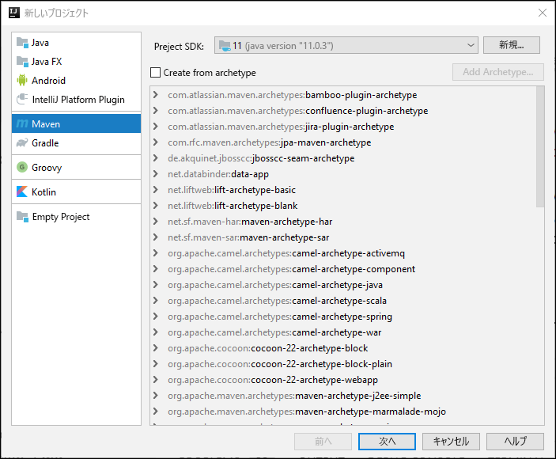
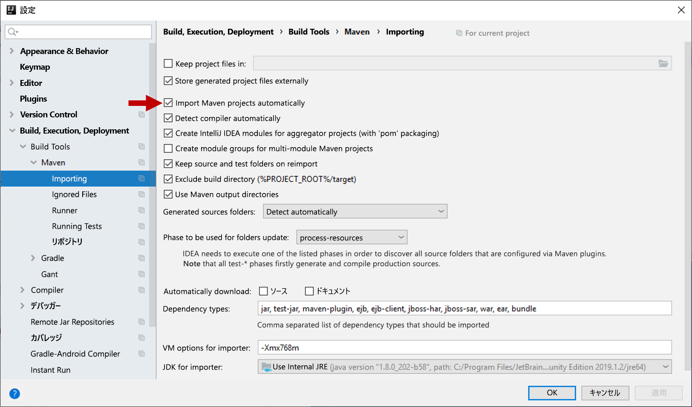
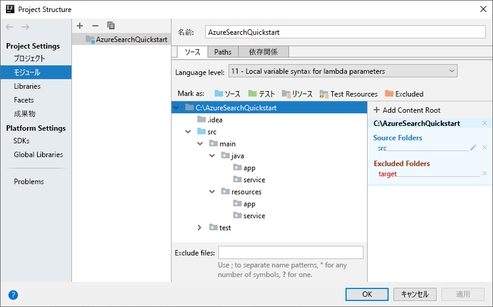
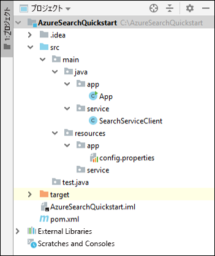
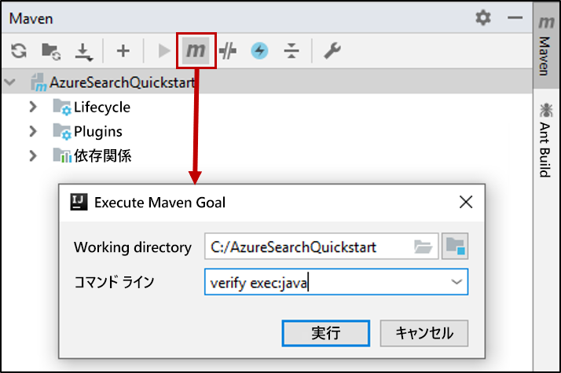

# <a name="quickstart-create-an-azure-cognitive-search-index-in-java-using-rest-apis"></a>クイック スタート:REST API を使用して Java で Azure Cognitive Search インデックスを作成する
> [!div class="op_single_selector"]
> * [JavaScript](search-get-started-nodejs.md)
> * [C#](search-get-started-dotnet.md)
> * [Java](search-get-started-java.md)
> * [ポータル](search-get-started-portal.md)
> * [PowerShell](search-create-index-rest-api.md)
> * [Python](search-get-started-python.md)
> * [Postman](search-get-started-postman.md)

[IntelliJ](https://www.jetbrains.com/idea/)、[Java 11 SDK](/java/azure/jdk/?view=azure-java-stable)、[Azure Cognitive Search REST API](/rest/api/searchservice/) を使用して検索インデックスの作成、読み込み、クエリを実行する Java コンソール アプリケーションを作成します。 この記事では、アプリケーションを作成するための具体的な手順を紹介します。 代わりに、[完全なアプリケーションをダウンロードして実行する](/samples/azure-samples/azure-search-java-samples/java-sample-quickstart/)こともできます。

Azure サブスクリプションをお持ちでない場合は、開始する前に [無料アカウント](https://azure.microsoft.com/free/?WT.mc_id=A261C142F) を作成してください。

## <a name="prerequisites"></a>前提条件

このクイックスタートをビルドしてテストするために次のソフトウェアとサービスを使用しました。

+ [IntelliJ IDEA](https://www.jetbrains.com/idea/)

+ [Java 11 SDK](/java/azure/jdk/?view=azure-java-stable)

+ [Azure Cognitive Search サービスを作成](search-create-service-portal.md)するか、現在のサブスクリプションから[既存のサービスを見つけます](https://ms.portal.azure.com/#blade/HubsExtension/BrowseResourceBlade/resourceType/Microsoft.Search%2FsearchServices)。 このクイック スタート用には、無料のサービスを使用できます。

<a name="get-service-info"></a>

## <a name="get-a-key-and-url"></a>キーと URL を入手する

サービスの呼び出しには、要求ごとに URL エンドポイントとアクセス キーが必要です。 両方を使用して検索サービスが作成されるので、Azure Cognitive Search をサブスクリプションに追加した場合は、次の手順に従って必要な情報を入手してください。

1. [Azure portal にサインイン](https://portal.azure.com/)し、ご使用の検索サービスの **[概要]** ページで、URL を入手します。 たとえば、エンドポイントは `https://mydemo.search.windows.net` のようになります。

2. **[設定]**  >  **[キー]** で、サービスに対する完全な権限の管理キーを取得します。 管理キーをロールオーバーする必要がある場合に備えて、2 つの交換可能な管理キーがビジネス継続性のために提供されています。 オブジェクトの追加、変更、および削除の要求には、主キーまたはセカンダリ キーのどちらかを使用できます。

   クエリ キーも作成します。 読み取り専用アクセスを使用してクエリ要求を発行することをお勧めします。


サービスに送信される要求ごとに API キーが必要です。 有効なキーがあれば、要求を送信するアプリケーションとそれを処理するサービスの間で、要求ごとに信頼を確立できます。

## <a name="set-up-your-environment"></a>環境の設定方法

まず、IntelliJ IDEA を開き、新しいプロジェクトを設定します。

### <a name="create-the-project"></a>プロジェクトを作成する

1. IntelliJ IDEA を開き、 **[Create New Project]\(新しいプロジェクトの作成\)** を選択します。
1. **[Maven]** を選択します。
1. **[Project SDK]\(プロジェクト SDK\)** ボックスの一覧で、Java 11 SDK を選択します。

     

1. **[GroupId]** と **[ArtifactId]** で、「`AzureSearchQuickstart`」と入力します。
1. 他の既定値をそのまま使用して、プロジェクトを開きます。

### <a name="specify-maven-dependencies"></a>Maven の依存関係を指定する

1. **[File]\(ファイル\)**  >  **[Settings]\(設定\)** を選択します。
1. **[Settings]\(設定\)** ウィンドウで、 **[Build, Execution, Deployment]\(ビルド、実行、デプロイ\)**  >  **[Build Tools]\(構築ツール\)**  >  **[Maven]**  >  **[Importing]\(インポート\)** の順に選択します。
1. **[Import Maven projects automatically]\(Maven プロジェクトを自動的にインポートする\)** チェック ボックスをオンにし、 **[OK]** をクリックしてウィンドウを閉じます。 Maven のプラグインとその他の依存関係は、次の手順で pom.xml ファイルを更新すると自動的に同期されるようになります。

    

1. pom.xml ファイルを開き、その内容を次の Maven の構成の詳細に置き換えます。 これには、[Exec Maven プラグイン](https://www.mojohaus.org/exec-maven-plugin/)と [JSON インターフェイス API](https://javadoc.io/doc/org.glassfish/javax.json/1.0.2) への参照が含まれています。

    ```xml
    <?xml version="1.0" encoding="UTF-8"?>
    <project xmlns="http://maven.apache.org/POM/4.0.0"
             xmlns:xsi="http://www.w3.org/2001/XMLSchema-instance"
             xsi:schemaLocation="http://maven.apache.org/POM/4.0.0 http://maven.apache.org/xsd/maven-4.0.0.xsd">
        <modelVersion>4.0.0</modelVersion>
    
        <groupId>AzureSearchQuickstart</groupId>
        <artifactId>AzureSearchQuickstart</artifactId>
        <version>1.0-SNAPSHOT</version>
        <build>
            <sourceDirectory>src</sourceDirectory>
            <plugins>
                <plugin>
                    <artifactId>maven-compiler-plugin</artifactId>
                    <version>3.1</version>
                    <configuration>
                        <source>11</source>
                        <target>11</target>
                    </configuration>
                </plugin>
                <plugin>
                    <groupId>org.codehaus.mojo</groupId>
                    <artifactId>exec-maven-plugin</artifactId>
                    <version>1.6.0</version>
                    <executions>
                        <execution>
                            <goals>
                                <goal>exec</goal>
                            </goals>
                        </execution>
                    </executions>
                    <configuration>
                        <mainClass>main.java.app.App</mainClass>
                        <cleanupDaemonThreads>false</cleanupDaemonThreads>
                    </configuration>
                </plugin>
            </plugins>
        </build>
        <dependencies>
            <dependency>
                <groupId>org.glassfish</groupId>
                <artifactId>javax.json</artifactId>
                <version>1.0.2</version>
            </dependency>
        </dependencies>   
    </project>
    ```

### <a name="set-up-the-project-structure"></a>プロジェクト構造を設定する

1. **[File]\(ファイル\)**  >  **[Project Structure]\(プロジェクト構造\)** を選択します。
1. **[Modules]\(モジュール\)** を選択し、ソース ツリーを展開して `src` >  `main` フォルダーのコンテンツにアクセスします。
1. `src` >  `main` > `java` フォルダーに、`app` および `service` フォルダーを追加します。 これを行うには、`java` フォルダーを選択し、Alt + Insert キーを押して、フォルダー名を入力します。
1. `src` >  `main` >`resources` フォルダーに、`app` および `service` フォルダーを追加します。

    完了すると、プロジェクト ツリーは次の図のようになります。

    

1. **[OK]** をクリックしてウィンドウを閉じます。

### <a name="add-azure-cognitive-search-service-information"></a>Azure Cognitive Search サービスの情報を追加する

1. **[Project]\(プロジェクト\)** ウィンドウで、ソース ツリーを展開して `src` >  `main` >`resources` > `app` フォルダーにアクセスし、`config.properties` ファイルを追加します。 これを行うには、`app` フォルダーを選択し、Alt + Insert キーを押して、 **[File]\(ファイル\)** を選択し、ファイル名を入力します。

1. 新しいファイルに次の設定をコピーし、`<YOUR-SEARCH-SERVICE-NAME>`、`<YOUR-ADMIN-KEY>`、および `<YOUR-QUERY-KEY>` を実際のサービス名とキーに置き換えます。 ご使用のサービス エンドポイントが `https://mydemo.search.windows.net` の場合、サービス名は "mydemo" になります。

    ```java
        SearchServiceName=<YOUR-SEARCH-SERVICE-NAME>
        SearchServiceAdminKey=<YOUR-ADMIN-KEY>
        SearchServiceQueryKey=<YOUR-QUERY-KEY>
        IndexName=hotels-quickstart
        ApiVersion=2019-05-06
    ```

### <a name="add-the-main-method"></a>main メソッドを追加する

1. `src` >  `main` > `java` > `app` フォルダーに、`App` クラスを追加します。 これを行うには、`app` フォルダーを選択し、Alt + Insert キーを押して、 **[Java Class]\(Java クラス\)** を選択し、クラス名を入力します。
1. `App` クラスを開いて、その内容を次のコードに置き換えます。 このコードには `main` メソッドが含まれています。 

    コメント解除されたコードは、検索サービスのパラメーターを読み取り、それらを使用して検索サービス クライアントのインスタンスを作成します。 検索サービス クライアントのコードは、次のセクションで追加されます。

    このクラス内のコメントになっているコードは、このクイックスタートの後のセクションでコメント解除されます。

    ```java
    package main.java.app;
    
    import main.java.service.SearchServiceClient;
    import java.io.IOException;
    import java.util.Properties;
    
    public class App {
    
        private static Properties loadPropertiesFromResource(String resourcePath) throws IOException {
            var inputStream = App.class.getResourceAsStream(resourcePath);
            var configProperties = new Properties();
            configProperties.load(inputStream);
            return configProperties;
        }
    
        public static void main(String[] args) {
            try {
                var config = loadPropertiesFromResource("/app/config.properties");
                var client = new SearchServiceClient(
                        config.getProperty("SearchServiceName"),
                        config.getProperty("SearchServiceAdminKey"),
                        config.getProperty("SearchServiceQueryKey"),
                        config.getProperty("ApiVersion"),
                        config.getProperty("IndexName")
                );
    
    
    //Uncomment the next 3 lines in the 1 - Create Index section of the quickstart
    //            if(client.indexExists()){ client.deleteIndex();}
    //            client.createIndex("/service/index.json");
    //            Thread.sleep(1000L); // wait a second to create the index
    
    //Uncomment the next 2 lines in the 2 - Load Documents section of the quickstart
    //            client.uploadDocuments("/service/hotels.json");
    //            Thread.sleep(2000L); // wait 2 seconds for data to upload
    
    //Uncomment the following 5 search queries in the 3 - Search an index section of the quickstart
    //            // Query 1
    //            client.logMessage("\n*QUERY 1****************************************************************");
    //            client.logMessage("Search for: Atlanta'");
    //            client.logMessage("Return: All fields'");
    //            client.searchPlus("Atlanta");
    //
    //            // Query 2
    //            client.logMessage("\n*QUERY 2****************************************************************");
    //            client.logMessage("Search for: Atlanta");
    //            client.logMessage("Return: HotelName, Tags, Address");
    //            SearchServiceClient.SearchOptions options2 = client.createSearchOptions();
    //            options2.select = "HotelName,Tags,Address";
    //            client.searchPlus("Atlanta", options2);
    //
    //            //Query 3
    //            client.logMessage("\n*QUERY 3****************************************************************");
    //            client.logMessage("Search for: wifi & restaurant");
    //            client.logMessage("Return: HotelName, Description, Tags");
    //            SearchServiceClient.SearchOptions options3 = client.createSearchOptions();
    //            options3.select = "HotelName,Description,Tags";
    //            client.searchPlus("wifi,restaurant", options3);
    //
    //            // Query 4 -filtered query
    //            client.logMessage("\n*QUERY 4****************************************************************");
    //            client.logMessage("Search for: all");
    //            client.logMessage("Filter: Ratings greater than 4");
    //            client.logMessage("Return: HotelName, Rating");
    //            SearchServiceClient.SearchOptions options4 = client.createSearchOptions();
    //            options4.filter="Rating%20gt%204";
    //            options4.select = "HotelName,Rating";
    //            client.searchPlus("*",options4);
    //
    //            // Query 5 - top 2 results, ordered by
    //            client.logMessage("\n*QUERY 5****************************************************************");
    //            client.logMessage("Search for: boutique");
    //            client.logMessage("Get: Top 2 results");
    //            client.logMessage("Order by: Rating in descending order");
    //            client.logMessage("Return: HotelId, HotelName, Category, Rating");
    //            SearchServiceClient.SearchOptions options5 = client.createSearchOptions();
    //            options5.top=2;
    //            options5.orderby = "Rating%20desc";
    //            options5.select = "HotelId,HotelName,Category,Rating";
    //            client.searchPlus("boutique", options5);
    
            } catch (Exception e) {
                System.err.println("Exception:" + e.getMessage());
                e.printStackTrace();
            }
        }
    }
    ```

### <a name="add-the-http-operations"></a>HTTP 操作を追加する

1. `src` >  `main` > `java` > `service` フォルダーに、`SearchServiceClient` クラスを追加します。 これを行うには、`service` フォルダーを選択し、Alt + Insert キーを押して、 **[Java Class]\(Java クラス\)** を選択し、クラス名を入力します。
1. `SearchServiceClient` クラスを開き、その内容を次のコードに置き換えます。 このコードは、Azure Cognitive Search REST API を使用するために必要な HTTP 操作を提供します。 インデックスの作成、ドキュメントのアップロード、作成したインデックスへのクエリ実行を行うためのメソッドは、後のセクションで追加します。

    ```java
    package main.java.service;

    import javax.json.Json;
    import javax.net.ssl.HttpsURLConnection;
    import java.io.IOException;
    import java.io.StringReader;
    import java.net.HttpURLConnection;
    import java.net.URI;
    import java.net.http.HttpClient;
    import java.net.http.HttpRequest;
    import java.net.http.HttpResponse;
    import java.nio.charset.StandardCharsets;
    import java.util.Formatter;
    import java.util.function.Consumer;
    
        /* This class is responsible for implementing HTTP operations for creating the index, uploading documents and searching the data*/
        public class SearchServiceClient {
            private final String _adminKey;
            private final String _queryKey;
            private final String _apiVersion;
            private final String _serviceName;
            private final String _indexName;
            private final static HttpClient client = HttpClient.newHttpClient();
    
        public SearchServiceClient(String serviceName, String adminKey, String queryKey, String apiVersion, String indexName) {
            this._serviceName = serviceName;
            this._adminKey = adminKey;
            this._queryKey = queryKey;
            this._apiVersion = apiVersion;
            this._indexName = indexName;
        }

        private static HttpResponse<String> sendRequest(HttpRequest request) throws IOException, InterruptedException {
            logMessage(String.format("%s: %s", request.method(), request.uri()));
            return client.send(request, HttpResponse.BodyHandlers.ofString());
        }

        private static URI buildURI(Consumer<Formatter> fmtFn)
                {
                    Formatter strFormatter = new Formatter();
                    fmtFn.accept(strFormatter);
                    String url = strFormatter.out().toString();
                    strFormatter.close();
                    return URI.create(url);
        }
    
        public static void logMessage(String message) {
            System.out.println(message);
        }
    
        public static boolean isSuccessResponse(HttpResponse<String> response) {
            try {
                int responseCode = response.statusCode();
    
                logMessage("\n Response code = " + responseCode);
    
                if (responseCode == HttpURLConnection.HTTP_OK || responseCode == HttpURLConnection.HTTP_ACCEPTED
                        || responseCode == HttpURLConnection.HTTP_NO_CONTENT || responseCode == HttpsURLConnection.HTTP_CREATED) {
                    return true;
                }
    
                // We got an error
                var msg = response.body();
                if (msg != null) {
                    logMessage(String.format("\n MESSAGE: %s", msg));
                }
    
            } catch (Exception e) {
                e.printStackTrace();
            }
    
            return false;
        }
    
        public static HttpRequest httpRequest(URI uri, String key, String method, String contents) {
            contents = contents == null ? "" : contents;
            var builder = HttpRequest.newBuilder();
            builder.uri(uri);
            builder.setHeader("content-type", "application/json");
            builder.setHeader("api-key", key);
    
            switch (method) {
                case "GET":
                    builder = builder.GET();
                    break;
                case "HEAD":
                    builder = builder.GET();
                    break;
                case "DELETE":
                    builder = builder.DELETE();
                    break;
                case "PUT":
                    builder = builder.PUT(HttpRequest.BodyPublishers.ofString(contents));
                    break;
                case "POST":
                    builder = builder.POST(HttpRequest.BodyPublishers.ofString(contents));
                    break;
                default:
                    throw new IllegalArgumentException(String.format("Can't create request for method '%s'", method));
            }
            return builder.build();
        }
    }
    
    ```

### <a name="build-the-project"></a>プロジェクトのビルド

1. プロジェクトの構造が次のようになっていることを確認します。

    

1. **[Maven]** ツール ウィンドウを開き、次の Maven 目標を実行します: `verify exec:java`


処理が完了すると、ビルド成功のメッセージに続いてゼロ (0) 終了コードが表示されることを確認します。

## <a name="1---create-index"></a>1 - インデックスの作成

ホテル インデックスの定義には、複数の単純なフィールドと 1 つの複雑なフィールドが含まれています。 単純なフィールドの例として "HotelName" や "Description" があります。 "Address" フィールドは、"Street Address" や "City" などのサブフィールドが含まれているため、複雑なフィールドです。 このクイックスタートでは、このインデックスの定義を JSON を使用して指定します。

1. **[Project]\(プロジェクト\)** ウィンドウで、ソース ツリーを展開して `src` >  `main` >`resources` > `service` フォルダーにアクセスし、`index.json` ファイルを追加します。 これを行うには、`app` フォルダーを選択し、Alt + Insert キーを押して、 **[File]\(ファイル\)** を選択し、ファイル名を入力します。

1. `index.json` ファイルを開き、次のインデックスの定義を挿入します。

    ```json
    {
      "name": "hotels-quickstart",
      "fields": [
        {
          "name": "HotelId",
          "type": "Edm.String",
          "key": true,
          "filterable": true
        },
        {
          "name": "HotelName",
          "type": "Edm.String",
          "searchable": true,
          "filterable": false,
          "sortable": true,
          "facetable": false
        },
        {
          "name": "Description",
          "type": "Edm.String",
          "searchable": true,
          "filterable": false,
          "sortable": false,
          "facetable": false,
          "analyzer": "en.lucene"
        },
        {
          "name": "Description_fr",
          "type": "Edm.String",
          "searchable": true,
          "filterable": false,
          "sortable": false,
          "facetable": false,
          "analyzer": "fr.lucene"
        },
        {
          "name": "Category",
          "type": "Edm.String",
          "searchable": true,
          "filterable": true,
          "sortable": true,
          "facetable": true
        },
        {
          "name": "Tags",
          "type": "Collection(Edm.String)",
          "searchable": true,
          "filterable": true,
          "sortable": false,
          "facetable": true
        },
        {
          "name": "ParkingIncluded",
          "type": "Edm.Boolean",
          "filterable": true,
          "sortable": true,
          "facetable": true
        },
        {
          "name": "LastRenovationDate",
          "type": "Edm.DateTimeOffset",
          "filterable": true,
          "sortable": true,
          "facetable": true
        },
        {
          "name": "Rating",
          "type": "Edm.Double",
          "filterable": true,
          "sortable": true,
          "facetable": true
        },
        {
          "name": "Address",
          "type": "Edm.ComplexType",
          "fields": [
            {
              "name": "StreetAddress",
              "type": "Edm.String",
              "filterable": false,
              "sortable": false,
              "facetable": false,
              "searchable": true
            },
            {
              "name": "City",
              "type": "Edm.String",
              "searchable": true,
              "filterable": true,
              "sortable": true,
              "facetable": true
            },
            {
              "name": "StateProvince",
              "type": "Edm.String",
              "searchable": true,
              "filterable": true,
              "sortable": true,
              "facetable": true
            },
            {
              "name": "PostalCode",
              "type": "Edm.String",
              "searchable": true,
              "filterable": true,
              "sortable": true,
              "facetable": true
            },
            {
              "name": "Country",
              "type": "Edm.String",
              "searchable": true,
              "filterable": true,
              "sortable": true,
              "facetable": true
            }
          ]
        }
      ]
    }
    ```

    インデックス名は "hotels-quickstart" になります。 このインデックス フィールドの属性によって、インデックス付きデータをアプリケーションで検索する方法が決まります。 たとえば、フルテキスト検索に含める必要があるすべてのフィールドに、`IsSearchable` 属性を割り当てる必要があります。 属性の詳細については、「[フィールド コレクションとフィールド属性](search-what-is-an-index.md#fields-collection)」を参照してください。
    
    このインデックスの `Description` フィールドでは、省略可能な `analyzer` プロパティを使用して既定の Lucene 言語アナライザーをオーバーライドします。 `Description_fr` フィールドでは、フランス語のテキストを格納するため、フランス語の Lucene アナライザー `fr.lucene` を使用しています。 `Description` では、オプションの Microsoft 言語アナライザー en.lucene を使用しています。 アナライザーの詳細については、[Azure Cognitive Search でのテキスト処理のためのアナライザー](search-analyzers.md)に関するページを参照してください。

1. 次のコードを `SearchServiceClient` クラスに追加します。 これらのメソッドにより、インデックスの作成と削除を実行し、インデックスが存在するかどうかを確認する Azure Cognitive Search REST サービスの URL が作成されます。 また、メソッドは HTTP 要求も行います。

    ```java
    public boolean indexExists() throws IOException, InterruptedException {
        logMessage("\n Checking if index exists...");
        var uri = buildURI(strFormatter -> strFormatter.format(
                "https://%s.search.windows.net/indexes/%s/docs?api-version=%s&search=*",
                _serviceName,_indexName,_apiVersion));
        var request = httpRequest(uri, _adminKey, "HEAD", "");
        var response = sendRequest(request);
        return isSuccessResponse(response);
    }
    
    public boolean deleteIndex() throws IOException, InterruptedException {
        logMessage("\n Deleting index...");
        var uri = buildURI(strFormatter -> strFormatter.format(
                "https://%s.search.windows.net/indexes/%s?api-version=%s",
                _serviceName,_indexName,_apiVersion));
        var request = httpRequest(uri, _adminKey, "DELETE", "*");
        var response = sendRequest(request);
        return isSuccessResponse(response);
    }
    
    
    public boolean createIndex(String indexDefinitionFile) throws IOException, InterruptedException {
        logMessage("\n Creating index...");
        //Build the search service URL
        var uri = buildURI(strFormatter -> strFormatter.format(
                "https://%s.search.windows.net/indexes/%s?api-version=%s",
                _serviceName,_indexName,_apiVersion));
        //Read in index definition file
        var inputStream = SearchServiceClient.class.getResourceAsStream(indexDefinitionFile);
        var indexDef = new String(inputStream.readAllBytes(), StandardCharsets.UTF_8);
        //Send HTTP PUT request to create the index in the search service
        var request = httpRequest(uri, _adminKey, "PUT", indexDef);
        var response = sendRequest(request);
        return isSuccessResponse(response);
    }
    ```

1. `App` クラス内の次のコードをコメント解除します。 このコードにより、"hotels-quickstart" インデックスが存在する場合は削除され、"index.json" ファイル内のインデックスの定義に基づいて新しいインデックスが作成されます。 

    インデックス作成要求の後に、1 秒間の一時停止が挿入されます。 この一時停止により、ドキュメントをアップロードする前にインデックスが作成されるようになります。

    ```java
        if (client.indexExists()) { client.deleteIndex();}
          client.createIndex("/service/index.json");
          Thread.sleep(1000L); // wait a second to create the index
    ```

1. **[Maven]** ツール ウィンドウを開き、次の Maven 目標を実行します: `verify exec:java`

    このコードが実行されると、"Creating index" メッセージに続いて 201 応答コードが表示されることを確認します。 この応答コードでは、インデックスが作成されたことを確認します。 この実行の終了時には、ビルド成功のメッセージとゼロ (0) 終了コードが表示されます。
    
## <a name="2---load-documents"></a>2 - ドキュメントを読み込む

1. **[Project]\(プロジェクト\)** ウィンドウで、ソース ツリーを展開して `src` >  `main` >`resources` > `service` フォルダーにアクセスし、`hotels.json` ファイルを追加します。 これを行うには、`app` フォルダーを選択し、Alt + Insert キーを押して、 **[File]\(ファイル\)** を選択し、ファイル名を入力します。
1. そのファイルに次のホテル ドキュメントを挿入します。

    ```json
    {
      "value": [
        {
          "@search.action": "upload",
          "HotelId": "1",
          "HotelName": "Secret Point Motel",
          "Description": "The hotel is ideally located on the main commercial artery of the city in the heart of New York. A few minutes away is Time's Square and the historic centre of the city, as well as other places of interest that make New York one of America's most attractive and cosmopolitan cities.",
          "Description_fr": "L'hôtel est idéalement situé sur la principale artère commerciale de la ville en plein cœur de New York. A quelques minutes se trouve la place du temps et le centre historique de la ville, ainsi que d'autres lieux d'intérêt qui font de New York l'une des villes les plus attractives et cosmopolites de l'Amérique.",
          "Category": "Boutique",
          "Tags": [ "pool", "air conditioning", "concierge" ],
          "ParkingIncluded": "false",
          "LastRenovationDate": "1970-01-18T00:00:00Z",
          "Rating": 3.60,
          "Address": {
            "StreetAddress": "677 5th Ave",
            "City": "New York",
            "StateProvince": "NY",
            "PostalCode": "10022",
            "Country": "USA"
          }
        },
        {
          "@search.action": "upload",
          "HotelId": "2",
          "HotelName": "Twin Dome Motel",
          "Description": "The hotel is situated in a  nineteenth century plaza, which has been expanded and renovated to the highest architectural standards to create a modern, functional and first-class hotel in which art and unique historical elements coexist with the most modern comforts.",
          "Description_fr": "L'hôtel est situé dans une place du XIXe siècle, qui a été agrandie et rénovée aux plus hautes normes architecturales pour créer un hôtel moderne, fonctionnel et de première classe dans lequel l'art et les éléments historiques uniques coexistent avec le confort le plus moderne.",
          "Category": "Boutique",
          "Tags": [ "pool", "free wifi", "concierge" ],
          "ParkingIncluded": "false",
          "LastRenovationDate": "1979-02-18T00:00:00Z",
          "Rating": 3.60,
          "Address": {
            "StreetAddress": "140 University Town Center Dr",
            "City": "Sarasota",
            "StateProvince": "FL",
            "PostalCode": "34243",
            "Country": "USA"
          }
        },
        {
          "@search.action": "upload",
          "HotelId": "3",
          "HotelName": "Triple Landscape Hotel",
          "Description": "The Hotel stands out for its gastronomic excellence under the management of William Dough, who advises on and oversees all of the Hotel’s restaurant services.",
          "Description_fr": "L'hôtel est situé dans une place du XIXe siècle, qui a été agrandie et rénovée aux plus hautes normes architecturales pour créer un hôtel moderne, fonctionnel et de première classe dans lequel l'art et les éléments historiques uniques coexistent avec le confort le plus moderne.",
          "Category": "Resort and Spa",
          "Tags": [ "air conditioning", "bar", "continental breakfast" ],
          "ParkingIncluded": "true",
          "LastRenovationDate": "2015-09-20T00:00:00Z",
          "Rating": 4.80,
          "Address": {
            "StreetAddress": "3393 Peachtree Rd",
            "City": "Atlanta",
            "StateProvince": "GA",
            "PostalCode": "30326",
            "Country": "USA"
          }
        },
        {
          "@search.action": "upload",
          "HotelId": "4",
          "HotelName": "Sublime Cliff Hotel",
          "Description": "Sublime Cliff Hotel is located in the heart of the historic center of Sublime in an extremely vibrant and lively area within short walking distance to the sites and landmarks of the city and is surrounded by the extraordinary beauty of churches, buildings, shops and monuments. Sublime Cliff is part of a lovingly restored 1800 palace.",
          "Description_fr": "Le sublime Cliff Hotel est situé au coeur du centre historique de sublime dans un quartier extrêmement animé et vivant, à courte distance de marche des sites et monuments de la ville et est entouré par l'extraordinaire beauté des églises, des bâtiments, des commerces et Monuments. Sublime Cliff fait partie d'un Palace 1800 restauré avec amour.",
          "Category": "Boutique",
          "Tags": [ "concierge", "view", "24-hour front desk service" ],
          "ParkingIncluded": "true",
          "LastRenovationDate": "1960-02-06T00:00:00Z",
          "Rating": 4.60,
          "Address": {
            "StreetAddress": "7400 San Pedro Ave",
            "City": "San Antonio",
            "StateProvince": "TX",
            "PostalCode": "78216",
            "Country": "USA"
          }
        }
      ]
    }
    ```

1. `SearchServiceClient` クラスに次のコードを挿入します。 このコードにより、ホテル ドキュメントをインデックスにアップロードする REST サービスの URL が作成された後、HTTP POST 要求が行われます。

    ```java
    public boolean uploadDocuments(String documentsFile) throws IOException, InterruptedException {
        logMessage("\n Uploading documents...");
        //Build the search service URL
        var endpoint = buildURI(strFormatter -> strFormatter.format(
                "https://%s.search.windows.net/indexes/%s/docs/index?api-version=%s",
                _serviceName,_indexName,_apiVersion));
        //Read in the data to index
        var inputStream = SearchServiceClient.class.getResourceAsStream(documentsFile);
        var documents = new String(inputStream.readAllBytes(), StandardCharsets.UTF_8);
        //Send HTTP POST request to upload and index the data
        var request = httpRequest(endpoint, _adminKey, "POST", documents);
        var response = sendRequest(request);
        return isSuccessResponse(response);
    }
    ```

1. `App` クラス内の次のコードをコメント解除します。 このコードにより、"hotels.json" 内のドキュメントがインデックスにアップロードされます。

    ```java
    client.uploadDocuments("/service/hotels.json");
    Thread.sleep(2000L); // wait 2 seconds for data to upload
    ```

    アップロード要求の後に 2 秒の一時停止が挿入されることで、ドキュメントの読み込みプロセスが完了してからインデックスにクエリが実行されるようになります。

1. **[Maven]** ツール ウィンドウを開き、次の Maven 目標を実行します: `verify exec:java`

    前の手順で "hotels-quickstart" インデックスを作成したため、このコードではそれが削除され、ホテル ドキュメントを読み込む前に再作成されます。

    このコードが実行されると、"Uploading documents" メッセージに続いて 200 応答コードが表示されることを確認します。 この応答コードでは、ドキュメントがインデックスにアップロードされたことを確認します。 この実行の終了時には、ビルド成功のメッセージとゼロ (0) 終了コードが表示されます。

## <a name="3---search-an-index"></a>3 - インデックスの検索

ホテル ドキュメントを読み込んだので、検索クエリを作成してホテルのデータにアクセスできます。

1. 次のコードを `SearchServiceClient` クラスに追加します。 このコードにより、インデックス付きデータを検索する Azure Cognitive Search REST サービスの URL が作成され、検索結果が出力されます。

    `SearchOptions` クラスと `createSearchOptions` メソッドを使用すると、使用可能な Azure Cognitive Search REST API クエリ オプションのサブセットを指定できます。 REST API クエリ オプションの詳細については、[Search Documents (Azure Cognitive Search REST API)](/rest/api/searchservice/search-documents) に関するページを参照してください。

    `SearchPlus` メソッドでは、検索クエリ URL が作成され、検索要求が行われた後、その結果がコンソールに出力されます。 

    ```java
    public SearchOptions createSearchOptions() { return new SearchOptions();}

    //Defines available search parameters that can be set
    public static class SearchOptions {

        public String select = "";
        public String filter = "";
        public int top = 0;
        public String orderby= "";
    }

    //Concatenates search parameters to append to the search request
    private String createOptionsString(SearchOptions options)
    {
        String optionsString = "";
        if (options != null) {
            if (options.select != "")
                optionsString = optionsString + "&$select=" + options.select;
            if (options.filter != "")
                optionsString = optionsString + "&$filter=" + options.filter;
            if (options.top != 0)
                optionsString = optionsString + "&$top=" + options.top;
            if (options.orderby != "")
                optionsString = optionsString + "&$orderby=" +options.orderby;
        }
        return optionsString;
    }
    
    public void searchPlus(String queryString)
    {
        searchPlus( queryString, null);
    }
    
    public void searchPlus(String queryString, SearchOptions options) {
    
        try {
            String optionsString = createOptionsString(options);
            var uri = buildURI(strFormatter -> strFormatter.format(
                    "https://%s.search.windows.net/indexes/%s/docs?api-version=%s&search=%s%s",
                    _serviceName, _indexName, _apiVersion, queryString, optionsString));
            var request = httpRequest(uri, _queryKey, "GET", null);
            var response = sendRequest(request);
            var jsonReader = Json.createReader(new StringReader(response.body()));
            var jsonArray = jsonReader.readObject().getJsonArray("value");
            var resultsCount = jsonArray.size();
            logMessage("Results:\nCount: " + resultsCount);
            for (int i = 0; i <= resultsCount - 1; i++) {
                logMessage(jsonArray.get(i).toString());
            }
    
            jsonReader.close();
    
        }
        catch (Exception e) {
            e.printStackTrace();
        }
    
    }
    ```

1. `App` クラスで、次のコードをコメント解除します。 このコードにより、検索テキスト、クエリ パラメーター、返されるデータ フィールドなど、5 つの異なるクエリが設定されます。 

    ```java
    // Query 1
    client.logMessage("\n*QUERY 1****************************************************************");
    client.logMessage("Search for: Atlanta");
    client.logMessage("Return: All fields'");
    client.searchPlus("Atlanta");

    // Query 2
    client.logMessage("\n*QUERY 2****************************************************************");
    client.logMessage("Search for: Atlanta");
    client.logMessage("Return: HotelName, Tags, Address");
    SearchServiceClient.SearchOptions options2 = client.createSearchOptions();
    options2.select = "HotelName,Tags,Address";
    client.searchPlus("Atlanta", options2);

    //Query 3
    client.logMessage("\n*QUERY 3****************************************************************");
    client.logMessage("Search for: wifi & restaurant");
    client.logMessage("Return: HotelName, Description, Tags");
    SearchServiceClient.SearchOptions options3 = client.createSearchOptions();
    options3.select = "HotelName,Description,Tags";
    client.searchPlus("wifi,restaurant", options3);

    // Query 4 -filtered query
    client.logMessage("\n*QUERY 4****************************************************************");
    client.logMessage("Search for: all");
    client.logMessage("Filter: Ratings greater than 4");
    client.logMessage("Return: HotelName, Rating");
    SearchServiceClient.SearchOptions options4 = client.createSearchOptions();
    options4.filter="Rating%20gt%204";
    options4.select = "HotelName,Rating";
    client.searchPlus("*",options4);

    // Query 5 - top 2 results, ordered by
    client.logMessage("\n*QUERY 5****************************************************************");
    client.logMessage("Search for: boutique");
    client.logMessage("Get: Top 2 results");
    client.logMessage("Order by: Rating in descending order");
    client.logMessage("Return: HotelId, HotelName, Category, Rating");
    SearchServiceClient.SearchOptions options5 = client.createSearchOptions();
    options5.top=2;
    options5.orderby = "Rating%20desc";
    options5.select = "HotelId,HotelName,Category,Rating";
    client.searchPlus("boutique", options5);
    ```


    [クエリにおける語句の照合方法](search-query-overview.md#types-of-queries)には、フルテキスト検索とフィルターの 2 つがあります。 フルテキスト検索クエリでは、実際のインデックス内の `IsSearchable` フィールドで 1 つ以上の語句を検索します。 フィルターは、インデックス内の `IsFilterable` フィールドに対して評価されるブール式です。 フルテキスト検索とフィルターは、単独でまたは組み合わせて使用できます。

1. **[Maven]** ツール ウィンドウを開き、次の Maven 目標を実行します: `verify exec:java`

    各クエリの概要とその結果を確認します。 この実行の完了時には、ビルド成功のメッセージとゼロ (0) 終了コードが表示されます。

## <a name="clean-up-resources"></a>リソースをクリーンアップする

所有するサブスクリプションを使用している場合は、プロジェクトの終了時に、不要になったリソースを削除することをお勧めします。 リソースを実行したままにすると、お金がかかる場合があります。 リソースは個別に削除することも、リソース グループを削除してリソースのセット全体を削除することもできます。

ポータルの左側のナビゲーション ウィンドウにある **[すべてのリソース]** または **[リソース グループ]** リンクを使って、リソースを検索および管理できます。

無料サービスを使っている場合は、3 つのインデックス、インデクサー、およびデータソースに制限されることに注意してください。 ポータルで個別の項目を削除して、制限を超えないようにすることができます。 

## <a name="next-steps"></a>次のステップ

この Java クイックスタートでは、インデックスの作成、ドキュメントを利用した読み込み、およびクエリの実行を行う一連のタスクに取り組みました。 基本的な概念を十分理解している場合は、REST でのインデクサーの操作を一覧にした次の記事をお勧めします。

> [!div class="nextstepaction"]
> [インデクサーの操作](/rest/api/searchservice/indexer-operations)
