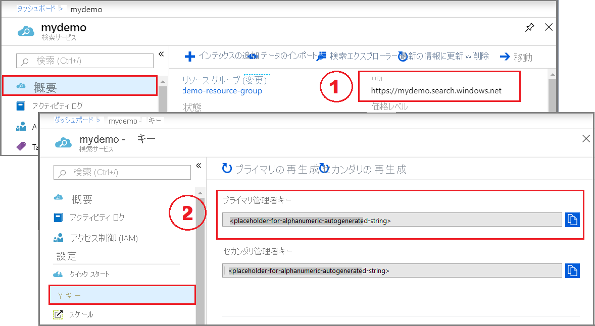

# <a name="quickstart-create-an-azure-cognitive-search-index-using-the-javascript-sdk"></a>クイックスタート: JavaScript SDK を使用して Azure Cognitive Search インデックスを作成する
> [!div class="op_single_selector"]
> * [JavaScript](search-get-started-javascript.md)
> * [C#](search-get-started-dotnet.md)
> * [ポータル](search-get-started-portal.md)
> * [PowerShell](./search-get-started-powershell.md)
> * [Python](search-get-started-python.md)
> * [REST](search-get-started-rest.md)


[Azure Cognitive Search 用 JavaScript (TypeScript) SDK](/javascript/api/overview/azure/search-documents-readme) を使用して、検索インデックスの作成、読み込み、クエリを実行するための Node.js アプリケーションを JavaScript で作成します。

この記事では、アプリケーションを作成する方法について詳しく説明します。 代わりに、[ソース コードとデータをダウンロード](https://github.com/Azure-Samples/azure-search-javascript-samples/tree/master/quickstart/v11)して、コマンド ラインでアプリケーションを実行することもできます。

## <a name="prerequisites"></a>前提条件

開始する前に、次のツールとサービスを用意してください。

+ アクティブなサブスクリプションが含まれる Azure アカウント。 [無料でアカウントを作成できます](https://azure.microsoft.com/free/)。

+ Azure Cognitive Search サービス。 [サービスを作成](search-create-service-portal.md)するか、[既存のサービスを検索](https://ms.portal.azure.com/#blade/HubsExtension/BrowseResourceBlade/resourceType/Microsoft.Search%2FsearchServices)します。 このクイック スタート用には、無料のサービスを使用できます。 

+ [Node.js](https://nodejs.org) と [npm](https://www.npmjs.com)

+ [Visual Studio Code](https://code.visualstudio.com) または別の IDE


## <a name="set-up-your-project"></a>プロジェクトの設定

最初に、自分の検索サービスのエンドポイントとキーを取得します。 次に、下記の説明のとおり、npm を使用して新しいプロジェクトを作成します。

<a name="get-service-info"></a>

### <a name="copy-a-key-and-endpoint"></a>キーとエンドポイントをコピーする

サービスの呼び出しには、要求ごとに URL エンドポイントとアクセス キーが必要です。 最初に、API キーと URL を見つけてプロジェクトに追加します。 後続の手順でクライアントを作成する際に、両方の値を指定することになります。

1. [Azure portal にサインイン](https://portal.azure.com/)し、ご使用の検索サービスの **[概要]** ページで、URL を入手します。 たとえば、エンドポイントは `https://mydemo.search.windows.net` のようになります。

2. **[設定]**  >  **[キー]** で、サービスに対する完全な権限の管理者キーを取得します。オブジェクトを作成したり削除したりする場合には必須となります。 キーには、プライマリとセカンダリの 2 つがあり、どちらでも同じように機能します どちらを使ってもかまいません。

   

すべての要求では、サービスに送信されるすべての要求に API キーが必要です。 有効なキーがあれば、要求を送信するアプリケーションとそれを処理するサービスの間で、要求ごとに信頼を確立できます。

### <a name="create-a-new-npm-project"></a>新しい npm プロジェクトを作成する

VS Code およびその[統合ターミナル](https://code.visualstudio.com/docs/editor/integrated-terminal)、または別のターミナル (Node.js コマンド プロンプトなど) を開いて開始します。

1. 開発用ディレクトリを作成して `quickstart` という名前を付けます。

    ```cmd
    mkdir quickstart
    cd quickstart
    ```

2. 次を実行し、npm を使用して空のプロジェクトを初期化します。 

    ```cmd
    npm init
    ```
     既定値をそのまま使用します。ただし、ライセンスは "MIT" に設定する必要があります。 

3. `@azure/search-documents` ([Azure Cognitive Search 用 JavaScript (TypeScript) SDK](/javascript/api/overview/azure/search-documents-readme)) をインストールします。

    ```cmd
    npm install @azure/search-documents
    ```

4. `dotenv` をインストールします。これは、サービス名や API キーなど、環境変数をインポートするために使用されます。
    ```cmd
    npm install dotenv
    ```

5. 自分の **package.json** ファイルが次の jsonのようになっていることをチェックして、プロジェクトとその依存関係を構成できたことを確認します。

    ```json
    {
      "name": "quickstart",
      "version": "1.0.0",
      "description": "Azure Cognitive Search Quickstart",
      "main": "index.js",
      "scripts": {
        "test": "echo \"Error: no test specified\" && exit 1"
      },
      "keywords": [
        "Azure",
        "Search"
      ],
      "author": "Your Name",
      "license": "MIT",
      "dependencies": {
        "@azure/search-documents": "^11.0.3",
        "dotenv": "^8.2.0"
      }
    }
    ```

6. 自分の検索サービスのパラメーターを保持するファイル **.env** を作成します。

    ```
    SEARCH_API_KEY=<search-admin-key>
    SEARCH_API_ENDPOINT=https://<search-service-name>.search.windows.net
    ```

`<search-service-name>` の値は、自分の検索サービスの名前に置き換えます。 `<search-admin-key>` は、先ほど記録したキー値に置き換えます。 

### <a name="create-indexjs-file"></a>index.js ファイルを作成する

次は **index.js** ファイルを作成します。これはコードをホストするメイン ファイルです。

このファイルの冒頭で、`@azure/search-documents` ライブラリをインポートします。

```javascript
const { SearchIndexClient, SearchClient, AzureKeyCredential, odata } = require("@azure/search-documents");
```

その後、次のように `dotenv` パッケージに対して require を実行し、 **.env** ファイルからパラメーターを読み取る必要があります。

```javascript
// Load the .env file if it exists
require("dotenv").config();

// Getting endpoint and apiKey from .env file
const endpoint = process.env.SEARCH_API_ENDPOINT || "";
const apiKey = process.env.SEARCH_API_KEY || "";
```

インポートと環境変数を用意できたところで、main 関数を定義する準備が整いました。

SDK 内の機能のほとんどは非同期のため、ここでは main 関数を `async` にします。 また、main 関数の下に `main().catch()` も追加します。エラーが発生した場合にキャッチしてログに記録するためです。

```javascript
async function main() {
    console.log(`Running Azure Cognitive Search Javascript quickstart...`);
    if (!endpoint || !apiKey) {
        console.log("Make sure to set valid values for endpoint and apiKey with proper authorization.");
        return;
    }

    // remaining quickstart code will go here
}

main().catch((err) => {
    console.error("The sample encountered an error:", err);
});
```

それが済んだら、インデックスを作成する準備は完了です。

## <a name="1---create-index"></a>1 - インデックスの作成 

**hotels_quickstart_index.json** というファイルを作成します。  このファイルでは、次の手順で読み込むドキュメントに対する Azure Cognitive Search の処理を定義します。 各フィールドは `name` によって識別されます。それぞれ、指定された `type` を備えています。 さらに各フィールドは、Azure Cognitive Search がそのフィールドに対して検索、フィルター、並べ替え、およびファセットを実行できるかどうかを指定する、一連のインデックス属性も備えています。 ほとんどのフィールドは単純なデータ型ですが、`AddressType` のように、自分のインデックスでリッチなデータ構造を作成できる複合型もあります。  [サポートされているデータ型](/rest/api/searchservice/supported-data-types)とインデックスの属性について詳しくは、[インデックスの作成 (REST)](/rest/api/searchservice/create-index) に関するページを参照してください。 

以下を **hotels_quickstart_index.json** に追加するか、[ファイルをダウンロードします](https://github.com/Azure-Samples/azure-search-javascript-samples/blob/master/quickstart/v11/hotels_quickstart_index.json)。 

```json
{
    "name": "hotels-quickstart",
    "fields": [
        {
            "name": "HotelId",
            "type": "Edm.String",
            "key": true,
            "filterable": true
        },
        {
            "name": "HotelName",
            "type": "Edm.String",
            "searchable": true,
            "filterable": false,
            "sortable": true,
            "facetable": false
        },
        {
            "name": "Description",
            "type": "Edm.String",
            "searchable": true,
            "filterable": false,
            "sortable": false,
            "facetable": false,
            "analyzer": "en.lucene"
        },
        {
            "name": "Description_fr",
            "type": "Edm.String",
            "searchable": true,
            "filterable": false,
            "sortable": false,
            "facetable": false,
            "analyzer": "fr.lucene"
        },
        {
            "name": "Category",
            "type": "Edm.String",
            "searchable": true,
            "filterable": true,
            "sortable": true,
            "facetable": true
        },
        {
            "name": "Tags",
            "type": "Collection(Edm.String)",
            "searchable": true,
            "filterable": true,
            "sortable": false,
            "facetable": true
        },
        {
            "name": "ParkingIncluded",
            "type": "Edm.Boolean",
            "filterable": true,
            "sortable": true,
            "facetable": true
        },
        {
            "name": "LastRenovationDate",
            "type": "Edm.DateTimeOffset",
            "filterable": true,
            "sortable": true,
            "facetable": true
        },
        {
            "name": "Rating",
            "type": "Edm.Double",
            "filterable": true,
            "sortable": true,
            "facetable": true
        },
        {
            "name": "Address",
            "type": "Edm.ComplexType",
            "fields": [
                {
                    "name": "StreetAddress",
                    "type": "Edm.String",
                    "filterable": false,
                    "sortable": false,
                    "facetable": false,
                    "searchable": true
                },
                {
                    "name": "City",
                    "type": "Edm.String",
                    "searchable": true,
                    "filterable": true,
                    "sortable": true,
                    "facetable": true
                },
                {
                    "name": "StateProvince",
                    "type": "Edm.String",
                    "searchable": true,
                    "filterable": true,
                    "sortable": true,
                    "facetable": true
                },
                {
                    "name": "PostalCode",
                    "type": "Edm.String",
                    "searchable": true,
                    "filterable": true,
                    "sortable": true,
                    "facetable": true
                },
                {
                    "name": "Country",
                    "type": "Edm.String",
                    "searchable": true,
                    "filterable": true,
                    "sortable": true,
                    "facetable": true
                }
            ]
        }
    ],
    "suggesters": [
        {
            "name": "sg",
            "searchMode": "analyzingInfixMatching",
            "sourceFields": [
                "HotelName"
            ]
        }
    ]
}
```

インデックスの定義が完了したら、main 関数でインデックスの定義にアクセスできるように、**index.js** の冒頭で **hotels_quickstart_index.json** をインポートする必要があります。

```javascript
const indexDefinition = require('./hotels_quickstart_index.json');
```

その後、main 関数内で `SearchIndexClient` を作成します。これは、Azure Cognitive Search のインデックスを作成および管理するために使用されます。 

```javascript
const indexClient = new SearchIndexClient(endpoint, new AzureKeyCredential(apiKey));
```

次に、インデックスが既に存在する場合はそれを削除します。 これは、テストやデモのコードでは一般的な手法です。

これを行うには、インデックスの削除を試行する単純な関数を定義します。

```javascript
async function deleteIndexIfExists(indexClient, indexName) {
    try {
        await indexClient.deleteIndex(indexName);
        console.log('Deleting index...');
    } catch {
        console.log('Index does not exist yet.');
    }
}
```

関数を実行するには、インデックス定義からインデックス名を抽出し、`indexClient` と共に `indexName` を `deleteIndexIfExists()` 関数に渡します。

```javascript
const indexName = indexDefinition["name"];

console.log('Checking if index exists...');
await deleteIndexIfExists(indexClient, indexName);
```

その後、`createIndex()` メソッドを使用してインデックスを作成する準備が整います。

```javascript
console.log('Creating index...');
let index = await indexClient.createIndex(indexDefinition);

console.log(`Index named ${index.name} has been created.`);
```

### <a name="run-the-sample"></a>サンプルを実行する

これで、サンプルを実行する準備が整いました。 ターミナル ウィンドウを使用して次のコマンドを実行します。

```cmd
node index.js
```

[ソース コードをダウンロード](https://github.com/Azure-Samples/azure-search-javascript-samples/tree/master/quickstart/v11)していても、必須のパッケージをまだインストールしていない場合は、最初に `npm install` を実行します。

プログラムにより実行されているアクションを示す一連のメッセージが表示されます。 

Azure portal で、自分の検索サービスの **[概要]** を開きます。 **[インデックス]** タブを選択します。次のように表示されます。

:::image type="content" source="media/search-get-started-javascript/create-index-no-data.png" alt-text="Azure portal の検索サービスの概要にある [インデックス] タブのスクリーンショット" border="false":::

次の手順では、インデックスにデータを追加します。 

## <a name="2---load-documents"></a>2 - ドキュメントを読み込む 


Azure Cognitive Search では、ドキュメントにはインデックス作成の入力とクエリからの出力があり、どちらもデータ構造です。 このようなデータをインデックスにプッシュするか、[インデクサー](search-indexer-overview.md)を使用することができます。 ここでは、プログラムでドキュメントをインデックスにプッシュします。

ドキュメント入力には、データベース内の行、Blob Storage 内の BLOB、またはこの例のようなディスク上の JSON ドキュメントがあります。 [hotels.json](https://github.com/Azure-Samples/azure-search-javascript-samples/blob/master/quickstart/v11/hotels.json) をダウンロードするか、次の内容を使って独自の **hotels.json** ファイルを作成できます。

```json
{
    "value": [
        {
            "HotelId": "1",
            "HotelName": "Secret Point Motel",
            "Description": "The hotel is ideally located on the main commercial artery of the city in the heart of New York. A few minutes away is Time's Square and the historic centre of the city, as well as other places of interest that make New York one of America's most attractive and cosmopolitan cities.",
            "Description_fr": "L'hôtel est idéalement situé sur la principale artère commerciale de la ville en plein cœur de New York. A quelques minutes se trouve la place du temps et le centre historique de la ville, ainsi que d'autres lieux d'intérêt qui font de New York l'une des villes les plus attractives et cosmopolites de l'Amérique.",
            "Category": "Boutique",
            "Tags": ["pool", "air conditioning", "concierge"],
            "ParkingIncluded": false,
            "LastRenovationDate": "1970-01-18T00:00:00Z",
            "Rating": 3.6,
            "Address": {
                "StreetAddress": "677 5th Ave",
                "City": "New York",
                "StateProvince": "NY",
                "PostalCode": "10022"
            }
        },
        {
            "HotelId": "2",
            "HotelName": "Twin Dome Motel",
            "Description": "The hotel is situated in a  nineteenth century plaza, which has been expanded and renovated to the highest architectural standards to create a modern, functional and first-class hotel in which art and unique historical elements coexist with the most modern comforts.",
            "Description_fr": "L'hôtel est situé dans une place du XIXe siècle, qui a été agrandie et rénovée aux plus hautes normes architecturales pour créer un hôtel moderne, fonctionnel et de première classe dans lequel l'art et les éléments historiques uniques coexistent avec le confort le plus moderne.",
            "Category": "Boutique",
            "Tags": ["pool", "free wifi", "concierge"],
            "ParkingIncluded": "false",
            "LastRenovationDate": "1979-02-18T00:00:00Z",
            "Rating": 3.6,
            "Address": {
                "StreetAddress": "140 University Town Center Dr",
                "City": "Sarasota",
                "StateProvince": "FL",
                "PostalCode": "34243"
            }
        },
        {
            "HotelId": "3",
            "HotelName": "Triple Landscape Hotel",
            "Description": "The Hotel stands out for its gastronomic excellence under the management of William Dough, who advises on and oversees all of the Hotel’s restaurant services.",
            "Description_fr": "L'hôtel est situé dans une place du XIXe siècle, qui a été agrandie et rénovée aux plus hautes normes architecturales pour créer un hôtel moderne, fonctionnel et de première classe dans lequel l'art et les éléments historiques uniques coexistent avec le confort le plus moderne.",
            "Category": "Resort and Spa",
            "Tags": ["air conditioning", "bar", "continental breakfast"],
            "ParkingIncluded": "true",
            "LastRenovationDate": "2015-09-20T00:00:00Z",
            "Rating": 4.8,
            "Address": {
                "StreetAddress": "3393 Peachtree Rd",
                "City": "Atlanta",
                "StateProvince": "GA",
                "PostalCode": "30326"
            }
        },
        {
            "HotelId": "4",
            "HotelName": "Sublime Cliff Hotel",
            "Description": "Sublime Cliff Hotel is located in the heart of the historic center of Sublime in an extremely vibrant and lively area within short walking distance to the sites and landmarks of the city and is surrounded by the extraordinary beauty of churches, buildings, shops and monuments. Sublime Cliff is part of a lovingly restored 1800 palace.",
            "Description_fr": "Le sublime Cliff Hotel est situé au coeur du centre historique de sublime dans un quartier extrêmement animé et vivant, à courte distance de marche des sites et monuments de la ville et est entouré par l'extraordinaire beauté des églises, des bâtiments, des commerces et Monuments. Sublime Cliff fait partie d'un Palace 1800 restauré avec amour.",
            "Category": "Boutique",
            "Tags": ["concierge", "view", "24-hour front desk service"],
            "ParkingIncluded": true,
            "LastRenovationDate": "1960-02-06T00:00:00Z",
            "Rating": 4.6,
            "Address": {
                "StreetAddress": "7400 San Pedro Ave",
                "City": "San Antonio",
                "StateProvince": "TX",
                "PostalCode": "78216"
            }
        }
    ]
}
```

indexDefinition で行ったのと同様に、main 関数でデータにアクセスできるように、**index.js** の冒頭で `hotels.json` をインポートする必要もあります。

```javascript
const hotelData = require('./hotels.json');
```


データに検索インデックスを付けるために、次は `SearchClient` を作成する必要があります。 `SearchIndexClient` はインデックスの作成と管理に使用され、`SearchClient` はドキュメントのアップロードとインデックスのクエリに使用されます。

`SearchClient` は 2 とおりの方法で作成できます。 1 つには、ゼロから `SearchClient` を作成する方法があります。

```javascript
 const searchClient = new SearchClient(endpoint, indexName, new AzureKeyCredential(apiKey));
```

または、`SearchIndexClient` の `getSearchClient()` メソッドを使用して `SearchClient` を作成することもできます。

```javascript
const searchClient = indexClient.getSearchClient(indexName);
```

クライアントが定義できたところで、ドキュメントを検索インデックスにアップロードします。 ここでは `mergeOrUploadDocuments()` メソッドを使用します。これにより、ドキュメントをアップロードしたり、同じキーのドキュメントが既に存在する場合に既存のドキュメントとマージしたりします。

```javascript
console.log('Uploading documents...');
let indexDocumentsResult = await searchClient.mergeOrUploadDocuments(hotelData['value']);

console.log(`Index operations succeeded: ${JSON.stringify(indexDocumentsResult.results[0].succeeded)}`);
```

`node index.js` でプログラムを再度実行します。 手順 1 で表示されたのとは若干異なるメッセージが表示されるはずです。 今回はインデックスが存在して "*いる*" ので、その削除に関するメッセージが表示されます。そしてその後に、アプリによって新しいインデックスが作成され、そこにデータがポストされます。 

次の手順でクエリを実行する前に、プログラムを 1 秒間待機させる関数を定義します。 これは、インデックスの作成を確実に完了し、クエリ用のインデックスでドキュメントを利用できるようにするために、ただテストやデモの目的で行います。

```javascript
function sleep(ms) {
    var d = new Date();
    var d2 = null;
    do {
        d2 = new Date();
    } while (d2 - d < ms);
}
```

プログラムを 1 秒間待機させるには、以下のように `sleep` 関数を呼び出します。

```javascript
sleep(1000);
```

## <a name="3---search-an-index"></a>3 - インデックスの検索

インデックスを作成し、ドキュメントをアップロードしたところで、クエリをインデックスに送信する準備が整いました。 このセクションでは、5 つの異なるクエリを検索インデックスに送信して、利用可能なさまざまなクエリ機能について説明します。

クエリは `sendQueries()` 関数で記述されます。それを、次のとおり main 関数で呼び出します。

```javascript
await sendQueries(searchClient);
```

クエリは `searchClient` の `search()` メソッドを使用して送信されます。 1 つ目のパラメーターは検索テキストで、2 つ目のパラメーターは追加の検索オプションです。

最初のクエリでは `*` を検索します。これはすべてを検索することと同じで、インデックス内のフィールドのうち 3 つが選択されます。 不要なデータをプルするとクエリでの待ち時間が長くなる可能性があるため、必要なフィールドのみ `select` することをお勧めします。

このクエリでは、`searchOptions` の `includeTotalCount` が `true` に設定されています。これにより、一致した結果の数が検出されて返されます。

```javascript
async function sendQueries(searchClient) {
    console.log('Query #1 - search everything:');
    let searchOptions = {
        includeTotalCount: true,
        select: ["HotelId", "HotelName", "Rating"]
    };

    let searchResults = await searchClient.search("*", searchOptions);
    for await (const result of searchResults.results) {
        console.log(`${JSON.stringify(result.document)}`);
    }
    console.log(`Result count: ${searchResults.count}`);

    // remaining queries go here
}
```

以下で説明する残りのクエリも `sendQueries()` 関数に追加する必要があります。 ここでは読みやすいようにそれらを区切ってあります。

次のクエリでは、検索用語 `"wifi"` を指定します。また、状態が `'FL'` と一致する結果のみが返されるようにフィルターも含めます。 さらに結果はホテルの `Rating` の順に並べられます。

```javascript
console.log('Query #2 - Search with filter, orderBy, and select:');
let state = 'FL';
searchOptions = {
    filter: odata`Address/StateProvince eq ${state}`,
    orderBy: ["Rating desc"],
    select: ["HotelId", "HotelName", "Rating"]
};

searchResults = await searchClient.search("wifi", searchOptions);
for await (const result of searchResults.results) {
    console.log(`${JSON.stringify(result.document)}`);
}
```

次に、`searchFields` パラメーターを使用して検索が単一の検索可能なフィールドに制限されます。 これは、特定のフィールドとの一致にのみ関心があることがわかっている場合にクエリを効率化できる優れたオプションです。 

```javascript
console.log('Query #3 - Limit searchFields:');
searchOptions = {
    select: ["HotelId", "HotelName", "Rating"],
    searchFields: ["HotelName"]
};

searchResults = await searchClient.search("sublime cliff", searchOptions);
for await (const result of searchResults.results) {
    console.log(`${JSON.stringify(result.document)}`);
}
console.log();
```

クエリによく含められるもう 1 つのオプションは、`facets` です。 ファセットを使用すると、UI 上でフィルターを構築できます。そうすることで、ユーザーがどの値をフィルターで絞り込めるかを簡単に把握できるようになります。

```javascript
console.log('Query #4 - Use facets:');
searchOptions = {
    facets: ["Category"],
    select: ["HotelId", "HotelName", "Rating"],
    searchFields: ["HotelName"]
};

searchResults = await searchClient.search("*", searchOptions);
for await (const result of searchResults.results) {
    console.log(`${JSON.stringify(result.document)}`);
}
```

最後のクエリでは、`searchClient` の `getDocument()` メソッドを使用します。 これにより、そのキーでドキュメントを効率的に取得できます。 

```javascript
console.log('Query #5 - Lookup document:');
let documentResult = await searchClient.getDocument(key='3')
console.log(`HotelId: ${documentResult.HotelId}; HotelName: ${documentResult.HotelName}`)
```

### <a name="run-the-sample"></a>サンプルを実行する

`node index.js` でプログラムを実行します。 今回は、これまでの手順に加えてクエリが送信され、結果がコンソールに書き込まれます。

## <a name="clean-up-resources"></a>リソースをクリーンアップする

独自のサブスクリプションを使用している場合は、プロジェクトの最後に、作成したリソースがまだ必要かどうかを確認してください。 リソースを実行したままにすると、お金がかかる場合があります。 リソースは個別に削除することも、リソース グループを削除してリソースのセット全体を削除することもできます。

ポータルの左側のナビゲーション ウィンドウにある **[すべてのリソース]** または **[リソース グループ]** リンクを使って、リソースを検索および管理できます。

無料サービスを使っている場合は、3 つのインデックス、インデクサー、およびデータソースに制限されることに注意してください。 ポータルで個別の項目を削除して、制限を超えないようにすることができます。 

## <a name="next-steps"></a>次のステップ

この JavaScript クイックスタートでは、インデックスの作成、そこへのドキュメントの読み込み、およびクエリの実行を行う一連のタスクに取り組みました。 

Azure Cognitive Search についての知識が既にある場合は、このサンプルを基にして、サジェスター (先行入力またはオートコンプリート クエリ)、フィルター、ファセット ナビゲーションなどを試すことができます。 Azure Cognitive Search を初めて使用する場合は、他のチュートリアルも試して、作成できる内容について理解を深めることをお勧めします。 他のリソースについては、[ドキュメントのページ](https://azure.microsoft.com/documentation/services/search/)を参照してください。 

> [!div class="nextstepaction"]
> [Azure Cognitive Search の React フロントエンドを構築する](https://github.com/dereklegenzoff/azure-search-react-template)