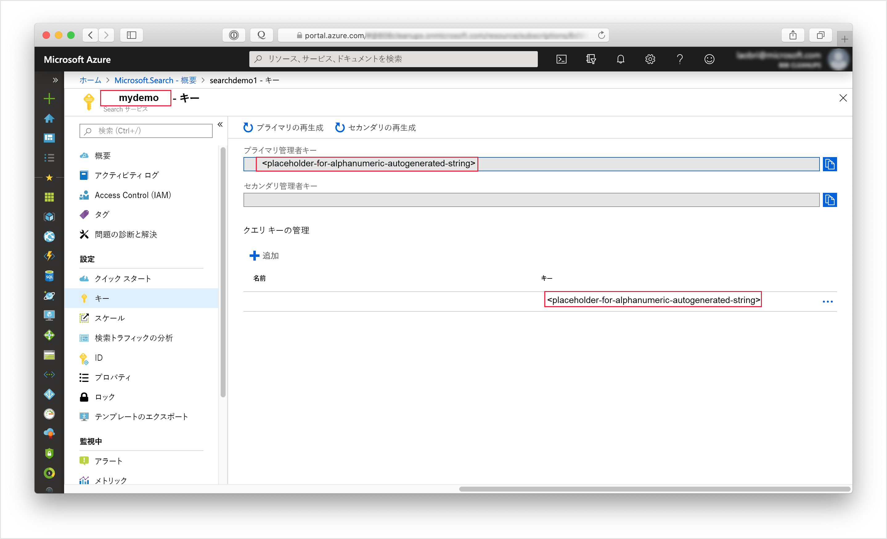

# <a name="quickstart-create-an-azure-cognitive-search-index-in-nodejs-using-rest-apis"></a>クイック スタート:REST API を使用して Node.js で Azure Cognitive Search インデックスを作成する
> [!div class="op_single_selector"]
> * [JavaScript](search-get-started-nodejs.md)
> * [C#](search-get-started-dotnet.md)
> * [ポータル](search-get-started-portal.md)
> * [PowerShell](search-create-index-rest-api.md)
> * [Python](search-get-started-python.md)
> * [Postman](search-get-started-postman.md)

Azure Cognitive Search インデックスの作成、読み込み、クエリを実行する Node.js アプリケーションを作成します。 本記事では、このアプリケーションの作成方法について詳しく説明します。 代わりに、[ソース コードとデータをダウンロード](https://github.com/Azure-Samples/azure-search-javascript-samples/tree/master/quickstart/)して、コマンド ラインでアプリケーションを実行することもできます。

Azure サブスクリプションをお持ちでない場合は、開始する前に [無料アカウント](https://azure.microsoft.com/free/?WT.mc_id=A261C142F) を作成してください。

## <a name="prerequisites"></a>前提条件

このクイックスタートをビルドしてテストするために次のソフトウェアとサービスを使用しました。

+ [Node.js](https://nodejs.org)

+ [NPM](https://www.npmjs.com) が Node.js によってインストールされている必要があります。

+ サンプルのインデックス構造と一致ドキュメントは、この記事で用意されます。または、[リポジトリの **quickstart** ディレクトリ](https://github.com/Azure-Samples/azure-search-javascript-samples/)から入手できます。

+ [Azure Cognitive Search サービスを作成](search-create-service-portal.md)するか、現在のサブスクリプションから[既存のサービスを見つけます](https://ms.portal.azure.com/#blade/HubsExtension/BrowseResourceBlade/resourceType/Microsoft.Search%2FsearchServices)。 このクイック スタート用には、無料のサービスを使用できます。

推奨:

* [Visual Studio Code](https://code.visualstudio.com)

* VSCode 用の [Prettier](https://marketplace.visualstudio.com/items?itemName=esbenp.prettier-vscode) および [ESLint](https://marketplace.visualstudio.com/items?itemName=dbaeumer.vscode-eslint) 拡張機能。

<a name="get-service-info"></a>

## <a name="get-keys-and-urls"></a>キーと URL を取得する

サービスの呼び出しには、要求ごとに URL エンドポイントとアクセス キーが必要です。 両方を使用して検索サービスが作成されるので、Azure Cognitive Search をサブスクリプションに追加した場合は、次の手順に従って必要な情報を入手してください。

1. [Azure portal にサインイン](https://portal.azure.com/)し、自分の検索サービスの **[概要]** ページで、自分の検索サービスの名前を確認します。 エンドポイント URL を見ることで、自分のサービス名を確かめることができます。 エンドポイント URL が `https://mydemo.search.windows.net` だったら、自分のサービス名は `mydemo` になります。

2. **[設定]**  >  **[キー]** で、サービスに対する完全な権限の管理キーを取得します。 管理キーをロールオーバーする必要がある場合に備えて、2 つの交換可能な管理キーがビジネス継続性のために提供されています。 オブジェクトの追加、変更、および削除の要求には、主キーまたはセカンダリ キーのどちらかを使用できます。

    クエリ キーも入手します。 読み取り専用アクセスを使用してクエリ要求を発行することをお勧めします。



すべての要求で、自分のサービスに送信される各要求のヘッダーに API キーが必要になります。 有効なキーにより、要求を送信するアプリケーションとそれを処理するサービスの間で、要求ごとに信頼が確立されます。

## <a name="set-up-your-environment"></a>環境の設定方法

まず、PowerShell コンソールか、Node.js をインストール済みのその他の環境を開きます。

1. 開発用ディレクトリを作成して `quickstart` という名前を付けます。

    ```powershell
    mkdir quickstart
    cd quickstart
    ```

2. `npm init` を実行して、npm により空のプロジェクトを初期化します。 既定値をそのまま使用します。ただし、ライセンスは "MIT" に設定する必要があります。 

1. コードで利用される、開発に役立つパッケージを追加します。

    ```powershell
    npm install nconf node-fetch
    npm install --save-dev eslint eslint-config-prettier eslint-config-airbnb-base eslint-plugin-import prettier
    ```

4. 自分の **package.json** ファイルが次のようになっていることをチェックして、プロジェクトとその依存関係を構成できたことを確認します。

    ```json
    {
      "name": "quickstart",
      "version": "1.0.0",
      "description": "Azure Cognitive Search Quickstart",
      "main": "index.js",
      "scripts": {
        "test": "echo \"Error: no test specified\" && exit 1"
      },
      "keywords": [
        "Azure",
        "Azure_Search"
      ],
      "author": "Your Name",
      "license": "MIT",
      "dependencies": {
        "nconf": "^0.10.0",
        "node-fetch": "^2.6.0"
      },
      "devDependencies": {
        "eslint": "^6.1.0",
        "eslint-config-airbnb-base": "^13.2.0",
        "eslint-config-prettier": "^6.0.0",
        "eslint-plugin-import": "^2.18.2",
        "prettier": "^1.18.2"
      }
    }
    ```

5. 自分の検索サービスのデータを保持する **azure_search_config.json** ファイルを作成します。

    ```json
    {
        "serviceName" : "[SEARCH_SERVICE_NAME]",
        "adminKey" : "[ADMIN_KEY]",
        "queryKey" : "[QUERY_KEY]",
        "indexName" : "hotels-quickstart"
    }
    ```

`[SERVICE_NAME]` の値は、自分の検索サービスの名前に置き換えます。 `[ADMIN_KEY]` と `[QUERY_KEY]` は、先ほど記録したキー値に置き換えます。 

## <a name="1---create-index"></a>1 - インデックスの作成 

**hotels_quickstart_index.json** というファイルを作成します。  このファイルでは、次の手順で読み込むドキュメントに対する Azure Cognitive Search の処理を定義します。 各フィールドは `name` によって識別されます。それぞれ、指定された `type` を備えています。 さらに各フィールドは、Azure Cognitive Search がそのフィールドに対して検索、フィルター、並べ替え、およびファセットを実行できるかどうかを指定する、一連のインデックス属性も備えています。 ほとんどのフィールドは単純なデータ型ですが、`AddressType` のように、自分のインデックスでリッチなデータ構造を作成できる複合型もあります。  [サポートされているデータ型](https://docs.microsoft.com/rest/api/searchservice/supported-data-types)と[インデックス属性](https://docs.microsoft.com/azure/search/search-what-is-an-index#index-attributes)について、詳細をお読みください。 

以下を **hotels_quickstart_index.json** に追加するか、[ファイルをダウンロードします](https://github.com/Azure-Samples/azure-search-javascript-samples/blob/master/quickstart/hotels_quickstart_index.json)。 

```json
{
    "name": "hotels-quickstart",
    "fields": [
        {
            "name": "HotelId",
            "type": "Edm.String",
            "key": true,
            "filterable": true
        },
        {
            "name": "HotelName",
            "type": "Edm.String",
            "searchable": true,
            "filterable": false,
            "sortable": true,
            "facetable": false
        },
        {
            "name": "Description",
            "type": "Edm.String",
            "searchable": true,
            "filterable": false,
            "sortable": false,
            "facetable": false,
            "analyzer": "en.lucene"
        },
        {
            "name": "Description_fr",
            "type": "Edm.String",
            "searchable": true,
            "filterable": false,
            "sortable": false,
            "facetable": false,
            "analyzer": "fr.lucene"
        },
        {
            "name": "Category",
            "type": "Edm.String",
            "searchable": true,
            "filterable": true,
            "sortable": true,
            "facetable": true
        },
        {
            "name": "Tags",
            "type": "Collection(Edm.String)",
            "searchable": true,
            "filterable": true,
            "sortable": false,
            "facetable": true
        },
        {
            "name": "ParkingIncluded",
            "type": "Edm.Boolean",
            "filterable": true,
            "sortable": true,
            "facetable": true
        },
        {
            "name": "LastRenovationDate",
            "type": "Edm.DateTimeOffset",
            "filterable": true,
            "sortable": true,
            "facetable": true
        },
        {
            "name": "Rating",
            "type": "Edm.Double",
            "filterable": true,
            "sortable": true,
            "facetable": true
        },
        {
            "name": "Address",
            "type": "Edm.ComplexType",
            "fields": [
                {
                    "name": "StreetAddress",
                    "type": "Edm.String",
                    "filterable": false,
                    "sortable": false,
                    "facetable": false,
                    "searchable": true
                },
                {
                    "name": "City",
                    "type": "Edm.String",
                    "searchable": true,
                    "filterable": true,
                    "sortable": true,
                    "facetable": true
                },
                {
                    "name": "StateProvince",
                    "type": "Edm.String",
                    "searchable": true,
                    "filterable": true,
                    "sortable": true,
                    "facetable": true
                },
                {
                    "name": "PostalCode",
                    "type": "Edm.String",
                    "searchable": true,
                    "filterable": true,
                    "sortable": true,
                    "facetable": true
                },
                {
                    "name": "Country",
                    "type": "Edm.String",
                    "searchable": true,
                    "filterable": true,
                    "sortable": true,
                    "facetable": true
                }
            ]
        }
    ],
    "suggesters": [
        {
            "name": "sg",
            "searchMode": "analyzingInfixMatching",
            "sourceFields": [
                "HotelName"
            ]
        }
    ]
}
```
    

特定のシナリオに固有の部分は、幅広く適用できるコードから分離することをお勧めします。 **AzureSearchClient.js** ファイルで定義される `AzureSearchClient` クラスでは、要求 URL の構築方法を認識し、Fetch API を使用して要求を実行して、応答の状態コードに対応します。

**node-fetch** パッケージをインポートし、単純なクラスを作成して、**AzureSearchClient.js** に着手します。 さまざまな構成値をコンストラクターに渡して、`AzureSearchClient` クラスの変更可能な部分を分離します。

```javascript
const fetch = require('node-fetch');

class AzureSearchClient {
    constructor(searchServiceName, adminKey, queryKey, indexName) {
        this.searchServiceName = searchServiceName;
        this.adminKey = adminKey;
        // The query key is used for read-only requests and so can be distributed with less risk of abuse.
        this.queryKey = queryKey;
        this.indexName = indexName;
        this.apiVersion = '2019-05-06';
    }

    // All methods go inside class body here!
}

module.exports = AzureSearchClient;
```

このクラスの最初の役割は、さまざまな要求の送信先となる URL の構築方法を認識することです。 これらの URL は、クラス コンストラクターに渡された構成データを使用するインスタンス メソッドによって構築します。 ここで構築する URL は API バージョンごとに異なり、そのバージョンを指定する引数が必要であることに注意してください (このアプリケーションでは `2019-05-06`)。 

これらのメソッドの 1 つ目は、インデックス自体の URL を返します。 クラス本文内に次のメソッドを追加します。

```javascript
getIndexUrl() { return `https://${this.searchServiceName}.search.windows.net/indexes/${this.indexName}?api-version=${this.apiVersion}`; }

```

`AzureSearchClient` の次の役目は、Fetch API を使用して非同期要求を実行することです。 非同期の静的メソッド `request` は、URL、HTTP メソッド ("GET"、"PUT"、"POST"、"DELETE") を指定する文字列、要求で使用されるキー、オプションの JSON オブジェクトを受け取ります。 `headers` 変数では、`queryKey` (管理キーと読み取り専用クエリ キーのいずれか) を HTTP 要求ヘッダーの "api-key" にマッピングします。 要求のオプションには常に、使用される `method` と、`headers` が含まれます。 `bodyJson` が `null` でない場合、HTTP 要求の本文は、`bodyJson` の文字列表現に設定されます。 `request` メソッドは、Fetch API の Promise を返して HTTP 要求を実行します。

```javascript
static async request(url, method, apiKey, bodyJson = null) {
    // Uncomment the following for request details:
    /*
    console.log(`\n${method} ${url}`);
    console.log(`\nKey ${apiKey}`);
    if (bodyJson !== null) {
        console.log(`\ncontent: ${JSON.stringify(bodyJson, null, 4)}`);
    }
    */

    const headers = {
        'content-type' : 'application/json',
        'api-key' : apiKey
    };
    const init = bodyJson === null ?
        { 
            method, 
            headers
        }
        : 
        {
            method, 
            headers,
            body : JSON.stringify(bodyJson)
        };
    return fetch(url, init);
}
```

デモが目的のため、HTTP 要求が成功にならなかった場合は例外をスローするだけにします。 実際のアプリケーションでは、検索サービス要求からの `response` の HTTP 状態コードをログに記録したり、診断したりするでしょう。 
    
```javascript
static throwOnHttpError(response) {
    const statusCode = response.status;
    if (statusCode >= 300){
        console.log(`Request failed: ${JSON.stringify(response, null, 4)}`);
        throw new Error(`Failure in request. HTTP Status was ${statusCode}`);
    }
}
```

最後に、Azure Cognitive Search インデックスの検出、削除、作成を行うメソッドを追加します。 これらのメソッドの構造はすべて同じです。

* 要求の実行対象になるエンドポイントを取得します。
* 適切なエンドポイント、HTTP 動詞、API キー、JSON 本文 (該当する場合) を使用して要求を生成します。 `indexExistsAsync()` と `deleteIndexAsync()` には JSON 本文がありませんが、`createIndexAsync(definition)` にはあります。
* 要求に対する応答を `await` します。  
* 応答の状態コードに対応します。
* 適切な値 (ブール値、`this`、またはクエリ結果) の Promise を返します。 

```javascript
async indexExistsAsync() { 
    console.log("\n Checking if index exists...");
    const endpoint = this.getIndexUrl();
    const response = await AzureSearchClient.request(endpoint, "GET", this.adminKey);
    // Success has a few likely status codes: 200 or 204 (No Content), but accept all in 200 range...
    const exists = response.status >= 200 && response.status < 300;
    return exists;
}

async deleteIndexAsync() {
    console.log("\n Deleting existing index...");
    const endpoint = this.getIndexUrl();
    const response = await AzureSearchClient.request(endpoint, "DELETE", this.adminKey);
    AzureSearchClient.throwOnHttpError(response);
    return this;
}

async createIndexAsync(definition) {
    console.log("\n Creating index...");
    const endpoint = this.getIndexUrl();
    const response = await AzureSearchClient.request(endpoint, "PUT", this.adminKey, definition);
    AzureSearchClient.throwOnHttpError(response);
    return this;
}
```

自分のメソッドがクラス内にあることと、クラスをエクスポートしていることを確認してください。 **AzureSearchClient.js** の最も外側のスコープは、次のようになります。

```javascript
const fetch = require('node-fetch');

class AzureSearchClient {
    // ... code here ...
}

module.exports = AzureSearchClient;
```

再利用の可能性がある **AzureSearchClient.js** モジュールには、オブジェクト指向のクラスが適していました。ただしこれは、**index.js** というファイルに配置すべきメイン プログラムには必要ありません。 

**index.js** を作成して、まずは以下を取り込みます。

* **nconf** パッケージ。これにより、JSON、環境変数、またはコマンド ライン引数で構成を指定できる柔軟性が得られます。
* **hotels_quickstart_index.json** ファイルのデータ。
* `AzureSearchClient` モジュール。

```javascript
const nconf = require('nconf');

const indexDefinition = require('./hotels_quickstart_index.json');
const AzureSearchClient = require('./AzureSearchClient.js');
```

[**nconf** パッケージ](https://github.com/indexzero/nconf)を使用すると、環境変数やコマンド ラインなど、さまざまな形式で構成データを指定できます。 このサンプルでは、基本的な方法で **nconf** を使用し、**azure_search_config.json** ファイルを読み取って、そのファイルの内容をディクショナリとして返します。 **nconf** の `get(key)` 関数を使用すると、構成の情報が適切にカスタマイズされていることを簡単にチェックできます。 最後に、関数は構成を返します。

```javascript
function getAzureConfiguration() {
    const config = nconf.file({ file: 'azure_search_config.json' });
    if (config.get('serviceName') === '[SEARCH_SERVICE_NAME]' ) {
        throw new Error("You have not set the values in your azure_search_config.json file. Change them to match your search service's values.");
    }
    return config;
}
```

`sleep` 関数では、指定された時間の経過後に解決される `Promise` を作成します。 この関数を使用すると、非同期インデックス操作が完了するまでアプリを一時停止して待機させ、その後利用可能にすることができます。 通常、こうした遅延の追加が必要になるのは、デモ、テスト、およびサンプル アプリケーションのみです。

```javascript
function sleep(ms) {
    return(
        new Promise(function(resolve, reject) {
            setTimeout(function() { resolve(); }, ms);
        })
    );
}
```

最後に、メインの非同期関数 `run` を指定して呼び出します。 この関数では、必要に応じて `Promise` の解決まで待機しながら、その他の関数を順番に呼び出します。

* 先ほど記述した `getAzureConfiguration()` を使用して構成を取得する
* 新しい `AzureSearchClient` インスタンスを作成し、構成から値を渡す
* インデックスが存在するかどうかをチェックし、存在する場合はそれを削除する
* **hotels_quickstart_index.json** から読み込んだ `indexDefinition` を使用してインデックスを作成する

```javascript
const run = async () => {
    try {
        const cfg = getAzureConfiguration();
        const client = new AzureSearchClient(cfg.get("serviceName"), cfg.get("adminKey"), cfg.get("queryKey"), cfg.get("indexName));
        
        const exists = await client.indexExistsAsync();
        await exists ? client.deleteIndexAsync() : Promise.resolve();
        // Deleting index can take a few seconds
        await sleep(2000);
        await client.createIndexAsync(indexDefinition);
    } catch (x) {
        console.log(x);
    }
}

run();
```

最後の `run()` の呼び出しを忘れないようにしてください。 これは、次の手順で `node index.js` を実行するときに、自分のプログラムへの入り口になります。

`AzureSearchClient.indexExistsAsync()` と `AzureSearchClient.deleteIndexAsync()` は、パラメーターを取らないことに注意してください。 これらの関数では、`bodyJson` 引数なしで `AzureSearchClient.request()` が呼び出されます。 `AzureSearchClient.request()` 内では `bodyJson === null` が `true` であるので、`init` 構造は、HTTP 動詞 (`indexExistsAsync()` の場合は "GET"、`deleteIndexAsync()` の場合は "DELETE") と、要求キーを指定するヘッダーのみに設定されます。  

これに対し、`AzureSearchClient.createIndexAsync(indexDefinition)` メソッドは 1 つのパラメーターを取り "_ます_"。 `index.js` の `run` 関数では、**hotels_quickstart_index.json** ファイルの内容を `AzureSearchClient.createIndexAsync(indexDefinition)` メソッドに渡します。 `createIndexAsync()` メソッドは、この定義を `AzureSearchClient.request()` に渡します。 `AzureSearchClient.request()` では `bodyJson === null` が今度は `false` であるので、`init` 構造には HTTP 動詞 ("PUT") とヘッダーが含まれるだけでなく、`body` がインデックスの定義データに設定されます。

### <a name="prepare-and-run-the-sample"></a>サンプルを用意して実行する

ターミナル ウィンドウを使用して、次のコマンドを実行します。

1. **package.json** ファイルと残りのコードが含まれているフォルダーに移動します。
1. `npm install` を使用して、サンプルのパッケージをインストールします。  このコマンドにより、コードで利用されるパッケージがダウンロードされます。
1. `node index.js` で自分のプログラムを実行します。

プログラムにより実行されているアクションを示す一連のメッセージが表示されます。 要求の詳細を確認したい場合は、**AzureSearchClient.js** で、[`AzureSearchClient.request()` メソッドの冒頭にある行]https://github.com/Azure-Samples/azure-search-javascript-samples/blob/master/quickstart/AzureSearchClient.js#L21-L27) をコメント解除します。 

Azure portal で、自分の検索サービスの **[概要]** を開きます。 **[インデックス]** タブを選択します。次のように表示されます。

![Azure portal の検索サービスの概要にある [インデックス] タブのスクリーンショット](media/search-get-started-nodejs/create-index-no-data.png)

次の手順では、インデックスにデータを追加します。 

## <a name="2---load-documents"></a>2 - ドキュメントの読み込み 

Azure Cognitive Search では、ドキュメントにはインデックス作成の入力とクエリからの出力があり、どちらもデータ構造です。 こうしたデータは、インデックスに POST する必要があります。 これには、前の手順で操作を実行したのとは異なるエンドポイントを使用します。 **AzureSearchClient.js** を開いて、`getIndexUrl()` の後に次のメソッドを追加します。

```javascript
 getPostDataUrl() { return `https://${this.searchServiceName}.search.windows.net/indexes/${this.indexName}/docs/index?api-version=${this.apiVersion}`;  }
```

`AzureSearchClient.createIndexAsync(definition)` と同様に、`AzureSearchClient.request()` を呼び出して、その本文となるホテル データを渡す関数が必要になります。 **AzureSearchClient.js** の `createIndexAsync(definition)` の後に、`postDataAsync(hotelsData)` を追加します。

```javascript
async postDataAsync(hotelsData) {
    console.log("\n Adding hotel data...");
    const endpoint = this.getPostDataUrl();
    const response = await AzureSearchClient.request(endpoint,"POST", this.adminKey, hotelsData);
    AzureSearchClient.throwOnHttpError(response);
    return this;
}
```

 ドキュメント入力には、データベース内の行、Blob Storage 内の BLOB、またはこの例のようなディスク上の JSON ドキュメントがあります。 [hotels.json](https://github.com/Azure-Samples/azure-search-javascript-samples/blob/master/quickstart/hotels.json) をダウンロードするか、次の内容を使って独自の **hotels.json** ファイルを作成できます。

```json
{
    "value": [
        {
            "HotelId": "1",
            "HotelName": "Secret Point Motel",
            "Description": "The hotel is ideally located on the main commercial artery of the city in the heart of New York. A few minutes away is Time's Square and the historic centre of the city, as well as other places of interest that make New York one of America's most attractive and cosmopolitan cities.",
            "Description_fr": "L'hôtel est idéalement situé sur la principale artère commerciale de la ville en plein cœur de New York. A quelques minutes se trouve la place du temps et le centre historique de la ville, ainsi que d'autres lieux d'intérêt qui font de New York l'une des villes les plus attractives et cosmopolites de l'Amérique.",
            "Category": "Boutique",
            "Tags": ["pool", "air conditioning", "concierge"],
            "ParkingIncluded": false,
            "LastRenovationDate": "1970-01-18T00:00:00Z",
            "Rating": 3.6,
            "Address": {
                "StreetAddress": "677 5th Ave",
                "City": "New York",
                "StateProvince": "NY",
                "PostalCode": "10022"
            }
        },
        {
            "HotelId": "2",
            "HotelName": "Twin Dome Motel",
            "Description": "The hotel is situated in a  nineteenth century plaza, which has been expanded and renovated to the highest architectural standards to create a modern, functional and first-class hotel in which art and unique historical elements coexist with the most modern comforts.",
            "Description_fr": "L'hôtel est situé dans une place du XIXe siècle, qui a été agrandie et rénovée aux plus hautes normes architecturales pour créer un hôtel moderne, fonctionnel et de première classe dans lequel l'art et les éléments historiques uniques coexistent avec le confort le plus moderne.",
            "Category": "Boutique",
            "Tags": ["pool", "free wifi", "concierge"],
            "ParkingIncluded": "false",
            "LastRenovationDate": "1979-02-18T00:00:00Z",
            "Rating": 3.6,
            "Address": {
                "StreetAddress": "140 University Town Center Dr",
                "City": "Sarasota",
                "StateProvince": "FL",
                "PostalCode": "34243"
            }
        },
        {
            "HotelId": "3",
            "HotelName": "Triple Landscape Hotel",
            "Description": "The Hotel stands out for its gastronomic excellence under the management of William Dough, who advises on and oversees all of the Hotel’s restaurant services.",
            "Description_fr": "L'hôtel est situé dans une place du XIXe siècle, qui a été agrandie et rénovée aux plus hautes normes architecturales pour créer un hôtel moderne, fonctionnel et de première classe dans lequel l'art et les éléments historiques uniques coexistent avec le confort le plus moderne.",
            "Category": "Resort and Spa",
            "Tags": ["air conditioning", "bar", "continental breakfast"],
            "ParkingIncluded": "true",
            "LastRenovationDate": "2015-09-20T00:00:00Z",
            "Rating": 4.8,
            "Address": {
                "StreetAddress": "3393 Peachtree Rd",
                "City": "Atlanta",
                "StateProvince": "GA",
                "PostalCode": "30326"
            }
        },
        {
            "HotelId": "4",
            "HotelName": "Sublime Cliff Hotel",
            "Description": "Sublime Cliff Hotel is located in the heart of the historic center of Sublime in an extremely vibrant and lively area within short walking distance to the sites and landmarks of the city and is surrounded by the extraordinary beauty of churches, buildings, shops and monuments. Sublime Cliff is part of a lovingly restored 1800 palace.",
            "Description_fr": "Le sublime Cliff Hotel est situé au coeur du centre historique de sublime dans un quartier extrêmement animé et vivant, à courte distance de marche des sites et monuments de la ville et est entouré par l'extraordinaire beauté des églises, des bâtiments, des commerces et Monuments. Sublime Cliff fait partie d'un Palace 1800 restauré avec amour.",
            "Category": "Boutique",
            "Tags": ["concierge", "view", "24-hour front desk service"],
            "ParkingIncluded": true,
            "LastRenovationDate": "1960-02-06T00:00:00Z",
            "Rating": 4.6,
            "Address": {
                "StreetAddress": "7400 San Pedro Ave",
                "City": "San Antonio",
                "StateProvince": "TX",
                "PostalCode": "78216"
            }
        }
    ]
}

```

このデータを自分のプログラムに読み込むために、`hotelData` を参照する行を先頭付近に追加して、**index.js** を変更します。

```javascript
const nconf = require('nconf');

const hotelData = require('./hotels.json');
const indexDefinition = require('./hotels_quickstart_index.json');
```

次に、**index.js** の `run()` 関数を変更します。 インデックスが利用可能となるまでに数秒かかる可能性があるので、`AzureSearchClient.postDataAsync(hotelData)` の呼び出しの前に 2 秒間の一時停止を追加します。

```javascript
const run = async () => {
    try {
        const cfg = getAzureConfiguration();
        const client = new AzureSearchClient(cfg.get("serviceName"), cfg.get("adminKey"), cfg.get("queryKey"), cfg.get("indexName"));
        
        const exists = await client.indexExistsAsync();
        await exists ? client.deleteIndexAsync() : Promise.resolve();
        // Deleting index can take a few seconds
        await sleep(2000);
        await client.createIndexAsync(indexDefinition);
        // Index availability can take a few seconds
        await sleep(2000);
        await client.postDataAsync(hotelData);
    } catch (x) {
        console.log(x);
    }
}
```

`node index.js` でプログラムを再度実行します。 手順 1 で表示されたのとは若干異なるメッセージが表示されるはずです。 今回はインデックスが存在して "_いる_" ので、アプリが新規インデックスを作成してそこにデータをポストする前に、インデックスの削除に関するメッセージが表示されます。 

## <a name="3---search-an-index"></a>3 - インデックスの検索

Azure portal で、自分の検索サービスの **[概要]** の **[インデックス]** タブに戻ります。 インデックスには現在 4 つのドキュメントが含まれており、一定量のストレージが消費されています (インデックスの基本状態が UI に適切に反映されるまで数分かかる場合があります)。 インデックス名をクリックすると、**Search エクスプローラー**が開きます。 このページでは、データ クエリを試すことができます。 `*&$count=true` というクエリ文字列を検索してみてください。自分のドキュメントと、結果の数がすべて返されます。 `historic&highlight=Description&$filter=Rating gt 4` というクエリ文字列を試してみてください。単語 "historic" が `<em></em>` タグで囲まれた単一のドキュメントが返されます。 詳細については、[Azure Cognitive Search でのクエリを構成する方法](https://docs.microsoft.com/azure/search/search-query-overview)に関するページを参照してください。 

**index.js** を開いて先頭付近にこのコードを追加して、これらのクエリをコードで再現します。

```javascript
const queries = [
    "*&$count=true",
    "historic&highlight=Description&$filter=Rating gt 4&"
];
```

同じ **index.js** ファイルで、以下に示す `doQueriesAsync()` 関数を記述します。 この関数では、`AzureSearchClient` オブジェクトを受け取り、`queries` 配列の各値に `AzureSearchClient.queryAsync` メソッドを適用します。 `Promise.all()` 関数を使用して、すべてのクエリが解決されたときにのみ解決される単一の `Promise` を返します。 `JSON.stringify(body, null, 4)` の呼び出しでは、クエリ結果を読みやすい形式に整えています。

```javascript
async function doQueriesAsync(client) {
    return Promise.all(
        queries.map( async query => {
            const result = await client.queryAsync(query);
            const body = await result.json();
            const str = JSON.stringify( body, null, 4);
            console.log(`Query: ${query} \n ${str}`);
        })
    );
}
```

インデクサーが機能するのに十分な時間一時停止してから `doQueriesAsync(client)` 関数を呼び出すように、`run()` 関数を変更します。

```javascript
const run = async () => {
    try {
        const cfg = getAzureConfiguration();
        const client = new AzureSearchClient(cfg.get("serviceName"), cfg.get("adminKey"), cfg.get("queryKey"), cfg.get("indexName"));
        
        const exists = await client.indexExistsAsync();
        await exists ? client.deleteIndexAsync() : Promise.resolve();
        // Deleting index can take a few seconds
        await sleep(2000);
        await client.createIndexAsync(indexDefinition);
        // Index availability can take a few seconds
        await sleep(2000);
        await client.postDataAsync(hotelData);
        // Data availability can take a few seconds
        await sleep(5000);
        await doQueriesAsync(client);
    } catch (x) {
        console.log(x);
    }
}
```

`AzureSearchClient.queryAsync(query)` を実装するために、**AzureSearchClient.js** ファイルを編集します。 検索には別のエンドポイントが必要であり、検索語句が URL の引数になります。このため、既に記述済みの `getIndexUrl()` および `getPostDataUrl()` メソッドに加えて、`getSearchUrl(searchTerm)` 関数を追加します。

```javascript
getSearchUrl(searchTerm) { return `https://${this.searchServiceName}.search.windows.net/indexes/${this.indexName}/docs?api-version=${this.apiVersion}&search=${searchTerm}&searchMode=all`; }
 ```

`queryAsync(searchTerm)` 関数も **AzureSearchClient.js** 内で実行され、`postDataAsync(data)` やその他のクエリ関数と同じ構造になります。 

```javascript
async queryAsync(searchTerm) {
    console.log("\n Querying...")
    const endpoint = this.getSearchUrl(searchTerm);
    const response = await AzureSearchClient.request(endpoint, "GET", this.queryKey);
    AzureSearchClient.throwOnHttpError(response);
    return response;
}
```

検索語句が URL の一部であるため、検索は本文を指定せずに "GET" 動詞を使用して行います。 管理キーを使用していた他の関数とは異なり、`queryAsync(searchTerm)` では `this.queryKey` を使用することに注意してください。 クエリ キーは、その名前が示すとおりインデックスのクエリにのみ使用でき、インデックスを変更する目的で使用することは一切できません。 したがって、クライアント アプリケーションに配布する場合はクエリ キーの方が安全です。

`node index.js` でプログラムを実行します。 今回は、これまでの手順に加えてクエリが送信され、結果がコンソールに書き込まれます。

### <a name="about-the-sample"></a>サンプルについて

このサンプルでは、Azure Cognitive Search インデックスの作成とクエリ実行の基礎を説明するうえで十分な、少量のホテル データを使用しています。

検索サービスの構成、URL、基本的な HTTP 要求は、**AzureSearchClient** クラスによってカプセル化されています。 **index.js** ファイルでは、Azure Cognitive Search サービスの構成データ、およびインデックス作成のためにアップロードするホテル データを読み込んでいます。また、その `run` 関数でさまざまな操作を指示および実行しています。

`run` 関数の全動作は、Azure Cognitive Search インデックスを削除し (存在する場合)、インデックスを作成してデータを追加し、いくつかのクエリを実行することです。  

## <a name="clean-up-resources"></a>リソースをクリーンアップする

独自のサブスクリプションを使用している場合は、プロジェクトの最後に、作成したリソースがまだ必要かどうかを確認してください。 リソースを実行したままにすると、お金がかかる場合があります。 リソースは個別に削除することも、リソース グループを削除してリソースのセット全体を削除することもできます。

ポータルの左側のナビゲーション ウィンドウにある **[すべてのリソース]** または **[リソース グループ]** リンクを使って、リソースを検索および管理できます。

無料サービスを使っている場合は、3 つのインデックス、インデクサー、およびデータソースに制限されることに注意してください。 ポータルで個別の項目を削除して、制限を超えないようにすることができます。 

## <a name="next-steps"></a>次のステップ

この Node.js クイックスタートでは、インデックスの作成、そこへのドキュメントの読み込み、およびクエリの実行という一連のタスクに取り組みました。 構成の読み取りやクエリの定義など、一部の手順についてはできる限り単純な方法で行っています。 実際のアプリケーションでは、これらは別のモジュールに配置することをお勧めします。そうすることで、柔軟性が高まり、カプセル化が可能になります。 
 
Azure Cognitive Search についての知識が既にある場合は、このサンプルを基にして、サジェスター (先行入力またはオートコンプリート クエリ)、フィルター、ファセット ナビゲーションなどを試すことができます。 Azure Cognitive Search を初めて使用する場合は、他のチュートリアルも試して、作成できる内容について理解を深めることをお勧めします。 他のリソースについては、[ドキュメントのページ](https://azure.microsoft.com/documentation/services/search/)を参照してください。 

> [!div class="nextstepaction"]
> [JavaScript を使用して Web ページから Azure Cognitive Search を呼び出す](https://github.com/liamca/azure-search-javascript-samples)
