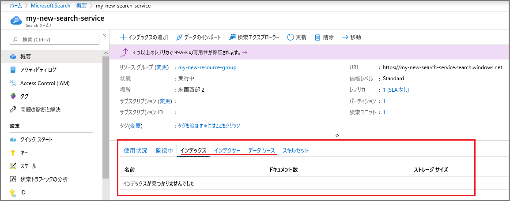
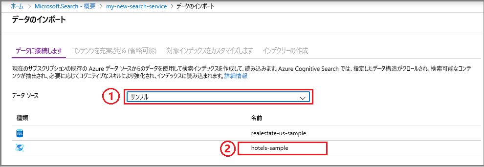
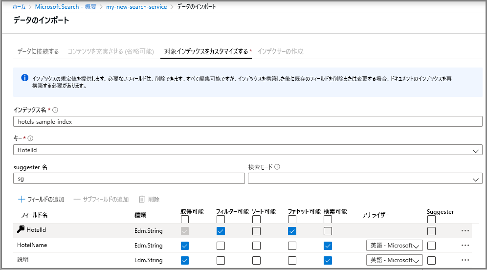
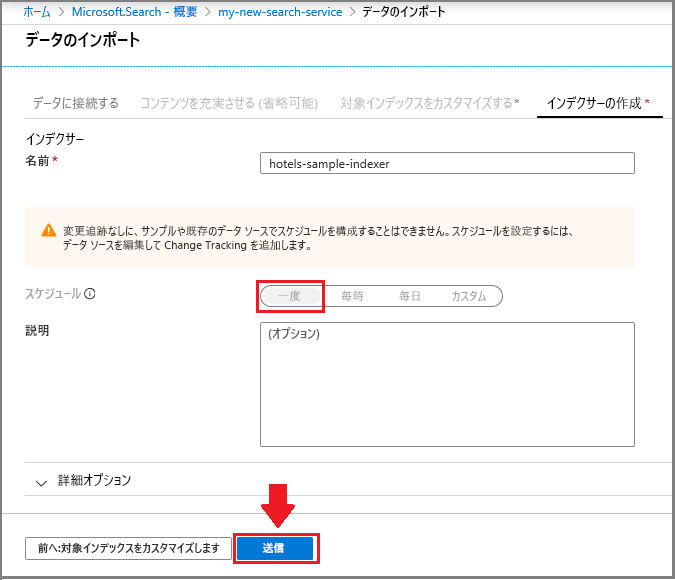
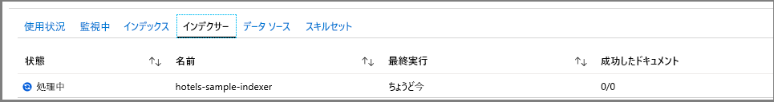
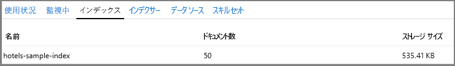
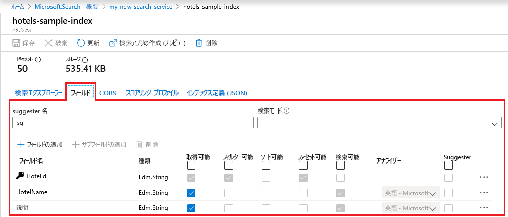
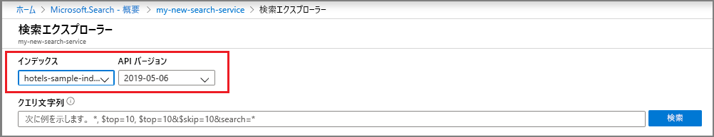
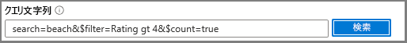

# クイック スタート:Azure portal を利用して Azure Search インデックスを作成する
> [!div class="op_single_selector"]
> * [ポータル](search-get-started-portal.md)
> * [PowerShell](search-get-started-powershell.md)
> * [Postman](search-get-started-postman.md)
> * [Python](search-get-started-python.md)
> * [C#](search-get-started-dotnet.md)

Azure Search の概念をすばやく把握するために、Azure portal のビルトイン ツールをお試しください。 ウィザードとエディターは .NET および REST API と完全には対応していませんが、コーディングなしの導入ですぐに開始でき、サンプル データに対する興味深いクエリを数分以内に記述できます。

> [!div class="checklist"]
> * Azure にホストされている無料のパブリック サンプル データセットから開始する
> * Azure Search 内の**データのインポート** ウィザードを実行してデータを読み込み、インデックスを生成する
> * ポータル上でインデックス作成の進行状況を監視する
> * 既存のインデックスとそれを変更するためのオプションを表示する
> * **Search エクスプローラー**を使用して、フルテキスト検索、フィルター、ファセット、あいまい検索、地理空間検索について確認する

ツールに制限がありすぎる場合は、[.NET での Azure Search のプログラミングに関するコーディングを前提とした概要記事](search-howto-dotnet-sdk.md)を検討するか、または [REST API の呼び出しを行うために Postman](search-get-started-postman.md) を使います。 また、「[Azure Search Overview (Azure Search の概要)](https://channel9.msdn.com/Events/Connect/2016/138)」ビデオで、このチュートリアルの手順のデモをご覧いただけます (約 3 分目から 6 分間)。

Azure サブスクリプションをお持ちでない場合は、開始する前に [無料アカウント](https://azure.microsoft.com/free/?WT.mc_id=A261C142F) を作成してください。 

## 前提条件

[Azure Search サービスを作成](search-create-service-portal.md)するか、現在のサブスクリプションから[既存のサービスを見つけます](https://ms.portal.azure.com/#blade/HubsExtension/BrowseResourceBlade/resourceType/Microsoft.Search%2FsearchServices)。 このクイック スタート用には、無料のサービスを使用できます。 

### 領域の確認

多くのユーザーが最初に利用するのは、無料版のサービスです。 このバージョンは、インデックス、データ ソース、インデクサーがそれぞれ 3 つに限定されています。 十分な空き領域があることを確認してから開始してください。 このチュートリアルでは、それぞれのオブジェクトを 1 つ作成します。

サービス ダッシュボードのセクションには、既に存在するインデックス、インデクサー、データ ソースの数が表示されます。 

## インデックスの作成とデータの読み込み

検索クエリは、"[*インデックス*](search-what-is-an-index.md)" を反復処理します。インデックスには、検索可能なデータやメタデータに加え、特定の検索の動作を最適化する構造が含まれています。

このチュートリアルでは、**データのインポート** ウィザードから "[*インデクサー*](search-indexer-overview.md)" を使用してクロールできる、組み込みのサンプル データセットを使用します。 インデクサーは、サポートされている Azure データ ソースからメタデータとコンテンツを読み取ることができるソース固有のクローラーです。 通常、インデクサーはプログラムで使用されますが、ポータル上では**データのインポート** ウィザードを使用してアクセスできます。 

### 手順 1 - データのインポート ウィザードを起動し、データ ソースを作成する

1. Azure Search サービスのダッシュボード上で、コマンド バーの **[データのインポート]** をクリックして検索インデックスを作成し、設定します。

   ![[データのインポート] コマンド](media/search-get-started-portal/import-data-cmd.png)

2. ウィザードで **[データに接続します]**  >  **[サンプル]**  >  **[hotels-sample]** の順にクリックします。 このデータ ソースは組み込まれています。 独自のデータ ソースを作成する場合は、名前、型、接続情報を指定する必要があります。 作成すると、他のインポート操作で再度使用できる "既存のデータ ソース" になります。

   

3. 次のページに進みます。

   

### 手順 2 - コグニティブ スキルをスキップする

ウィザードでは、インデックス作成に Cognitive Services AI アルゴリズムを組み込むための[コグニティブ スキル パイプライン](cognitive-search-concept-intro.md)の作成がサポートされます。 

今回はこの手順をスキップして、 **[対象インデックスをカスタマイズします]** に直接進みましょう。

   

> [!TIP]
> AI インデックス作成の例は、[クイックスタート](cognitive-search-quickstart-blob.md)または[チュートリアル](cognitive-search-tutorial-blob.md)内でステップ実行できます。

### 手順 3 - インデックスを構成する

通常、インデックスの作成はコード ベースの作業であり、データの読み込み前に完了しています。 ただし、このチュートリアルで示すように、ウィザードではクロール可能なデータ ソースを想定して、基本インデックスを生成できます。 インデックスには少なくとも、名前とフィールド コレクションが必要です。さらに、各ドキュメントを一意に識別するためのドキュメント キーとして、いずれかのフィールドがマークされている必要があります。 さらに、オートコンプリートやクエリ候補が必要な場合は、言語アナライザーまたは suggester を指定できます。

フィールドには、データ型と属性があります。 上部に並んだチェック ボックスは、フィールドがどのように使用されるかを制御する "*インデックスの属性*" です。

* **[取得可能]** は、そのフィールドが検索結果のリストに現れることを意味します。 このチェック ボックスをオフにすることで、フィルター式でのみ使用されているフィールドなど、検索結果から抑制するフィールドを個別に指定できます。
* **[キー]** は一意のドキュメント識別子です。 常に文字列で、必須です。
* **[フィルター可能]** 、 **[ソート可能]** 、 **[ファセット可能]** では、フィルタリング、並べ替え、ファセットのナビゲーション構造にフィールドを使用するかどうかを決定します。
* **[検索可能]** は、フィールドがフルテキスト検索の対象となることを意味します。 文字列は検索可能です。 数値フィールドとブール型フィールドは通常、検索対象外として指定されます。

ストレージ要件は、選択の結果によって変わりません。 たとえば、複数のフィールドで **[取得可能]** 属性を設定した場合、ストレージ要件は上昇しません。

既定では、ウィザードは一意の識別子のデータ ソースをキー フィールドの基準としてスキャンします。 "*文字列*" は、**取得可能**かつ**検索可能**です。 "*整数*" は、**取得可能**、**フィルター可能**、**ソート可能**、**ファセット可能**です。

1. 既定値を受け入れます。 

   既存の hotels データ ソースを使用してウィザードを 2 回目に再実行した場合は、インデックスが既定の属性で構成されることはありません。 以降のインポートでは、属性を手動で選択する必要があります。 

   

2. 次のページに進みます。

   

### 手順 4 - インデクサーを構成する

引き続き、**データのインポート** ウィザードで、 **[インデクサー]**  >  **[名前]** の順にクリックし、インデクサーの名前を入力します。

このオブジェクトによって、実行可能なプロセスが定義されます。 定期的なスケジュールを設定することもできますが、ここでは、インデクサーを即時に一度だけ実行する既定のオプションを使用します。

**[送信]** をクリックして、インデクサーを作成し、同時に実行します。

  

## 進行状況の監視

ウィザードに、進行状況を監視できるインデクサーの一覧が表示されます。 自己ナビゲーションを行うには、[概要] ページに移動し、 **[インデクサー]** をクリックします。

ポータルによってページが更新されるまで数分かかることがありますが、新規に作成したインデクサーが一覧に表示されます。"進行中" または "成功" を示すステータスと、インデックスが作成されたドキュメントの数も表示されます。

   

## インデックスの表示

メイン サービス ページには、Azure Search サービスで作成されたリソースへのリンクがあります。  作成したインデックスを表示するには、リンクの一覧の **[インデックス]** をクリックします。 

   

この一覧で、作成した *hotels-sample* インデックスをクリックすると、インデックスのスキーマが表示されます。 また、必要に応じて新しいフィールドを追加できます。 

**[フィールド]** タブには、インデックス スキーマが表示されます。 一覧を下までスクロールし、新しいフィールドを入力します。 ほとんどの場合、既存のフィールドを変更することはできません。 既存のフィールドは、Azure Search における物理的表現を含んでいるため、コード内でも編集することはできません。 既存のフィールドを根本的に変えるには、インデックスを新たに作成して、元のインデックスは削除します。

   

その他のコンストラクト (スコアリング プロファイル、CORS オプションなど) はいつでも追加することができます。

インデックスの設計時に何を編集できて何を編集できないかを明確に理解するために、インデックスの定義オプションをじっくり見てみましょう。 淡色表示されているオプションは、値を編集することも削除することもできないことを表します。 

##  Search エクスプローラーを使用してクエリを実行する

この時点で検索インデックスは、ビルトインの [**Search エクスプローラー**](search-explorer.md)のクエリ ページを使って照会する準備が整っています。 このページには、任意のクエリ文字列をテストできるよう検索ボックスが備わっています。

**Search エクスプローラー**は、[REST API 要求](https://docs.microsoft.com/rest/api/searchservice/search-documents)を処理するためだけに装備されていますが、[単純なクエリ構文](https://docs.microsoft.com/rest/api/searchservice/simple-query-syntax-in-azure-search)と[完全な Lucene クエリ パーサー](https://docs.microsoft.com/rest/api/searchservice/lucene-query-syntax-in-azure-search)の両方の構文を受け取ります。さらに、[Search Document REST API](https://docs.microsoft.com/rest/api/searchservice/search-documents#bkmk_examples) 操作で使用できるすべての検索パラメーターも受け取ります。

> [!TIP]
> [Azure Search の概要ビデオ](https://channel9.msdn.com/Events/Connect/2016/138)の 6 分 8 秒から 次の手順のデモをご覧いただけます。
>

1. コマンド バーの **[Search エクスプローラー]** をクリックします。

   ![[Search エクスプローラー] コマンド](media/search-get-started-portal/search-explorer-cmd.png)

2. **[インデックス]** ドロップダウンで *hotels-sample* を選択します。 **[API バージョン]** ドロップダウンをクリックして、REST API が使用可能であることを確認します。 以下のクエリでは、一般公開バージョン (2019-05-06) を使います。

   

3. 検索バーで次のクエリ文字列を貼り付けて、 **[検索]** をクリックします。

   

## クエリの例

Bing や Google 検索で行うように用語や語句を入力するか、完全に指定したクエリ式を入力できます。 結果は冗長な JSON ドキュメントとして返されます。

### 上位 N 件の単純なクエリ

#### 例 (文字列クエリ): `search=spa`

* **search** パラメーターは、フルテキスト検索用のキーワード検索の入力に使用します。この例では、ドキュメントのいずれかの検索可能フィールドに *spa* が含まれるホテルのデータが返されます。

* **Search エクスプローラー**は JSON で結果を返しますが、ドキュメント構造が高密度な場合は冗長で読みづらくなります。 これは意図的なものです。開発の目的上、特にテスト時には、ドキュメント全体の可視性が重要となります。 ユーザー エクスペリエンスを高めるためには、[検索結果を処理](search-pagination-page-layout.md)して重要な要素を抽出するコードの作成が必要になるでしょう。

* ドキュメントは、インデックスで "取得可能" としてマークされているすべてのフィールドで構成されます。 ポータル上でインデックスの属性を表示するには、 **[インデックス]** 一覧で *hotels-sample* をクリックします。

#### 例 (パラメーター化クエリ): `search=spa&$count=true&$top=10`

* 検索パラメーターを追加するには **&** 記号を使用します。検索パラメーターは任意の順序で指定できます。

* **$count=true** パラメーターでは、返されたすべてのドキュメントの合計数が返されます。 この値は、検索結果の最上部付近に表示されます。 **$count=true** で報告される数の変化を監視することで、フィルター クエリを確認できます。 カウントが小さいほど、指定したフィルターが効果的に作用していることを意味します。

* **$top=10** では、全体の中から上位 10 件のドキュメントが返されます。 既定では、Azure Search によって上位 50 件が返されます。 **$top** を使用して、この数を増減できます。

###  クエリのフィルター処理

検索要求に対するフィルターの追加は、 **$filter** パラメーターを追加するときに行います。 

#### 例 (フィルター): `search=beach&$filter=Rating gt 4`

* **$filter** パラメーターは、指定した条件に一致する結果を返します。 この例では、評価が 4 を超えるものが返されます。

* フィルター構文は、OData 構文です。 詳細については、[フィルターの OData 構文](https://docs.microsoft.com/rest/api/searchservice/odata-expression-syntax-for-azure-search)に関するページを参照してください。

###  クエリのファセット

ファセット フィルターは検索要求に追加されます。 指定したファセット値に一致するドキュメントの総数を facet パラメーターを使用して取得できます。

#### 例 (範囲の縮小によるファセット): `search=*&facet=Category&$top=2`

* **search=** * は空の検索です。 空の検索は、すべてを検索します。 空のクエリを送信する理由の 1 つは、ドキュメントのすべてのセットをフィルターまたはファセットすることです。 たとえば、インデックス内のすべてのホテルから成るファセット ナビゲーション構造が必要な場合などです。
* **facet** は、UI コントロールに渡せるナビゲーション構造を返します。 返されるのはカテゴリと数です。 この場合、カテゴリはちょうど *Category* という名前のフィールドに基づきます。 Azure Search には集計機能はありませんが、各カテゴリのドキュメントの数を示す `facet` により、大まかな集計を行うことができます。

* **$top=2** では 2 件のドキュメントが返されます。つまり、`top` を使用すると、結果を減らすことも増やすこともできます。

#### 例 (数値に対するファセット): `search=spa&facet=Rating`

* このクエリは、*spa* に対するテキスト検索での、評価に対するファセットです。 フィールドがインデックスで取得可能、フィルター可能、ファセット可能としてマークされているので、用語 *Rating* をファセットとして指定できます。また、含まれる値 (1 から 5 の数値) は一覧をグループに分類するのに適しています。

* ファセットできるのは、フィルター可能なフィールドのみです。 結果として返されるのは、取得可能なフィールドのみです。

* *Rating* フィールドは倍精度浮動小数点数であり、グループ化は正確な値によります。 間隔によるグループ化 (たとえば、"三つ星評価"、"四つ星評価" など) について詳しくは、「[Azure Search でファセット ナビゲーションを実装する方法](https://docs.microsoft.com/azure/search/search-faceted-navigation#filter-based-on-a-range)」をご覧ください。

###  検索結果の強調表示

検索結果の強調表示は、特定のフィールドで一致があった場合の、キーワードに一致したテキストの書式設定を表します。 検索対象の用語が説明に深く埋もれている場合、検索結果の強調表示を追加してその用語を見つけやすくすることができます。

#### 例 (蛍光ペン): `search=beach&highlight=Description`

* この例では、書式設定された語句 *beach* が説明フィールドで見つけやすくなります。

#### 例 (言語分析): `search=beaches&highlight=Description`

* フルテキスト検索では、単語の形式の基本的なバリエーションが認識されます。 この場合、"beaches" のキーワード検索に対する応答の検索結果には、検索可能フィールドにその単語が存在するホテルについて、"beach" が強調表示されたテキストが含まれます。 語形変化していても、言語分析により同じ単語として結果に表示できます。 

* Azure Search では、Lucene と Microsoft の 56 個のアナライザーをサポートしています。 Azure Search で既定で使用されるのは、Lucene の標準アナライザーです。

###  あいまい検索を試す

既定では、検索語のスペルを間違うと ("Seattle" に対する *seatle* など)、通常の検索では一致しません。 次の例では、検索結果が 1 件も返されません。

#### 例 (検索語のスペルミス非対応): `search=seatle`

スペルミスに対応するには、あいまい検索を使用します。 あいまい検索は、full タイプの Lucene クエリ構文を使用したときに有効になります。クエリで「**queryType=full**」を設定し、さらに検索文字列に「 **~** 」を追加するという 2 つの指定によって、この動作が引き起こされます。

#### 例 (検索語のスペルミス対応): `search=seatle~&queryType=full`

この例では、"Seattle" に基づく一致を含んだドキュメントが返されます。

**queryType** が指定されていない場合、既定の単純なクエリ パーサーが使用されます。 単純なクエリ パーサーの方が高速ですが、あいまい検索、正規表現、近接検索などの高度な種類のクエリが必要な場合は、完全な構文が必要になります。

あいまい検索とワイルドカード検索は、検索の出力に影響を及ぼします。 これらのクエリ形式に対しては言語分析が実行されません。 あいまい検索とワイルドカード検索を使用する際は、あらかじめ「[Azure Search のフルテキスト検索のしくみ](search-lucene-query-architecture.md#stage-2-lexical-analysis)」で、字句解析の例外についてのセクションを参照してください。

完全なクエリ パーサーによって有効になるクエリのシナリオの詳細については、「[Lucene query syntax in Azure Search (Azure Search での Lucene クエリ構文)](https://docs.microsoft.com/rest/api/searchservice/lucene-query-syntax-in-azure-search)」を参照してください。

###  地理空間検索を試す

地理空間検索は、座標を格納しているフィールドの [edm.GeographyPoint データ型](https://docs.microsoft.com/rest/api/searchservice/supported-data-types)によってサポートされます。 地理空間検索はフィルターの種類で、[フィルターの OData 構文](https://docs.microsoft.com/rest/api/searchservice/odata-expression-syntax-for-azure-search)で指定します。

#### 例 (地理座標フィルター): `search=*&$count=true&$filter=geo.distance(Location,geography'POINT(-122.12 47.67)') le 5`

この例のクエリでは、位置データのすべての結果から、(緯度と経度の座標で指定された) 特定の地点から 5 km 未満のものをフィルター処理します。 **$count** を追加すると、距離と座標のいずれかを変更した場合に返される結果の数を確認できます。

地理空間検索は、検索アプリケーションに "近くを検索" 機能がある場合、またはマップ ナビゲーションを使用している場合に有用です。 ただし、フルテキスト検索ではありません。 ユーザーの要件に都市名または国/地域名での検索がある場合は、座標に加えて、都市名または国/地域名を含むフィールドを追加します。

## 重要なポイント

このチュートリアルでは、Azure portal を使用した Azure Search について簡単に紹介しました。

**データのインポート** ウィザードを使って検索インデックスを作成する方法について説明しました。 [インデクサー](search-indexer-overview.md)について取り上げると共に、インデックス設計の基本的なワークフローについて説明しました。その際、[公開済みのインデックスに対して行うことができる変更](https://docs.microsoft.com/rest/api/searchservice/update-index)についても触れています。

Azure portal の **Search エクスプローラー**を使って、フィルターや検索結果の強調表示、あいまい検索、地理空間検索など、主要な機能を紹介する実践的な例を通じて、基本的なクエリの構文を学びました。

ポータル上で、インデックス、インデクサー、データ ソースを検索する方法も学びました。 今後、新しいデータ ソースを扱うときにも、ポータルから、ごくわずかな労力で、その定義やフィールド コレクションを簡単に調べることができるでしょう。

## クリーンアップ

独自のサブスクリプションを使用している場合は、プロジェクトの最後に、作成したリソースがまだ必要かどうかを確認してください。 リソースを実行したままにすると、お金がかかる場合があります。 リソースは個別に削除することも、リソース グループを削除してリソースのセット全体を削除することもできます。

ポータルの左側のナビゲーション ウィンドウにある **[すべてのリソース]** または **[リソース グループ]** リンクを使って、リソースを検索および管理できます。

無料サービスを使っている場合は、3 つのインデックス、インデクサー、およびデータソースに制限されることに注意してください。 ポータルで個別の項目を削除して、制限を超えないようにすることができます。 

## 次の手順

次のプログラム ツールを使えば、Azure Search の可能性がさらに広がります。

* [.NET SDK を使用してインデックスを作成する](https://docs.microsoft.com/azure/search/search-create-index-dotnet)
* [REST API を使用してインデックスを作成する](https://docs.microsoft.com/azure/search/search-create-index-rest-api)
* [Postman または Fiddler と Azure Search REST API を使用してインデックスを作成する](search-get-started-postman.md)
