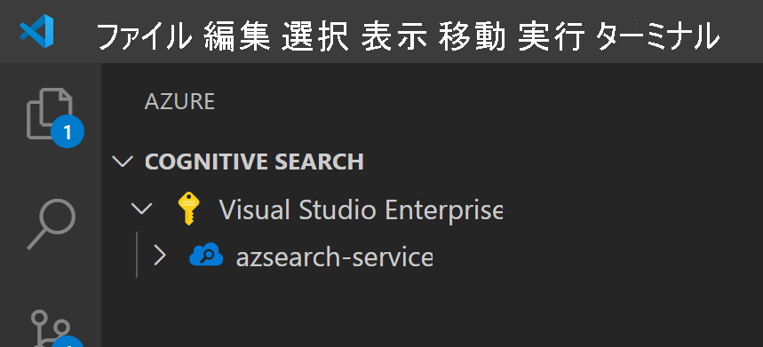
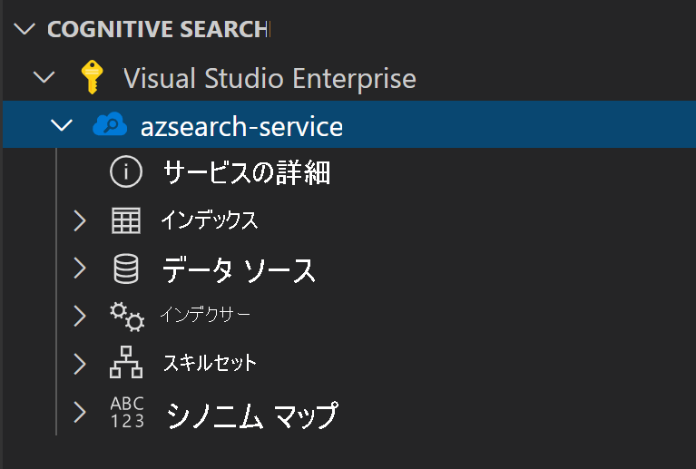
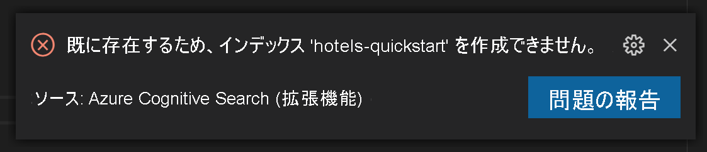
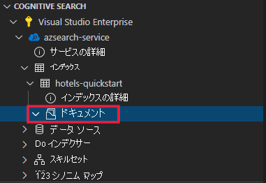
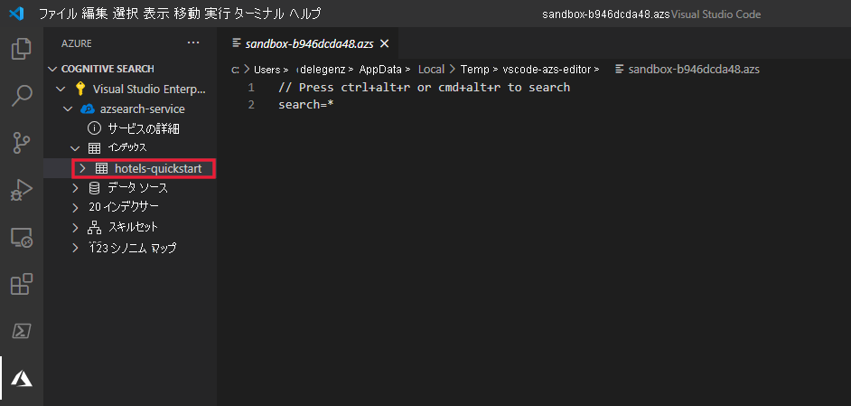

# <a name="get-started-with-azure-cognitive-search-using-visual-studio-code"></a>Visual Studio Code を使用して Azure Cognitive Search の使用を開始する

この記事では、[Azure Cognitive Search REST API](/rest/api/searchservice) と [Visual Studio Code](https://marketplace.visualstudio.com/items?itemName=ms-azuretools.vscode-azurecognitivesearch) を使用してREST API 要求を対話的に作成する方法について説明します。 [Azure Cognitive Search 用の Visual Studio Code 拡張機能 (プレビュー)](https://marketplace.visualstudio.com/items?itemName=ms-azuretools.vscode-azurecognitivesearch) およびこれらの手順を使用して、コードを記述することなく要求を送信し、応答を表示できます。

Azure サブスクリプションをお持ちでない場合は、開始する前に [無料アカウント](https://azure.microsoft.com/free/?WT.mc_id=A261C142F) を作成してください。

> [!IMPORTANT] 
> 現在、この機能はパブリック プレビュー段階にあります。 プレビュー段階の機能はサービス レベル アグリーメントなしで提供しています。運用環境のワークロードに使用することはお勧めできません。 詳しくは、[Microsoft Azure プレビューの追加使用条件](https://azure.microsoft.com/support/legal/preview-supplemental-terms/)に関するページをご覧ください。 

## <a name="prerequisites"></a>前提条件

このクイックスタートでは、次のサービスとツールが必要です。 

+ [Visual Studio Code](https://code.visualstudio.com/download)

+ [Azure Cognitive Search for Visual Studio Code (プレビュー)](https://marketplace.visualstudio.com/items?itemName=ms-azuretools.vscode-azurecognitivesearch)

+ [Azure Cognitive Search サービスを作成](search-create-service-portal.md)するか、現在のサブスクリプションから[既存のサービスを見つけます](https://ms.portal.azure.com/#blade/HubsExtension/BrowseResourceBlade/resourceType/Microsoft.Search%2FsearchServices)。 このクイック スタート用には、無料のサービスを使用できます。 

## <a name="install-the-extension"></a>拡張機能をインストールする

まず [VS Code](https://code.visualstudio.com) を起動します。 アクティビティ バーの **[拡張機能]** タブを選択し、*Azure Cognitive Search* を検索します。 検索結果から拡張機能を見つけて **[インストール]** を選択します。


または、Web ブラウザーで、VS Code マーケットプレースから [Azure Cognitive Search 拡張機能](https://aka.ms/vscode-search)をインストールすることもできます。

アクティビティ バーに新しい Azure タブが (まだ存在しない場合) 表示されます。


## <a name="connect-to-your-subscription"></a>サブスクリプションへの接続

**[Azure にサインイン]** を選択し、Azure アカウントにログインします。

自分のサブスクリプションが表示されることがわかります。 サブスクリプションを選択して、サブスクリプション内の検索サービスの一覧を表示します。



表示するサブスクリプションを制限するには、コマンド パレット (Ctrl + Shift + P または Cmd + Shift + P) を開いて、「*Azure*」または「*サブスクリプションの選択*」を検索します。 Azure アカウントのサインインとサインアウトを行うためのコマンドも用意されています。

検索サービスを展開すると、Cognitive Search の各リソース (インデックス、データ ソース、インデクサー、スキルセット、シノニム マップ) のツリー項目が表示されます。



これらのツリー項目を展開すると、検索サービスのリソースが表示されます。

## <a name="1---create-an-index"></a>1 - インデックスの作成

Azure Cognitive Search の使用を開始するには、まず検索インデックスを作成する必要があります。 これは [Create Index REST API](/rest/api/searchservice/create-index) を使用して行います。 

VS Code 拡張機能があれば、要求の本文に気を配るだけで済みます。 このクイックスタートでは、サンプルのインデックス定義と対応するドキュメントを用意しています。

### <a name="index-definition"></a>インデックスの定義

以下のインデックス定義は、架空のホテルのサンプル スキーマです。

検索インデックスにおけるドキュメントの構造は、`fields` コレクションによって定義されます。 各フィールドには、データ型に加え、そのフィールドの使用法を左右する他の属性があります。

```json
{
    "name": "hotels-quickstart",
    "fields": [
        {
            "name": "HotelId",
            "type": "Edm.String",
            "key": true,
            "filterable": true
        },
        {
            "name": "HotelName",
            "type": "Edm.String",
            "searchable": true,
            "filterable": false,
            "sortable": true,
            "facetable": false
        },
        {
            "name": "Description",
            "type": "Edm.String",
            "searchable": true,
            "filterable": false,
            "sortable": false,
            "facetable": false,
            "analyzer": "en.lucene"
        },
        {
            "name": "Description_fr",
            "type": "Edm.String",
            "searchable": true,
            "filterable": false,
            "sortable": false,
            "facetable": false,
            "analyzer": "fr.lucene"
        },
        {
            "name": "Category",
            "type": "Edm.String",
            "searchable": true,
            "filterable": true,
            "sortable": true,
            "facetable": true
        },
        {
            "name": "Tags",
            "type": "Collection(Edm.String)",
            "searchable": true,
            "filterable": true,
            "sortable": false,
            "facetable": true
        },
        {
            "name": "ParkingIncluded",
            "type": "Edm.Boolean",
            "filterable": true,
            "sortable": true,
            "facetable": true
        },
        {
            "name": "LastRenovationDate",
            "type": "Edm.DateTimeOffset",
            "filterable": true,
            "sortable": true,
            "facetable": true
        },
        {
            "name": "Rating",
            "type": "Edm.Double",
            "filterable": true,
            "sortable": true,
            "facetable": true
        },
        {
            "name": "Address",
            "type": "Edm.ComplexType",
            "fields": [
                {
                    "name": "StreetAddress",
                    "type": "Edm.String",
                    "filterable": false,
                    "sortable": false,
                    "facetable": false,
                    "searchable": true
                },
                {
                    "name": "City",
                    "type": "Edm.String",
                    "searchable": true,
                    "filterable": true,
                    "sortable": true,
                    "facetable": true
                },
                {
                    "name": "StateProvince",
                    "type": "Edm.String",
                    "searchable": true,
                    "filterable": true,
                    "sortable": true,
                    "facetable": true
                },
                {
                    "name": "PostalCode",
                    "type": "Edm.String",
                    "searchable": true,
                    "filterable": true,
                    "sortable": true,
                    "facetable": true
                },
                {
                    "name": "Country",
                    "type": "Edm.String",
                    "searchable": true,
                    "filterable": true,
                    "sortable": true,
                    "facetable": true
                }
            ]
        }
    ],
    "suggesters": [
        {
            "name": "sg",
            "searchMode": "analyzingInfixMatching",
            "sourceFields": [
                "HotelName"
            ]
        }
    ]
}
```

新しいインデックスを作成するには、 **[インデックス]** を右クリックし、 **[新しいインデックスの作成]** を選択します。 `indexes-new-28c972f661.azsindex` のような名前のエディターがポップアップ表示されます。 

そのウィンドウに前出のインデックス定義を貼り付けてください。 インデックスを更新したい場合は、ファイルを保存し、確認を求められたら **[アップロード]** を選択します。 これでインデックスが作成され、ツリー ビューで利用できる状態になります。


インデックス定義に問題がある場合、エラーについての説明を含むエラー メッセージがポップアップ表示されます。



このような場合は、問題を修正してファイルを再度保存してください。

## <a name="2---load-documents"></a>2 - ドキュメントを読み込む

インデックスの作成とインデックスの設定は別の手順です。 Azure Cognitive Search では、検索可能なデータがすべてインデックスに含まれています。 このシナリオでは、データは JSON ドキュメントとして提供されます。 このタスクには、[ドキュメントの追加、更新、または削除 REST API](/rest/api/searchservice/addupdate-or-delete-documents) が使用されます。 

VS Code で新しいドキュメントを追加するには:

1. 自分が作成した `hotels-quickstart` インデックスを展開します。 **[ドキュメント]** を右クリックし、 **[新規作成]** を選択します。

    

2. これにより、JSON エディターが開き、推測されたインデックスのスキーマが表示されます。

    

3. 以下の JSON を貼り付けて、ファイルを保存します。 プロンプトが開き、変更の確認を求められます。 **[アップロード]** を選択して変更を保存します。

    ```json
    {
        "HotelId": "1",
        "HotelName": "Secret Point Motel",
        "Description": "The hotel is ideally located on the main commercial artery of the city in the heart of New York. A few minutes away is Time's Square and the historic centre of the city, as well as other places of interest that make New York one of America's most attractive and cosmopolitan cities.",
        "Category": "Boutique",
        "Tags": [ "pool", "air conditioning", "concierge" ],
        "ParkingIncluded": false,
        "LastRenovationDate": "1970-01-18T00:00:00Z",
        "Rating": 3.60,
        "Address": {
            "StreetAddress": "677 5th Ave",
            "City": "New York",
            "StateProvince": "NY",
            "PostalCode": "10022",
            "Country": "USA"
        } 
    }
    ```

4. 残りの 3 つのドキュメントについても、このプロセスを繰り返します。

    ドキュメント 2:
    ```json
    {
        "HotelId": "2",
        "HotelName": "Twin Dome Motel",
        "Description": "The hotel is situated in a  nineteenth century plaza, which has been expanded and renovated to the highest architectural standards to create a modern, functional and first-class hotel in which art and unique historical elements coexist with the most modern comforts.",
        "Category": "Boutique",
        "Tags": [ "pool", "free wifi", "concierge" ],
        "ParkingIncluded": false,
        "LastRenovationDate": "1979-02-18T00:00:00Z",
        "Rating": 3.60,
        "Address": {
            "StreetAddress": "140 University Town Center Dr",
            "City": "Sarasota",
            "StateProvince": "FL",
            "PostalCode": "34243",
            "Country": "USA"
        } 
    }
    ```

    ドキュメント 3:
    ```json
    {
        "HotelId": "3",
        "HotelName": "Triple Landscape Hotel",
        "Description": "The Hotel stands out for its gastronomic excellence under the management of William Dough, who advises on and oversees all of the Hotel’s restaurant services.",
        "Category": "Resort and Spa",
        "Tags": [ "air conditioning", "bar", "continental breakfast" ],
        "ParkingIncluded": true,
        "LastRenovationDate": "2015-09-20T00:00:00Z",
        "Rating": 4.80,
        "Address": {
            "StreetAddress": "3393 Peachtree Rd",
            "City": "Atlanta",
            "StateProvince": "GA",
            "PostalCode": "30326",
            "Country": "USA"
        } 
    }
    ```

    ドキュメント 4:
    ```json
    {
        "HotelId": "4",
        "HotelName": "Sublime Cliff Hotel",
        "Description": "Sublime Cliff Hotel is located in the heart of the historic center of Sublime in an extremely vibrant and lively area within short walking distance to the sites and landmarks of the city and is surrounded by the extraordinary beauty of churches, buildings, shops and monuments. Sublime Cliff is part of a lovingly restored 1800 palace.",
        "Category": "Boutique",
        "Tags": [ "concierge", "view", "24-hour front desk service" ],
        "ParkingIncluded": true,
        "LastRenovationDate": "1960-02-06T00:00:00Z",
        "Rating": 4.60,
        "Address": {
            "StreetAddress": "7400 San Pedro Ave",
            "City": "San Antonio",
            "StateProvince": "TX",
            "PostalCode": "78216",
            "Country": "USA"
        }
    }
    ```

この時点で、4 つすべてのドキュメントが [ドキュメント] セクションで利用できる状態になっていることがわかります。


## <a name="3---search-an-index"></a>3 - インデックスの検索

これでインデックスとドキュメントのセットが読み込まれたので、[Search Documents REST API](/rest/api/searchservice/search-documents) を使用して、それらに対してクエリを発行できます。

これを VS Code で行うには:

1. 検索したいインデックスを右クリックし、 **[検索インデックス]** を選択します。 `sandbox-b946dcda48.azs` のような名前のエディターが表示されます。

    

2. 簡単なクエリが自動入力されます。 **Ctrl + Alt + R** キーまたは **Cmd + Alt + R** キーを使用してクエリを送信します。 その結果が左側のウィンドウにポップアップ表示されます。

    


### <a name="example-queries"></a>クエリの例

構文について大まかに把握するため、その他のクエリ例をいくつか試してください。 以下、さらに 4 つのクエリを用意しましたので、試してみましょう。 クエリは、同じエディタに複数追加できます。 **Ctrl + Alt + R** または **Cmd + Alt + R** を押したときにどのクエリが送信されるかは、カーソルのある行によって決まります。


1 つ目のクエリでは `boutique` を検索し、`select` で特定のフィールドだけを選択しています。 不要なデータをプルするとクエリでの待ち時間が長くなる可能性があるため、必要なフィールドのみ `select` することをお勧めします。 また、このクエリでは `$count=true` を設定することで、検索結果と共に結果の総数を取得しています。

```
// Query example 1 - Search `boutique` with select and return count
search=boutique&$count=true&$select=HotelId,HotelName,Rating,Category
```

次のクエリでは、検索用語 `wifi` を指定します。また、状態が `'FL'` と一致する結果のみが返されるようにフィルターも含めます。 さらに結果はホテルの `Rating` の順に並べられます。

```
// Query example 2 - Search with filter, orderBy, select, and count
search=wifi&$filter=Address/StateProvince eq 'FL'&$select=HotelId,HotelName,Rating&$orderby=Rating desc
```

次に、`searchFields` パラメーターを使用して検索が単一の検索可能なフィールドに制限されます。 これは、特定のフィールドとの一致にのみ関心があることがわかっている場合にクエリを効率化できる優れたオプションです。

```
// Query example 3 - Limit searchFields
search=submlime cliff&$select=HotelId,HotelName,Rating&searchFields=HotelName
```

クエリによく含められるもう 1 つのオプションは、`facets` です。 ファセットを使用すると、UI 上でフィルターを構築できます。そうすることで、ユーザーがどの値をフィルターで絞り込めるかを簡単に把握できるようになります。

```
// Query example 4 - Take the top two results, and show only HotelName and Category in the results
search=*&$select=HotelId,HotelName,Rating&searchFields=HotelName&facet=Category
```

## <a name="open-index-in-the-portal"></a>ポータルでインデックスを開く

検索サービスをポータルで表示したい場合は、検索サービスの名前を右クリックし、 **[ポータルで開く]** を選択します。 これで、Azure portal でその検索サービスに移動します。

## <a name="clean-up-resources"></a>リソースをクリーンアップする

独自のサブスクリプションを使用している場合は、プロジェクトの最後に、作成したリソースがまだ必要かどうかを確認してください。 リソースを実行したままにすると、お金がかかる場合があります。 リソースは個別に削除することも、リソース グループを削除してリソースのセット全体を削除することもできます。

ポータルの左側のナビゲーション ウィンドウにある **[すべてのリソース]** または **[リソース グループ]** リンクを使って、リソースを検索および管理できます。

無料サービスを使っている場合は、3 つのインデックス、インデクサー、およびデータソースに制限されることに注意してください。 ポータルで個別の項目を削除して、制限を超えないようにすることができます。 

## <a name="next-steps"></a>次のステップ

主なタスクの実行方法は以上です。その他の REST API 呼び出しに進んで、インデックス作成処理にコンテンツ変換を追加する[エンリッチメント パイプラインの設定](cognitive-search-tutorial-blob.md)やインデクサーなど、より高度な機能について見てみましょう。 次のステップについては、以下のリンクをお勧めします。

> [!div class="nextstepaction"]
> [チュートリアル: REST と AI を使用して Azure Blob から検索可能なコンテンツを生成する](cognitive-search-tutorial-blob.md)