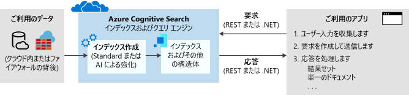

# Azure Cognitive Search とは

Azure Cognitive Search ([旧称は "Azure Search"](whats-new.md#new-service-name)) は、Web、モバイル、およびエンタープライズ アプリケーションのプライベートな異種コンテンツに対するリッチな検索機能を追加するための API とツールを開発者に提供する、サービスとしての検索クラウド ソリューションです。 コードまたはツールでデータ インジェスト (インデックス作成) を呼び出し、インデックスを作成して読み込みます。 必要に応じて、インデックス作成中に AI プロセスを適用するコグニティブ スキルを追加できます。 これにより、検索やその他のシナリオに役立つ新しい情報と構造を追加できます。

サービスの他の面では、アプリケーション コードを使用して、クエリ要求を発行し、応答を処理します。 検索エクスペリエンスは、Azure Cognitive Search の機能を使用してクライアント内で定義します。クエリは、自分で作成および所有し、サービスに保存する永続化されたインデックスに対して実行します。

機能は、情報の検索に固有の複雑さを感じさせないシンプルな [REST API](/rest/api/searchservice/) または [.NET SDK](search-howto-dotnet-sdk.md) を使って公開されます。 API だけでなく、Azure Portal では、管理とコンテンツ管理のサポートおよびプロトタイプの作成とインデックスのクエリのためのツールも提供されます。 サービスはクラウドで実行されるため、インフラストラクチャと可用性は Microsoft によって管理されます。

## Azure Cognitive Search を使用する場合

Azure Cognitive Search は、次のアプリケーション シナリオに適しています。

+ 異種のコンテンツ タイプのプライベートな単一の検索可能なインデックスへの統合。 クエリは、常に自分で作成してドキュメントと共に読み込むインデックスに対して実行されます。インデックスは、常にお使いの Azure Cognitive Search サービスのクラウドに配置されます。 任意のソースまたはプラットフォームの JSON ドキュメントのストリームからインデックスを作成できます。 または、Azure をソースとするコンテンツの場合、"*インデクサー*" を使用してデータをインデックスにプルできます。 インデックスの定義と管理および所有権が、Azure Cognitive Search を使用する主な理由です。

+ 生のコンテンツは、Azure Blob Storage や Cosmos DB などの Azure データ ソース上の Office コンテンツ タイプなど、区分されていない大きなテキスト、画像ファイル、またはアプリケーション ファイルです。 インデックス作成中にコグニティブ スキルを適用して、構造を追加したり、画像ファイルとアプリケーション ファイルから意味を抽出したりすることができます。

+ 検索に関連する機能の簡単な実装。 Azure Cognitive Search API シリーズを使用すると、クエリの構築、ファセット ナビゲーション、フィルター (地理空間検索を含む)、シノニム マッピング、先行入力クエリ、および関連性チューニングを簡素化できます。 組み込みの機能を使用して、商用 Web 検索エンジンと同様の検索体験に対するエンドユーザーの期待に応えることができます。

+ 非構造化テキストのインデックス作成、または画像ファイルからのテキストと情報の抽出。 Azure Cognitive Search の [AI エンリッチメント](cognitive-search-concept-intro.md)機能により、AI 処理がインデックス作成パイプラインに追加されます。 一般的なユースケースには、スキャンされたドキュメントに対する OCR、大きなドキュメントに対するエンティティ認識とキー フレーズ抽出、言語検出とテキスト翻訳、センチメント分析などがあります。

+ Azure Cognitive Search のカスタムおよび言語アナライザーを使用して満たされる言語要件。 英語以外のコンテンツがある場合、Azure Cognitive Search では、Lucene アナライザーと Microsoft の自然言語プロセッサの両方がサポートされます。 また、特定の生コンテンツ (分音記号のフィルター処理など) の特殊な処理を実現するようにアナライザーを構成することもできます。

## 機能の説明

| コア&nbsp;検索&nbsp;&nbsp;&nbsp;&nbsp;&nbsp;&nbsp;&nbsp;&nbsp;&nbsp;&nbsp;&nbsp;&nbsp;&nbsp;&nbsp;&nbsp;&nbsp;&nbsp;&nbsp;&nbsp;&nbsp;&nbsp;&nbsp;&nbsp;&nbsp;  | [機能] |
|-------------------|----------|
|自由形式のテキスト検索 | [**フルテキスト検索**](search-lucene-query-architecture.md)は、大部分の検索ベース アプリの主な用途です。 クエリは、サポートされている構文を使用して作成できます。   [**単純なクエリ構文**](query-simple-syntax.md)では、論理演算子、語句検索演算子、後置演算子、優先順位演算子を使用できます。  [**Lucene クエリ構文**](query-lucene-syntax.md)には、あいまい検索、近接検索、用語ブースト、正規表現の拡張機能を含む、簡単な構文でのすべての操作が含まれています。|
| 関連性 | [**シンプルなスコアリング**](index-add-scoring-profiles.md)は、Azure Cognitive Search の主な利点です。 スコアリング プロファイルを使用して、ドキュメント自体の値の関数として、関連性をモデル化できます。 たとえば、新しい製品や割り引き製品を検索結果の上位に表示することが望ましい場合があります。 あるいは、追跡記録し、個別に保存しておいた顧客の検索傾向に基づいてパーソナライズされたスコアリングのタグを利用し、スコアリング プロファイルを作成できます。 |
| 地理空間検索 | Azure Cognitive Search は、地理的な場所を処理、フィルター、表示する機能を備えています。 Azure Search により、ユーザーは物理的な場所に対する検索結果の近接度に基づいてデータを探索できます。 詳細については、[このビデオを視聴する](https://channel9.msdn.com/Shows/Data-Exposed/Azure-Search-and-Geospatial-Data)か[このサンプルを確認](https://github.com/Azure-Samples/search-dotnet-asp-net-mvc-jobs)してください。 |
| フィルターとファセット | 1 つのクエリ パラメーターで[**ファセット ナビゲーション**](search-faceted-navigation.md)を有効にできます。 Azure Cognitive Search は、ファセット ナビゲーション構造を返します。これをカテゴリ一覧の背後のコードとして使用すると、自律フィルター処理 (たとえば、価格帯やブランド別のカタログ品目のフィルター処理) を実現できます。    [**フィルター**](query-odata-filter-orderby-syntax.md)を使用することで、ファセット ナビゲーションをアプリケーションの UI に組み込み、クエリ形成を拡張し、ユーザーまたは開発者が指定した条件に基づいてフィルター処理することができます。 フィルターを作成するには、OData 構文を使用します。 |
| ユーザー エクスペリエンス機能 | 検索バーでの先行入力クエリで、[**オートコンプリート**](search-autocomplete-tutorial.md)を有効にすることができます。   [**検索候補**](https://docs.microsoft.com/rest/api/searchservice/suggesters) も検索バーでの部分テキスト入力に使用できますが、結果はクエリ用語ではなくインデックス内の実際のドキュメントです。   [**シノニム**](search-synonyms.md)は、ユーザーが代替用語を提供する必要がなく、クエリのスコープを暗黙的に拡張する同等の用語を関連付けます。   [**ヒットの強調表示**](https://docs.microsoft.com/rest/api/searchservice/Search-Documents)は、検索結果内の一致するキーワードにテキスト書式を適用します。 強調表示されるスニペットを返すフィールドを選択できます。  [**並べ替え**](https://docs.microsoft.com/rest/api/searchservice/Search-Documents)は、インデックス スキーマを介して、複数のフィールドで利用でき、クエリ時に 1 つの検索パラメーターで切り替えることができます。   [**ページング**](search-pagination-page-layout.md)とスロットルは、Azure Cognitive Search が検索結果に適用する微調整された制御によって簡単に行うことができます。    |

| AI&nbsp;エンリッチメント&nbsp;&nbsp;&nbsp;&nbsp;&nbsp;&nbsp;&nbsp;&nbsp;&nbsp;&nbsp;&nbsp;       | [機能] |
|-------------------|----------|
|インデックス作成中の AI 処理 | イメージおよびテキスト分析のための [**AI エンリッチメント**](cognitive-search-concept-intro.md)をインデックス作成パイプラインに適用して、生のコンテンツからテキスト情報を抽出できます。 [組み込みのスキル](cognitive-search-predefined-skills.md)の例には、光学式文字認識 (スキャン済みの JPEG を検索可能にする)、エンティティ認識 (組織、名前、または場所を識別する)、キー フレーズ認識などがあります。 [カスタム スキルをコーディング](cognitive-search-create-custom-skill-example.md)してパイプラインにアタッチすることもできます。 |
| 検索以外のシナリオでの分析と使用のためのエンリッチされたコンテンツの格納 | [**ナレッジ ストア (プレビュー)** ](knowledge-store-concept-intro.md) は、AI ベースのインデックス作成の拡張機能です。 Azure ストレージをバックエンドとして使用して、インデックス作成時に作成されたエンリッチメントを保存できます。 これらの成果物を使用して、より優れたスキルを設計したり、不定形またはあいまいなデータからシェイプと構造体を作成したりできます。 特定のワークロードまたはユーザーをターゲットとするこれらの構造体のプロジェクションを作成できます。 抽出されたデータを直接分析したり、他のアプリに読み込むこともできます。   |
| キャッシュされたコンテンツ | [**インクリメンタル エンリッチメント (プレビュー)** ](cognitive-search-incremental-indexing-conceptual.md) では、パイプラインに対する特定の編集によって変更されたドキュメントのみに処理が制限され、パイプラインの変更されていない部分に対してはキャッシュされたコンテンツが使用されます。 |

| データ&nbsp;インポート/インデックス作成 | [機能] |
|----------------------------------|----------|
| データ ソース | Azure Cognitive Search インデックスは、JSON データ構造として送信されていれば、すべてのソースからのデータを受け入れます。    [**インデクサー**](search-indexer-overview.md)では、サポートされている Azure データ ソースのデータ インジェストが自動化され、JSON のシリアル化が処理されます。 [Azure SQL Database](search-howto-connecting-azure-sql-database-to-azure-search-using-indexers.md)、[Azure Cosmos DB](search-howto-index-cosmosdb.md)、または [Azure Blob Storage](search-howto-indexing-azure-blob-storage.md) に接続して、プライマリ データ ストア内の検索可能なコンテンツを抽出します。 Azure Blob インデクサーは、"*ドキュメント クラッキング*" を実行して、Microsoft Office、PDF、HTML ドキュメントなどの[主要なファイル形式からテキストを抽出](search-howto-indexing-azure-blob-storage.md)することができます。 |
| 階層データ構造と入れ子になったデータ構造 | [**複合型**](search-howto-complex-data-types.md)とコレクションでは、事実上すべての種類の JSON 構造を Azure Cognitive Search インデックスとしてモデル化できます。 一対多と多対多のカーディナリティは、コレクション、複合型、および複合型のコレクションを通じてネイティブに表現できます。|
| Linguistic Analysis | アナライザーは、インデックス作成および検索操作中のテキスト処理に使用するコンポーネントです。 次の 2 つの種類があります。   [**カスタム字句アナライザー**](index-add-custom-analyzers.md)は、発音照合と正規表現を使用する複雑な検索クエリで使用されます。   Lucene または Microsoft の[**言語アナライザー**](index-add-language-analyzers.md)は、動詞の時制や名詞の性、不規則な複数形の名詞 (例: 'mouse' と 'mice')、二重複合語、(スペースを使用しない言語の) 改行などをインテリジェントに処理するために使用されます。   |

| プラットフォーム&nbsp;レベル&nbsp;&nbsp;&nbsp;&nbsp;&nbsp;&nbsp;&nbsp;&nbsp;&nbsp;&nbsp;&nbsp;&nbsp;&nbsp;| [機能] |
|-------------------|----------|
| プロトタイピングと検査のためのツール | ポータルでは、[**データのインポート ウィザード**](search-import-data-portal.md)を使用してインデクサーを構成したり、インデックス デザイナーを使用してインデックスを設定したりできます。また、[**Search エクスプローラー**](search-explorer.md)を使用してクエリをテストしたり、スコアリング プロファイルを調整したりできます。 また、任意のインデックスを開いてスキーマを表示することもできます。 |
| 監視と診断 | [**監視機能を有効にして**](search-monitor-usage.md)、ポータルに常に表示される、ひとめで確認できるメトリックの先に進みます。 1 秒あたりのクエリ数、待ち時間、スロットルに関するメトリックが取得され、ポータル ページで報告されます。追加の構成は必要ありません。|
| サーバー側暗号化 | [**Microsoft によって管理される保存中の暗号化**](search-security-overview.md#encrypted-transmission-and-storage)は内部ストレージ レイヤーに組み込まれており、取り消しはできません。 必要に応じて、既定の暗号化を[**顧客が管理する暗号化キー**](search-security-manage-encryption-keys.md)で補足できます。 Azure Key Vault 内で作成して管理するキーは、Azure Cognitive Search 内でインデックスとシノニム マップの暗号化に使用されます。 |
| インフラストラクチャ | **可用性の高いプラットフォーム**により、極めて信頼性の高い検索サービス エクスペリエンスを確保します。 適切に拡張された場合に、[Azure Cognitive Search は 99.9% の SLA を実現](https://azure.microsoft.com/support/legal/sla/search/v1_0/)します。   エンド ツー エンドのソリューションとして**完全に管理され、スケーラブルな** Azure Cognitive Search では、インフラストラクチャ管理をまったく必要としません。 サービスは 2 次元での拡張によって、ニーズに合わせてカスタマイズでき、より大きなドキュメント ストレージ、より高いクエリ負荷、またはその両方を処理できます。  |

## Azure Cognitive Search の使用方法
### 手順 1:サービスのプロビジョニング
[Azure portal](https://portal.azure.com/) または [Azure Resource Management API](/rest/api/searchmanagement/) を使用して、Azure Cognitive Search サービスをプロビジョニングできます。 他のサブスクライバーと共有する無料サービス、または自分のサービスのみで使用するリソース専用の[有料レベル](https://azure.microsoft.com/pricing/details/search/)を選択できます。 有料レベルでは、2 つの面でサービスを拡張できます。 

- 大量のクエリ負荷を処理できるように、レプリカを追加して容量を拡張する   
- より多くのドキュメントに対応できるように、パーティションを追加して記憶域を拡大する 

ドキュメント ストレージとクエリのスループットを個別に処理することによって、運用環境の要件に基づいてリソースの割り当てを調整できます。

### 手順 2:インデックスの作成
検索可能なコンテンツをアップロードする前に、まず Azure Cognitive Search インデックスを定義する必要があります。 インデックスは、データを保持し、検索クエリを受け付けることができるデータベース テーブルに似ています。 データベースのフィールドに似た、検索するドキュメントの構造を反映するように、マップするインデックス スキーマを定義します。

スキーマは Azure Portal で作成するか、[.NET SDK](search-howto-dotnet-sdk.md) または [REST API](/rest/api/searchservice/) を使用してプログラムによって作成できます。

### 手順 3:データの読み込み
インデックスを定義したら、コンテンツをアップロードする準備が完了します。 プッシュ モデルまたはプル モデルを使用できます。

プル モデルは、外部データ ソースからデータを取得します。 データへの接続、読み取り、シリアル化など、データ取り込みの諸側面を効率化および自動化する "*インデクサー*" を通じてサポートされます。 [インデクサー](/rest/api/searchservice/Indexer-operations)は、Azure Cosmos DB、Azure SQL Database、Azure Blob Storage、および Azure VM でホストされている SQL Server で使用できます。 インデクサーは、オンデマンドで、またはスケジュールされたデータ更新のために構成できます。

プッシュ モデルは SDK または REST API によって提供され、更新したドキュメントをインデックスに送信するために使用されます。 JSON 形式を使用して、事実上すべてのデータセットからデータをプッシュできます。 データの読み込み方法については、「[ドキュメントの追加、更新、削除](/rest/api/searchservice/addupdate-or-delete-documents)」または「[.NET SDK の使用方法](search-howto-dotnet-sdk.md)」を参照してください。

### 手順 4:検索
インデックスを入力したら、[REST API](/rest/api/searchservice/Search-Documents) または [.NET SDK](https://docs.microsoft.com/dotnet/api/microsoft.azure.search.idocumentsoperations) によって簡単な HTTP 要求を使用して、サービス エンドポイントに[検索クエリを発行](search-query-overview.md)できます。

[初めての検索アプリの作成](tutorial-csharp-create-first-app.md)を行うことで、ユーザー入力を収集して結果を処理する Web ページをビルドして拡張します。 [対話型 REST 向けの Postman](search-get-started-postman.md) 呼び出しや Azure portal の組み込みの[検索エクスプローラー](search-explorer.md)を使用して、既存のインデックスに対するクエリを実行することもできます。

## 他のソリューションとの比較

お客様から、Azure Cognitive Search が他の検索に関連するソリューションと比較してどうなのかよくお問い合わせいただきます。 主な相違点を次の表に示します。

| 比較対象 | 主な相違点 |
|-------------|-----------------|
|Bing | [Bing Web Search API](https://docs.microsoft.com/azure/cognitive-services/bing-web-search/) は Bing.com のインデックスで送信された語句と一致するものを検索します。 インデックスは、公開サイトの HTML、XML、および他の Web コンテンツから構築されます。 同じ基板上に構築されている [Bing Custom Search](https://docs.microsoft.com/azure/cognitive-services/bing-custom-search/) は、個々の Web サイトに範囲指定して、各 Web コンテンツ タイプに対して同じクローラー テクノロジを提供します。  Azure Cognitive Search では、所有するデータおよびドキュメントを入力して定義したインデックスを多くの場合さまざまなソースから検索します。 Azure Cognitive Search は[インデクサー](search-indexer-overview.md)により複数のデータ ソースに対するクローラー機能を備えていますが、インデックス スキーマに準拠している任意の JSON ドキュメントを 1 つの統合された検索可能なリソースにプッシュできます。 |
|データベース検索 | 多くのデータベース プラットフォームには、組み込みの検索エクスペリエンスが含まれます。 SQL Server には[フル テキスト検索](https://docs.microsoft.com/sql/relational-databases/search/full-text-search)があります。 Cosmos DB や同種のテクノロジには、クエリ可能なインデックスがあります。 検索とストレージを結合する製品を評価するとき、採用する方法を決めるのが困難な場合があります。 多くのソリューションでは両方が採用され、ストレージには DBMS が、専用の検索機能には Azure Cognitive Search が使用されています。  DBMS 検索と比較すると、Azure Cognitive Search は異種ソースからのコンテンツを格納し、[56 言語](https://docs.microsoft.com/rest/api/searchservice/language-support)で言語対応のテキスト処理 (語幹検索、レンマ化、語形) などの専用のテキスト処理機能を提供します。 また、スペルミスの単語のオート コレクト、[シノニム](https://docs.microsoft.com/rest/api/searchservice/synonym-map-operations)、[候補](https://docs.microsoft.com/rest/api/searchservice/suggestions)、[スコアリング コントロール](https://docs.microsoft.com/rest/api/searchservice/add-scoring-profiles-to-a-search-index)、[ファセット](https://docs.microsoft.com/azure/search/search-filters-facets)、および[カスタムトークン化](https://docs.microsoft.com/rest/api/searchservice/custom-analyzers-in-azure-search)もサポートしています。 Azure Cognitive Search の[フル テキスト検索エンジン](search-lucene-query-architecture.md)は情報取得の業界標準である Apache Lucene に基づいて構築されています。 Azure Cognitive Search は逆インデックスの形式でデータを保持しますが、真のデータ ストレージの代わりになることはほとんどありません。 詳しくは、こちらの[フォーラム投稿](https://stackoverflow.com/questions/40101159/can-azure-search-be-used-as-a-primary-database-for-some-data)をご覧ください。   リソース使用率も、このカテゴリで別途考慮する必要があります。 インデックス付けと一部のクエリ操作は、多くの場合、計算を大量に使用します。 DBMS からクラウドの専用ソリューションに検索をオフロードすることにより、トランザクション処理用のシステム リソースを保持します。 さらに、検索を外部化することで、クエリのボリュームに合わせてスケールを簡単に調整できます。|
|専用の検索ソリューション | 全機能を持つ専用の検索を使用する場合、最後の比較カテゴリはオンプレミス ソリューションかクラウド サービスかです。 多くの検索テクノロジには、インデックスの作成とクエリ パイプラインの管理、豊富なクエリとフィルター構文へのアクセス、ランクと関連性の管理、自主的な高度な検索の機能が用意されています。   クラウド サービスは、オーバーヘッドとメンテナンスが最小限で済み、スケールが調整可能なターンキー ソリューションを望むお客様に最適の選択肢です。   クラウドの枠組みでは、複数のプロバイダーがフルテキスト検索、地理空間検索、検索入力の程度のあいまいさを処理する機能など、同等の基本機能を備えるソリューションを提供しています。 使用環境に最も合うものを判断する場合、通常は、[特化した機能](#feature-drilldown)か、API、ツール、管理の容易さと全体的な単純さが決め手になります。 |

クラウド プロバイダーの中で Azure Cognitive Search は、Azure 上のコンテンツ ストアとデータベースに対するフルテキスト検索のワークロードに関して最も強力で、情報の取得とコンテンツのナビゲーションの両方を主に検索に依存するアプリに適しています。 

以下のような大きな強みがあります。

+ インデックス層での Azure データ統合 (クローラー)
+ 中央管理のための Azure Portal
+ Azure のスケール、信頼性、世界クラスの可用性
+ 画像からのテキストや非構造化コンテンツ内でのパターンの検索など、より検索しやすくするための生データの AI 処理。
+ 56 の言語での堅実なフルテキスト検索を実現するアナライザーによる言語分析とカスタム分析
+ [検索中心のアプリに共通のコア機能](#feature-drilldown): スコアリング、ファセット、検索候補、シノニム、地理空間検索など。

> [!Note]
> Azure 以外のデータ ソースは完全にサポートされていますが、インデクサーではなく、コードをより大量に使用するプッシュ手法に依存します。 Microsoft 提供の API を使用して、任意の JSON ドキュメント コレクションを Azure Cognitive Search インデックスにパイプすることができます。

Microsoft のお客様は、オンライン カタログ、基幹業務プログラム、およびドキュメント検索アプリケーションを含む、Azure Cognitive Search の機能を最大限利用できます。

## REST API | .NET SDK

多くのタスクを実行できるポータルに対し、Azure Cognitive Search は既存のアプリケーションに検索機能を統合したいと考えている開発者向けのものです。 次のプログラミング インターフェイスが用意されています。

|プラットフォーム |説明 |
|-----|------------|
|[REST](/rest/api/searchservice/) | あらゆるプログラミング プラットフォームと言語 (Xamarin、Java、JavaScript など) でサポートされている HTTP コマンド|
|[.NET SDK](search-howto-dotnet-sdk.md) | REST API 用の .NET ラッパーにより、C# と .NET Framework をターゲットとするその他のマネージ コード言語で効率的なコーディングを実現できます。 |

## 無料試用版
Azure サブスクライバーは [Free レベルでサービスをプロビジョニング](search-create-service-portal.md)できます。

サブスクライバーでない場合は、[Azure アカウントを無料で開設できます](https://azure.microsoft.com/pricing/free-trial/?WT.mc_id=A261C142F)。 Azure の有料サービスを試用する際に、クレジットを入手してください。 このクレジットを使い切った後に、アカウントを保持して、[無料の Azure サービス](https://azure.microsoft.com/free/)を使用できます。 明示的に設定を変更して課金を了承しない限り、クレジット カードに課金されることはありません。

または、[MSDN サブスクライバーの特典を有効にする](https://azure.microsoft.com/pricing/member-offers/msdn-benefits-details/?WT.mc_id=A261C142F)こともできます。MSDN サブスクリプションにより、有料の Azure サービスを利用できるクレジットが毎月与えられます。 

## ファースト ステップ

1. [無料サービス](search-create-service-portal.md)を作成します。 すべてのクイック スタートとチュートリアルは、無料のサービスで完了できます。

2. [組み込みのツールを使用してインデックス作成とクエリを行う方法に関するチュートリアル](search-get-started-portal.md)の手順を完了します。 重要な概念を学習して、ポータルで提供される情報に親しみます。

3. .NET と REST API のいずれかを使用してコーディングを進めます。

   + [.NET SDK を使用する方法](search-howto-dotnet-sdk.md)では、マネージド コードにおける主なワークフローについて説明します。  
   + [REST API の概要](https://github.com/Azure-Samples/search-rest-api-getting-started)では、REST API の使用と同じ手順を示します。 さらに、次のクイック スタートを使用して、Postman または Fiddler から REST API を呼び出すこともできます[Azure Cognitive Search の REST API を探索します](search-get-started-postman.md)。

## 次の動画をご覧ください

検索エンジンは、モバイル アプリ、Web、企業データ ストアでの情報の取得を推進する一般的な要素です。 Azure Cognitive Search は、大規模な商用 Web サイトに類似する検索エクスペリエンスを作成するためのツールを提供します。

プログラム マネージャー Liam Cavanagh によるこの 9 分間のビデオでは、検索エンジンを統合することでアプリにもたらされるメリットについて説明しています。 短いデモでは、Azure Cognitive Search の重要な機能と一般的なワークフローについて説明します。 

>[!VIDEO https://channel9.msdn.com/Events/Connect/2016/138/player]
 
+ 0 ～ 3 分: 主要な機能とユースケースについて説明します。
+ 3 ～ 4 分: サービスのプロビジョニングについて説明します。 
+ 4 ～ 6 分: データのインポート ウィザードで組み込みの不動産データセットを使ってインデックスを作成する方法について説明します。
+ 6 分から 9 分: Search エクスプローラーとさまざまなクエリについて説明します。
