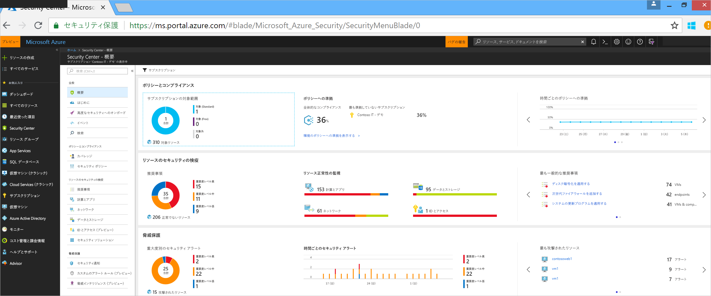
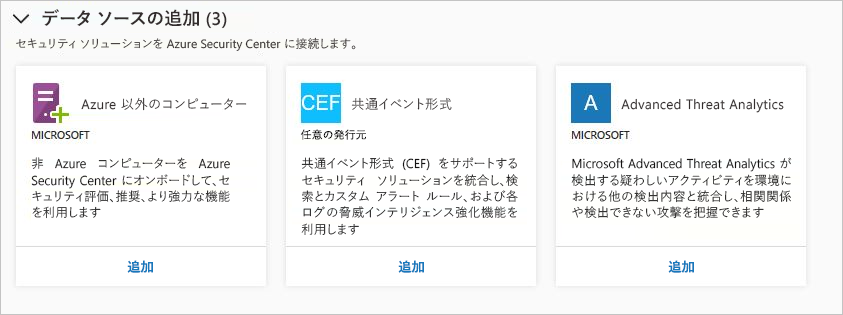
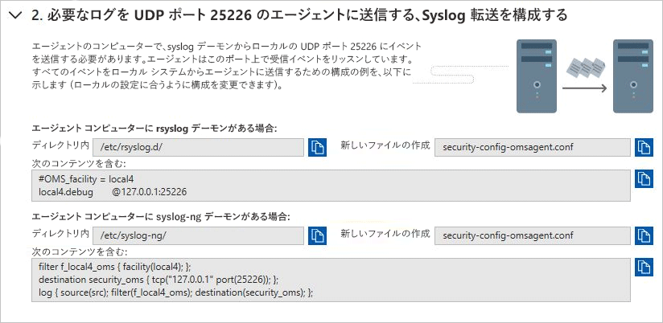
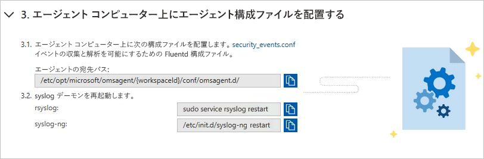
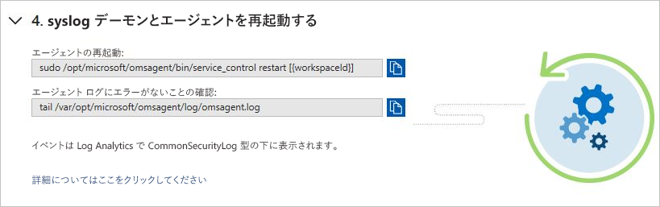
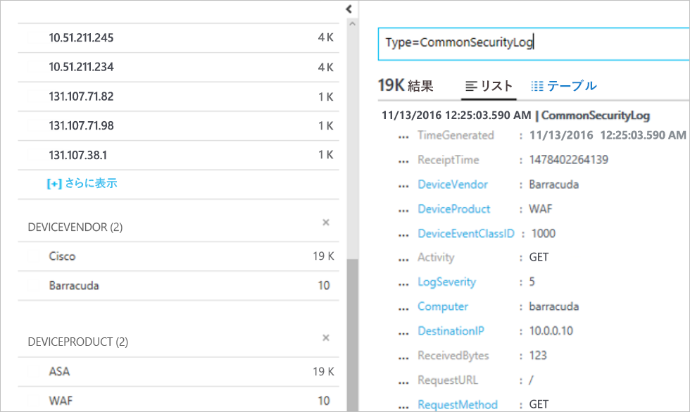

# クイックスタート: Security Center へのセキュリティ ソリューションの接続

コンピューターからのセキュリティ データの収集に加えて、共通イベント形式 (CEF) をサポートするソリューションなど、さまざまな他のセキュリティ ソリューションからのセキュリティ データを統合することができます。 CEF は、Syslog メッセージをベースにした、業界標準フォーマットの 1 つで、さまざまなプラットフォームにおけるイベントの統合を実現するために多くのセキュリティ ベンダーで使用されています。

このクイックスタートでは、次の方法について説明します。
- CEF ログを使用してセキュリティ ソリューションを Security Center に接続する
- セキュリティ ソリューションとの接続を検証する

## 前提条件
セキュリティ センターを使用するには、Microsoft Azure のサブスクリプションが必要です。 サブスクリプションがない場合は、[無料アカウント](https://azure.microsoft.com/free/)にサインアップできます。

このチュートリアルの手順を実行するには、Security Center の Standard 価格レベルを使用する必要があります。 Security Center Standard は最初の 60 日間、無料でお試しいただけます。 Standard にアップグレードする方法については、[Azure サブスクリプションでの Security Center Standard の利用開始](security-center-get-started.md)に関するクイックスタートを参照してください。

さらに、Syslog サービスが既に Security Center に接続されている [Linux マシン](https://docs.microsoft.com/azure/log-analytics/log-analytics-agent-linux)も必要です。

## CEF を使用したソリューションの接続

1. [Azure Portal](https://azure.microsoft.com/features/azure-portal/) にサインインします。
2. **[Microsoft Azure]** メニューの **[セキュリティ センター]** を選択します。 **[セキュリティ センター - 概要]** が開きます。

      

3. Security Center のメイン メニューで、**[セキュリティ ソリューション]** を選択します。
4. セキュリティ ソリューションのページで、**[Add data sources (3)]\(データ ソースの追加 (3)\)** の下にある **[共通イベント形式]** の **[追加]** をクリックします。

    

5. 共通イベント形式のログのページで、2 番目の手順 **[必要なログを UDP ポート 25226 のエージェントに送信する、Syslog 転送を構成する]** を展開し、Linux コンピューターで以下の手順に従います。

    

6. 3 番目の手順 **[エージェント コンピューター上にエージェント構成ファイルを配置する]** を展開して、Linux コンピューターで以下の手順に従います。

    

7. 4 番目の手順 **[Syslog デーモンとエージェントを再起動する]** を展開して、Linux コンピューターで以下の手順に従います。

    

## 接続の検証

次の手順に進む前に、Syslog が Security Center への報告を開始するまで待機する必要があります。 これにはしばらく時間がかかる場合があります。この時間は、環境のサイズによって異なります。

1.  Security Center ダッシュボードの左側のウィンドウで、**[検索]** をクリックします。
2.  Syslog (Linux マシン) の接続先であるワークスペースを選択します。
3.  「*CommonSecurityLog*」と入力し、**[検索]** ボタンをクリックします。

次の例は、これらの手順の結果を示しています。

## リソースのクリーンアップ
このコレクションの他のクイックスタートとチュートリアルは、このクイックスタートに基づいています。 引き続き次のクイックスタートとチュートリアルを行う予定の場合、Standard レベルの実行を継続して、自動プロビジョニングを有効のままにしてください。 続行しないまたは Free レベルに戻したい場合:

1. Security Center のメイン メニューに戻り、**[セキュリティ ポリシー]** を選択します。
2. Free に戻したいサブスクリプションまたはポリシーを選択します。 **[セキュリティ ポリシー]** が開きます。
3. **[ポリシー コンポーネント]** で、**[価格レベル]** を選択します。
4. **[Free]** を選択して、Standard レベルから Free レベルにサブスクリプションを変更します。
5. **[保存]** を選択します。

自動プロビジョニングを無効にする場合:

1. Security Center のメイン メニューに戻り、**[セキュリティ ポリシー]** を選択します。
2. 自動プロビジョニングを無効にするサブスクリプションを選択します。
3. **[セキュリティ ポリシー - データ収集]** で、**[オンボード]** の **[オフ]** を選択して、自動プロビジョニングを無効にします。
4. **[保存]** を選択します。

>[!NOTE]
> 自動プロビジョニングを無効しても、Microsoft Monitoring Agent がプロビジョニングされている Azure VM からエージェントは削除されません。 自動プロビジョニングを無効にすると、リソースのセキュリティの監視が制限されます。
>

## 次の手順
このクイックスタートでは、CEF を使用して Linux Syslog ソリューションを Security Center に接続する方法について説明しました。 CEF ログを Security Center に接続すると、検索およびカスタムのアラート ルールのほか、各ログの脅威インテリジェンスの機能強化を利用できます。 Security Center の使用方法について学習するには、セキュリティ ポリシーの構成とリソースのセキュリティの評価に関するチュートリアルに進んでください。

> [!div class="nextstepaction"]
> [チュートリアル: セキュリティ ポリシーの定義と評価](./tutorial-security-policy.md)
