# Azure Security Center における各種のセキュリティ アラート
この記事では、Azure Security Center で利用できるさまざまなセキュリティ アラートについてわかりやすく説明します。 アラートを管理する方法の詳細については、「[Azure Security Center でのセキュリティの警告の管理と対応](security-center-managing-and-responding-alerts.md)」を参照してください。

> [!NOTE]
> 高度な検出をセットアップする場合には、Azure Security Center Standard にアップグレードする必要があります。 60 日間の無料試用版が提供されています。 アップグレードするには、[[セキュリティ ポリシー]](security-center-policies.md) で **[価格レベル]** を選択します。 詳細については、[価格のページ](https://azure.microsoft.com/pricing/details/security-center/)を参照してください。
>
>

## 使用できる警告の種類
Azure Security Center では、サイバー キル チェーンの各段階に応じた各種の警告が用意されています。 以下の図では、さまざまなアラートを紹介しています。アラートはそれぞれ、ここに示したサイバー キル チェーンの段階のいくつかに関係します。

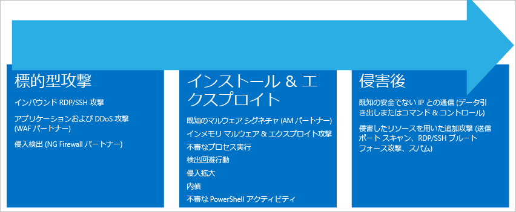

**ターゲットと攻撃**

* 受信 RDP/SSH 攻撃
* アプリケーションと DDoS 攻撃 (WAF パートナー)
* 不正侵入検出 (NG ファイアウォール パートナー)

**インストールとエクスプロイト**

* 既知のマルウェア シグネチャ (AM パートナー)
* インメモリ マルウェアとエクスプロイトの試行
* 疑わしいプロセスの実行
* 検出を防ぐ回避行動
* 侵入拡大
* 内部偵察
* 疑わしい PowerShell アクティビティ

**侵害後**  

* 既知の悪意のある IP との通信 (データの搾取、コマンド アンド コントロール)
* セキュリティの侵害されたリソースを使用した追加の攻撃の開始 (送信ポート スキャン RDP/SSH ブルート フォース攻撃、スパム)

さまざまな種類の攻撃が各段階に関連し、さまざまなサブシステムをターゲットとしています。 これらの段階の攻撃に対処するために、Security Center では警告に&3; つのカテゴリを設けています。

* 仮想マシンの動作分析 (VMBA)
* ネットワーク分析
* リソース分析

## 仮想マシンの動作分析
Azure Security Center は動作分析を使用し、仮想マシンのイベント ログの分析に基づいて、侵害の発生したリソースを特定します。 分析対象となるイベントには、プロセス作成イベント、ログイン イベントなどがあります。 また、他のシグナルとの間には、蔓延している攻撃の裏付けとなる兆候を確認できる相関関係が存在します。

> [!NOTE]
> Security Center の検出機能に関する詳細については、「[Azure Security Center の検出機能](security-center-detection-capabilities.md)」を参照してください。
>
>

### クラッシュ分析
クラッシュ ダンプ メモリ分析は、従来のセキュリティ ソリューションを回避することができる高度なマルウェアの検出に使用される方法です。 さまざまな形式のマルウェアは、ディスクへの書き込みを行わないことや、ディスクに書き込まれたソフトウェア コンポーネントを暗号化することで、ウイルス対策製品によって検出される可能性を減らすよう試みます。 このことが、従来のマルウェア対策手法を使ったマルウェア検出を困難にしています。 しかし、マルウェアが機能するためにはメモリに痕跡を残す必要があるので、メモリ分析を使用すればそのようなマルウェアを検出することができます。

ソフトウェアがクラッシュすると、クラッシュ時のメモリが部分的にクラッシュ ダンプにキャプチャされます。 クラッシュは、マルウェア、一般的なアプリケーション、またはシステムの問題によって引き起こされる可能性があります。 Security Center では、クラッシュ ダンプでメモリを分析することによって、ソフトウェアの脆弱性の悪用や機密データへのアクセスに使用された手法を検出できます。また、侵入したコンピューターに密かに常駐するタイプの手法であっても検出が可能です。 Security Center バックエンドによって分析が実行されるため、この方法ではホストのパフォーマンスに対する影響が最小限に抑えられます。

以下のフィールドは、この記事で後ほど紹介するクラッシュ ダンプ アラートの例に共通して存在するものです。

* DUMPFILE (ダンプ ファイル): クラッシュ ダンプ ファイルの名前。
* PROCESSNAME (プロセス名): クラッシュしているプロセスの名前。
* PROCESSVERSION (プロセスのバージョン): クラッシュしているプロセスのバージョン。

### シェルコードの検出
シェルコードは、マルウェアがソフトウェアの脆弱性を突破した後に実行されるペイロードです。 このアラートは、悪意のあるペイロードに共通した振る舞いをする実行可能コードがクラッシュ ダンプ分析によって検出されたことを意味します。 悪意のないソフトウェアによる振る舞いである可能性もありますが、ソフトウェア開発の標準的な慣例からは逸脱しています。

このシェルコードに関するアラートの例では、ほかにも次のフィールドがあります。

* ADDRESS (アドレス): メモリ内におけるシェルコードの場所。

このタイプの警告の例を次に示します。

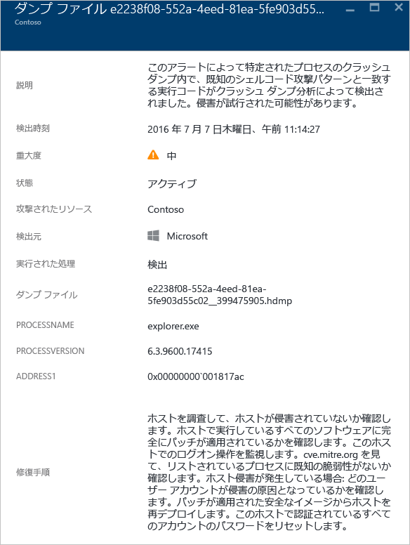

### モジュールのハイジャックの検出
Windows では、システムに共通の機能をソフトウェアから利用できるようにするために、ダイナミック リンク ライブラリ (DLL) を使用しています。 DLL ハイジャックは、マルウェアが DLL の読み込み順序を改変することによって行われます。このときメモリに悪質なペイロードが読み込まれ、任意のコードを実行できる状態となります。 このアラートは、クラッシュ ダンプ分析により、よく似た名前のモジュールが&2; つの異なるパスから読み込まれている状態が検出されたことを示しています。 パスの&1; つは、一般的な Windows システム バイナリが置かれた場所です。

悪意からではなく、インストルメント化や Windows OS の拡張、Windows アプリケーションの拡張といった目的で、通常のソフトウェア開発者が DLL の読み込み順序を変更することも皆無ではありません。 DLL の読み込み順序に対する悪意のある変更と、無害である可能性の高い変更とを判別しやすいように、Azure Security Center では、読み込まれているモジュールに疑わしい特徴が見られるかどうかをチェックします。 このチェックの結果は、警告の "SIGNATURE (シグネチャ)" フィールドに表示され、警告の重大度、説明、修正手順に反映されます。 モジュールが正当なものか、それとも悪意のあるものかを調査するには、ハイジャック モジュールのディスク コピーを分析します。 たとえば、ファイルのデジタル署名を検証したり、ウイルス対策スキャンを実行したりする方法が考えられます。

このアラートには、「シェルコードの検出」のセクションで取り上げた共通のフィールドに加えて次のフィールドがあります。

* SIGNATURE (シグネチャ): ハイジャック モジュールが、疑わしい動作のプロファイルと一致しているかどうかを示します。
* HIJACKEDMODULE (ハイジャックされたモジュール): ハイジャックされた Windows システム モジュールの名前。
* HIJACKEDMODULEPATH (ハイジャックされたモジュールのパス): ハイジャックされた Windows システム モジュールのパス。
* HIJACKINGMODULEPATH (ハイジャック モジュールのパス): ハイジャック モジュールのパス。

このタイプの警告の例を次に示します。

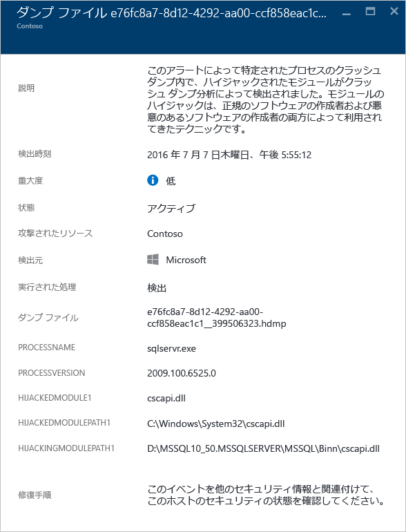

### Windows モジュールのなりすましの検出
マルウェアには、Windows システムに共通するバイナリ名 (SVCHOST.EXE など) やモジュール名 (NTDLL.DLL など) が使用されている場合があります。悪質なソフトウェアを "*紛れ込ませる*" ことで、その正体をシステム管理者に見破られないようにするためです。 このアラートは、Windows システムのモジュール名と同じ名前のモジュールがクラッシュ ダンプ ファイルに含まれているものの、それ以外の点は一般的な Windows モジュールの基準をそのモジュールは満たしていないことが、クラッシュ ダンプ分析によって検出されたことを意味します。 そのモジュールが悪意のあるものかどうかについては、ディスク上のなりすましモジュールのコピーを分析することによって、さらに詳しい情報を得ることができます。 実行される分析の例を次に示します。

* 問題になっているファイルが正規ソフトウェア パッケージの一部として出荷されていること確認する。
* ファイルのデジタル署名を確認する。
* ファイルに対してウイルス対策スキャンを実行する。

このアラートには、「シェルコードの検出」のセクションで取り上げた共通のフィールドに加えて次のフィールドがあります。

* DETAILS (詳細): モジュールのメタデータが有効であるかどうかと、モジュールがシステム パスから読み込まれたかどうかを表します。
* NAME (名前): Windows のモジュールになりすましているモジュールの名前。
* PATH (パス): Windows のモジュールになりすましているモジュールのパス。

また、このアラートにはモジュールの PE ヘッダーから特定のフィールド ("CHECKSUM"、"TIMESTAMP" など) が抽出されて表示されます。 これらのフィールドは、モジュールに存在する場合にのみ表示されます。 これらのフィールドの詳細については、「 [Microsoft PE and COFF 仕様](https://msdn.microsoft.com/windows/hardware/gg463119.aspx) 」を参照してください。

このタイプの警告の例を次に示します。

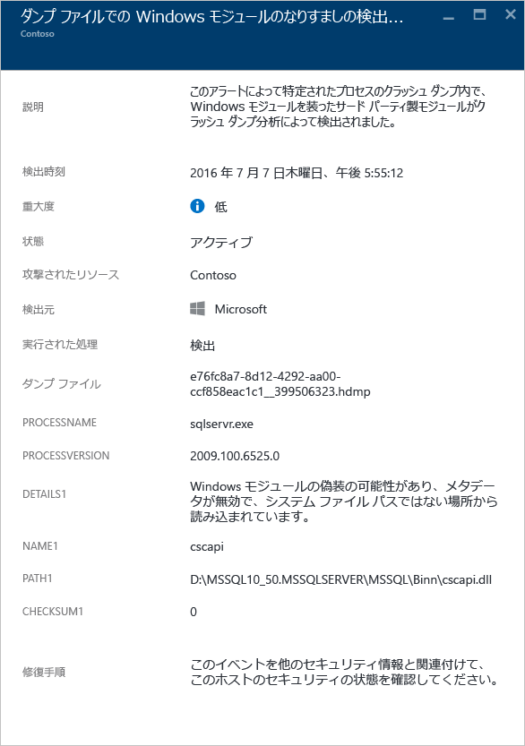

### システム バイナリの改変の検出
マルウェアは、侵入したシステム上でこっそりデータにアクセスしたり人目に付かないよう常駐したりするために、主要なシステム バイナリを改変する場合があります。 このアラートは、Windows OS の主要なバイナリがメモリ内またはディスク上で改変されたことがクラッシュ ダンプ分析によって検出されたことを意味します。

悪意からではなく、迂回やアプリケーションの互換性といった目的で、通常のソフトウェア開発者がメモリ内のシステム モジュールに変更を加えることも皆無ではありません。 悪意のあるモジュールとそうでないモジュールを判別しやすいよう、Azure Security Center は、改変されたモジュールに疑わしい特徴が見られるかどうかをチェックします。 このチェックの結果は、警告の重大度、説明、修正手順に反映されます。

このアラートには、「シェルコードの検出」のセクションで取り上げた共通のフィールドに加えて次のフィールドがあります。

* MODULENAME (モジュール名): 改変されたシステム バイナリの名前。
* MODULEVERSION (モジュールのバージョン): 改変されたシステム バイナリのバージョン。

このタイプの警告の例を次に示します。

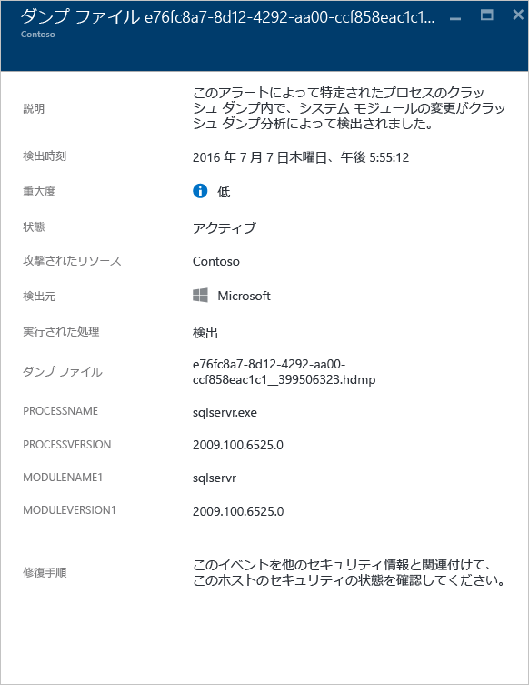

### 疑わしいプロセスの実行
Security Center は、ターゲット仮想マシンで実行されている疑わしいプロセスを特定し、アラートをトリガーします。 この検出では、具体的な名前ではなく、実行可能ファイルのパラメーターが確認されます。 このため、攻撃者が実行可能ファイルの名前を変更した場合でも、不審なプロセスを検出することができます。

このタイプの警告の例を次に示します。

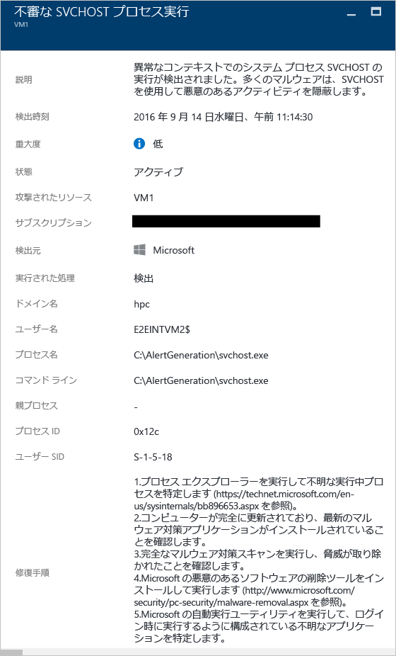

### 複数のドメイン アカウントのクエリ
Security Center は、ドメイン アカウントに対しクエリが複数回試行されていることを検出できます。このような試行は通常、ネットワーク偵察時に攻撃者が実行することです。 攻撃者は、この手法を使ってドメインに問い合わせ、ユーザー、ドメインの管理者アカウント、ドメイン コントローラーであるコンピューターを特定できるほか、他のドメインとの潜在的なドメイン信頼関係も特定できます。

このタイプの警告の例を次に示します。

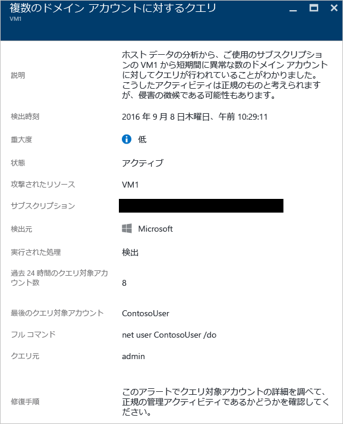

## ネットワーク分析
Security Center のネットワーク脅威検出は、Azure IPFIX (Internet Protocol Flow Information Export) トラフィックからセキュリティ情報を自動的に収集することによって機能します。 この情報を分析し、ときには複数の情報源から得た情報との関連性を探りながら、脅威を特定します。

### 疑わしい送信トラフィックの検出
ネットワーク デバイスは、他の種類のシステムとほぼ同じように検出、プロファイリングされることがあります。 通常、攻撃者は初めにポート スキャンまたはポート スイープを行います。 次の例では、ある VM から不審な Secure Shell (SSH) トラフィックが発生しています。 このシナリオでは、外部リソースに対する SSH ブルート フォース攻撃またはポート スイープ攻撃が考えられます。

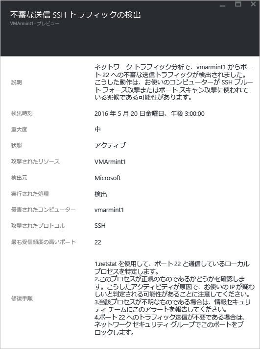

このアラートには、この攻撃を開始するにあたり使用されたリソースを特定する際に役立つ情報が表示されます。 また、セキュリティが侵害されたコンピューター、検出の日時、使用されたプロトコルとポートの特定に役立つ情報も確認できます。 このブレードでは、問題を軽減するために使用できる修復手順の一覧も表示されます。

### 悪意のあるコンピューターとのネットワーク通信
Azure Security Center は、悪意のある IP アドレスと通信している、セキュリティが侵害されたコンピューターを、Microsoft 脅威インテリジェンス フィードを使用して検出できます。 悪意のあるアドレスは多くの場合、コマンド アンド コントロール センターです。 この例では、Security Center によって、Pony Loader マルウェア ([Fareit](https://www.microsoft.com/security/portal/threat/encyclopedia/entry.aspx?Name=PWS:Win32/Fareit.AF) とも呼ばれる) を使用した通信が行われたことが検出されました。

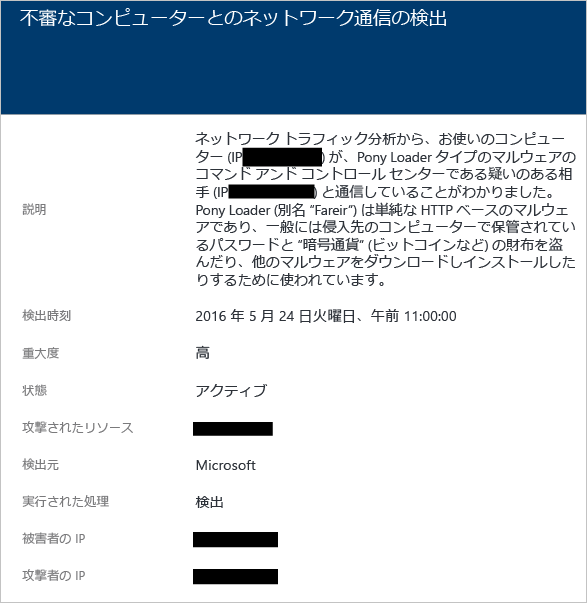

このアラートでは、この攻撃の開始に使用されたリソース、攻撃されたリソース、被害を受けた IP、攻撃者の IP、検出の日時を特定できる情報が表示されます。

> [!NOTE]
> ライブ IP アドレスは、プライバシー保護の目的でこのスクリーンショットからは削除しています。
>
>

### 送信サービス拒否攻撃の可能性の検出
ある仮想マシンによる異常なネットワーク トラフィックが原因となって、Security Center が潜在的なサービス拒否型の攻撃をトリガーする場合があります。

このタイプの警告の例を次に示します。

## リソース分析
Security Center のリソース分析は、[Azure SQL Database の脅威の検出](../sql-database/sql-database-threat-detection.md)機能との統合など、サービスとしてのプラットフォーム (PaaS) サービスに重点を置いています。 これらの領域の分析結果に基づいて、Security Center はリソースに関連するアラートをトリガーします。

### SQL インジェクションの可能性
SQL インジェクションとは、後で SQL Server のインスタンスに渡して解析と実行の対象とする文字列に、悪意のあるコードが挿入される攻撃です。 SQL Server は受け取った有効な構文のクエリをすべて実行してしまうため、SQL ステートメントを構成するすべてのプロシージャにおいて、挿入に対する脆弱性を確認する必要があります。 SQL 脅威の検出では、機械学習、動作分析、異常検出を使用して、Azure SQL データベースで発生しているおそれのある疑わしいイベントを特定します。 For example:

* 以前の従業員によるデータベース アクセスの試行
* SQL インジェクション攻撃
* 在宅中のユーザーからの運用データベースへの不自然なアクセス

このアラートに表示される情報は、攻撃を受けたリソース、検出の日時、攻撃の状態の特定に役立ちます。 また、さらに詳しい調査をするための手順を説明したリンクも表示されます。

### SQL インジェクションにつながる脆弱性
このアラートは、データベースでアプリケーション エラーが検出された場合にトリガーされます。 このアラートは、SQL インジェクション攻撃に対する脆弱性が存在する可能性を示すものです。

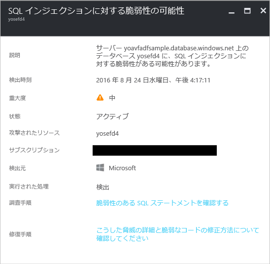

### 不明な場所からの不自然なアクセス
このアラートは、最後の期間に見られなかった不明な IP アドレスからのアクセス イベントがサーバーで検出された場合にトリガーされます。

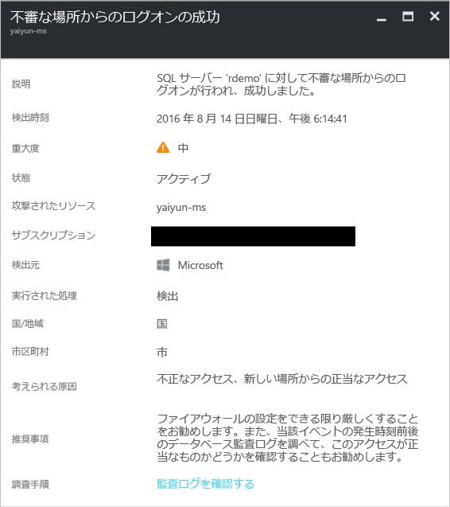

## 関連項目
この記事では、Security Center のさまざまな種類のセキュリティ アラートについて説明しました。 セキュリティ センターの詳細については、次を参照してください。

* [Azure Security Center でのセキュリティ インシデントの処理](security-center-incident.md)
* [Azure Security Center の検出機能](security-center-detection-capabilities.md)
* [Azure Security Center 計画および運用ガイド](security-center-planning-and-operations-guide.md)
* 「[Azure Security Center のよく寄せられる質問 (FAQ)](security-center-faq.md)」: このサービスの使用に関してよく寄せられる質問が記載されています。
* [Azure セキュリティ ブログ](http://blogs.msdn.com/b/azuresecurity/): Azure のセキュリティとコンプライアンスについてのブログ記事を確認できます。

