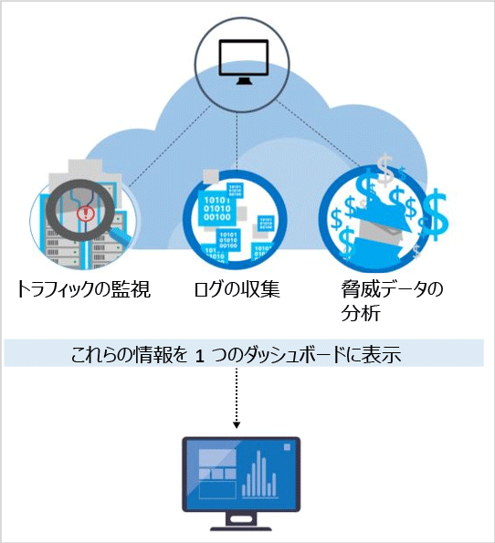

# Azure Security Center の検出機能
このドキュメントでは、Azure Security Center の高度な検出機能について取り上げます。この機能を使用すると、Microsoft Azure リソース (Windows と Linux の両方) が今さらされている脅威を特定し、迅速に対応するうえで必要な知見を得ることができます。

高度な検出は、Azure Security Center の Standard レベルで利用できます。 無料試用版が提供されています。 アップグレードは、 [[セキュリティ ポリシー]](tutorial-security-policy.md)の [価格レベル] の選択から実行できます。 価格の詳細については、 [Security Center のページ](https://azure.microsoft.com/pricing/details/security-center/) を参照してください。

## 今日の脅威への対応
脅威を取り巻く状況は、この 20 年で様変わりしました。 従来、企業が警戒すべきことは一般に Web サイトの改ざんのみで、その攻撃も興味本位の個人によるものが大半でした。 その頃と比べ今日の攻撃は、はるかに進化しており、組織化されています。 明らかに金銭や戦略的な目的をもって攻撃が遂行されるケースも少なくありません。 攻撃に利用されるリソースも増えてきました。国家や犯罪組織によって資金提供されている場合があるためです。

その手法により、攻撃者集団はかつてないほど高い技術力を身に付けています。 もはや彼らのねらいは、Web の改ざんではありません。 情報や金融口座、プライベート データの盗難がねらいです。いずれも一般市場で現金を得たり、特定の事業や政治、軍事的な立場を利用したりする目的で使用されます。 金銭目的のこのような攻撃者以上にやっかいな存在は、インフラストラクチャや人に危害を加えるためにネットワークを侵害する攻撃者です。

そうした攻撃に対応するために多くの組織が実施しているさまざまな解決策は、既に知られている攻撃のシグネチャを探すことで企業ネットワークの境界領域やエンドポイントを防御する対症療法が中心です。 このような解決策では、精度の低いアラートが大量に生成されることが多く、セキュリティ アナリストが優先順位を付けて調査しなければなりません。 しかし、そのようなアラートに対応できるだけの時間とノウハウを持った組織はまれで、多くのアラートは未解決のまま放置されます。  その一方で攻撃者の手法は着々と進化を遂げています。シグネチャを使用した防御はその多くが攻略され、[クラウド環境への対応](https://azure.microsoft.com/blog/detecting-threats-with-azure-security-center/)も進んでいます。 発生している脅威を従来以上に早く特定し、検出と対応にかかる時間を短縮する新しいアプローチが必要です。

## Azure Security Center での脅威の検出と対応
マイクロソフトのセキュリティ研究員は、絶えず脅威に目を光らせています。 クラウドやオンプレミスにおけるマイクロソフトのグローバル プレゼンスから得た広範なテレメトリにアクセスすることが彼らには許されています。 この広範かつ多様なデータセットのコレクションによって、マイクロソフトは、そのオンプレミスの消費者向け/企業向け製品からオンライン サービスに至るまで、攻撃の新しいパターンや傾向を把握することができます。 攻撃者によって脆弱性の悪用手法が次々に生み出され、しだいに複雑化する中で、Security Center は、その検出アルゴリズムを更新することができるのです。 この手法が、目まぐるしい脅威の環境の変化に対応するために役立てられます。

Security Center の脅威検出は、Azure のリソースやネットワーク、接続されているパートナー ソリューションからセキュリティ情報を自動的に収集することによって機能します。 この情報を分析し、ときには複数の情報源から得た情報との関連性を探りながら、脅威を特定します。 Security Center では、セキュリティの警告に優先順位が、脅威に対処するための推奨事項と共に割り当てられます。

Security Center には、シグネチャ ベースの手法とは比較にならない高度なセキュリティ分析が採用されています。 ビッグ データや [機械学習](https://azure.microsoft.com/blog/machine-learning-in-azure-security-center/) における革新的テクノロジを活かし、クラウド ファブリック全体にわたってイベントが評価されるので、手作業に頼った手法や攻撃の進化を予測する手法では特定できない脅威でも検出することができます。 こうしたセキュリティ分析の例を次に示します。

* **統合された脅威インテリジェンス**: グローバルな脅威インテリジェンスを活用して、既知の有害因子を探します。情報源としては、Microsoft 製品とサービス、Microsoft Digital Crimes Unit (DCU)、Microsoft Security Response Center (MSRC)、外部フィードがあります。
* **行動分析**: 既知のパターンを適用することによって悪質な行動を検出します。
* **異常検出**: 統計プロファイルを使用して、過去の基準を構築します。 確立された基準からの逸脱に、攻撃ベクトルとの一致が疑われる場合、警告が生成されます。

### 脅威インテリジェンス
Microsoft は、膨大なグローバル脅威インテリジェンスを保有しています。 Azure、Office 365、Microsoft CRM オンライン、Microsoft Dynamics AX、outlook.com、MSN.com、Microsoft Digital Crimes Unit (DCU)、Microsoft セキュリティ レスポンス センター (MSRC) などさまざまなソースからテレメトリが集められます。 また研究員も、大手クラウド サービス プロバイダー間で共有されている脅威インテリジェンス情報を入手しているほか、サード パーティから脅威インテリジェンス フィードをサブスクライブしています。 Azure Security Center はこの情報を基に、既知の有害因子から生じる脅威について利用者に警告を発することができます。 次に例をいくつか示します。

* **悪質な IP アドレスへの送信方向の通信**: 既知のボットネットやダークネットへの送信トラフィックは、リソースのセキュリティが侵害され、そのシステムに対して攻撃者がコマンドを実行しようとしているか、データを引き出そうとしている可能性を強く示唆しています。 Azure Security Center は、マイクロソフトのグローバル脅威データベースに対してネットワーク トラフィックを比較し、悪質な IP アドレスへの通信を検出した場合に警告を発します。

## 行動分析
行動分析は、データを分析し、既知のパターンのコレクションと照らして比較する手法です。 ただし、これらのパターンはただのシグネチャではありません。 大量のデータセットに適用された複雑な機械学習アルゴリズムを通じてパターンが決定されています。 また、パターンの特定にあたっては、専門のアナリストによって悪質な行動が緻密に分析されます。 Azure Security Center は行動分析を使用し、仮想マシンのログや仮想ネットワーク デバイスのログ、ファブリック ログ、クラッシュ ダンプなど各種ソースの分析に基づいて、セキュリティの侵害されたリソースを特定します。

また、他のシグナルとの間には、蔓延している攻撃の裏付けとなる兆候を確認できる相関関係が存在します。 この相関関係によって、セキュリティ侵害の証拠として確立されたインジケーターと一致しているイベントが特定されます。 次に例をいくつか示します。

* **疑わしいプロセスの実行**:攻撃者は、悪質なソフトウェアを秘かに実行するためにいくつかの手法を用います。 たとえば、マルウェアに対して正規のシステム ファイルと同じ名前を付けて本来とは異なる場所に配置したり、無害なファイルと酷似した名前を使用したり、ファイルの本当の拡張子を隠したりすることが考えられます。 Security Center はプロセスの動作をモデル化し、そのプロセスの実行を監視することで、こうした異常を検出します。  
* **マルウェアおよび脆弱性の悪用の試行を非表示にする**:巧妙なマルウェアは、ディスクへの書き込みやディスクに格納されているソフトウェア コンポーネントの暗号化をまったくしないために、従来のマルウェア対策製品から逃れることができます。  しかし、マルウェアが機能するためにはメモリに痕跡を残す必要があるので、メモリ分析を使用すればそのようなマルウェアを検出することができます。 ソフトウェアがクラッシュすると、クラッシュ時のメモリが部分的にクラッシュ ダンプにキャプチャされます。  Azure Security Center は、クラッシュ ダンプでメモリを分析することによって、ソフトウェアの脆弱性悪用や機密データへのアクセスに使用された手法を検出できます。侵入したコンピューターのパフォーマンスに影響を及ぼさず、こっそりと常駐するタイプの手法であっても検出が可能です。
* **水平移動と内部偵察:** 攻撃者は、侵害されたネットワークで存続またはこのようなネットワークを探して貴重なデータを奪取するために、侵害されたマシンから同一ネットワーク内の他のマシンに水平移動を試みる場合がよくあります。 ネットワーク内の踏み台を広げようとする攻撃者の試み (リモート コマンド実行、ネットワーク プローブ、アカウントの列挙など) を検出するために、Security Center はプロセスとログイン アクティビティを監視します。
* **悪質な PowerShell スクリプト**:PowerShell は、標的となる仮想マシン上で悪質なコードを実行するために、攻撃者がさまざまな目的で使用します。 疑わしい活動の兆候がないか、PowerShell のアクティビティは Security Center によって調査されます。
* **送信方向の攻撃**:攻撃の踏み台として利用するために、クラウド リソースを攻撃者が標的にすることは少なくありません。 たとえば、侵入した仮想マシンを利用して、他の仮想マシンにブルート フォース攻撃を仕掛けたり、スパムを送信したり、開放ポートやインターネット上の他のデバイスをスキャンしたりする場合があります。 Security Center では、ネットワーク トラフィックに機械学習を適用することで、正常な範囲を逸脱した送信ネットワーク通信を検出することができます。 さらに、スパムの場合、Security Center は、普通でない電子メール トラフィックと Office 365 から得られたインテリジェンスとの相関を明らかにし、不正目的のメールであるか、正当な電子メール キャンペーンによるものであるかを判断します。  

### 異常検出
Azure Security Center での脅威の特定には、異常検出も使用されます。 行動分析は、大規模なデータセットから導いた既知のパターンに依存します。これとは対照的に、異常検出は "独自色" が強く、個々の環境に固有の基準に重点が置かれます。 機械学習を適用して個々の環境の正常なアクティビティを突き止めたうえで、セキュリティ イベントの可能性を示す異常な条件とは何かを定義する規則を作成します。 次に例を示します。

* **受信方向の RDP/SSH ブルート フォース攻撃**:同じ環境でも、日々多数のユーザーがログインする稼働率の高い仮想マシンもあれば、ほとんどまたはまったくログインされない仮想マシンもあります。 Azure Security Center は、これらの仮想マシンの基準となるログイン アクティビティを突き止め、機械学習を使って、異常なログイン アクティビティを定義します。 ログインの回数や時刻、要求元など、ログインに関連したさまざまな特性がその基準と有意に異なる場合、警告が生成されます。 前述のように、何をもって有意とするかは、機械学習によって突き止められます。

## 脅威インテリジェンスの継続的監視
Azure Security Center に寄与するセキュリティ リサーチ チームやデータ サイエンス チームは、脅威に関する状況の変化を絶えず監視します。 たとえば次のような取り組みが行われています。

* **脅威インテリジェンスの監視**:脅威インテリジェンスには、既存の脅威や新たに発生した脅威に関するメカニズム、インジケーター、示唆、即時に利用可能なアドバイスが含まれます。 こうした情報はセキュリティ コミュニティから得られるほか、マイクロソフトも、社内や社外のソースから提供される脅威インテリジェンスを絶えず監視しています。
* **シグナルの共有**:クラウドとオンプレミス向けに Microsoft が保有するさまざまなサービス、サーバー、クライアント エンドポイント デバイスを通じてセキュリティ チームが得た知見は共有され、分析されます。
* **Microsoft のセキュリティ スペシャリスト**:フォレンジクスや Web 攻撃検出など、専門のセキュリティ分野に従事する Microsoft 内のさまざまなチームと絶えず連携します。
* **検出のチューニング**:実際のユーザーのデータセットに対してアルゴリズムが実行され、セキュリティ研究員がユーザーと連携してその結果を検証します。 機械学習アルゴリズムの精度を高めるために、真陽性と偽陽性が使用されます。

こうしたさまざまな取り組みを通じて、これまでできなかったような検出が可能となり、検出の精度が向上しています。しかもその恩恵はすぐに得ることができます。ユーザーが措置を講じる必要はありません。

## 関連項目
このドキュメントでは、Azure Security Center の検出機能の働きについて説明しました。 セキュリティ センターの詳細については、次を参照してください。

* [Azure Security Center 計画および運用ガイド](security-center-planning-and-operations-guide.md)
* [Azure セキュリティ センターでのセキュリティの警告の管理と対応](security-center-managing-and-responding-alerts.md)
* [Azure Security Center の種類別のセキュリティの警告](security-center-alerts-type.md)
* [Azure Security Center でのセキュリティ ヘルスの監視](security-center-monitoring.md) 」 -- Azure リソースの正常性を監視する方法について説明しています。
* [Azure Security Center を使用したパートナー ソリューションの監視](security-center-partner-solutions.md) 」 -- パートナー ソリューションの正常性状態を監視する方法について説明しています。
* [Azure Security Center のよく寄せられる質問 (FAQ)](security-center-faq.md) 」 -- このサービスの使用に関してよく寄せられる質問が記載されています。
* [Azure セキュリティ ブログ](https://blogs.msdn.com/b/azuresecurity/) -- Azure のセキュリティとコンプライアンスについてのブログ記事を確認できます。
