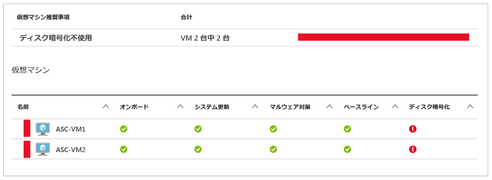
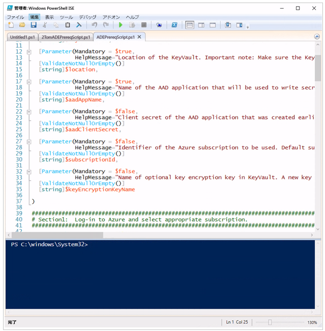
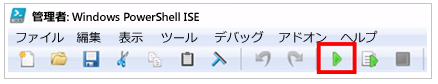
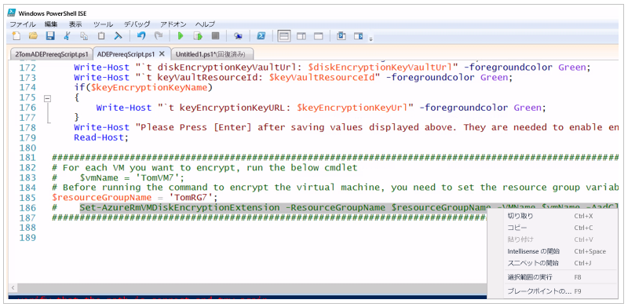
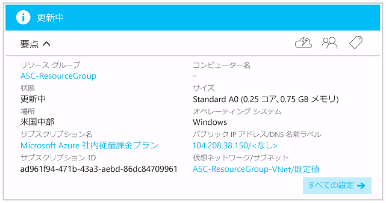
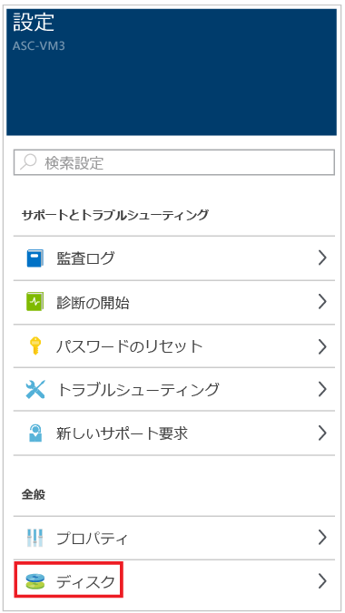
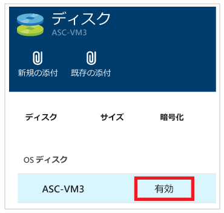

# Azure 仮想マシンの暗号化
暗号化されていない仮想マシンがある場合には、Azure Security Center からアラートを受け取ります。 これらのアラートは重要度が高いとして表示されるため、このような仮想マシンを暗号化することをお勧めします。

> [!NOTE]
> このドキュメントの情報は、キー暗号化キー (Azure Backup を使用して仮想マシンをバックアップするために必要) を使用しない仮想マシンの暗号化に適用されます。 キー暗号化キーを使用して、暗号化された Azure Virtual Machines に対して Azure Backup をサポートする方法の詳細については、[Windows と Linux の Azure 仮想マシンの Azure Disk Encryption](https://docs.microsoft.com/en-us/azure/security/azure-security-disk-encryption) に関する記事を参照してください。
>
>

Azure Security Center で暗号化が必要と識別された Azure 仮想マシンを暗号化するには、次の手順をお勧めします。

* Azure PowerShell のインストールおよび構成。 これにより、Azure 仮想マシンの暗号化に必要な必須コンポーネントを設定するための PowerShell コマンドを実行できるようになります。
* Azure Disk Encryption の前提条件となる Azure PowerShell スクリプトの取得と実行。
* 仮想マシンの暗号化。

このドキュメントの目的は、Azure PowerShell の知識がほとんどまたはまったくない場合でも、仮想マシンを暗号化できるようにすることです。
このドキュメントでは、Azure Disk Encryption を構成するクライアント コンピューターとして Windows 10 を使用していることを想定しています。

必須コンポーネントの設定と Azure 仮想マシンの暗号化の構成に使用できる方法は多数あります。 既に Azure PowerShell または Azure CLI についてよく知っている方は、他の方法を好む場合もあります。

> [!NOTE]
> Azure 仮想マシンの暗号化を構成する他の方法の詳細については、「 [Azure Disk Encryption for Windows and Linux Azure Virtual Machines (Windows とLinux の Azure 仮想マシンの Azure Disk Encryption)](https://gallery.technet.microsoft.com/Azure-Disk-Encryption-for-a0018eb0)」を参照してください。
>
>

## Azure PowerShell のインストールおよび構成
お使いのコンピューターに Azure PowerShell Version 1.2.1 以降がインストールされている必要があります。 「 [Azure PowerShell のインストールおよび構成方法](/powershell/azureps-cmdlets-docs) 」には、Azure PowerShell を操作するためにコンピューターをプロビジョニングする際に必要な手順がすべて記載されています。 最も簡単なのは、この記事で説明されている Web PI によるインストール方法です。 既に Azure PowerShell がインストールされている場合でも、Azure PowerShell の最新バージョンを入手するために Web PI による方法を使用して再インストールしてください。

## Azure Disk Encryption の前提条件となる構成スクリプトの取得と実行
Azure Disk Encryption の前提条件となる構成スクリプトを使用すると、Azure 仮想マシンの暗号化に必要な必須コンポーネントすべてが設定されます。

1. [Azure Disk Encryption Prerequisite Setup スクリプト](https://github.com/Azure/azure-powershell/blob/dev/src/ResourceManager/Compute/Commands.Compute/Extension/AzureDiskEncryption/Scripts/AzureDiskEncryptionPreRequisiteSetup.ps1)がある GitHub ページにアクセスします。
2. GibHub ページで、 **[Raw]** (元データ) をクリックします。
3. **Ctrl + A** キーを押してそのページのテキストすべてを選択し、**Ctrl + C** キーを押して、選択したテキストをクリップボードにコピーします。
4. **メモ帳** を開き、コピーしたテキストをメモ帳に貼り付けます。
5. C: ドライブ上に、 **AzureADEScript**という名前の新しいフォルダーを作成します。
6. メモ帳のファイルを保存します。これには、**[ファイル]** をクリックし、**[名前を付けて保存]** をクリックします。 [ファイル名] ボックスに「**"ADEPrereqScript.ps1"**」と入力し、**[保存]** をクリックします  (必ず名前を引用符で囲んでください。そうしないと、ファイルは .txt という拡張子付きで保存されます)。

スクリプトの内容が保存されたので、PowerShell ISE でそのスクリプトを開きます。

1. [スタート] メニューの **[Cortana]**をクリックします。 Cortana の検索ボックスに「**PowerShell**」と入力して、"PowerShell" について **Cortana** に質問します。
2. **[Windows PowerShell ISE]** を右クリックし、**[管理者として実行]** をクリックします。
3. **[Administrator: Windows PowerShell ISE (管理者: Windows PowerShell ISE)]** ウィンドウで、**[表示]** をクリックし、**[Show Script Pane (スクリプト ウィンドウの表示)]** をクリックします。
4. ウィンドウの右側に **[コマンド]** ウィンドウが表示される場合は、そのウィンドウの右上隅にある**閉じるボタン**をクリックして閉じます。 表示されるテキストが小さすぎる場合は、 **Ctrl + プラス記号 (+)** キーを押します。 テキストが大きすぎる場合は、 **Ctrl + マイナス記号 (-)** キーを押します。
5. **[ファイル]** をクリックし、**[開く]** をクリックします。 **C:\AzureADEScript** フォルダーに移動し、**ADEPrereqScript** をダブルクリックします。
6. **ADEPrereqScript** の内容は PowerShell ISE で表示され、各種コンポーネント (コマンド、パラメーター、変数など) がよりわかりやすくなるように色分けされています。

次の図のように表示されます。

上部のウィンドウは "スクリプト ウィンドウ"、下部のウィンドウは "コンソール" と呼ばれています。 この記事では、これ以降、これらの用語を使用します。

## Azure Disk Encryption の前提条件となる PowerShell コマンドの実行
Azure Disk Encryption の前提条件となるスクリプトでは、スクリプトの開始後に次の情報が求められます。

* **リソース グループ名** - Key Vault を配置するリソース グループの名前。  入力した名前のリソース グループがまだ作成されていない場合は、その名前の付いた新しいリソース グループが作成されます。 このサブスクリプションで使用するリソース グループが既にある場合は、そのリソース グループ名を入力します。
* **Key Vault 名** - 暗号化キーが配置される Key Vault の名前。 この名前の Key Vault がまだない場合は、この名前の付いた新しい Key Vault が作成されます。 使用する Key Vault が既にある場合は、既存の Key Vault の名前を入力します。
* **場所** - Key Vault の場所。 Key Vault と暗号化する VM が同じ場所にあることを確認します。 場所がわからない場合は、その確認方法を説明する手順がこの記事の後半にあります。
* **Azure Active Directory アプリケーション名** - Key Vault へのシークレットの書き込みに使用される Azure Active Directory アプリケーションの名前。 該当するアプリケーションがない場合は、この名前の付いた新しいアプリケーションが作成されます。 使用する Azure Active Directory アプリケーションが既にある場合は、その Azure Active Directory アプリケーションの名前を入力します。

> [!NOTE]
> Azure Active Directory アプリケーションを作成する必要がある理由について知りたい場合は、「 *Azure Key Vault の概要* 」の「 [Azure Active Directory にアプリケーションを登録する](../key-vault/key-vault-get-started.md)」セクションを参照してください。
>
>

Azure 仮想マシンを暗号化するには、次の手順を実行してください。

1. PowerShell ISE を閉じた場合は、PowerShell ISE のインスタンスを管理者特権で開きます。 PowerShell ISE がまだ開いていない場合は、この記事で前に説明した手順に従います。 スクリプトを閉じた場合は、**ADEPrereqScript.ps1** を開きます (これには、**[ファイル]**、**[開く]** の順にクリックし、**C:\AzureADEScript** フォルダーからスクリプトを選択します)。 この記事の手順を最初から実行している場合は、そのまま次の手順に進んでください。
2. PowerShell ISE のコンソール (PowerShell ISE の下部のウィンドウ) で、「**cd c:\AzureADEScript**」と入力して **Enter** キーを押すことで、スクリプトの場所にフォーカスを移動します。
3. スクリプトを実行できるようにコンピューター上で実行ポリシーを設定します。 コンソールで「 **Set-ExecutionPolicy Unrestricted** 」と入力し、Enter キーを押します。 変更による実行ポリシーへの影響を示すダイアログ ボックスが表示されたら、**[すべてはい]** または **[はい]** をクリックします (**[すべてはい]** が表示される場合はそれを選択し、**[すべてはい]** が表示されない場合は **[はい]** をクリックします)。
4. Azure アカウントにログインします。 コンソールで、「**Login-AzureRmAccount**」と入力し、**Enter** キーを押します。 資格情報を入力するダイアログ ボックスが表示されます (仮想マシンを変更する権限を持っていることを確認してください。権限がない場合は、仮想マシンを暗号化することができません。 わからない場合は、サブスクリプションの所有者または管理者に問い合わせてください)。 **環境**、**アカウント**、**TenantId**、**SubscriptionId**、**CurrentStorageAccount** に関する情報が表示されます。 **SubscriptionId** をメモ帳にコピーします。 これは手順 6. で必要になります。
5. 仮想マシンが属しているサブスクリプションとその仮想マシンの場所を探します。 [https://portal.azure.com](ttps://portal.azure.com) にアクセスしてログインします。  ページの左側にある **[Virtual Machines]**をクリックします。 仮想マシンとそれが属しているサブスクリプションの一覧が表示されます。

   ![[Virtual Machines]](./media/security-center-disk-encryption/security-center-disk-encryption-fig3.png)
6. PowerShell ISE に戻ります。 スクリプトが実行されるサブスクリプションのコンテキストを設定します。 コンソールで、「**Select-AzureRmSubscription –SubscriptionId <your_subscription_Id>**」と入力し、**Enter** キーを押します (**< your_subscription_Id >** は実際のサブスクリプション ID に置き換えてください)。 環境、**アカウント**、**TenantId**、**SubscriptionId**、**CurrentStorageAccount** に関する情報が表示されます。
7. これで、スクリプトを実行する準備が整いました。 **[スクリプトの実行]** ボタンをクリックするか、**F5** キーを押します。

   
8. スクリプトにより **resourceGroupName:** の入力が求められます。使用する "*リソース グループ*" の名前を入力し、**Enter** キーを押します。 Azure Active Directory アプリケーションがない場合は、新しい Azure Active Directory アプリケーションに使用する名前を入力します。 使用する "*リソース グループ*" (仮想マシンが存在するものなど) が既にある場合は、既存のリソース グループの名前を入力します。
9. スクリプトにより **keyVaultName:** の入力が求められます。使用する "*キー コンテナー*" の名前を入力し、Enter キーを押します。 Azure Active Directory アプリケーションがない場合は、新しい Azure Active Directory アプリケーションに使用する名前を入力します。 使用するキー コンテナーが既にある場合は、既存の "*キー コンテナー*" の名前を入力します。
10. スクリプトにより **location:** の入力が求められます。暗号化する VM がある場所の名前を入力し、**Enter** キーを押します。 場所を覚えていない場合は、手順 5. に戻ってください。
11. スクリプトにより **aadAppName:** の入力が求められます。使用する *Azure Active Directory* アプリケーションの名前を入力し、**Enter** キーを押します。 Azure Active Directory アプリケーションがない場合は、新しい Azure Active Directory アプリケーションに使用する名前を入力します。 使用する "*Azure Active Directory アプリケーション*" が既にある場合は、既存の "*Azure Active Directory アプリケーション*" の名前を入力します。
12. ログイン ダイアログ ボックスが表示されます。 資格情報を入力します (一度ログインしていますが、ここでもう一度入力する必要があります)。
13. スクリプトが実行され、完了時に、**aadClientID**、**aadClientSecret**、**diskEncryptionKeyVaultUrl**、**keyVaultResourceId** の値をコピーするよう求められます。 これらの値をそれぞれクリップボードにコピーし、メモ帳に貼り付けます。
14. PowerShell ISE に戻り、最後の行の末尾にカーソルを置いて、 **Enter**キーを押します。

スクリプトの出力は次の画面のようになります。

## Azure 仮想マシンの暗号化
これで、仮想マシンを暗号化する準備が整いました。 仮想マシンが Key Vault と同じリソース グループにある場合は、「暗号化の手順」に進むことができます。 ただし、仮想マシンが Key Vault と同じリソース グループにない場合は、PowerShell ISE のコンソールに次のコマンドを入力する必要があります。

**$resourceGroupName = <'Virtual_Machine_RG'>**

**<'Virtual_Machine_RG'>** は、仮想マシンが含まれるリソース グループの名前を単一引用符で囲んだものに置き換えてください。 次に、 **Enter**キーを押します。
正しいリソース グループ名が入力されたことを確認するには、PowerShell ISE のコンソールで次のコマンドを入力します。

**$resourceGroupName**

**Enter**キーを押します。 仮想マシンが存在するリソース グループの名前が表示されます。 次に例を示します。

### 暗号化の手順
まず、PowerShell に対して、暗号化する仮想マシンの名前を指定する必要があります。 コンソールで、次のコマンドを入力します。

**$vmName = <'your_vm_name'>**

**<'your_vm_name'>** を VM の名前に置き換え (名前は単一引用符で囲んでください)、**Enter** キーを押します。

正しい VM 名が入力されたことを確認するには、次のコマンドを入力します。

**$vmName**

**Enter**キーを押します。 暗号化する仮想マシンの名前が表示されます。 次に例を示します。

暗号化コマンドを実行して仮想マシンを暗号化する方法は&2; とおりあります。 1 つ目の方法では、PowerShell ISE のコンソールで次のコマンドを入力します。

~~~
Set-AzureRmVMDiskEncryptionExtension -ResourceGroupName $resourceGroupName -VMName $vmName -AadClientID $aadClientID -AadClientSecret $aadClientSecret -DiskEncryptionKeyVaultUrl $diskEncryptionKeyVaultUrl -DiskEncryptionKeyVaultId $keyVaultResourceId
~~~

上記のコマンドを入力した後、 **Enter**キーを押します。

2 つ目の方法では、スクリプト ウィンドウ (PowerShell ISE の上部のウィンドウ) をクリックし、スクリプトの一番下までスクロールします。 次に、上記のコマンドを強調表示し、右クリックして **[選択範囲の実行]** をクリックするか、**F8** キーを押します。

使用する方法にかかわらず、操作が完了するまでに 10 ～ 15 分かかることを示すダイアログ ボックスが表示されます。 **[はい]**をクリックします。

暗号化処理が行われている間に、Azure ポータルに戻って、仮想マシンの状態を確認することができます。 ページの左側にある **[Virtual Machines]** をクリックし、**[Virtual Machines]** ブレードで、暗号化している仮想マシンの名前をクリックします。 表示されたブレードで、**[状態]** に **[更新中]** と表示されていることに気付きます。 これは、暗号化が進行中であることを示します。

PowerShell ISE に戻ります。 スクリプトが完了すると、次の図のように表示されます。

仮想マシンが暗号化されることを示すには、Azure ポータルに戻り、ページの左側にある **[Virtual Machines]** をクリックします。 暗号化した仮想マシンの名前をクリックします。 **[設定]** ブレードで **[ディスク]** をクリックします。

**[ディスク]** ブレードで、**[暗号化]** が **[有効]** になっていることがわかります。

## 次のステップ
このドキュメントでは、Azure 仮想マシンを暗号化する方法について説明しました。 Azure セキュリティ センターの詳細については、次を参照してください。

* [Azure セキュリティ センターでのセキュリティ ヘルスの監視](security-center-monitoring.md) 」 – Azure リソースのヘルスを監視する方法についての説明
* [Azure セキュリティ センターでのセキュリティの警告の管理と対応](security-center-managing-and-responding-alerts.md) 」 -セキュリティの警告の管理および応答の方法について
* [Azure セキュリティ センターに関する FAQ](security-center-faq.md) 」 – このサービスの使用に関してよく寄せられる質問
* [Azure セキュリティ ブログ](http://blogs.msdn.com/b/azuresecurity/) 」 – Azure のセキュリティとコンプライアンスについてまとめたブログ記事の検索

