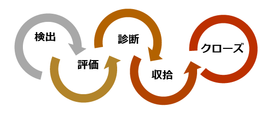
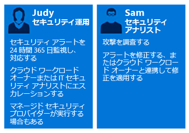
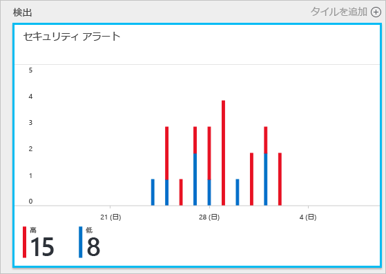
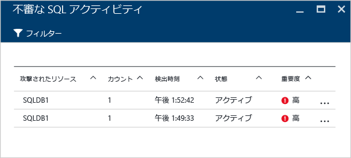
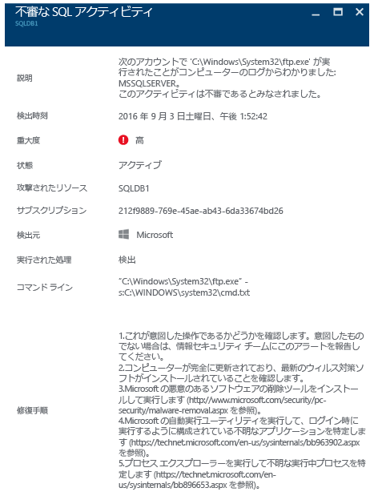

# Azure Security Center を活用したインシデント対応
多くの組織は、攻撃を受けた後にのみセキュリティ インシデントに対応する方法を学習します。 コストを削減し、被害を抑えるためには、攻撃を受ける前にインシデント対応計画を整えておくことが重要です。 Azure Security Center は、インシデント対応のさまざまな段階で利用できます。

## インシデント対応の計画
計画が効果的なものとなるかどうかは、脅威に対する保護、検出、対応という 3 つの中心的な機能にかかっています。 保護はインシデントの防止を指し、検出は脅威の早期特定を指します。対応は、攻撃者を追い払うことと、システムを復元して侵害の影響を軽減することを指します。

この記事では、次の図に示すように、「[Microsoft Azure Security Response in the Cloud (クラウドにおける Microsoft Azure のセキュリティ対応)](https://gallery.technet.microsoft.com/Azure-Security-Response-in-dd18c678)」で述べられているセキュリティ インシデント対応の段階を使用します。

Security Center は、検出、評価、診断の各段階で利用できます。 初期インシデント対応の 3 つの段階で Security Center が役に立つ例を次に示します。

* **検出**: イベント調査の最初の兆候を確認します。
  * 例: 優先順位の高いセキュリティの警告が Security Center ダッシュボードに表示されたことの最初の確認。
* **評価**: 最初の評価を実行して、疑わしいアクティビティに関する詳細情報を入手します。
  * 例: セキュリティの警告に関する詳しい情報の入手。
* **診断**: 技術的な調査、ID コンテインメント、対応策、回避戦略を実施します。
  * 例: その特定のセキュリティの警告で Security Center によって説明されている修復手順の実行。

次のシナリオでは、セキュリティ インシデントの検出、評価、診断/対応の段階で Security Center を利用する方法について説明します。 Security Center での[セキュリティ インシデント](security-center-incident.md)とは、[キル チェーン](https://blogs.technet.microsoft.com/office365security/addressing-your-cxos-top-five-cloud-security-concerns/)のパターンに一致するリソースに関するすべての警告を集約したものです。 インシデントは、[[セキュリティ通知]](security-center-managing-and-responding-alerts.md) タイルおよびブレードに表示されます。 インシデントには関連する警告の一覧が表示されるため、それぞれの警告の発生について詳細情報を得ることができます。 また、Security Center では、疑わしいアクティビティの追跡にも使用できるセキュリティの警告が単独で表示されます。

## シナリオ
Contoso は最近、いくつかの仮想マシンベースの基幹業務ワークロードと SQL データベースなど、オンプレミスのリソースの一部を Azure に移行しました。 現在、中心となる Contoso のコンピューター セキュリティ インシデント対応チーム (CSIRT) は、セキュリティ インテリジェンスが現在のインシデント対応ツールと統合されていないため、セキュリティ上の問題の調査に関する課題を抱えています。 この統合の欠如が原因で、検出の段階で問題 (偽陽性が多すぎる) が発生しているほか、評価と診断の段階でも問題が発生しています。 この移行の一環として、Security Center の利用を開始してこの問題を解決することに決定しました。

この移行の最初のフェーズは、すべてのリソースをオンボードし、Security Center からのセキュリティに関する推奨事項にすべて対処した後に完了しました。 Contoso CSIRT は、コンピューター セキュリティ インシデントに対処する場合に中心的な役割を果たします。 CSIRT チームは、セキュリティ インシデントへの対処について責任を負う複数人のグループで構成されています。 チームのメンバーは、対応領域が余すことなくカバーされるように、明確に定義された義務を負っています。

このシナリオでは、Contoso CSIRT に属する次の人物の役割を中心に説明していきます。

Judy はセキュリティ運用担当者です。 彼女の役割には次のものが含まれています。

* 24 時間体制でセキュリティの脅威に対する監視と対応を行う。
* 必要に応じて、クラウド ワークロード所有者またはセキュリティ アナリストに報告する。

Sam はセキュリティ アナリストです。彼の役割には次のものが含まれています。

* 攻撃を調査する。
* 警告を修正する。
* ワークロード所有者と協力し、対応策を決定して適用する。

ご覧のとおり、Judy と Sam は異なる役割を担っており、Security Center の情報を共有して互いに協力する必要があります。

## 推奨される解決策
Judy と Sam は異なる役割を担っているため、自分たちの日々の業務に関連する情報を入手するために Security Center の異なる領域を使用することになります。 Judy は、毎日の監視の一環として**セキュリティの警告**を使用します。

Judy は、検出と評価の段階でセキュリティの警告を使用します。 最初の評価が完了したら、追加の調査が必要な場合に問題を Sam に報告します。 この時点で、Sam は Security Center によって提供された情報を (場合によっては他のデータ ソースと併せて) 使用し、診断の段階に移ります。

## この解決策を実行する方法
インシデント対応シナリオで Azure Security Center を利用する方法を説明するために、検出と評価の段階における Judy の手順を確認してから、この問題を診断するために Sam が行う手順を見ていきます。

### インシデント対応の検出と評価の段階
Judy は Azure Portal にサインインし、Security Center コンソールで作業しています。 日々の監視業務の一環として、優先度の高いセキュリティの警告の確認を開始するために、次の手順を実行しました。

1. **[セキュリティ通知]** タイルをクリックし、**[セキュリティ通知]** ブレードにアクセスします。
    ![[セキュリティ通知] ブレード](./media/security-center-incident-response/security-center-incident-response-fig4.png)

   > [!NOTE]
   > 前の図からわかるように、このシナリオでは、Judy は [Malicious SQL activity (悪意のある SQL アクティビティ)] の警告に関する評価を行います。
   >
   >
2. **[Malicious SQL activity]\(悪意のある SQL アクティビティ\)** アラートをクリックし、**[Malicious SQL activity]\(悪意のある SQL アクティビティ\)** ブレードで攻撃されたリソースを確認します。

    このブレードで Judy は、攻撃されたリソースについて、この攻撃が行われた回数と攻撃が検出された時間を書き留めることができます。
3. **[攻撃されたリソース]** をクリックし、この攻撃に関する詳しい情報を取得します。

説明を読んだ後、Judy は、これが偽陽性でないことと、このケースを Sam に報告する必要があることを確信します。

### インシデント対応の診断の段階
Sam は Judy からこのケースを受け取り、Security Center によって提案される修復手順の確認を開始します。

### その他のリソース
セキュリティ情報およびイベント管理 (SIEM) ソリューションを調査プロセス中に使用する会社では、[このソリューションと Security Center を統合する](security-center-integrating-alerts-with-log-integration.md)こともできます。 また、Azure 監査ログと仮想マシン (VM) セキュリティ イベントも、[Azure ログ統合ツール](https://azure.microsoft.com/blog/introducing-hdinsight-integration-with-azure-log-analytics/)を使用して統合できます。 攻撃を調査するには、この情報を、Security Center によって提供される情報と共に使用します。 また、インシデントの根本的な原因を特定するのに役立つ、Security Center の[調査](https://docs.microsoft.com/azure/security-center/security-center-investigation)機能を使用することもできます。

## まとめ
インシデントが発生する前にチームを編成することは組織にとって非常に重要であり、インシデントの対処のあり方に確実に影響します。 リソースの監視に適切なツールを用意することで、このチームはセキュリティ インシデントを修正する手順を正確に実行できます。 Security Center の[検出機能](security-center-detection-capabilities.md)を利用すれば、IT はセキュリティ インシデントに迅速に対応してセキュリティの問題を修正できます。
