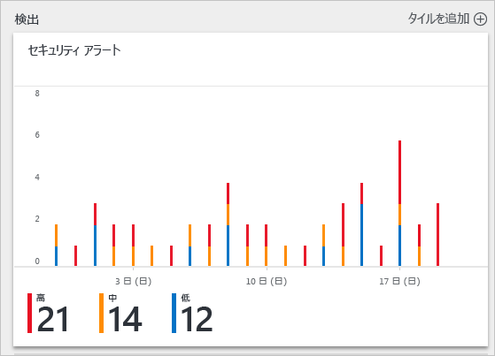
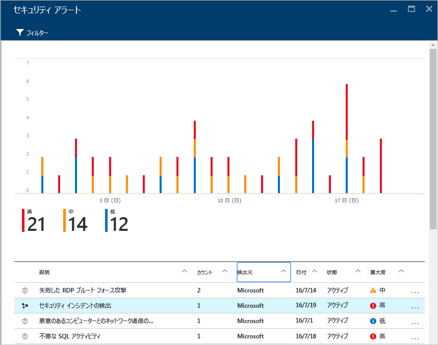
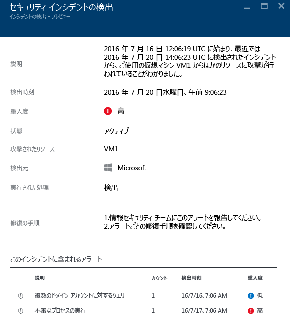
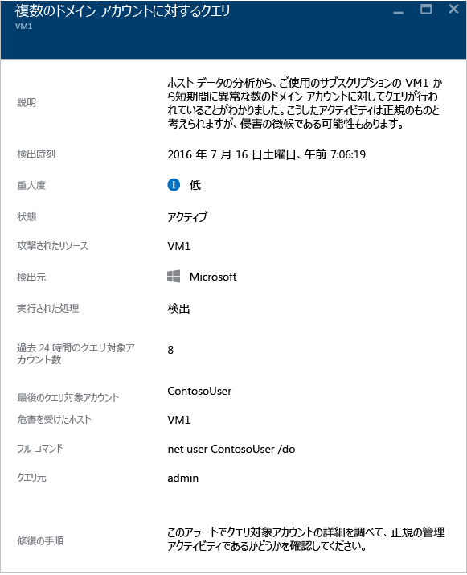

# Azure Security Center でのセキュリティ インシデントの処理
セキュリティ警告のトリアージと調査は、熟練のセキュリティ アナリストでさえ長時間を要することのある作業であり、多くのユーザーにとっては、どこから始めればよいのかもわかりません。 Security Center では、[分析](security-center-detection-capabilities.md)を利用して異なる[セキュリティ アラート](security-center-managing-and-responding-alerts.md)間の情報を結び付け、攻撃キャンペーンとそれに関連するすべてのアラートを単一のビューに表示します。これにより、攻撃者がどのような操作を実行し、どのリソースが影響を受けたのかを迅速に把握することができます。

このドキュメントでは、Security Center でセキュリティ警告機能を使用して、セキュリティ インシデントの処理に役立てる方法を説明します。

## セキュリティ インシデントとは
Security Center でのセキュリティ インシデントとは、 [キル チェーン](https://blogs.technet.microsoft.com/office365security/addressing-your-cxos-top-five-cloud-security-concerns/) のパターンに一致するリソースに関するすべての警告を集約したものです。 インシデントは、 [[セキュリティの警告]](security-center-managing-and-responding-alerts.md) タイルおよびブレードに表示されます。 インシデントには関連する警告の一覧が表示されるため、それぞれの警告の発生について詳細情報を得ることができます。

## セキュリティ インシデントの管理
現在のセキュリティ インシデントは、セキュリティ警告のタイルで確認できます。 Azure Portal にアクセスし、以下の手順に従って各セキュリティ インシデントについての詳細を確認してください。

1. [セキュリティ センター] ダッシュボードには **[セキュリティの警告]** タイルが表示されます。

    

2. このタイルをクリックして展開します。セキュリティ インシデントが削除されている場合は、以下に示すようにセキュリティ アラート グラフの下に表示されます。

    

3. セキュリティ インシデントの説明には、他の警告とは異なるアイコンが付いている点に注意してください。 このインシデントについての詳細を確認するには、このアイコンをクリックします。

    

4. **インシデント**のブレードでは、このセキュリティ インシデントの詳細情報を確認できます。インシデントの詳しい説明、重大度 (この場合は "高")、現在の状態 (この場合は依然として "*アクティブ*" (**[セキュリティ アラート]** ブレードのインシデントを右クリックして実行できるアクションをユーザーがまだ実行していないことを示します))、攻撃を受けたリソース (この場合は *VM1*)、インシデントの修復手順が表示されるほか、このインシデントに含まれていたアラートが下部のウィンドウに表示されます。 それぞれの警告の詳細を確認する場合、その警告をクリックするだけで次のように別のブレードが開きます。

    

このブレードの情報は、警告によって異なります。 これらの警告を管理する方法の詳細については、「 [Azure Security Center でのセキュリティの警告の管理と対応](security-center-managing-and-responding-alerts.md) 」を参照してください。 この機能に関する重要な考慮事項を以下に示します。

* 新しいフィルターを利用すると、インシデントのみ、警告のみ、またはその両方が表示されるようにビューをカスタマイズできます。
* 同じ警告がインシデントの一部 (該当する場合) として存在することもあれば、単独の警告として表示されることもあります。

## 関連項目
このドキュメントでは、Security Center でのセキュリティ インシデント機能の使用方法について説明しました。 セキュリティ センターの詳細については、次を参照してください。

* [Azure セキュリティ センターでのセキュリティの警告の管理と対応](security-center-managing-and-responding-alerts.md)
* [Azure Security Center の検出機能](security-center-detection-capabilities.md)
* [Azure Security Center 計画および運用ガイド](security-center-planning-and-operations-guide.md)
* [Azure セキュリティ センターでのセキュリティの警告の管理と対応](security-center-managing-and-responding-alerts.md)
* 「[Azure Security Center のよく寄せられる質問 (FAQ)](security-center-faq.md)」-- このサービスの使用に関してよく寄せられる質問が記載されています。
* [Azure セキュリティ ブログ](https://blogs.msdn.com/b/azuresecurity/)-- Azure のセキュリティとコンプライアンスについてのブログ記事を確認できます。
