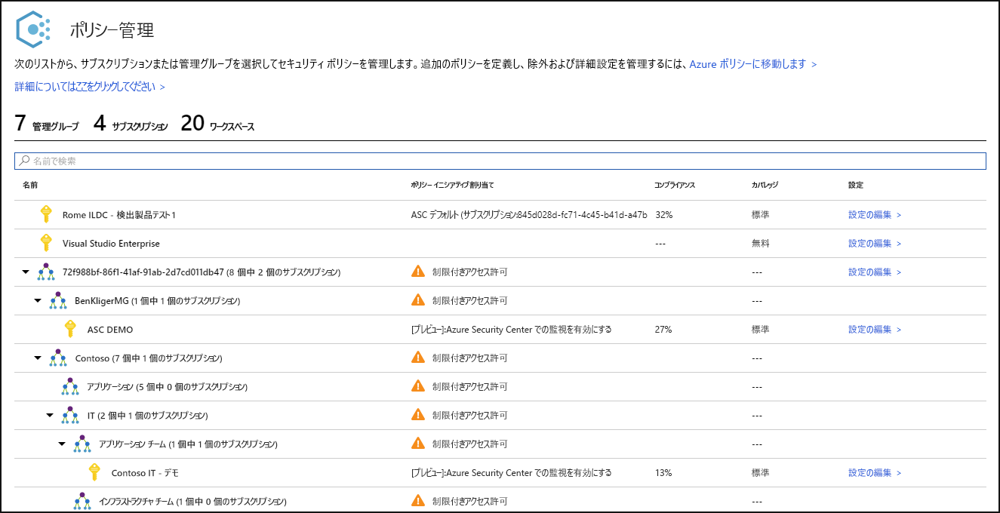
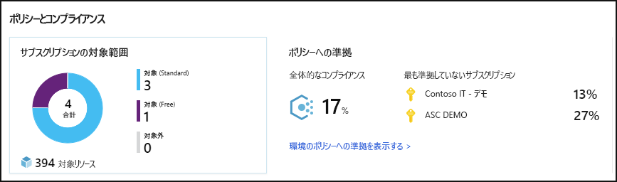
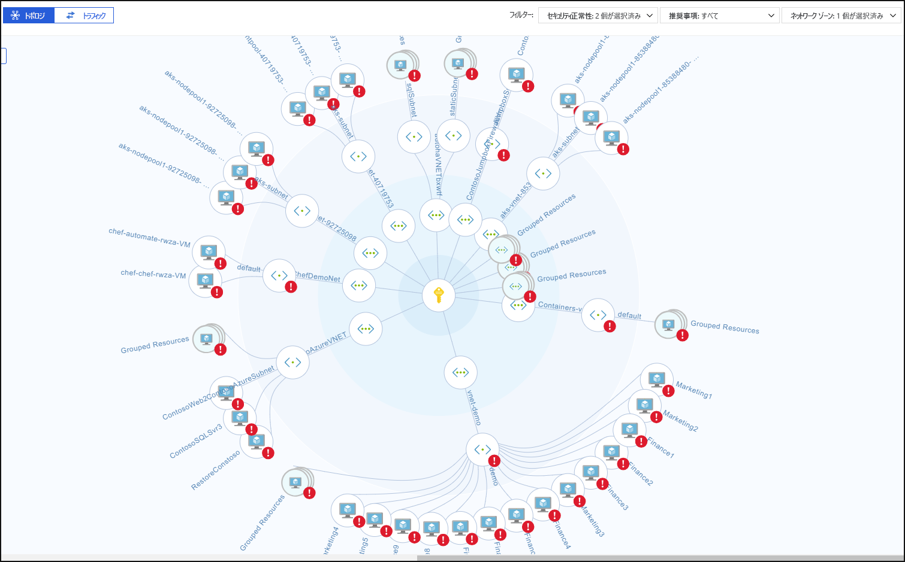
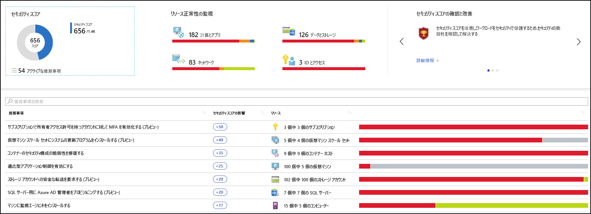
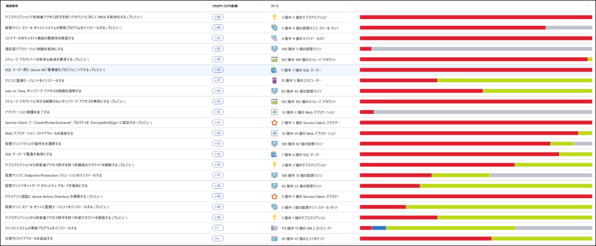
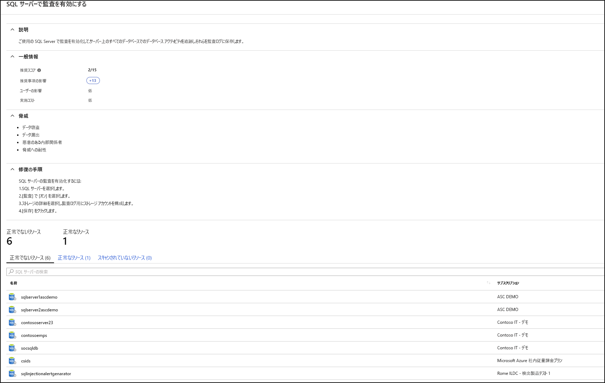
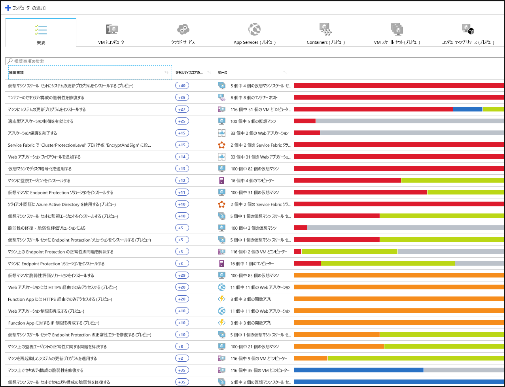
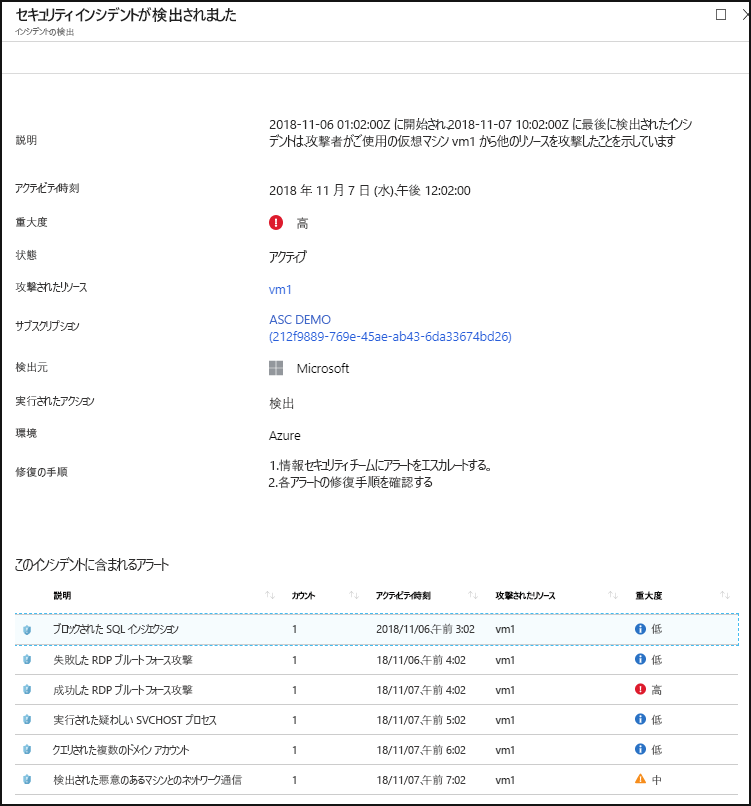

# Azure Security Center とは

Azure Security Center は、データ センターのセキュリティ体制を強化する統合インフラストラクチャ セキュリティ管理システムです。Azure 内かどうかにかかわらずクラウド内とオンプレミス上のハイブリッド ワークロード全体を保護する高度な脅威防止機能があります。

リソースの安全を保つことは、お客様のクラウド プロバイダー、Azure、そしてお客様が共同で取り組む作業です。 クラウドに移行する場合、ワークロードを確実にセキュリティで保護する必要があります。それと同時に、IaaS (サービスとしてのインフラストラクチャ) に移行する場合は、PaaS (サービスとしてのプラットフォーム) と SaaS (サービスとしてのソフトウェア) だったときよりもお客様の責任が大きくなります。 Azure Security Center には、ネットワークを強化し、サービスをセキュリティで保護し、お客様がセキュリティ体制を把握するために必要なツールが用意されています。

Azure Security Center は、3 つの緊急性が高いセキュリティの課題を対処します。

-   **急速に変化するワークロード**: これはクラウドの強みであり、課題でもあります。 一方、エンド ユーザーはより多くの処理を実行できます。 さらに、使用および作成されている常に変化するサービスが、お客様のセキュリティ基準に準拠し、セキュリティのベスト プラクティスに従っていることを確認するにはどうすればよいでしょうか。

-   **ますます高度になる攻撃** : ワークロードをどこで実行する場合でも、攻撃はますます高度になっています。 パブリック クラウドのワークロードを保護する必要があります。これは実質的にインターネットに接続しているワークロードであり、セキュリティのベスト プラクティスに従わないと、さらに脆弱になる可能性があります。

-   **セキュリティ スキルの不足** : セキュリティ アラートとアラート システムの数は、環境が保護されているかどうかを確認するために必要な経歴と経験を持つ管理者の数をはるかに上回っています。 最近の攻撃の最新情報を把握し続けることは常に課題であり、セキュリティの世界が絶え間なく変化する最前線に立ち続けることは不可能です。

このような課題からお客様自身を保護できるように、Security Center には次のツールが用意されています。

-   **セキュリティ体制を強化する**:Security Center では環境が評価されます。リソースの状態、つまりセキュリティで保護されているかどうかを把握できます。

-   **脅威からの保護**:Security Center ではワークロードが評価され、脅威防止の推奨事項と脅威検出アラートが生成されます。

-   **より迅速にセキュリティ保護**:Security Center では、すべてがクラウドの速度で行われます。 ネイティブに統合されているので、Security Center のデプロイは容易であり、Azure サービスによる自動プロビジョニングと保護が提供されます。

## アーキテクチャ

Security Center はネイティブで Azure の一部なので、Service Fabric、SQL Database、ストレージ アカウントなどの Azure に含まれる PaaS サービスは、デプロイすることなく Security Center で監視および保護されます。

さらに、Security Center によって、クラウド内またはオンプレミス上にある Azure 以外のサーバーおよび仮想マシンが保護されます。Microsoft Monitoring Agent をインストールすることで、Windows サーバーと Linux サーバーのどちらにも対応できます。 Azure 仮想マシンは、Security Center 内に自動プロビジョニングされます。

エージェントと Azure から収集されたイベントは、セキュリティ分析エンジンで相互に関連付けられ、調整された推奨事項 (強化タスク) が提供されます。これに従うことで、ワークロードをセキュリティで保護できます。また、脅威検出アラートも提供されます。 このようなアラートはできるだけ早く調査し、ワークロードに対して悪意のある攻撃が行われていないことを確認する必要があります。

Security Center を有効にすると、Security Center に組み込まれたセキュリティ ポリシーが、Security Center カテゴリのビルトインのイニシアティブとして Azure Policy に反映されます。 ビルトインのイニシアティブは、Security Center のすべての登録済みサブスクリプション (Free または Standard レベル) に対して自動的に割り当てられます。 ビルトインのイニシアティブに含まれているのは監査ポリシーだけです。 Azure Policy における Security Center のポリシーの詳細については、「[セキュリティ ポリシーの操作](tutorial-security-policy.md)」を参照してください。

## セキュリティ体制の強化

Azure Security Center を使用すると、セキュリティ体制を強化できます。 つまり、セキュリティのベスト プラクティスとして推奨される強化タスクを特定して実行し、マシン、データ サービス、およびアプリ全体に実装することができます。 これには、セキュリティ ポリシーの管理と実施、および Azure 仮想マシン、Azure 以外のサーバー、Azure PaaS サービスが準拠していることの確認が含まれています。 Security Center には、ネットワークのセキュリティ資産を明確に可視化して、ワークロード全体を把握するために必要なツールが用意されています。 

### 組織のセキュリティ ポリシーとコンプライアンスの管理

これは、ワークロードがセキュリティで保護されていることを把握し、確実にするための基本的なセキュリティです。まず、セキュリティ ポリシーを適切に調整して配置することから始めます。 Security Center のすべてのポリシーは Azure のポリシー制御を基礎にして構築されているため、 **世界レベルのポリシー ソリューション**のすべての範囲と柔軟性を利用できます。 Security Center では、管理グループ、サブスクリプション全体、さらにはテナント全体に対して実行するようにポリシーを設定できます。

Security Center を使用すると、 **シャドウ IT のサブスクリプションを特定する**ことができます。 ダッシュボードで**未カバー**のラベルが付いたサブスクリプションを見ると、新しくサブスクリプションが作成されたときにすぐに把握できます。また、ポリシーによって保護され、Azure Security Center によって保護されていることを確認できます。

Security Center の高度な監視機能を使用すると、 **コンプライアンスとガバナンスを長期にわたって追跡および管理することもできます**。  **全体的なコンプライアンス** には、ワークロードに関連付けられているポリシーにサブスクリプションが準拠しているかどうかのメジャーが表示されます。 

### 継続的な評価

Security Center では、ワークロード全体に展開されている新しいリソースが継続的に検出され、セキュリティのベスト プラクティスに従って構成されているかどうかが評価され、そうでない場合はフラグが立てられます。また、マシンを保護するために必要な修正点について、優先順位が付けられた推奨事項一覧が表示されます。

ネットワークのセキュリティ状態を継続的に監視するために Security Center に用意されている最も強力なツールの 1 つとして、 **ネットワーク マップ**があります。 このマップを使用すると、ワークロードのトポロジを確認できるため、各ノードが正しく構成されているかどうかを確認できます。 ノードがどのように接続されているかを確認できます。これにより、攻撃者がネットワークに侵入しやすくなる可能性がある望ましくない接続をブロックすることができます。

Security Center では、 **セキュリティ スコア**を追加することで、もう一段階簡単にセキュリティ アラートを緩和できます。 セキュリティ スコアは、全体的なセキュリティ体制に対する各推奨事項の重要度を理解できるように、受信した各推奨事項と関連付けられるようになりました。 これは、 **セキュリティ作業の優先度付け**を可能にする上で重要です。

### 推奨されるコントロールを構成してセキュリティを最適化し、強化する

Azure Security Center が持つ価値の中心は、その推奨事項にあります。 推奨事項は、ワークロード上で見つかった特定のセキュリティ上の懸案事項に合わせて調整されています。Security Center では、脆弱性を検出するだけでなく、その排除のための具体的な手順を提供することで、セキュリティ管理者の作業が自動実行されます。

このように、Security Center では、セキュリティ ポリシーを設定するだけでなく、セキュリティで保護された構成基準をリソース全体に適用することができます。

推奨事項を利用すると、各リソースの攻撃対象領域を減らすことができます。 これには、Azure 仮想マシン、Azure 以外のサーバー、SQL や Storage アカウントなどの Azure PaaS サービスなどが含まれます。リソースの種類によって評価方法は異なり、固有の基準があります。

## 脅威からの保護

Security Center の脅威の防止機能により、Azure 内のサービスとしてのプラットフォーム (PaaS) だけでなく、サービスとしてのインフラストラクチャ (IaaS)、Azure 以外のサーバーの脅威も検出して防止することができます。

Security Center の脅威の防止機能には、サイバー キルチェーン分析に基づいて環境内のアラートを自動的に相関させるフュージョン キルチェーン分析が含まれており、攻撃キャンペーンの詳細 (開始点、リソースに対する影響の種類) を詳細に把握することができます。

### 高度な脅威保護

Security Center では、Windows Defender Advanced Threat Protection とのネイティブ統合をすぐに利用できます。 つまり、Windows 仮想マシンとサーバーは、構成を行うことなく Security Center の推奨事項および評価と完全に統合されます。 高度な脅威検出は、Linux 仮想マシンおよびサーバー用にも提供されており、すぐに利用できます。

さらに、Security Center では、サーバー環境のアプリケーション制御ポリシーを自動化することができます。 Security Center の適応型アプリケーション制御を使用すると、Windows サーバー全体の包括的なアプリのホワイトリストを作成できます。 ルールを作成して違反を確認する必要はありません。すべて自動的に行われます。

### PaaS の保護

Security Center は、Azure PaaS サービス全体の脅威を検出するために役立ちます。 Azure App Service、Azure SQL、Azure ストレージ アカウント、その他のデータ サービスを含む Azure サービスを対象とした脅威を検出できます。 また、Microsoft Cloud App Security のユーザーおよびエンティティ行動分析 (UEBA) とのネイティブ統合を利用して、Azure アクティビティ ログに対して異常検出を実行することもできます。

### ブルート フォース攻撃のブロック

Security Center は、ブルートフォース攻撃への露出を制限するために役立ちます。 Just-In-Time VM アクセスを使用して仮想マシン ポートへのアクセスを減らすことにより、不要なアクセスを防止してネットワークを強化することができます。 許可されたユーザー、許可されたソース IP アドレスの範囲または IP アドレス、および制限された期間にのみ、選択したポートに対するセキュリティで保護されたアクセス ポリシーを設定することができます。

### データ サービスの保護

Security Center には、Azure SQL 内のデータの自動分類を実行するために役立つ機能が含まれています。 また、Azure SQL と Storage サービス全体の潜在的な脆弱性の評価と、それらを緩和する方法の推奨事項を取得することもできます。

### IoT およびハイブリッド クラウド ワークロードを保護する (プレビュー)

Azure Security Center for IoT (モノのインターネット) は、エッジ、オンプレミス、Azure、その他のクラウド上で実行されているワークロードにまたがる統一された可視性と制御、アダプティブな脅威の防止、およびインテリジェントな脅威の検出と対応を提供することによって、ハイブリッド ワークロード保護を簡素化します。 詳細については、[Azure Security Center for IoT (プレビュー)](https://docs.microsoft.com/azure/asc-for-iot/) に関するページを参照してください。

## より迅速にセキュリティ保護

ネイティブの Azure 統合 (Azure Policy、Azure Monitor ログなど) が、他の Microsoft セキュリティ ソリューション (Microsoft Cloud App Security、Windows Defender Advanced Threat Protection など) とのシームレスな統合と組み合わされているため、包括的なセキュリティ ソリューションを実現できるだけでなく、オンボードと展開も簡単です。

さらに、Azure 以外にも、他のクラウド上やオンプレミスのデータ センター内で実行されているワークロードにソリューション全体を拡張することもできます。

### Azure リソースの自動検出とオンボード

Security Center で、Azure および Azure リソースとのシームレスでネイティブな統合が実現します。 つまり、すべての Azure リソース全体から Azure Policy と組み込みの Security Center ポリシーに関係する詳細なセキュリティ ストーリーを集めて、Azure でのリソースの作成時に、新たに検出されたリソースに自動的に適用することができます。

広範なログ収集: Windows および Linux のログはすべてセキュリティ分析エンジンで活用され、推奨事項とアラートの作成に使用されます。

## 次の手順

- Security Center を使用するには、Microsoft Azure のサブスクリプションが必要です。 サブスクリプションがない場合は、 [無料試用版](https://azure.microsoft.com/free/)にサインアップできます。
- Security Center の Free 価格レベルは、Azure サブスクリプションがある場合に有効です。 高度なセキュリティ管理と脅威検出の機能を利用するには、Standard 価格レベルにアップグレードする必要があります。 Standard レベルは無料でお試しいただくことができます。 詳しくは、「[Security Center の価格](https://azure.microsoft.com/pricing/details/security-center/)」ページをご覧ください。
- 今すぐ Security Center Standard を有効にする準備ができたら、「[クイック スタート:Azure サブスクリプションでの Security Center Standard の利用開始](security-center-get-started.md)」の詳細な手順を参照してください。

