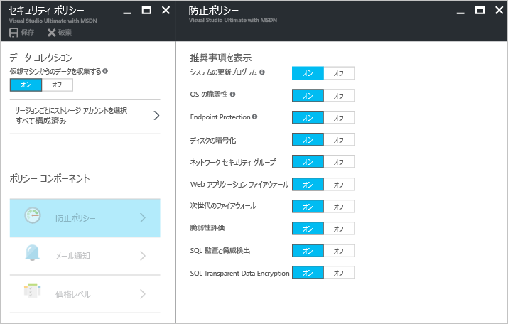
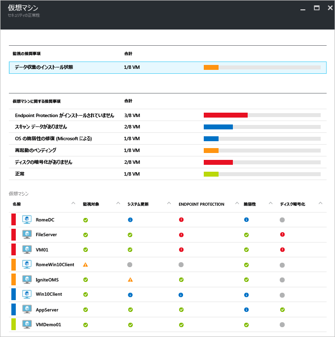
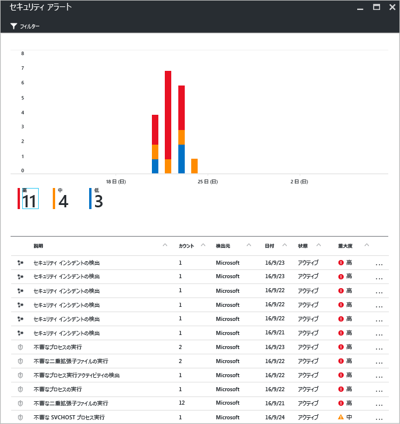
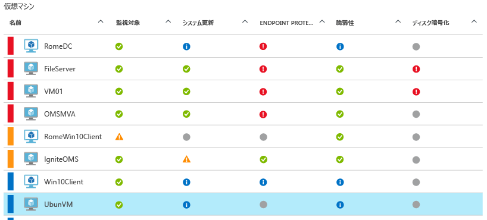
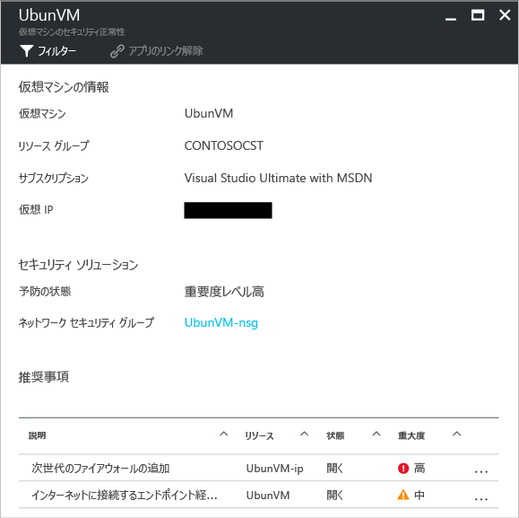

# Linux での Azure Security Center と Azure 仮想マシン
[Azure Security Center](https://azure.microsoft.com/services/security-center/) は、脅威の防御、検出、対応を可能にする機能です。 これにより、Azure サブスクリプション全体に統合セキュリティの監視とポリシーの管理を提供し、気付かない可能性がある脅威を検出し、セキュリティ ソリューションの広範なエコシステムと連動します。

この記事では、Linux オペレーティング システムを実行している Azure 仮想マシン (VM) のセキュリティ保護に Security Center を活かす方法について説明します。

## Security Center を使う意義
Security Center は、仮想マシンのセキュリティ設定を可視化し、脅威を監視することによって、Azure にある仮想マシンのデータを保護するのに役立ちます。 Security Center は、仮想マシンの次の項目を監視できます。 

* 推奨される構成規則を使用したオペレーティング システム (OS) セキュリティ設定
* 不足しているシステムのセキュリティ更新プログラムと重要な更新プログラム
* エンドポイント保護の推奨事項
* ディスク暗号化の検証
* ネットワーク ベースの攻撃 ([Standard バージョン](https://azure.microsoft.com/pricing/details/security-center/)でのみ使用可能)

Security Center の機能は、Azure VM を保護することだけではありません。Cloud Services、App Services、Virtual Network などのセキュリティを監視して管理することもできます。 

> [!NOTE]
> Azure Security Center の詳細については、「[Azure Security Center 入門](security-center-intro.md)」をご覧ください。
> 
> 

## 前提条件
Azure Security Center の使用を開始するには、次のことを理解して検討する必要があります。

* Microsoft Azure サブスクリプションを持っている必要があります。 Security Center の Free レベルと Standard レベルの詳細については、「[セキュリティ センターの価格](https://azure.microsoft.com/pricing/details/security-center/)」を参照してください。
* Security Center の導入を計画します。計画と運用の考慮事項の詳細については、「[Azure Security Center 計画および運用ガイド](security-center-planning-and-operations-guide.md)」を参照してください。
* サポートされているオペレーティング システムの情報については、「[Azure Security Center のよく寄せられる質問 (FAQ)](security-center-faq.md)」を参照してください。 

## セキュリティ ポリシーの設定
Azure Security Center で必要な情報を収集し、構成したセキュリティ ポリシーに基づいて推奨事項と警告を生成できるよう、データ収集を有効にしておく必要があります。 次の図では、 **[データ収集]** が **[オン]** になっていることがわかります。

セキュリティ ポリシーは、指定されたサブスクリプションまたはリソース グループ内のリソースに推奨されるコントロールのセットを定義します。 セキュリティ ポリシーを有効にする前に、データ収集を有効にしておく必要があります。Security Center では、仮想マシンのセキュリティ状態へのアクセス、セキュリティ推奨事項の提供、脅威についての警告を行うために、その仮想マシンからデータを収集します。 Security Center では、セキュリティに関する会社のニーズ、および各サブスクリプションでのアプリケーションの種類やデータの機密度に合わせて、Azure サブスクリプションまたはリソース グループのポリシーを定義できます。 

> [!NOTE]
> **[防止ポリシー]** で使用できる各ポリシーについては、[セキュリティ ポリシーの設定](tutorial-security-policy.md)に関する記事を参照してください。
> 

## セキュリティに関する推奨事項の管理
セキュリティ センターは、Azure リソースのセキュリティの状態を分析します。 セキュリティ センターでは、潜在的なセキュリティの脆弱性が特定されると、推奨事項が作成されます。 推奨事項では、必要なコントロールを構成する手順を説明します。

セキュリティ ポリシーを設定すると、セキュリティ センターではリソースのセキュリティの状態が分析され、潜在的な脆弱性が特定されます。 推奨事項は表形式で表示されます。表の行はそれぞれ特定の推奨事項を表します。 次の表には、Linux オペレーティング システムを実行している Azure VM の推奨事項の例の一部と、それぞれを適用した場合に実行される内容について記載されています。 推奨事項を選択すると、Security Center で推奨事項を実装する方法についての情報を確認できます。

| 推奨 | 説明 |
| --- | --- |
| [サブスクリプションのデータ収集の有効化](security-center-enable-data-collection.md) |各サブスクリプションおよびサブスクリプションのすべての仮想マシン (VM) に対して、セキュリティ ポリシーでデータ収集を有効にすることをお勧めします。 |
| OS の脆弱性の修復|OS の構成を推奨される構成規則 (パスワードの保存を許可しないなど) に合わせることをお勧めします。 |
| [システムの更新の適用](security-center-apply-system-updates.md) |システムの不足しているセキュリティ更新プログラムおよび重要な更新プログラムを VM にデプロイすることをお勧めします。 |
| [システムの更新後に再起動する](security-center-apply-system-updates.md#reboot-after-system-updates) |VM を再起動してシステムの更新プログラムの適用プロセスを完了するよう推奨します。 |
| VM エージェントの有効化|VM エージェントを必要とする VM を確認できます。 パッチのスキャン、基準のスキャン、およびマルウェア対策プログラムをプロビジョニングするには、VM 上に VM エージェントをインストールする必要があります。 既定では、Azure Marketplace からデプロイされた VM に VM エージェントがインストールされます。 「 [VM エージェントと拡張機能 – パート 2](https://azure.microsoft.com/blog/2014/04/15/vm-agent-and-extensions-part-2/) 」の記事には、VM エージェントのインストール方法が記載されています。 |
| [ディスク暗号化の適用](security-center-apply-disk-encryption.md) |Azure Disk Encryption を使用して VM ディスクを暗号化することをお勧めします (Windows VM および Linux VM)。 VM 上の OS とデータ ボリュームの両方を暗号化することをお勧めします。 |

> [!NOTE]
> 推奨事項の詳細については、[セキュリティに関する推奨事項の管理](security-center-recommendations.md)についての記事を参照してください。
> 

## セキュリティ正常性を監視する
サブスクリプションのリソースに対して [セキュリティ ポリシー](tutorial-security-policy.md) を有効にすると、Security Center は、リソースのセキュリティを分析して潜在的な脆弱性を特定します。  **[リソース セキュリティの正常性]** ブレードで、リソースのセキュリティの状態と、問題がある場合はその問題を確認することができます。 **[リソース セキュリティの正常性]** タイルの **[仮想マシン]** をクリックすると、 **[仮想マシン]** ブレードが開いて VM の推奨事項が表示されます。 

## セキュリティの警告の管理と対応
Security Center は、真の脅威を検出し、偽陽性を減らすために、Azure のリソースやネットワークのほか、接続されているパートナー ソリューション (ファイアウォールやエンドポイント保護ソリューションなど) から、自動的にログ データを収集、分析、統合します。 [検出機能](security-center-detection-capabilities.md)のさまざまな集計を利用することで、問題を迅速に調査するうえで役に立つ、優先順位付きのセキュリティの警告を生成できるほか、潜在的な攻撃の修復方法に関する推奨事項を提示することができます。

セキュリティの警告を選択して、警告を発生させたイベントの詳細を確認します。必要に応じて、攻撃を受けたものを修復するために必要な手順を確認します。 セキュリティの警告は、[種類](security-center-alerts-type.md)と日付によってグループ化されます。

## セキュリティ正常性の監視
サブスクリプションのリソースに対して [セキュリティ ポリシー](tutorial-security-policy.md) を有効にすると、Security Center は、リソースのセキュリティを分析して潜在的な脆弱性を特定します。  **[リソース セキュリティの正常性]** ブレードで、リソースのセキュリティの状態と、問題がある場合はその問題を確認することができます。 **[リソース セキュリティの正常性]** タイルの **[仮想マシン]** をクリックすると、 **[仮想マシン]** ブレードが開いて VM の推奨事項が表示されます。 

この推奨事項をクリックすると、これらの問題への対処に必要な具体的なアクションに関する詳細が表示されます。 詳細は、ブレード下部の **[Recommendations (推奨事項)]** に表示されます。 

## 関連項目
セキュリティ センターの詳細については、次を参照してください。

* [Azure Security Center でのセキュリティ ポリシーの設定](tutorial-security-policy.md) 」-- Azure サブスクリプションとリソース グループのセキュリティ ポリシーの構成方法について説明しています。
* [Azure Security Center でのセキュリティの警告の管理と対応](security-center-managing-and-responding-alerts.md) 」-- セキュリティの警告の管理と対応の方法について説明しています。
* [Azure Security Center のよく寄せられる質問 (FAQ)](security-center-faq.md) 」-- このサービスの使用に関してよく寄せられる質問が記載されています。

