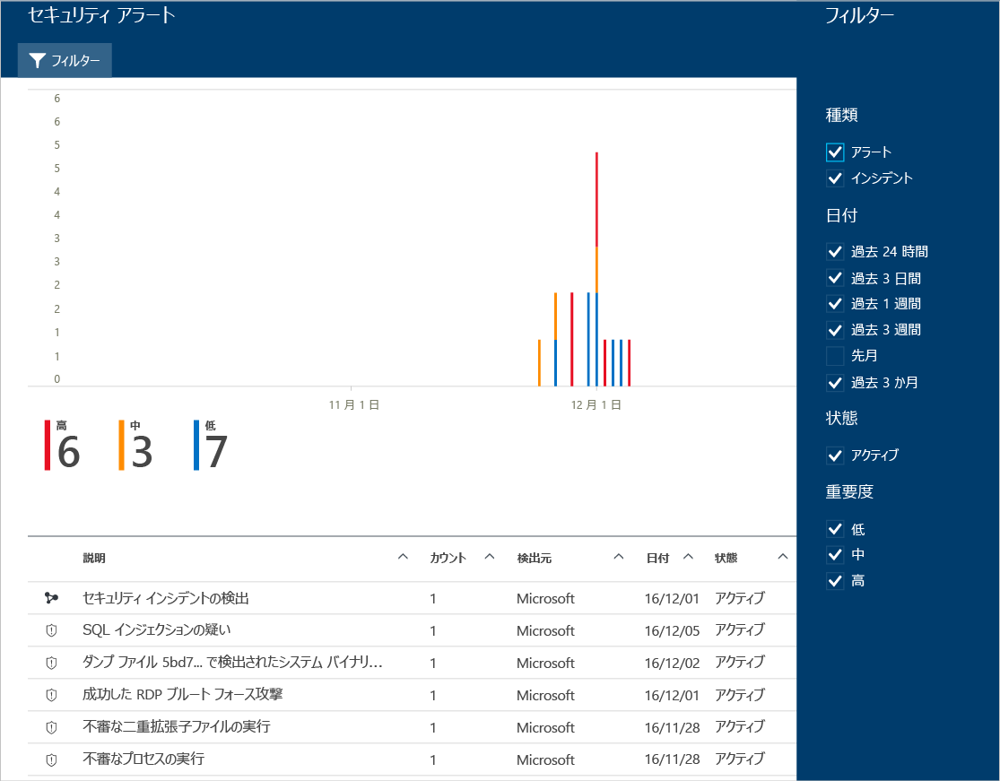

# Azure セキュリティ センターでのセキュリティの警告の管理と対応
このドキュメントは、Azure Security Center を使用してセキュリティの警告を管理し、必要な対応を行う際にお役立てください。

> [!NOTE]
> 高度な検出を有効にするには、Azure Security Center Standard にアップグレードしてください。 60 日間の無料試用版が提供されています。 アップグレードするには、 [[セキュリティ ポリシー]](security-center-policies.md)の [価格レベル] を選択してください。 詳細については、「[Azure Security Center pricing (Azure Security Center の料金)](security-center-pricing.md)」を参照してください。
>
>

## セキュリティの警告とは何か
Security Center は、真の脅威を検出し、偽陽性を減らすために、Azure のリソースやネットワークのほか、接続されているパートナー ソリューション (ファイアウォールやエンドポイント保護ソリューションなど) から、自動的にログ データを収集、分析、統合します。 Security Center には、優先順位の付いたセキュリティの警告の一覧が表示されます。また、すぐに問題を調査する必要がある情報や、攻撃を受けたものを修復する方法についての推奨事項も表示されます。

> [!NOTE]
> Security Center の検出機能に関する詳細については、「 [Azure Security Center の検出機能](security-center-detection-capabilities.md)」を参照してください。
>
>

## セキュリティの警告の管理
現在の警告は、 **[セキュリティ アラート]** タイルで確認できます。 各アラートの詳細を確認するには、以下の手順に従います。

1. [セキュリティ センター] ダッシュボードに **[セキュリティ アラート]** タイルが表示されます。

    

2. タイルをクリックして **[セキュリティ アラート]** を開くと、アラートの詳細が表示されます。

   

このページの下部に、各アラートの詳細が表示されます。 警告を並べ替えるには、並べ替えに使用する列をクリックします。 各列の定義を以下に示します。

* **説明**: 警告の短い説明。
* **カウント**: 特定の日に検出された、特定の種類の全警告の一覧。
* **検出元**: 警告をトリガーしたサービス。
* **日付**: イベントが発生した日付。
* **状態**: その警告の現在の状態。 ここに表示される状態は 2 種類です。
  * **アクティブ**: セキュリティの警告が検出されました。
  * **破棄済み**: セキュリティの警告はユーザーによって破棄されました。 通常、この状態が使用されるのは、調査済みであって、軽減されたか、または実際の攻撃とは見なされなかった警告に対してです。
* **重大度**: 重大度。高、中、低で示します。

> [!NOTE]
> Security Center によって生成されたセキュリティ アラートは、[Azure の活動ログ] にも表示されます。 [Azure の活動ログ] にアクセスする方法の詳細については、「[リソースのアクションを監査するアクティビティ ログの表示](https://docs.microsoft.com/azure/azure-resource-manager/resource-group-audit)」を参照してください。
>

### 警告のフィルター処理
日付、状態と重要度に基づいて警告をフィルター処理することができます。 警告のフィルター処理は、セキュリティの警告の表示範囲を限定する必要がある場合に便利です。 たとえば、システム内の潜在的な違反を調査するために、過去 24 時間以内に発生したセキュリティの警告を確認することができます。

1. **[セキュリティ アラート]** の **[フィルター]** をクリックします。 **[フィルター]** が開いたら、確認する日付、状態、重大度の値を選択します。

    

### セキュリティの警告への対応
セキュリティの警告を選択して、警告を発生させたイベントの詳細を確認します。必要に応じて、攻撃を受けたものを修復するために必要な手順を確認します。 セキュリティの警告は種類と日付別に分類されています。 セキュリティ アラートをクリックすると、分類されたアラートの一覧が示されたページが開きます。

この場合、トリガーされた警告が、リモート デスクトップ プロトコル (RDP) の疑わしいアクティビティを参照します。 1 列目には、攻撃を受けたリソースが表示されます。2 列目には、リソースが攻撃された回数が表示されます。3 列目には、攻撃の時刻が表示されます。4 列目には、警告の状態が表示されます。5 列目には、攻撃の重大度が表示されます。 この情報を確認した後、攻撃を受けたリソースをクリックします。

**[説明]** フィールドで、このイベントについての詳しい情報を確認できます。 詳しい情報を確認することで、セキュリティの警告を引き起こした原因、ターゲット リソース、(場合によっては) 発生元の IP アドレス、解決のための推奨事項を知ることができます。  Windows セキュリティ イベント ログによっては IP アドレスが含まれていないため、発生元の IP アドレスは空 (利用不可) である場合もあります。

Security Center から提案される修復方法は、セキュリティ アラートによって異なります。 場合によっては、他の Azure 機能を使用して推奨される修復方法を実行する必要があります。 このような攻撃に対する修復の例として、[ネットワーク ACL](../virtual-network/virtual-networks-acl.md) または[ネットワーク セキュリティ グループ](../virtual-network/security-overview.md#security-rules)規則を使用してこの攻撃の発信元の IP アドレスをブラックリストに指定することが挙げられます。 さまざまな警告の種類については、「 [Azure Security Center の種類別のセキュリティの警告](security-center-alerts-type.md)」を参照してください。

> [!NOTE]
> Security Center は、制限付きプレビューに対して、Linux マシン上の悪意のある行為を検出するために、共通の監査フレームワークである監査レコードを活用した一連の新しい検出機能をリリースしました。 プレビューに参加するには、サブスクリプション ID を記入した電子メールを[こちら](mailto:ASC_linuxdetections@microsoft.com)に送信してください。

## 関連項目
このドキュメントでは、セキュリティ センターでのセキュリティ ポリシーの構成方法について説明しました。 セキュリティ センターの詳細については、次を参照してください。

* [Azure Security Center でのセキュリティ インシデントの処理](security-center-incident.md)
* [Azure Security Center の検出機能](security-center-detection-capabilities.md)
* [Azure Security Center 計画および運用ガイド](security-center-planning-and-operations-guide.md)
* [Azure Security Center のよく寄せられる質問 (FAQ)](security-center-faq.md) 」 -- このサービスの使用に関してよく寄せられる質問が記載されています。
* [Azure セキュリティ ブログ](http://blogs.msdn.com/b/azuresecurity/) -- Azure のセキュリティとコンプライアンスについてのブログ記事を確認できます。
