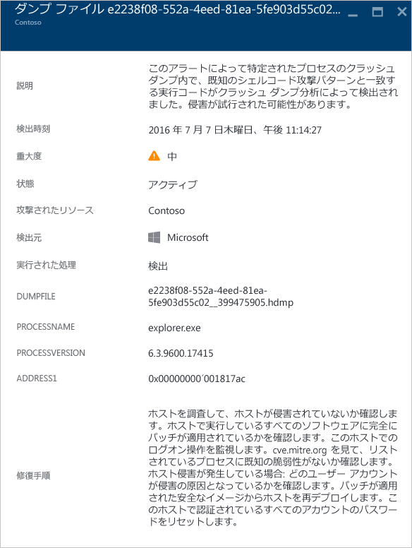
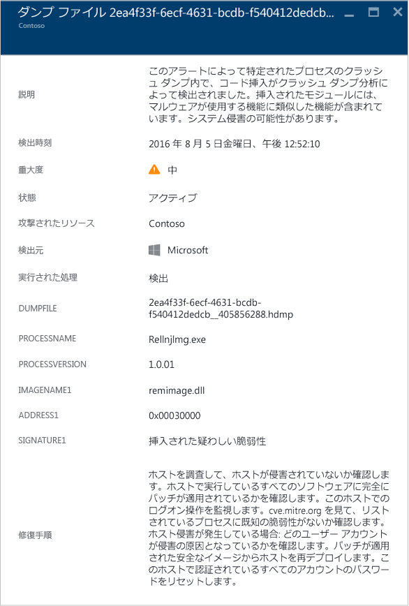
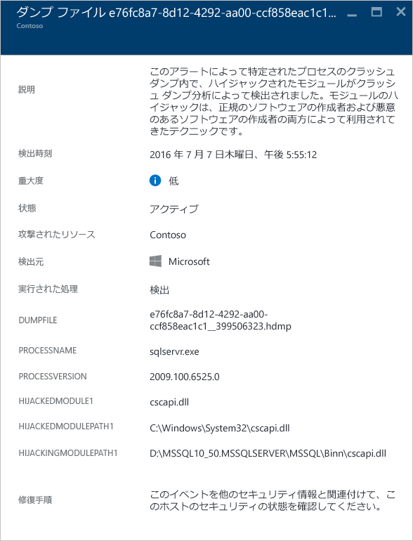
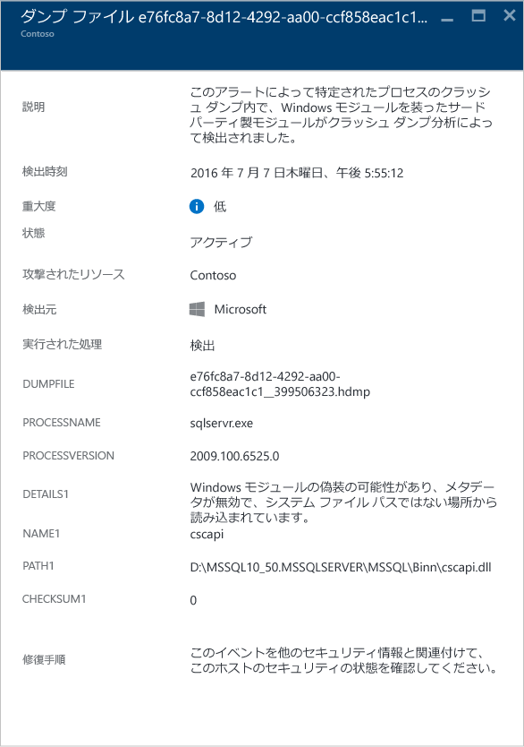
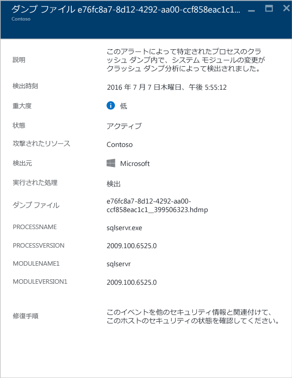

<properties
   pageTitle="Azure セキュリティ センターでのセキュリティの警告の管理と対応 | Microsoft Azure"
   description="このドキュメントは、Azure セキュリティ センターの機能を使用してセキュリティの警告の管理と対応することに役立ちます。"
   services="security-center"
   documentationCenter="na"
   authors="YuriDio"
   manager="swadhwa"
   editor=""/>

<tags
   ms.service="security-center"
   ms.topic="hero-article"
   ms.devlang="na"
   ms.tgt_pltfrm="na"
   ms.workload="na"
   ms.date="08/07/2016"
   ms.author="yurid"/>

# Azure セキュリティ センターでのセキュリティの警告の管理と対応
このドキュメントは、Azure Security Center を使用してセキュリティの警告を管理し、必要な対応を行う際にお役立てください。

## セキュリティの警告とは何か
Security Center は、真の脅威を検出し、偽陽性を減らすために、Azure のリソースやネットワークのほか、接続されているパートナー ソリューション (ファイアウォールやエンドポイント保護ソリューションなど) から、自動的にログ データを収集、分析、統合します。Security Center には、優先順位の付いたセキュリティの警告の一覧が表示されます。また、すぐに問題を調査する必要がある情報や、攻撃を受けたものを修復する方法についての推奨事項も表示されます。また、Azure Security Center は、キル チェーンのパターンに一致するアラートを[インシデント](security-center-incident.md)として集約します。

> [AZURE.NOTE] Security Center の検出機能に関する詳細については、「[Azure Security Center の検出機能](security-center-detection-capabilities.md)」を参照してください。

## セキュリティの警告の管理

現在の警告は、**[セキュリティ アラート]** タイルで確認できます。各警告の詳細については、Azure ポータルを開いて以下の手順に従います。

1. [セキュリティ センター] ダッシュボードに **[セキュリティ アラート]** タイルが表示されます。

    

2.  タイルをクリックすると、次のように、警告についての詳細が示される **[セキュリティ アラート]** ブレードが開きます。

    

このブレードの下部に、各警告の詳細が表示されます。警告を並べ替えるには、並べ替えに使用する列をクリックします。各列の定義を以下に示します。

- **警告**: 警告の短い説明。
- **カウント**: 特定の日に検出された、特定の種類の全警告の一覧。
- **検出元**: 警告をトリガーしたサービス。
- **日付**: イベントが発生した日付。
- **状態**: その警告の現在の状態。ここに表示される状態は 2 種類です。
    - **アクティブ**: セキュリティの警告が検出されました。
    - **破棄済み**: セキュリティの警告はユーザーによって破棄されました。通常、この状態は、調査済みであり、軽減されたか、実際の攻撃とは見なされなかった警告に使用されます。

- **重要度**: 重大度。高、中、低で示します。

### 警告のフィルター処理

日付、状態と重要度に基づいて警告をフィルター処理することができます。警告のフィルター処理は、セキュリティの警告の表示範囲を限定する必要がある場合に便利です。たとえば、システム内の潜在的な違反を調査するために、過去 24 時間以内に発生したセキュリティの警告を確認することができます。

1. **[セキュリティ アラート]** ブレードの **[フィルター]** をクリックします。**[フィルター]** ブレードが開いたら、確認する日付、状態、重要度の値を選択します。

	

2. 	セキュリティの警告の調査後に、警告がご自分の環境に当てはまらない誤検出であることや、特定のリソースで期待される動作であることがわかる場合があります。どの場合でも、セキュリティの警告が当てはまらないと判断した場合、その警告を無視し、ビューから除外することができます。セキュリティの警告を無視するには 2 つの方法があります。警告を右クリックして **[無視]** を選択するか、項目の上にマウスを合わせ、右側に表示されている 3 つの点をクリックして、**[無視]** を選択します。**[フィルター]** をクリックして **[無視]** を選択すると、無視したセキュリティの警告を表示できます。

	

### セキュリティの警告への対応

セキュリティの警告を選択して、警告を発生させたイベントの詳細を確認します。必要に応じて、攻撃を受けたものを修復するために必要な手順を確認します。セキュリティの警告は種類と日付別に分類されています。セキュリティの警告をクリックすると、分類された警告の一覧が示されたブレードが開きます。

この場合、トリガーされた警告が、リモート デスクトップ プロトコル (RDP) の疑わしいアクティビティを参照します。1 列目には、攻撃を受けたリソースが表示されます。2 列目には、リソースが攻撃された回数が表示されます。3 列目には、攻撃の時刻が表示されます。4 列目には、警告の状態が表示されます。5 列目には、攻撃の重大度が表示されます。この情報を確認し、攻撃を受けたリソースをクリックすると、新しいブレードが開きます。

このブレードの **[説明]** フィールドで、このイベントについての詳しい情報を確認できます。詳しい情報を確認することで、セキュリティの警告を引き起こした原因、ターゲット リソース、(場合によっては) 発生元の IP アドレス、解決のための推奨事項を知ることができます。Windows セキュリティ イベント ログによっては IP アドレスが含まれていないため、発生元の IP アドレスは空 (利用不可) である場合もあります。

> [AZURE.NOTE] セキュリティ センターから提案される修復方法は、セキュリティの警告によって変わります。場合によっては、他の Azure 機能を使用して推奨される修復方法を実行する必要があります。このような攻撃に対する修復の例として、[ネットワーク ACL](../virtual-network/virtual-networks-acl.md) または[ネットワーク セキュリティ グループ](../virtual-network/virtual-networks-nsg.md) ルールを使用してこの攻撃の発信元の IP アドレスをブラックリストに指定することが挙げられます。

## 種類別のセキュリティの警告
RDP の疑わしいアクティビティの警告にアクセスするのと同じ手順で、他の種類の警告にもアクセスできます。Security Center の警告として表示される他の警告の例は、次のとおりです。

### SQL インジェクションの可能性
SQL インジェクションとは、後で SQL Server のインスタンスに渡して解析と実行の対象とする文字列に、悪意のあるコードが挿入される攻撃です。SQL ステートメントを構成するすべてのプロシージャにおいて、挿入に対する脆弱性を確認する必要があります。SQL Server は、受け取った有効な構文のクエリをすべて実行してしまうからです。

この警告では、攻撃を受けたリソース、検出の日時、攻撃の状態を特定する情報が表示され、さらに詳しい調査手順へのリンクも表示されます。

### 疑わしい送信トラフィックの検出

ネットワーク デバイスは、他の種類のシステムとほぼ同じように検出、プロファイリングされることがあります。通常、攻撃者は初めにポート スキャンまたはポート スイープを行います。次の例では、VM からの疑わしい SSH トラフィックが存在しており、外部リソースに対する SSH ブルート フォース攻撃またはポート スイープ攻撃が行われている可能性があります。

この警告では、攻撃の開始に使用されたリソース、セキュリティが侵害されたコンピューター、検出の日時、使用されたプロトコルとポートを特定できる情報が表示されます。このブレードでは、問題を軽減するために使用できる修復手順の一覧も表示されます。

### 悪意のあるコンピューターとのネットワーク通信
 
Azure Security Center は、悪意のある IP アドレス (多くの場合、コマンド アンド コントロール センター) と通信している、セキュリティが侵害されたコンピューターを、Microsoft 脅威インテリジェンス フィードを利用して検出できます。この例では、Azure Security Center によって、Pony Loader マルウェア ([Fareit](https://www.microsoft.com/security/portal/threat/encyclopedia/entry.aspx?Name=PWS:Win32/Fareit.AF) とも呼ばれる) を使用した通信が行われたことが検出されました。

この警告では、この攻撃の開始に使用されたリソース、攻撃されたリソース、被害を受けた IP、攻撃者の IP、検出の日時を特定できる情報が表示されます。

> [AZURE.NOTE] ライブ IP アドレスは、プライバシー保護の目的でこのスクリーンショットからは削除しています。

### シェルコードの検出 

シェルコードは、マルウェアがソフトウェアの脆弱性を突破した後に実行されるペイロードです。この警告は、悪質なペイロードに共通した振る舞いをする実行可能コードがクラッシュ ダンプ分析によって検出されたことを意味します。悪意のないソフトウェアによる振る舞いである可能性もありますが、ソフトウェア開発の標準的な慣例からは逸脱しています。

次に示したのは、すべてのクラッシュ ダンプ警告に共通するフィールドです。

- DUMPFILE (ダンプ ファイル): クラッシュ ダンプ ファイルの名前
- PROCESSNAME (プロセス名): クラッシュしているプロセスの名前
- PROCESSVERSION (プロセスのバージョン): クラッシュしているプロセスのバージョン

この警告には、他にも次のフィールドがあります。

- ADDRESS (アドレス): メモリ内におけるシェルコードの場所

このタイプの警告の例を次に示します。

### コード注入の検出

コード注入とは、実行中のプロセスやスレッドに実行可能モジュールを挿入することです。マルウェアがデータにアクセスしたり、身を隠したり、削除を回避 (常駐化) したりする目的で、この手法が使用されます。この警告は、クラッシュ ダンプ分析の結果、注入されたモジュールがクラッシュ ダンプと共に検出されたことを意味します。
 
悪意からではなく、既存のアプリケーションやオペレーティング システムのコンポーネントを修正したり拡張したりするなどの目的で、通常のソフトウェア開発者がコード注入を利用することも皆無ではありません。悪質な注入モジュールとそうでない注入モジュールを判別しやすいよう、Azure Security Center は、注入されたモジュールに疑わしい動作の特徴が見られるかどうかをチェックします。このチェックの結果は、警告の "SIGNATURE (シグネチャ)" フィールドに表示され、警告の重大度、説明、修正手順に反映されます。

前出の「シェルコードの検出」のセクションで取り上げた共通のフィールドに加え、この警告には次のフィールドもあります。

- ADDRESS (アドレス): メモリ内における注入モジュールの場所。
- IMAGENAME (イメージ名): 注入モジュールの名前。イメージ内からイメージ名が得られなかった場合は空欄になります。
- SIGNATURE (シグネチャ): 注入されたモジュールが、疑わしい動作の特徴と一致しているかどうかを示します。表示される値の例とその説明を次の表に示します。

| **シグネチャの値** | **説明** |
|--------------------------------------|-------------------------------------------------------------------------------------------------------------------|
| Suspicious reflective loader exploit (Reflective Loader 悪用の疑い) | 多くの場合、オペレーティング システム ローダーとは別の注入コードの読み込みに関連した不審な動作です。 |
| Suspicious injected exploit (コード注入による悪用の疑い) | 多くの場合、メモリへのコード注入に関連した悪質な意図を表します。 |
| Suspicious injecting exploit (注入コードの悪用の疑い) | 多くの場合、メモリに注入されたコードの使用に関連した悪質な意図を表します。 |
| Suspicious injected debugger exploit (デバッガー エクスプロイト注入の疑い) | 多くの場合、デバッガーの検出または迂回に関連した悪質な意図を表します。 |
| Suspicious injected remote exploit (コード注入によるリモートからの悪用の疑い) | 多くの場合、指令制御 (C2: Command and Control) のシナリオに関連した悪質な意図を表します。 |

このタイプの警告の例を次に示します。

### ハイジャック モジュールの検出

Windows システムの共通の機能をソフトウェアから利用できるようにするために、Windows にはダイナミック リンク ライブラリ (DLL) が使用されています。DLL ハイジャックは、マルウェアが DLL の読み込み順序を改変することによって行われます。このときメモリに悪質なペイロードが読み込まれ、任意のコードを実行できる状態となります。この警告は、2 つの異なるパスから同様の名前のモジュールが読み込まれた (なおかつ読み込み元となったパスのいずれかが Windows システムの共通のバイナリ ファイルの格納場所である) ことをクラッシュ ダンプ分析が検出したことを意味します。

悪意からではなく、インストルメント化や Windows OS の拡張、Windows アプリケーションの拡張といった目的で、通常のソフトウェア開発者が DLL の読み込み順序を変更することも皆無ではありません。DLL 読み込み順序に対する悪意のある変更と、無害である可能性の高い変更とを判別しやすいように、Azure Security Center では、読み込まれているモジュールに疑わしい特徴が見られるかどうかをチェックします。このチェックの結果は、警告の "SIGNATURE (シグネチャ)" フィールドに表示され、警告の重大度、説明、修正手順に反映されます。ハイジャック モジュールが悪質なものであるかどうかについては、ディスク上のハイジャック モジュールのコピーを分析する (たとえばファイルのデジタル署名の検証、ウイルス対策スキャンを実行する) ことで、さらに詳しい情報を得ることができます。

前出の「シェルコードの検出」のセクションで取り上げた共通のフィールドに加え、この警告には次のフィールドがあります。

- SIGNATURE (シグネチャ): ハイジャック モジュールが、疑わしい動作の特徴と一致しているかどうかを示します。
- HIJACKEDMODULE (ハイジャックされたモジュール): ハイジャックされた Windows システム モジュールの名前。
- HIJACKEDMODULEPATH (ハイジャックされたモジュールのパス): ハイジャックされた Windows システム モジュールのパス。
- HIJACKINGMODULEPATH (ハイジャック モジュールのパス): ハイジャック モジュールのパス。

このタイプの警告の例を次に示します。

### Windows モジュールのなりすましの検出

マルウェアには、Windows システムに共通するバイナリ名 (SVCHOST.EXE など) やモジュール名 (NTDLL.DLL など) が使用されている場合があります。悪質なソフトウェアを "紛れ込ませる" ことで、その正体をシステム管理者に見破られないようにするためです。この警告は、Windows システムのモジュール名と同じ名前のモジュールがクラッシュ ダンプ ファイルに含まれているものの、それ以外の点は一般的な Windows モジュールの基準をそのモジュールは満たしていないことが、クラッシュ ダンプ分析によって検出されたことを意味します。そのモジュールが悪質なものであるかどうかについては、ディスク上のなりすましモジュールのコピーを分析することによって、さらに詳しい情報を得ることができます。実行される分析の例を次に示します。

- 問題になっているファイルが正規ソフトウェア パッケージの一部として出荷されていること確認する
- ファイルのデジタル署名を確認する
- ファイルに対してウイルス対策スキャンを実行する

前出の「シェルコードの検出」のセクションで取り上げた共通のフィールドに加え、この警告には次のフィールドもあります。

- DETAILS (詳細): モジュールのメタデータが有効であるかどうかと、モジュールがシステム パスから読み込まれたかどうかを表します。
- NAME (名前): Windows のモジュールになりすましているモジュールの名前。
- PATH (パス): Windows のモジュールになりすましているモジュールのパス。

また、この警告にはモジュールの PE ヘッダーから特定のフィールド ("CHECKSUM"、"TIMESTAMP" など) が抽出されて表示されます。これらのフィールドは、モジュールに存在する場合にのみ表示されます。これらのフィールドの詳細については、「[Microsoft PE and COFF 仕様](https://msdn.microsoft.com/windows/hardware/gg463119.aspx)」を参照してください。

このタイプの警告の例を次に示します。

### システム バイナリの改変を検出 

マルウェアは、侵入したシステム上でこっそりデータにアクセスしたり人目に付かないよう常駐したりするために、主要なシステム バイナリを改変する場合があります。この警告は、Windows OS の主要なバイナリがメモリ内またはディスク上で改変されたことがクラッシュ ダンプ分析によって検出されたことを意味します。

悪意からではなく、迂回やアプリケーションの互換性といった目的で、通常のソフトウェア開発者がメモリ内のシステム モジュールに変更を加えることも皆無ではありません。悪質なモジュールとそうでないモジュールを判別しやすいよう、Azure Security Center は、改変されたモジュールに疑わしい特徴が見られるかどうかをチェックします。このチェックの結果は、警告の重大度、説明、修正手順に反映されます。

前出の「シェルコードの検出」のセクションで取り上げた共通のフィールドに加え、この警告には次のフィールドもあります。

- MODULENAME (モジュール名): 改変されたシステム バイナリの名前。
- MODULEVERSION (モジュールのバージョン): 改変されたシステム バイナリのバージョン。

このタイプの警告の例を次に示します。

## 関連項目

このドキュメントでは、セキュリティ センターでのセキュリティ ポリシーの構成方法について説明しました。セキュリティ センターの詳細については、次を参照してください。

- [Azure Security Center でのセキュリティ インシデントの処理](security-center-incident.md)
- [Azure Security Center の検出機能](security-center-detection-capabilities.md)
- [Azure Security Center 計画および運用ガイド](security-center-planning-and-operations-guide.md)
- 「[Azure Security Center のよく寄せられる質問 (FAQ)](security-center-faq.md)」 -- このサービスの使用に関してよく寄せられる質問が記載されています。
- [Azure セキュリティ ブログ](http://blogs.msdn.com/b/azuresecurity/) -- Azure のセキュリティとコンプライアンスについてのブログ記事を確認できます。

<!---HONumber=AcomDC_0810_2016-->