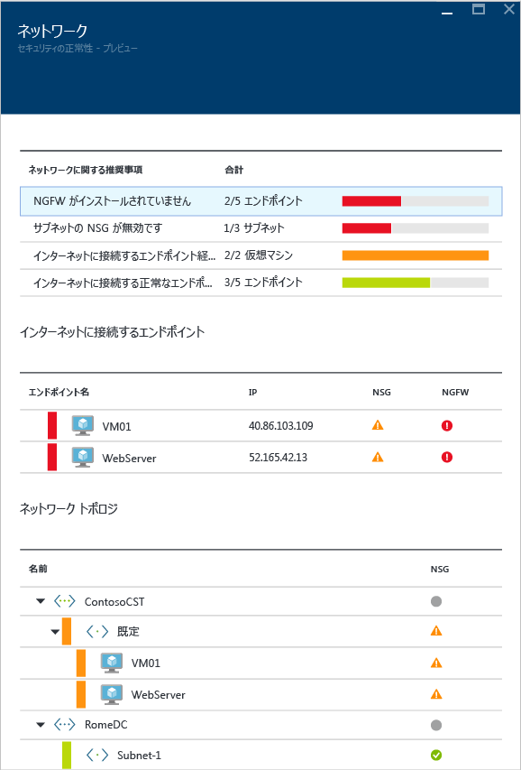
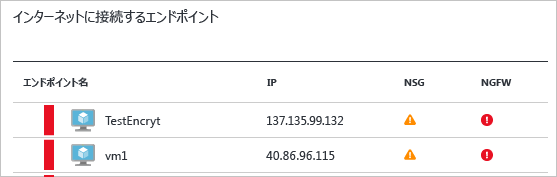
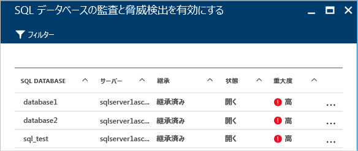
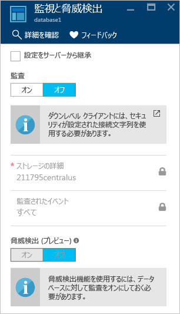

# Azure セキュリティ センターでのセキュリティ ヘルスの監視
この記事は、Azure Security Center で監視機能を使用してポリシーに対するコンプライアンスを監視するうえで役立ちます。

## セキュリティのヘルスの監視とは
私たちは監視について、状況に対処できるように、イベントが発生するのを監視して待機することだと考えがちです。 セキュリティの監視は、組織の標準やベスト プラクティスを満たしていないシステムを識別するために、リソースを監査するプロアクティブな戦略を持つことを意味します。

## セキュリティ ヘルスの監視
サブスクリプションのリソースに対して[セキュリティ ポリシー](security-center-policies.md)を有効にすると、Security Center は、リソースのセキュリティを分析して潜在的な脆弱性を特定します。 ネットワークの構成に関する情報は、すぐに利用可能になります。 VM とコンピューターの構成に関する情報 (セキュリティ更新プログラムの状態、オペレーティング システムの構成など) については、エージェントがインストールされている VM とコンピューターの台数によっては、収集して利用可能になるまでに 1 時間以上かかる場合があります。 リソースのセキュリティの状態は、**[Prevention]\(防止\)** セクションに表示されます。問題がある場合には、同じブレードで問題も確認できます。 これらの問題の一覧は、**[Recommendations]\(推奨事項\)** タイルでも確認できます。

推奨事項の適用方法の詳細については、「[Azure Security Center でのセキュリティに関する推奨事項の管理](security-center-recommendations.md)」を参照してください。

**[リソース正常性の監視]** では、リソースのセキュリティの状態を監視できます。 以下の例のように、各リソースのタイル (計算とアプリ、ネットワーク、データのセキュリティ、ID およびアクセス) で、特定された問題の総数を確認できます。

![[Resources security health (リソース セキュリティの正常性)] タイル](./media/security-center-monitoring/security-center-monitoring-fig1-newUI-2017.png)

### 計算とアプリの監視
詳細については、「[Protecting your machines and applications in Azure Security Center (Azure Security Center でのマシンとアプリケーションの保護)](security-center-virtual-machine-recommendations.md)」を参照してください。

### 仮想ネットワークの監視
**[ネットワーク]** タイルをクリックすると、**[ネットワーク]** ブレードが開き、以下のスクリーンショットに示すような詳細が表示されます。

#### ネットワークの推奨事項
仮想マシンのリソースの正常性情報と同様に、ここには、上部に問題をまとめた一覧、下部に監視対象のネットワークの一覧が表示されます。

ネットワーク状態の内訳のセクションには、潜在的なセキュリティの問題と [推奨事項](security-center-network-recommendations.md)の一覧が表示されます。 次のような問題が発生する可能性があります。

* 次世代ファイアウォール (NGFW) がインストールされていない
* サブネットでネットワーク セキュリティ グループが有効になっていない
* 仮想マシンでネットワーク セキュリティ グループが有効になっていない
* パブリックの外部エンドポイントを通じた外部アクセスが制限される
* インターネット接続エンドポイントが正常である

推奨事項をクリックすると、推奨事項の詳細を確認できます。以下に例を示します。

![[ネットワーク] に表示される推奨事項の詳細](./media/security-center-monitoring/security-center-monitoring-fig9-ga.png)

この例では、**[サブネット用の欠けているネットワーク セキュリティ グループを構成する]** に、ネットワーク セキュリティ グループの保護が存在しないサブネットと仮想マシンの一覧が表示されています。 ネットワーク セキュリティ グループを適用するサブネットをクリックすると、**[ネットワーク セキュリティ グループの選択]** が表示されます。 ここでは、サブネットに最適なネットワーク セキュリティ グループを選択したり、新しいネットワーク セキュリティ グループを作成したりできます。

#### [Internet facing endpoints (インターネット接続エンドポイント)] セクション
**[インターネットに接続するエンドポイント]** セクションでは、インターネット接続エンドポイントで現在構成されている仮想マシンとその現在の状態を確認できます。

この表には、仮想マシンを表すエンドポイント名、インターネット接続 IP アドレス、ネットワーク セキュリティ グループと NGFW の現在の重大度ステータスが示されています。 この表は、項目が以下の重大度に従って並んでいます。

* 赤 (最上位): 優先度が高く、直ちに対処する必要があります
* オレンジ: 優先度は中程度で、できるだけ早く対処する必要があります
* 緑 (最下位): 正常な状態です

#### [Networking topology (ネットワーク トポロジ)] セクション
**[ネットワーク トポロジ]** セクションには、以下のスクリーンショットのように、リソースが階層として表示されます。

![[ネットワーク トポロジ] セクション内のリソースの階層表示](./media/security-center-monitoring/security-center-monitoring-fig121-new4.png)

このテーブルは、項目 (仮想マシンとサブネット) が以下の重大度に従って順に並んでいます。

* 赤 (最上位): 優先度が高く、直ちに対処する必要があります
* オレンジ: 優先度は中程度で、できるだけ早く対処する必要があります
* 緑 (最下位): 正常な状態です

このトポロジ ビューでは、最初のレベルに[仮想ネットワーク](../virtual-network/virtual-networks-overview.md)、[仮想ネットワーク ゲートウェイ](../vpn-gateway/vpn-gateway-howto-site-to-site-classic-portal.md)、[仮想ネットワーク (クラシック)](../virtual-network/virtual-networks-create-vnet-classic-pportal.md) が表示されます。 2 番目のレベルにはサブネット、3 番目のレベルにはそれらのサブネットに属している仮想マシンが置かれます。 右側の列には、これらのリソースのネットワーク セキュリティ グループの現在の状態が表示されます。以下に例を示します。

![[ネットワーク トポロジ] セクションに表示されるネットワーク セキュリティ グループの状態](./media/security-center-monitoring/security-center-monitoring-fig12-ga.png)

このブレードの下部には、この仮想マシンに対する推奨事項が表示されます。推奨事項の内容は、前に説明したものとほぼ同じです。 ここでは、推奨事項をクリックして詳細を確認したり、必要なセキュリティ制御または構成を適用したりできます。

### データのセキュリティの監視

**[防止]** セクションの **[データのセキュリティ]** をクリックすると、**[データ リソース]** が開き、SQL とストレージの推奨事項が表示されます。 また、データベースの全般的な正常性状態に関する [推奨事項](security-center-sql-service-recommendations.md) も示されます。 ストレージの暗号化の詳細については、「[Enable encryption for Azure storage account in Azure Security Center (Azure Security Center における Azure ストレージ アカウントの暗号化の有効化)](security-center-enable-encryption-for-storage-account.md)」を参照してください。

**[SQL Recommendations (SQL の推奨事項)]** で任意の推奨事項をクリックすると、問題解決のためのアクションの詳細を確認できます。 次の例では、**[Database Auditing & Threat detection on SQL databases (データベースの監査と SQL Database の脅威の検出)]** という推奨事項を展開した状態を示しています。

**[SQL データベースの監査と脅威検出を有効にする]** には、次の情報が表示されます。

* SQL データベースの一覧
* SQL データベースが配置されているサーバー
* この設定がサーバーから継承されたものか、このデータベースに固有の設定かに関する情報
* 現在の状態
* 問題の重大度

この推奨事項に対処するためにデータベースをクリックすると、以下に示す **[監査と脅威検出]** が開きます。

監査を有効にするには、**[監査]** オプションの **[オン]** を選択します。

### ID およびアクセスの監視

詳細については、[Azure Security Center での ID とアクセスの監視](security-center-identity-access.md)に関するページを参照してください。

## 関連項目
この記事では、Azure Security Center での監視機能の使用方法について説明しました。 Azure セキュリティ センターの詳細については、次を参照してください。

* 「[Azure Security Center でのセキュリティ ポリシーの設定](security-center-policies.md)」: Azure Security Center でセキュリティ設定を構成する方法について説明します。
* 「[Azure Security Center でのセキュリティの警告の管理と対応](security-center-managing-and-responding-alerts.md)」: セキュリティの警告の管理と対応の方法について説明しています。
* 「[Azure Security Center を使用したパートナー ソリューションの監視](security-center-partner-solutions.md)」: パートナー ソリューションの正常性状態を監視する方法について説明しています。
* 「[Azure Security Center のよく寄せられる質問 (FAQ)](security-center-faq.md)」: このサービスの使用に関してよく寄せられる質問が記載されています。
* [Azure セキュリティ ブログ](http://blogs.msdn.com/b/azuresecurity/): Azure のセキュリティとコンプライアンスについてのブログ記事を確認できます。
