<properties
   pageTitle="Azure セキュリティ センターでのセキュリティ ヘルスの監視 | Microsoft Azure"
   description="このドキュメントは、Azure セキュリティ センターでの監視機能の使用を開始する際に役立ちます。"
   services="security-center"
   documentationCenter="na"
   authors="YuriDio"
   manager="swadhwa"
   editor=""/>

<tags
   ms.service="security-center"
   ms.devlang="na"
   ms.topic="hero-article"
   ms.tgt_pltfrm="na"
   ms.workload="na"
   ms.date="09/22/2016"
   ms.author="yurid"/>

#Azure セキュリティ センターでのセキュリティ ヘルスの監視
このドキュメントは、Azure セキュリティ センターで監視機能を使用してポリシーのコンプライアンスを監視するために役立ちます。

##セキュリティのヘルスの監視とは
私たちは監視について、状況に対処できるように、イベントが発生するのを監視して待機することだと考えがちです。セキュリティの監視は、組織の標準やベスト プラクティスを満たしていないシステムを識別するために、リソースを監査するプロアクティブな戦略を持つことを意味します。

##セキュリティ ヘルスの監視
サブスクリプションのリソースに対して[セキュリティ ポリシー](security-center-policies.md)を有効にすると、Security Center は、リソースのセキュリティを分析して潜在的な脆弱性を特定します。ネットワーク構成に関する情報はすぐに利用可能になりますが、セキュリティ更新プログラムの状態や OS の構成などの仮想マシンの構成に関する情報は、利用可能になるまで 1 時間以上かかる場合があります。**[リソース セキュリティの正常性]** ブレードで、リソースのセキュリティの状態と、問題がある場合はその問題を確認することができます。これらの問題の一覧は、**[推奨事項]** ブレードでも確認できます。

推奨事項の適用方法の詳細については、「[Azure セキュリティ センターでのセキュリティに関する推奨事項の実装](security-center-recommendations.md)」を参照してください。

**[リソース セキュリティの正常性]** タイルで、リソースのセキュリティの状態を監視することができます。次の例では、注意を必要とする、重大度が高レベルと中レベルの問題を多数確認できます。有効になっているセキュリティ ポリシーが、監視されているコントロールのタイプに影響します。

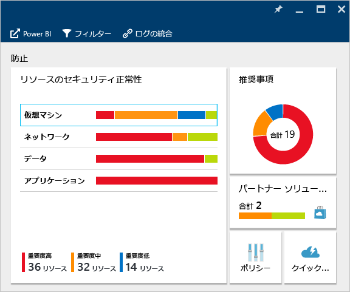

セキュリティ更新プログラムが適用されていない VM や[ネットワーク セキュリティ グループ](../virtual-network/virtual-networks-nsg.md)がないサブネットなど、対処する必要がある脆弱性が Security Center によって特定された場合、ここに表示されます。

###仮想マシンの監視
**[リソース セキュリティの正常性]** タイルで **[仮想マシン]** をクリックすると、**[仮想マシン]** ブレードが開き、次のように、利用開始手順と防止手順の詳細に加え、Security Center で監視されるすべての VM の一覧が表示されます。

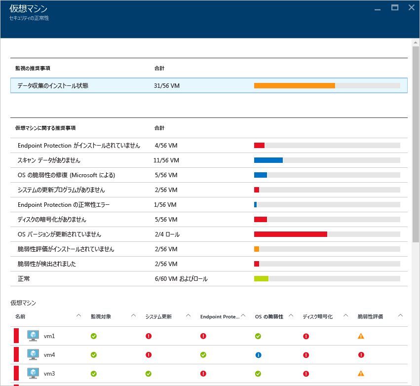

- 利用開始手順
- 仮想マシンの推奨事項
- 仮想マシン

各セクションでは、個別のオプションを選択して、その問題に対処するために推奨される手順に関する詳細を表示できます。次に、これらのセクションについて詳しく説明します。

#### 監視に関する推奨事項
このセクションには、データ収集用に初期化された VM の総数と、その現在の状態が表示されます。すべての VM のデータ収集が初期化されると、セキュリティ センターのセキュリティ ポリシーを受信する準備が完了します。このエントリをクリックすると、**[Data collection installation status (データ収集のインストール状態)]** ブレードが開き、VM の名前のほか、**[インストールの状態]** 列でデータ収集の現在の状態を確認できます。

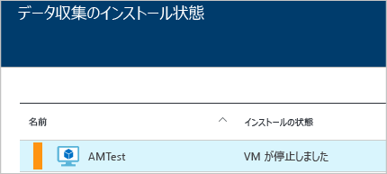

####仮想マシンの推奨事項
このセクションには、Azure Security Center で監視されている[各 VM についての推奨事項](security-center-virtual-machine-recommendations.md)が表示されます。次のように、最初の列には推奨事項、2 番目の列にはその推奨事項の影響を受ける VM の総数、3 番目の列には問題の重大度が表示されます。

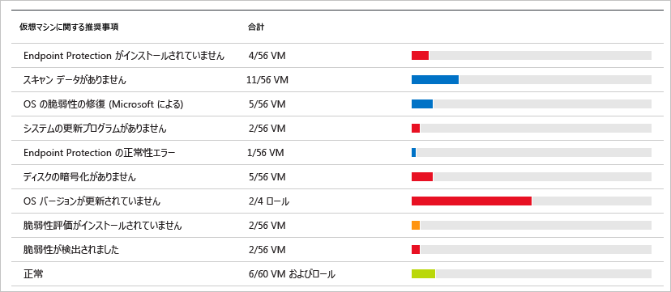

> [AZURE.NOTE] ネットワーク トポロジの一覧の [Networking Health (ネットワークの正常性)] ブレードに表示されるのは、少なくとも 1 つのパブリック エンドポイントを持つ VM だけです。

各推奨事項にはいくつかのアクションが示されており、アクションはクリックして実行できます。たとえば、**[不足しているシステムの更新]** をクリックすると、**[不足しているシステムの更新]** ブレードが開きます。ここには、次のように、修正プログラムが不足している VM と、不足している更新プログラムの重要度が表示されます。

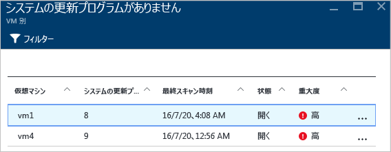

**[不足しているシステムの更新]** ブレードには、次の情報が表形式で表示されます。

- **[仮想マシン]**: 更新プログラムが不足している仮想マシンの名前。
- **[システムの更新プログラム]**: 不足しているシステム更新プログラムの件数。
- **[最終スキャン時刻]**: セキュリティ センターで VM の更新プログラムが最後にスキャンされた時刻。
- **[状態]**: 推奨事項の現在の状態。
	- **[オープン]**: 推奨事項への対処がまだ行われていない。
	- **[処理中]**: 推奨事項は現在、これらのリソースに適用されているため、ユーザーのアクションは不要。
	- **[解決済み]**: 推奨事項が既に完了済み (問題が解決されると、エントリは淡色表示になる)。
- **[重要度]**: 特定の推奨事項の重要度を示します。
	- **[高]**: 重要なリソース (アプリケーション、VM、ネットワーク セキュリティ グループ) に脆弱性が存在しており、注意が必要。
	- **[中]**: プロセスを完了または脆弱性を排除するために重大ではないまたは追加の手順が必要。
	- **[低]**: 対処する必要はあるが直ちに注意する必要はない脆弱性が存在する (既定では、重要度の低い推奨事項は表示されないが、重要度の低い推奨事項にフィルターを適用すると表示できる)。

推奨事項の詳細を表示するには、VM の名前をクリックします。次のように、その VM の新しいブレードが開き、更新プログラムの一覧が表示されます。

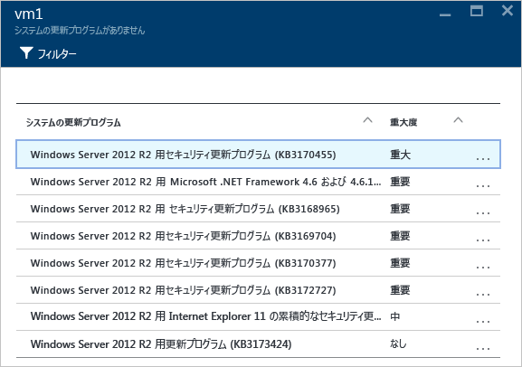

> [AZURE.NOTE] ここのセキュリティの推奨事項は、[推奨事項] ブレードに表示されているものと同じです。解決の推奨事項の詳細については、「[Azure セキュリティ センターでのセキュリティに関する推奨事項の実装](security-center-recommendations.md)」を参照してください。これは VM だけでなく、[リソース ヘルス] タイルで利用できるすべてのリソースに適用できます。

####[仮想マシン] セクション
[仮想マシン] セクションには、すべての VM と推奨事項の概要が表示されます。各列は、次のように推奨事項の 1 つのセットを表します。

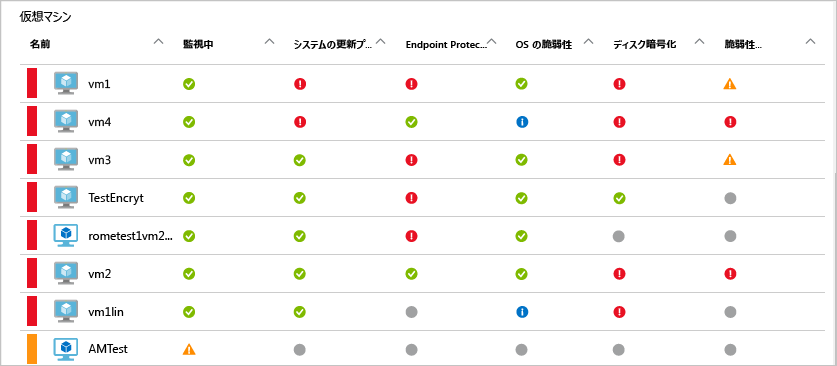

各推奨事項の下に表示されるアイコンにより、どの VM の、どのような種類の推奨事項に注意する必要があるかをすばやく特定できます。

前に示した例では、1 つの VM にエンドポイント保護に関する重要な推奨事項があります。VM の詳細情報を表示するには、その VM をクリックします。次に示すように、この VM を表す新しいブレードが開きます。

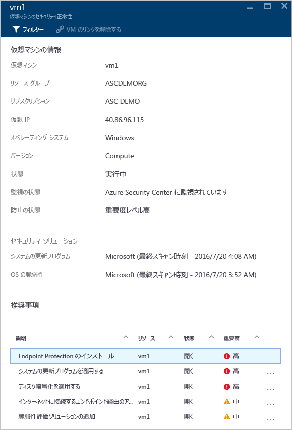

このブレードには VM のセキュリティに関する詳細情報が表示されます。このブレードの下部には、推奨されるアクションと、各問題の重大度が表示されます。

#### [Cloud services (Preview) (クラウド サービス (プレビュー))] セクション
仮想マシンのセキュリティ ヘルスのタイルでは、クラウド サービスの正常性状態が表示されます。OS のバージョンが最新でないときは、次の図のとおり、推奨事項の一覧が作成されます。

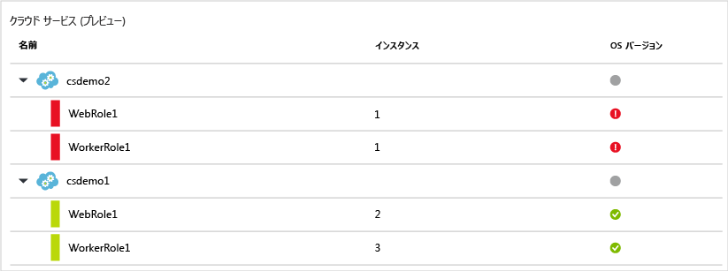

推奨事項内の手順に従って、OS のバージョンを更新する必要があります。たとえば、いずれかの Web ロールの赤いアラートをクリックした場合 (IIS に自動的にデプロイされた Web アプリで Windows Server が実行されます)、または worker ロールをクリックした場合 (IIS に自動的にデプロイされた Web アプリで Windows Server が実行されます)、新しいブレードが開き、次のような推奨事項に関する詳細が表示されます。

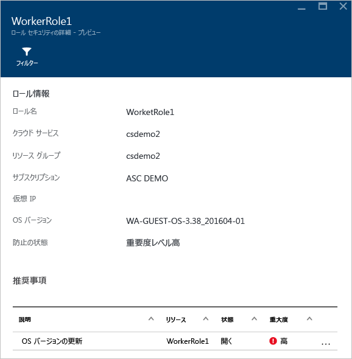

この推奨事項に関するより規範的な説明については、**[説明]** 列の **[Update OS version (OS のバージョンの更新)]** をクリックしてください。**[Update OS version (Preview) (OS のバージョンの更新 (プレビュー))]** ブレードが開き、詳細が表示されます。

### 仮想ネットワークの監視
**[Resources security health (リソースのセキュリティ ヘルス)]** タイルで **[ネットワーク]** をクリックすると、**[ネットワーク]** ブレードが開き、次のような詳細が表示されます。

####ネットワークの推奨事項

仮想マシンのリソースのヘルス情報と同様に、このブレードでは、上部に問題をまとめた一覧、下部に監視対象のネットワークの一覧が表示されます。

ネットワーク状態の内訳のセクションには、潜在的なセキュリティの問題と[推奨事項](security-center-network-recommendations.md)の一覧が表示されます。次のような問題が発生する可能性があります。

- 次世代ファイアウォール (NGFW) がインストールされていない
- サブネット上のネットワーク セキュリティ グループ (NSG) が有効になっていない
- VM 上の NSG が有効になっていない
- パブリックの外部エンドポイントを通じた外部アクセスが制限される
- インターネット接続エンドポイントが正常である

これらの推奨事項のいずれかをクリックすると、次の例に示すように、新しいブレードが開き、推奨事項に関する詳細が表示されます。

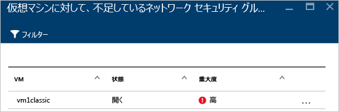

この例では、**[サブネット用の欠けているネットワーク セキュリティ グループを構成する]** ブレードには NSG 保護が欠落しているサブネットと仮想マシンの一覧が表示されています。NSG を適用するサブネットをクリックすると、別のブレードが開きます。

**[ネットワーク セキュリティ グループの選択]** ブレードでは、サブネットに最適なネットワーク セキュリティ グループを選択するか、新しいネットワーク セキュリティ グループを作成できます。

####[Internet facing endpoints (インターネット接続エンドポイント)] セクション

**[Internet facing endpoints (インターネット接続エンドポイント)]** セクションでは、インターネット接続エンドポイントで現在構成されている VM とその現在の状態を確認できます。

この表には、VM を表すエンドポイント名、インターネット接続 IP アドレス、NSG と NGFW の現在の重要度ステータスが示されています。この表は、次に示す重要度によって並べ替えられています。
- 赤 (最上位): 優先度が高く、直ちに対処する必要があります
- オレンジ: 優先度は中位で、できるだけ早く対処する必要があります
- 緑 (最下位): 正常な状態です

####[Networking topology (ネットワーク トポロジ)] セクション

**[Networking topology (ネットワーク トポロジ)]** セクションには、次のようにリソースが階層として表示されます。

このテーブルでは、次に示す重要度によって VM とサブネットが並べ替えられています。
- 赤 (最上位): 優先度が高く、直ちに対処する必要があります
- オレンジ: 優先度は中位で、できるだけ早く対処する必要があります
- 緑 (最下位): 正常な状態です

このトポロジ ビューでは、最初のレベルに[仮想ネットワーク](../virtual-network/virtual-networks-overview.md)、[仮想ネットワーク ゲートウェイ](../vpn-gateway/vpn-gateway-site-to-site-create.md)、[仮想ネットワーク (クラシック)](../virtual-network/virtual-networks-create-vnet-classic-pportal.md) が含まれます。2 番目のレベルにはサブネット、3 番目のレベルにはそれらのサブネットに属している VM が含まれます。次の例に示すように、右側の列には、これらのリソースのネットワーク セキュリティ グループ (NSG) の現在の状態が表示されます。

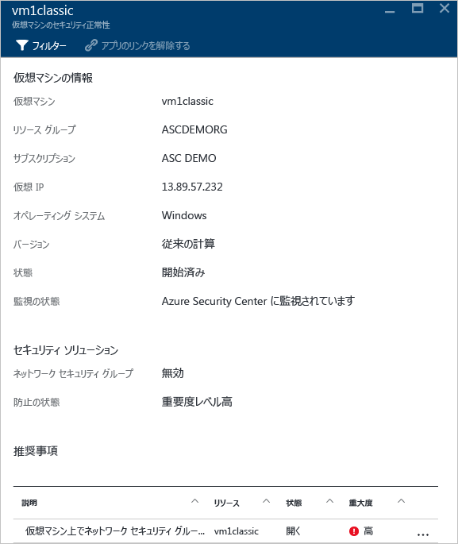

このブレードの下部には、上記の推奨事項に似た、この VM に対する推奨事項が表示されます。推奨事項をクリックして詳細を確認するか、必要なセキュリティ制御/構成を適用することができます。

###データの監視
**[リソース セキュリティの正常性]** タイルの **[データ]** をクリックすると、**[SQL]** ブレードが開き、監査や透過的なデータ暗号化が有効でないなどの問題に関する推奨事項が示されます。また、データベースの全般的な正常性状態に関する[推奨事項](security-center-sql-service-recommendations.md)も示されます。

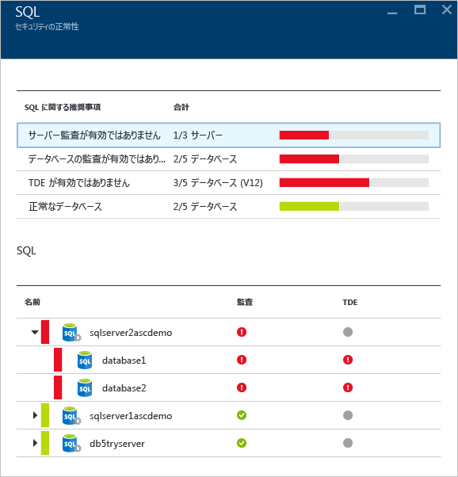

これらの推奨事項のいずれかをクリックすると、問題を解決するためのさらなるアクションに関する詳細を表示することができます。次の例では、**[データベースの監査が有効ではありません]** という推奨事項を展開した状態が示されています。

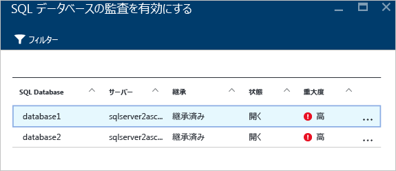

**[SQL データベースの監査を有効にする]** ブレードには、次の情報が表示されます。

- SQL データベースの一覧
- SQL データベースが配置されているサーバー
- この設定がサーバーから継承されたものか、このデータベースに固有の設定かに関する情報
- 現在の状態
- 問題の重大度

この推奨事項に対処するためにデータベースをクリックすると、次に示すような **[監査と脅威検出]** ブレードが開きます。

監査を有効にするには、**[監査]** オプションの **[オン]** を選択します。

### アプリケーションの監視

Azure ワークロードに、[Resource Manager の VM](../resource-manager-deployment-model.md) 内に配置されたアプリケーションがあり、Web ポート (TCP ポート 80 および 443) が公開されている場合、Security Center ではこれらを監視して、潜在的なセキュリティ問題を特定し、修復手順を推奨することができます。**[アプリケーション]** タイル内をクリックすると、**[アプリケーション]** ブレードが開き、防止手順のセクションに一連の推奨事項が示されます。さらに、次のように、ホスト/仮想 IP ごとのアプリケーションの内訳も示されます。

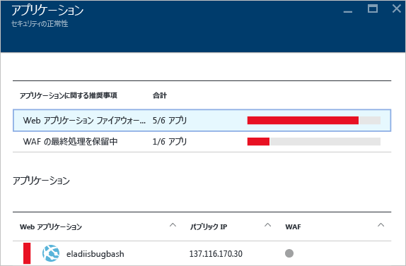

他の推奨事項の場合と同様に、推奨事項をクリックすると、問題と修復方法の詳細を確認できます。次の図に示す例は、セキュリティで保護されていない Web アプリケーションとして識別されたアプリケーションです。安全でないと見なされたアプリケーションを選択すると、使用可能なオプションが示された別のブレードが開きます。

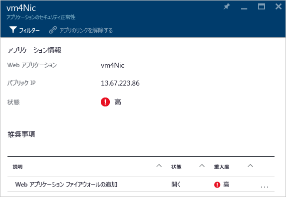

このブレードには、このアプリケーションのすべての推奨事項が一覧表示されます。**[Web アプリケーション ファイアウォールの追加]** をクリックすると、**[Web アプリケーション ファイアウォールを追加する]** ブレードが開き、次に示すように、サード パーティの WAF (Web アプリケーション ファイアウォール) をインストールするためのオプションが表示されます。

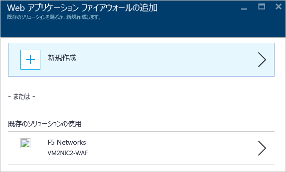

## 関連項目
このドキュメントでは、Azure セキュリティ センターでの監視機能の使用方法について説明しました。Azure セキュリティ センターの詳細については、次を参照してください。

- 「[Azure Security Center でのセキュリティ ポリシーの設定](security-center-policies.md)」 -- Azure Security Center でセキュリティ設定を構成する方法について説明します。
- 「[Azure Security Center でのセキュリティの警告の管理と対応](security-center-managing-and-responding-alerts.md)」 -- セキュリティの警告の管理と対応の方法について説明しています。
- 「[Azure Security Center を使用したパートナー ソリューションの監視](security-center-partner-solutions.md)」 -- パートナー ソリューションの正常性状態を監視する方法について説明しています。
- 「[Azure Security Center のよく寄せられる質問 (FAQ)](security-center-faq.md)」 -- このサービスの使用に関してよく寄せられる質問が記載されています。
- [Azure セキュリティ ブログ](http://blogs.msdn.com/b/azuresecurity/) -- Azure のセキュリティとコンプライアンスについてのブログ記事を確認できます。

<!---HONumber=AcomDC_0928_2016-->