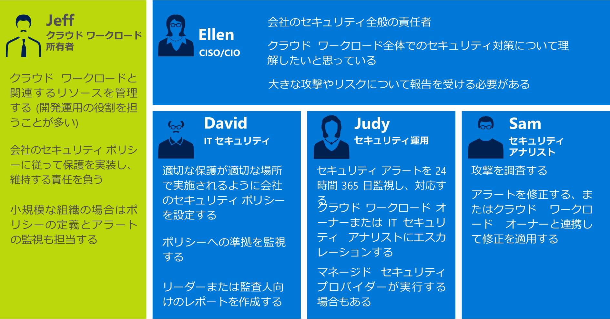
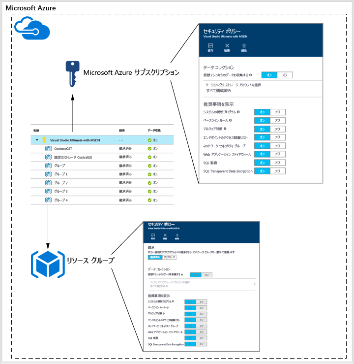
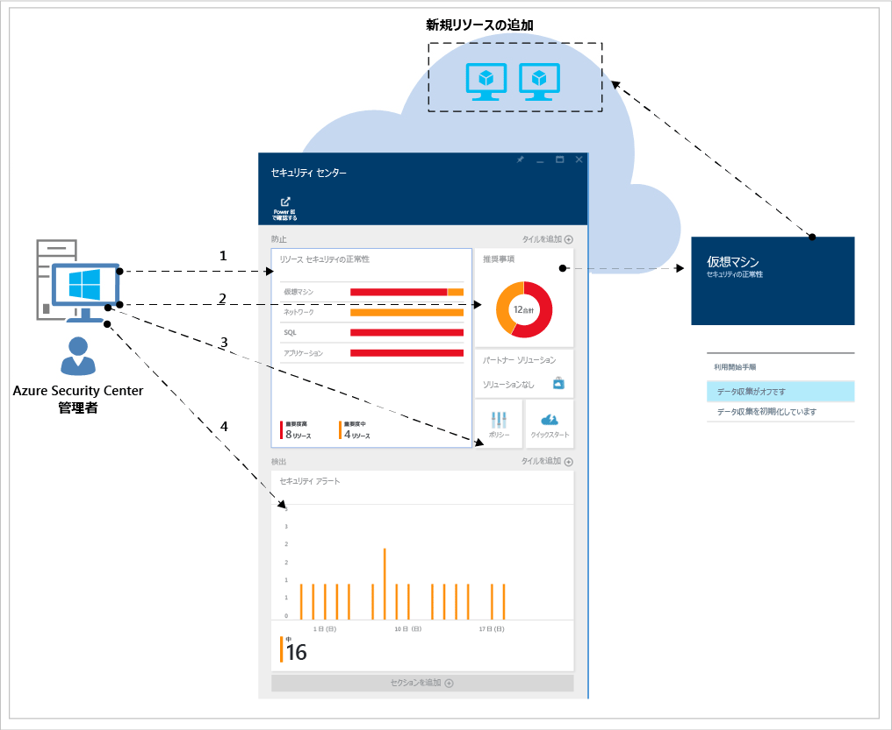
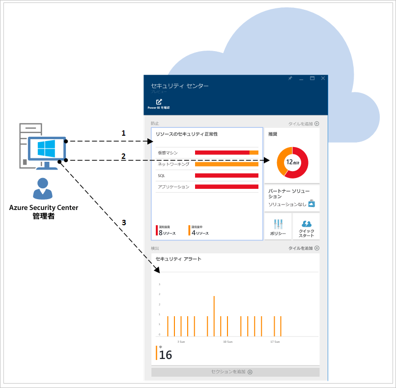

<properties
   pageTitle="Security Center 計画および運用ガイド | Microsoft Azure"
   description="このドキュメントを利用して、Azure Security Center と日常的な運用に関する考慮事項の採用前に計画を立てることができます。"
   services="security-center"
   documentationCenter="na"
   authors="YuriDio"
   manager="swadhwa"
   editor=""/>

<tags
   ms.service="security-center"
   ms.topic="hero-article"
   ms.devlang="na"
   ms.tgt_pltfrm="na"
   ms.workload="na"
   ms.date="09/22/2016"
   ms.author="yurid"/>

# Azure Security Center 計画および運用ガイド
このガイドは、所属組織が Azure Security Center の使用を計画している情報技術 (IT) プロフェッショナル、IT アーキテクト、情報セキュリティ アナリスト、クラウド管理者を対象としています。

## 計画ガイド
このガイドでは、組織のセキュリティ要件とクラウド管理モデルに応じて Security Center の利用を最適化できる、一連の手順とタスクについて説明します。Security Center を最大限に活用するには、安全な開発と運用、監視、ガバナンス、インシデント対応のニーズを満たすために、組織内のさまざまな個人やチームがこのサービスをどのように使用するのかを把握することが重要です。Security Center の使用を計画するうえで考慮が必要となる主な領域は次のとおりです。

- セキュリティ ロールとアクセス制御
- セキュリティ ポリシーと推奨事項
- データの収集と保存
- 継続的なセキュリティの監視
- インシデント対応

次のセクションでは、これらの領域のそれぞれについて計画し、自社の要件に合わせて推奨事項を適用する方法について説明します。

> [AZURE.NOTE] 「[Azure Security Center のよく寄せられる質問 (FAQ)](security-center-faq.md)」に、設計と計画のフェーズにも役立つ一般的な質問の一覧が記載されています。

## セキュリティ ロールとアクセス制御
組織の規模と構造によっては、複数の個人やチームが Security Center を使用して、セキュリティ関連のさまざまなタスクを実行する場合があります。次の図には、架空の人物のほか、それぞれの役割とセキュリティ責任が例として挙げられています。

Security Center を使用すると、上記のようなさまざまな責任を果たすことができます。次に例を示します。

**Jeff (クラウド ワークロード所有者)**

- クラウド ワークロードとその関連リソースを管理する
- 会社のセキュリティ ポリシーに従って保護を実装、管理する責任を負う

**Ellen (CISO/CIO)**

- 会社のセキュリティに関して全面的な責任を負う
- クラウド ワークロード全般について会社のセキュリティ体制を把握したいと考えている
- 主な攻撃とリスクを把握している必要がある

**David (IT セキュリティ担当者)**

- 適切な保護が実施されるように、会社のセキュリティ ポリシーを設定する
- ポリシーを使用してコンプライアンスを監視する
- リーダーまたは監査担当者向けのレポートを作成する

**Judy (セキュリティ運用担当者)**

- 24 時間 365 日監視を行い、セキュリティ アラートに対応する
- クラウド ワークロード所有者または IT セキュリティ アナリストに報告を行う

**Sam (セキュリティ アナリスト)**

- 攻撃を調査する
- 自分でアラートを修復するか、クラウド ワークロード所有者と連携して修復を実施する

Security Center では[ロールベースのアクセス制御 (RBAC)](../active-directory/role-based-access-control-configure.md) が使用されています。RBAC が提供する[組み込みのロール](../active-directory/role-based-access-built-in-roles.md)は、Azure でユーザー、グループ、サービスに割り当てることができます。ユーザーが Security Center を開くと、アクセス権のあるリソースに関する情報のみが表示されます。これは、サブスクリプションまたはリソースが属するリソース グループについて、所有者、共同作業者、閲覧者のいずれかのロールがユーザーに割り当てられていることを意味します。前の図で説明した人物の例では、次の RBAC が必要になります。

**Jeff (クラウド ワークロード所有者)**

- リソース グループの所有者/共同作業者

**David (IT セキュリティ担当者)**

- サブスクリプションの所有者/共同作業者

**Judy (セキュリティ運用担当者)**

- サブスクリプションの閲覧者 (アラートを表示するために必要)
- サブスクリプションの所有者/共同作業者 (アラートを解除するために必要)

**Sam (セキュリティ アナリスト)**

- サブスクリプションの閲覧者 (アラートを表示するために必要)
- サブスクリプションの所有者/共同作業者 (アラートを修復または解除するために必要)
- ストレージへのアクセスが必要になることがある

上記に加えて、次の点を考慮する必要があります。

- セキュリティ ポリシーを編集できるのは、サブスクリプションの所有者と共同作成者のみです。
- セキュリティに関する推奨事項をリソースに適用できるのは、サブスクリプションとリソース グループの所有者と共同作成者のみです。

Security Center の RBAC を使用してアクセス制御を計画する際は、組織内のどのユーザーが Security Center を使用するのかを必ず把握してください。また、実行されるタスクの種類を把握し、それに応じて RBAC を構成してください。

> [AZURE.NOTE] タスクを実行するために必要となる最小限の権限ロールをユーザーに割り当てることをお勧めします。たとえば、リソースのセキュリティ状態に関する情報の表示のみが必要で、推奨事項の適用やポリシーの編集などの操作を行う必要がないユーザーには、閲覧者ロールを割り当てます。

## セキュリティ ポリシーと推奨事項
セキュリティ ポリシーは、指定されたサブスクリプションまたはリソース グループ内のリソースに推奨されるコントロールのセットを定義します。Security Center では、セキュリティに関する会社の要件、アプリケーションの種類、データの機密度に合わせてポリシーを定義できます。

次の図に示すように、サブスクリプション レベルで有効になっているポリシーは、サブスクリプション内のすべてのリソース グループに自動的に反映されます。

前の図のとおり、リソース グループのセキュリティ ポリシーはサブスクリプション レベルから継承できます。

リソース グループ内に別のポリシー セットを必要とするリソースがあるシナリオでは、継承を無効にして、特定のリソース グループにカスタム ポリシーを適用できます。

特定のリソース グループにカスタム ポリシーが必要な場合は、リソース グループの継承を無効にし、セキュリティ ポリシーを変更する必要があります。たとえば、SQL Transparent Data Encryption ポリシーを必要としないワークロードが混在している場合は、サブスクリプション レベルのポリシーを無効にして、SQL TDE が必要なリソース グループでのみ有効にします。

複数のリソース グループに対してカスタム ポリシーを作成する際は、ポリシーが競合した場合 (サブスクリプションとリソース グループとの間の競合など)、リソース グループ ポリシーが優先されることを踏まえたうえでポリシーのデプロイを計画する必要があります。

> [AZURE.NOTE] 変更が加えられたポリシーを特定する必要がある場合は、[Azure 監査ログ](https://blogs.msdn.microsoft.com/cloud_solution_architect/2015/03/10/audit-logs-for-azure-events/)を使用して確認できます。ポリシーの変更は常に Azure 監査ログに記録されます。

### セキュリティに関する推奨事項

セキュリティ ポリシーを構成する前に、[セキュリティに関する推奨事項](security-center-recommendations.md)をそれぞれ確認し、対象の各種サブスクリプションとリソース グループに対してこれらのポリシーが適切かどうかを判断します。また、セキュリティに関する推奨事項への対応として必要なアクションを理解することも重要です。

**エンドポイントの保護**: 仮想マシンでエンドポイント保護ソリューションが有効になっていない場合、エンドポイント保護ソリューションをインストールするよう Security Center から推奨されます。オンプレミスで既に採用している使い慣れたエンドポイント保護ソリューションがある場合は、Azure VM に同じマルウェア対策を使用するかどうかを決定する必要があります。Security Center にも、エンドポイント保護オプションがいくつか用意されています。無料の Microsoft マルウェア対策を使用したり、統合パートナーが提供するエンドポイント保護ソリューションの一覧から選択したりすることができます。Security Center を使用してマルウェア対策をデプロイする方法の詳細については、「[Azure Security Center で Endpoint Protection をインストールする](security-center-install-endpoint-protection.md)」を参照してください。

**システムの更新**: Security Center は、IaaS と Cloud Services (PaaS) のセキュリティ更新プログラムや重要なオペレーティング システム更新プログラムが適用されていない仮想マシンを識別します。必要に応じて、更新プログラムの適用を担当するユーザーと適用方法を検討してください。多くの組織では、WSUS や Windows Update などのツールが使用されています。

**ベースライン構成**: 仮想マシン オペレーティング システムの構成が推奨されるベースラインと一致していない場合は、推奨事項が提示されます。ベースラインのセットを[こちら](https://gallery.technet.microsoft.com/Azure-Security-Center-a789e335)で確認し、オペレーティング システムの構成を適用する方法を検討してください。

**ディスク暗号化**: 仮想マシンのディスクが暗号化されていない場合、Azure Disk Encryption を適用するよう Security Center から推奨されます。この機能では、Windows 用に BitLocker、Linux 用に DM-Crypt を利用して、OS とデータ ディスクのボリューム暗号化を行います。この推奨に応じると、この暗号化を実行する手順を示した[ステップ バイ ステップ ガイド](security-center-disk-encryption.md)が表示されます。

対処の必要な暗号化のシナリオがいくつかあります。下に示す各シナリオに固有の要件を踏まえて計画する必要があります。

- 独自の暗号化キーを使用して暗号化されている VHD から新規作成された Azure Virtual Machines の暗号化
- Azure ギャラリーから新規作成された Azure Virtual Machines の暗号化
- Azure で既に実行されている Azure Virtual Machines の暗号化

要件の計画はこれらのシナリオごとに異なります。各シナリオの詳細については、[Azure Disk Encryption のホワイト ペーパー](https://gallery.technet.microsoft.com/Azure-Disk-Encryption-for-a0018eb0)を参照してください。

**Web アプリケーション ファイアウォール**: Security Center は、Web アプリケーションを実行している仮想マシンを識別すると、Web アプリケーション ファイアウォール (WAF) をインストールすることを推奨します。利用可能なパートナー ソリューションを評価し、自社に最適なソリューションと、そのライセンスの取得方法を特定してください (パートナーがライセンス持ち込みモデルや従量課金モデルに対応している場合があります)。Security Center を使用して Azure VM で Web アプリケーション ファイアウォールをデプロイする方法の詳細については、「[Azure Security Center で Web アプリケーション ファイアウォールを追加する](security-center-add-web-application-firewall.md)」を参照してください。

**次世代ファイアウォール**: 主要ベンダーの仮想アプライアンスをプロビジョニングできるようになります。Check Point のほか、間もなく Cisco および Fortinet のものもサポートされます。これを利用すると、Azure に組み込まれているネットワーク セキュリティ グループの適用範囲外までネットワーク保護が拡張されます。次世代ファイアウォールの利用が推奨されるデプロイが Security Center によって検出されると、仮想アプライアンスをプロビジョニングできるようになります。

**仮想ネットワーク**: Security Center は、[Azure Virtual Network](https://azure.microsoft.com/documentation/services/virtual-network/) のインフラストラクチャと構成を評価し、[ネットワーク セキュリティ グループ](../virtual-network/virtual-networks-nsg.md)が適用され、かつ着信トラフィック規則を使用して正しく構成されているかどうかを確認します。トラフィック規則での定義が必要な項目を検討し、関連するセキュリティ推奨事項を適用する個人に通知する必要があります。

Security Center では、Azure サブスクリプションに対してセキュリティ連絡先の詳細を指定するよう推奨されます。この情報は、Microsoft セキュリティ レスポンス センター (MSRC) で、不正なユーザーまたは権限のないユーザーによる顧客データへのアクセスが検出された場合に、Microsoft からの連絡先として使用されます。この推奨事項を有効にする方法の詳細については、「[Azure Security Center でセキュリティ連絡先の詳細情報を指定する](security-center-provide-security-contact-details.md)」を参照してください。

## データの収集と保存

サブスクリプションごとにデータ収集を有効にすることを強くお勧めします。これにより、すべての VM でセキュリティの監視を利用できるようになります。データ収集は、Azure 監視エージェント (ASMAgentLauncher.exe) と Azure セキュリティ監視拡張機能 (ASMMonitoringAgent.exe) を使用して実行されます。

Azure セキュリティ監視拡張機能では、さまざまなセキュリティ関連の構成がスキャンされ、仮想マシンからセキュリティ ログが収集されます。このデータは、指定したストレージ アカウントに送信されます。スキャン マネージャー (ASMSoftwareScanner.exe) も仮想マシンにインストールされ、更新プログラム スキャナーとして使用されます。

セキュリティ ポリシーでデータ収集が有効になると、Azure にプロビジョニングされている既存のすべての仮想マシンと新たにプロビジョニングされるサポート対象の仮想マシンに、監視エージェントと拡張機能が自動的にインストールされます。エージェントのプロセスは非干渉型で、VM のパフォーマンスには影響しません。

> [AZURE.NOTE] Azure セキュリティ監視エージェントに関する問題のトラブルシューティングについては、「[Azure Security Center トラブルシューティング ガイド](security-center-troubleshooting-guide.md)」を参照してください。

ある時点で、データ収集を無効にする必要が生じた場合は、セキュリティ ポリシーで無効にすることができます。デプロイ済みの監視エージェントを削除する場合は、[エージェントの削除] メニュー オプションを選択します。

> [AZURE.NOTE] サポート対象の VM の一覧については、「[Azure Security Center のよく寄せられる質問 (FAQ)](security-center-faq.md)」を参照してください。

実行している仮想マシンがある各リージョンに対し、これらの仮想マシンから収集されたデータが格納されているストレージ アカウントを選択します。リージョンごとにストレージ アカウントを選択しないと、自動的に作成されます。リージョンごとにストレージの場所を選択することも、中央の場所にすべての情報を格納することもできます。セキュリティ ポリシーは Azure サブスクリプション レベルとリソース グループ レベルで設定できますが、ストレージ アカウントのリージョンはサブスクリプション レベルでのみ選択できます。

使用するストレージ アカウントが別の Azure リソースとの間で共有されている場合は、記事「[Azure Storage のスケーラビリティおよびパフォーマンスのターゲット](../storage/storage-scalability-targets.md)」で、サイズの制限と制約に関する詳細をご確認ください。サブスクリプションにもストレージ アカウントの制限があります。記事「[Azure サブスクリプションとサービスの制限、クォータ、制約](../azure-subscription-service-limits.md)」を確認し、これらの制限について理解を深めてください。

> [AZURE.NOTE] このストレージに関連するコストは、Security Center サービスの料金には含まれません。通常の [Azure Storage 料金](https://azure.microsoft.com/pricing/details/storage/)が別途適用されます。

パフォーマンスとスケーラビリティに関する考慮事項も、Azure 環境の規模とストレージ アカウントを使用しているリソースに応じて計画する必要があります。詳細については、「[Microsoft Azure Storage のパフォーマンスとスケーラビリティに対するチェック リスト](../storage/storage-performance-checklist.md)」を参照してください。

## 継続的なセキュリティの監視

Security Center の初期構成と推奨事項の適用を完了したら、次の手順は Security Center の運用プロセスの検討です。

Azure ポータルから Security Center にアクセスするには、**[参照]** をクリックし、**[フィルター]** フィールドに「**Security Center**」と入力します。ユーザーに表示されるビューは、ここで適用するフィルターによって異なります。

Security Center は、通常の運用上の手順には干渉しません。デプロイを受動的に監視し、有効にされたセキュリティ ポリシーに基づいて推奨事項を提供します。

Security Center ダッシュボードは、主に 2 つの部分に分かれています。

- 防止
- 検出

Security Center で現在の Azure 環境に対してデータ収集を初めて有効にする際は、必ずすべての推奨事項を確認してください。この手順は、**[推奨事項]** ブレードで行うか、リソース単位 (**仮想マシン**、**ネットワーク**、**SQL**、**アプリケーション**) で実行できます。

すべての推奨事項に対処すると、**[防止策]** セクションの対処済みのリソースがすべて緑色になります。これで、今後は [リソースのセキュリティ正常性] タイルと [推奨事項] タイルの変化に基づいて対処するだけで済むようになるため、継続的な監視が容易になります。

**[検出]** セクションは事後対応型であり、現在対処中の問題、または過去に発生し、Security Center のコントロールやサード パーティ システムで検出された問題に関するアラートが表示されます。[セキュリティ アラート] タイルには、各日に発行された脅威検出アラートの数を表す棒グラフと、各重要度カテゴリ (低、中、高) における分布図が表示されます。セキュリティ アラートの詳細については、「[Azure Security Center でのセキュリティの警告の管理と対応](security-center-managing-and-responding-alerts.md)」を参照してください。

> [AZURE.NOTE] Microsoft Power BI を活用して、Security Center のデータを視覚化することもできます。詳細については、「[Power BI で Azure Security Center のデータから洞察を得る](security-center-powerbi.md)」を参照してください。

### 新しいリリースや変更されたリソースの監視

ほとんどの Azure 環境は動的で、新しいリソースが日常的に増減されたり、構成や変更が実施されたりします。Security Center を使用すると、これらの新しいリソースのセキュリティ状態を可視化できるようになります。

Azure 環境に新しいリソース (VM、SQL DB) を追加すると、Security Center によって自動的にこれらのリソースが検出され、セキュリティの監視が開始されます。これには、PaaS の Web ロールと worker ロールも含まれます。データ収集が[セキュリティ ポリシー](security-center-policies.md)で有効になっている場合は、仮想マシンに対して追加の監視機能が自動的に有効になります。

1.	仮想マシンについて、**[リソース セキュリティの正常性]** タイルにアクセスし、**[Virtual Machines]** をクリックします。データ収集または関連する推奨事項の有効化に問題があれば、**[監視の推奨事項]** セクションに表示されます。
2.	**[推奨事項]** を表示し、新しいリソースに関してセキュリティ上のリスクが特定されているかどうか、あればどのようなリスクかを確認します。
3.	環境に新しい VM が追加されると、通常は、最初にオペレーティング システムのみがインストールされます。リソースの所有者は、ある時点で、これらの VM で使用されるアプリをデプロイする必要が生じることがあります。理想としては、このワークロードの最終的な目的を理解している必要があります。たとえば、アプリケーション サーバーかもしれません。 新しいこのワークロードの目的に基づき、適切な**セキュリティ ポリシー**を有効にできます。これは、このワークフローの 3 番目の手順です。
4.	Azure 環境に新しいリソースを追加すると、**[セキュリティ アラート]** タイルに新しいアラートが表示される可能性があります。このタイルに新しいアラートがあるかどうかを絶えず確認し、Security Center の推奨事項に従って対処してください。

既存のリソースの状態を定期的に監視し、セキュリティ リスクの原因となった構成の変更、推奨されたベースラインからのズレ、およびセキュリティ アラートを特定する必要もあります。出発点となるのは、Security Center のダッシュボードです。ここで、主に 3 つの領域を定期的に確認します。

1.	**[リソース セキュリティの正常性]** パネルでは、主要なリソースにすばやくアクセスできます。このオプションを使用して、仮想マシン、ネットワーク、SQL、およびアプリケーションを監視できます。
2.	**[推奨事項]** パネルでは、Security Center の推奨事項を確認できます。継続的な監視の実施中、推奨事項は毎日表示されるわけではありません。これは、Security Center の初回の設定時にすべての推奨事項に対処したためです。この理由から、このセクションには毎日新しい情報が表示されるとは限らず、必要に応じてアクセスするだけで十分です。
3.	**[検出]** パネルは、頻繁に変化するか、ほとんど変化しないかのどちらかになる可能性があります。セキュリティ アラートを常に確認し、Security Center の推奨事項に従って対処してください。

## インシデント対応

脅威が発生すると、Security Center によって検出され、アラートが生成されます。組織は新しいセキュリティ アラートの有無を監視し、必要に応じて、詳しい調査や攻撃の修復のための対策を講じる必要があります。Security Center の検出機能に関する詳細については、「[Azure Security Center の検出機能](security-center-detection-capabilities.md)」を参照してください。

この記事は実際のインシデント対応プランの作成支援を目的としていないため、インシデント対応の段階のベースとして、クラウド ライフサイクルにおける Microsoft Azure のセキュリティ レスポンスを使用します。段階は次の図のとおりです。

> [AZURE.NOTE] 計画の作成については、米国国立標準技術研究所 (NIST) の『[Computer Security Incident Handling Guide (コンピューター セキュリティ インシデント対応ガイド)](http://nvlpubs.nist.gov/nistpubs/SpecialPublications/NIST.SP.800-61r2.pdf)』が参考資料としてご利用いただけます。

次の段階で、Security Center の警告を使用できます。

- **検出**: 1 つまたは複数のリソースで、疑わしいアクティビティを識別します。
- **評価**: 最初の評価を実行して、疑わしいアクティビティに関する詳細情報を入手します。
- **診断**: 修復手順を使用して技術的な処置を施し、問題に対処します。

各セキュリティ アラートで提供される情報は、攻撃の性質に関する理解を深め、緩和策を提案するために活用できます。詳細情報へのリンクか Azure 内の他の情報源へのリンクがアラートに記載されている場合もあります。これらの情報を使用して、さらに詳しい調査を実施したり、対応策を開始したりすることができます。

次の例は、疑わしい RDP アクティビティの発生を示しています。

上の図のように、このブレードには、攻撃が発生した時間、ソース ホスト名、標的となった VM に関する詳細情報と、推奨される手順が表示されます。状況によっては、攻撃元の情報が空白になっていることもあります。このような動作の詳細については、「[Missing Source Information in Azure Security Center Alerts (Azure Security Center アラートに表示されないソース情報)](https://blogs.msdn.microsoft.com/azuresecurity/2016/03/25/missing-source-information-in-azure-security-center-alerts/)」を参照してください。

ビデオ「[How to Leverage the Azure Security Center & Microsoft Operations Management Suite for an Incident Response (Azure Security Center と Microsoft Operations Management Suite をインシデントの対応に活用する方法)](https://channel9.msdn.com/Blogs/Taste-of-Premier/ToP1703)」では、上記の各段階における Security Center の使用方法を理解するのに役立つデモを、いくつかご覧いただけます。

> [AZURE.NOTE] インシデント対応に役立つ Security Center 機能を使用する方法の詳細については、「[Azure Security Center を活用したインシデント対応](security-center-incident-response.md)」を参照してください。

## 関連項目
このドキュメントでは、Security Center の導入を計画する方法について説明しました。セキュリティ センターの詳細については、次を参照してください。

- [Azure セキュリティ センターでのセキュリティの警告の管理と対応](security-center-managing-and-responding-alerts.md)
- 「[Azure Security Center でのセキュリティ ヘルスの監視](security-center-monitoring.md)」 -- Azure リソースの正常性を監視する方法について説明しています。
- 「[Azure Security Center を使用したパートナー ソリューションの監視](security-center-partner-solutions.md)」 -- パートナー ソリューションの正常性状態を監視する方法について説明しています。
- 「[Azure Security Center のよく寄せられる質問 (FAQ)](security-center-faq.md)」 -- このサービスの使用に関してよく寄せられる質問が記載されています。
- [Azure セキュリティ ブログ](http://blogs.msdn.com/b/azuresecurity/) -- Azure のセキュリティとコンプライアンスについてのブログ記事を確認できます。

<!---HONumber=AcomDC_0928_2016-->