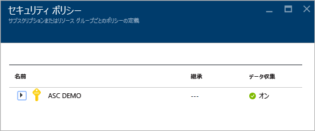
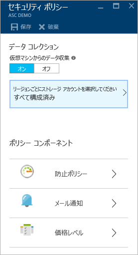
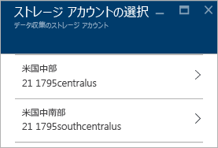
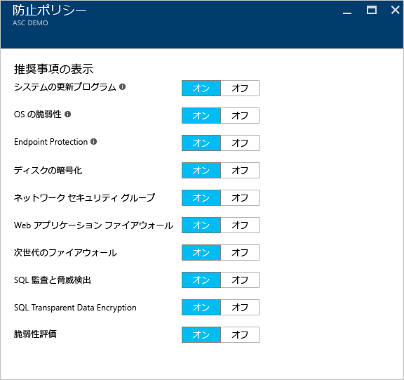
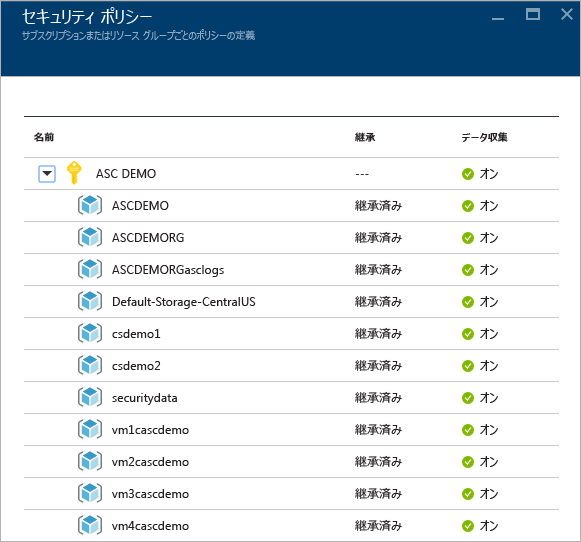
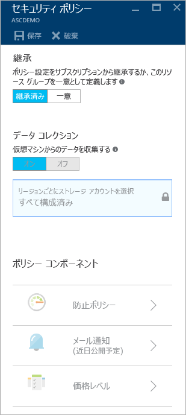

<properties
   pageTitle="Azure Security Center でのセキュリティ ポリシーの設定 | Microsoft Azure"
   description="このドキュメントは、Azure セキュリティ センターでのセキュリティ ポリシーを構成する場合に役立ちます。"
   services="security-center"
   documentationCenter="na"
   authors="YuriDio"
   manager="swadhwa"
   editor=""/>

<tags
   ms.service="security-center"
   ms.devlang="na"
   ms.topic="hero-article"
   ms.tgt_pltfrm="na"
   ms.workload="na"
   ms.date="09/22/2016"
   ms.author="yurid"/>

# Azure Security Center でのセキュリティ ポリシーの設定
このドキュメントでは、Security Center でセキュリティ ポリシーを構成するうえで必要な手順について詳しく説明します。

## セキュリティ ポリシーとは
セキュリティ ポリシーは、指定されたサブスクリプションまたはリソース グループ内のリソースに推奨されるコントロールのセットを定義します。Security Center では、セキュリティに関する会社のニーズ、および各サブスクリプションでのアプリケーションの種類やデータの機密度に合わせて、Azure サブスクリプションまたはリソース グループのポリシーを定義できます。

たとえば、開発やテストに使用されるリソースは、運用アプリケーションで使用されるリソースとは異なるセキュリティ要件を持つ場合があります。同様に、個人情報のような規制されたデータが使用されるアプリケーションには、より高いレベルのセキュリティが必要です。Azure Security Center で有効化されているセキュリティ ポリシーは、セキュリティに関する推奨事項と監視を促進して、潜在的な脆弱性を識別し、脅威を軽減します。使用に適しているオプションを判断する方法の詳細については、「[Azure Security Center 計画および運用ガイド](security-center-planning-and-operations-guide.md)」を参照してください。

## サブスクリプションのセキュリティ ポリシーの設定

セキュリティ ポリシーは、サブスクリプションまたはリソース グループごとに構成できます。セキュリティ ポリシーを変更するには、そのサブスクリプションの所有者または共同作業者である必要があります。Azure Portal にサインインし、次の手順に従って Security Center でセキュリティ ポリシーを構成します。

1. Security Center のダッシュボードで **[ポリシー]** タイルをクリックします。

2. **[セキュリティ ポリシー - サブスクリプションまたはリソース グループごとにポリシーを定義する]** ブレードが開いたら、セキュリティ ポリシーを有効にするサブスクリプションを選択します。サブスクリプション全体ではなく、リソース グループのセキュリティ ポリシーを有効にする場合は、リソース グループのセキュリティ ポリシーを設定する方法について説明する次のセクションまで下へスクロールしてください。

    

3. 選択したサブスクリプションの **[セキュリティ ポリシー]** ブレードが開き、次のスクリーンショットにあるようなオプションのセットが表示されます。

    

	このブレードで使用できるオプションは次のとおりです。
	- **防止ポリシー**: このオプションは、サブスクリプションまたはリソース グループごとにポリシーを構成するために使用します。
	- **電子メールの通知**: このオプションは、最初に警告が発生したとき、および重大度が高い警告に対して送信される電子メール通知を構成するために使用します。また、電子メールの設定は、サブスクリプション ポリシーに対してのみ構成できます。電子メールの通知を構成する方法の詳細については、「[Azure Security Center でセキュリティ連絡先の詳細情報を指定する](security-center-provide-security-contact-details.md)」を参照してください。
	- **価格レベル**: このオプションは、価格レベルの選択をアップグレードするために使用します。価格オプションの詳細については、[Security Center のページ](https://azure.microsoft.com/pricing/details/security-center/)を参照してください。

4.  **[仮想マシンからデータを収集する]** オプションが **[オン]** になっていることを確認します。このオプションは、既存および新規のリソースに対する自動ログ収集を有効化します。

    >[AZURE.NOTE] サブスクリプションごとにデータ収集を有効にすることをお勧めします。これにより、既存および新規のすべての VM でセキュリティの監視を利用できるようになります。データ収集を有効にすると、監視エージェントがインストールされます。この場所からのデータ収集を今すぐ有効にしない場合は、後で **[正常性]** ビューと **[推奨事項]** ビューから有効にすることができます。また、特定のサブスクリプションのみ、または選択した VM でデータ収集を有効にすることもできます。サポートされる VM に関する詳細は、「[Azure セキュリティ センターに関する FAQ](security-center-faq.md)」を参照してください。

5. ストレージ アカウントをまだ構成していない場合は、**[セキュリティ ポリシー]** を開いたときに、次のスクリーンショットに示すような警告が表示されることがあります。

    

6. この警告が表示された場合は、このオプションをクリックして、次のスクリーンショットに示すようにリージョンを選択します。

    

7. 仮想マシンが実行されている各リージョンに対し、これらの仮想マシンから収集されたデータが格納されるストレージ アカウントを選択します。これにより、プライバシーとデータ主権の目的で、同じ地域にデータを保持することが容易になります。使用するリージョンを決めた後、そのリージョンを選択し、ストレージ アカウントを選択します。

8. **[ストレージ アカウントを選ぶ]** ブレードで **[OK]** をクリックします。

    > [AZURE.NOTE] 必要に応じて、さまざまなリージョンにある仮想マシンについて、データを 1 つの中央のストレージ アカウントに集約することができます。詳細については、「[Azure Security Center のよく寄せられる質問 (FAQ)](security-center-faq.md)」を参照してください。

9. **[セキュリティ ポリシー]** ブレードで **[オン]** をクリックして、このサブスクリプションで使用するセキュリティの推奨事項を有効にします。**[防止ポリシー]** をクリックして、次のスクリーンショットにあるようなオプションを表示します。

	

次の表を参照して、各オプションについて確認してください。

| ポリシー | 状態がオンの場合 |
|----- |-----|
| システムの更新プログラム | Windows Update または Windows Server Update Services から、利用できる毎日のセキュリティ更新プログラムと重要な更新プログラムの一覧を取得します。取得される一覧は、その仮想マシンで構成されているサービスによって異なります。この一覧によって、不足している更新プログラムを適用するよう推奨されます。Linux システムの場合、ポリシーはディストリビューション提供のパッケージ管理システムを利用し、使用できる更新プログラムが含まれているパッケージを特定します。また、[Azure Cloud Services](./cloud-services/cloud-services-how-to-configure.md) 仮想マシンのセキュリティ更新プログラムと重要な更新プログラムについても確認します。 |
| OS の脆弱性 | オペレーティング システム構成を毎日分析し、攻撃に対する仮想マシンの脆弱性を引き起こすおそれのある問題を特定します。また、このポリシーによって、これらの脆弱性に対応するための構成の変更が推奨されます。監視対象のこの特定の構成に関する詳細は、[推奨される基準の一覧](https://gallery.technet.microsoft.com/Azure-Security-Center-a789e335)を参照してください。 |
| エンドポイント保護 | ウイルス、スパイウェア、およびその他の悪意のあるソフトウェアを特定して削除するため、すべての Windows 仮想マシンにエンドポイント保護をプロビジョニングすることをお勧めします。|
| ディスクの暗号化 | 静止データの保護を強化するために、ディスク暗号化はすべての仮想マシンで有効にすることをお勧めします。
| ネットワーク セキュリティ グループ | パブリック エンドポイントがある VM への受信トラフィックと送信トラフィックを制御するように、[ネットワーク セキュリティ グループ](../virtual-network/virtual-networks-nsg.md)を構成することを推奨します。サブネットで構成されたネットワーク セキュリティ グループは、他に指定しない限り、すべての仮想マシンのネットワーク インターフェイスによって継承されます。このポリシーは、ネットワーク セキュリティ グループが構成されていることをチェックするほか、受信セキュリティ規則を評価して、受信トラフィックを許可する規則を特定します。 |
| Web アプリケーション ファイアウォール | 次のいずれかに該当する場合に、仮想マシンに Web アプリケーション ファイアウォールをプロビジョニングすることを推奨します。  [インスタンスレベル パブリック IP](../virtual-network/virtual-networks-instance-level-public-ip.md) (ILPIP) が使用されており、関連付けられたネットワーク セキュリティ グループの受信セキュリティ規則が、ポート 80/443 へのアクセスを許可するように構成されている。  負荷分散された IP が使用されており、関連付けられた負荷分散と受信ネットワーク アドレス変換 (NAT) の規則が、ポート 80/443 へのアクセスを許可するように構成されている。詳細については、「[Azure Resource Manager によるロード バランサーのサポート](../load-balancer/load-balancer-arm.md)」を参照してください。 |
| 次世代のファイアウォール | Azure に組み込まれているネットワーク セキュリティ グループの適用範囲外までネットワーク保護を拡張します。次世代ファイアウォールの利用が推奨されるデプロイが Security Center によって検出されると、仮想アプライアンスをプロビジョニングできるようになります。 |
| SQL 監査と脅威検出 | コンプライアンスのために、また高度な脅威検出の調査のために、Azure データベースへのアクセスの監査を有効にすることを推奨します。 |
| SQL Transparent Data Encryption | Azure SQL データベース、関連付けられたバックアップ、トランザクション ログ ファイルに対し、REST での暗号化を有効にすることを推奨します。セキュリティ侵害を受けた場合でも、データが読み取られることはありません。 |
| 脆弱性評価 | VM に脆弱性評価ソリューションをインストールすることをお勧めします。 |

すべてのオプションの構成が完了したら、推奨事項が表示されている **[セキュリティ ポリシー]** ブレードで **[OK]** をクリックし、初期設定が表示されている **[セキュリティ ポリシー]** ブレードで **[保存]** をクリックします。

## リソース グループのセキュリティ ポリシーの設定

リソース グループごとにセキュリティ ポリシーを構成する場合、その手順は、サブスクリプションのセキュリティ ポリシーを設定する際に使用するものと似ています。主な違いは、サブスクリプション名を展開し、一意のセキュリティ ポリシーを構成するリソース グループを選択する必要があることです。

リソース グループを選択すると、**[セキュリティ ポリシー]** ブレードが開きます。既定では、**[継承]** オプションが有効になっています。これは、このリソース グループに対するすべてのセキュリティ ポリシーがサブスクリプション レベルから継承されることを意味します。リソース グループのカスタム セキュリティ ポリシーを設定する場合は、この構成を変更できます。その場合は、**[一意]** を選択し、**[防止ポリシー]** オプションの下で変更を加える必要があります。

> [AZURE.NOTE] サブスクリプション レベルのポリシーとリソース グループ レベルのポリシーが競合する場合は、リソース グループ レベルのポリシーが優先されます。

## 関連項目

このドキュメントでは、Azure セキュリティ センターでのセキュリティ ポリシーの構成方法について説明しました。Azure セキュリティ センターの詳細については、次を参照してください。

- [Azure Security Center 計画および運用ガイド](security-center-planning-and-operations-guide.md)。Azure Security Center を導入するための設計上の考慮事項を計画し、理解する方法について説明しています。
- [Azure Security Center でのセキュリティ ヘルスの監視](security-center-monitoring.md)。Azure リソースの正常性を監視する方法について説明しています。
- [Azure Security Center でのセキュリティの警告の管理と対応](security-center-managing-and-responding-alerts.md)。セキュリティの警告の管理と対応の方法について説明しています。
- [Azure Security Center を使用したパートナー ソリューションの監視](security-center-partner-solutions.md)。パートナー ソリューションの正常性状態を監視する方法について説明しています。
- [Azure Security Center のよく寄せられる質問 (FAQ)](security-center-faq.md)。このサービスの使用に関してよく寄せられる質問が記載されています。
- [Azure セキュリティ ブログ](http://blogs.msdn.com/b/azuresecurity/)。Azure のセキュリティとコンプライアンスについてのブログ記事を確認できます。

<!---HONumber=AcomDC_0928_2016-->