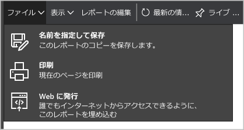

<properties
   pageTitle="Power BI で Azure Security Center のデータから洞察を得る | Microsoft Azure"
   description="Azure Security Center の Power BI コンテンツ パックを使用すると、レポート用に作成されたデータセットに基づいて、セキュリティ アラート、推奨事項、攻撃されたリソース、および傾向を簡単に見つけることができます。"
   services="security-center"
   documentationCenter="na"
   authors="YuriDio"
   manager="swadhwa"
   editor=""/>

<tags
   ms.service="security-center"
   ms.devlang="na"
   ms.topic="hero-article"
   ms.tgt_pltfrm="na"
   ms.workload="na"
   ms.date="02/25/2016"
   ms.author="yurid"/>

# Power BI で Azure Security Center のデータから洞察を得る
Azure Security Center の [Power BI ダッシュボード](http://aka.ms/azure-security-center-power-bi)を使用すると、モバイル デバイスなどの任意の場所から推奨事項とセキュリティ アラートの視覚化、分析、およびフィルター処理を行うことができます。傾向や攻撃パターンを表示し、リソースまたは発信元 IP アドレスごとのセキュリティ アラートや、リソースまたは時間ごとの未対応のセキュリティ リスクを確認できます。また、Security Center の推奨事項およびセキュリティ アラートと他のデータを、興味深い方法で組み合わせることもできます。たとえば、[Azure 監査ログ](https://powerbi.microsoft.com/blog/monitor-azure-audit-logs-with-power-bi/)および [Azure SQL Database の監査](https://powerbi.microsoft.com/blog/monitor-your-azure-sql-database-auditing-activity-with-power-bi/)と組み合わせることができ、これらはどちらも Power BI ダッシュボードにデータを提供します。このデータを Excel にエクスポートして、クラウド リソースのセキュリティの状態に関するレポートを簡単に作成することもできます。

> [AZURE.NOTE] このドキュメントの情報は、Azure セキュリティ センターのプレビュー リリースに適用されます。

## Power BI サービスで Azure Security Center のデータを調べる
Power BI で [Azure Security Center のコンテンツ パック](https://app.powerbi.com/groups/me/getdata/services/azure-security-center)に接続し、以下の手順に従います。

1\. 続行するには、Azure Security Center タイルで **[接続]** をクリックします。

2\. **[Azure Security Center への接続]** ウィンドウが開きます。**[Azure サブスクリプション ID]** フィールドに自分の Azure サブスクリプションを入力し、**[次へ]** をクリックします。

3\. **[認証方法]** ボックスの一覧で **[oAuth2]** を選択し、**[サインイン]** をクリックします。

4\. 認証ページにリダイレクトされるので、Azure Security Center への接続に使用している資格情報を入力します。認証プロセスが完了すると、Power BI がレポートを作成するためのデータのインポートを開始します。この処理中は、ブラウザーの右上隅に、次のメッセージが表示されます。

5\. 処理が完了すると、次のように、Azure Security Center の Power BI ダッシュボードにレポートが読み込まれます。

セキュリティ アラートと推奨事項の数や、Azure Security Center によって監視されている VM、Azure SQL データベース、ネットワーク リソースの数をひとめで確認できます。

Azure Security Center へのリンクをクリックすると、Azure ポータルにリダイレクトされます。グラフでは、セキュリティに関する推奨事項やアラートなど、次のような情報を簡単に視覚化できます。

- リソースのセキュリティ正常性
- 保留中の推奨事項の総数
- VM 推奨事項
- アラートの累積
- 攻撃されたリソース
- 攻撃された IP

各グラフからは、さらに洞察を得ることができます。タイルを選択すると、より詳しい情報が表示されます。たとえば、[リソースのセキュリティ正常性] タイルには、リソースごとの保留中の推奨事項に関する追加情報が次のように表示されます。

このグラフのいずれかの項目をクリックすると、他の項目は淡色表示になり、選択した 1 つの項目だけに注目できます。ダッシュボードに戻るには、このページの左側のウィンドウで **[ダッシュボード]** オプションの下にある **[Azure Security Center]** をクリックします。

> [AZURE.NOTE] フィールドを追加したり既存のビジュアルを変更したりしてレポートをカスタマイズする場合は、レポートを編集できます。詳細については、「[Power BI の編集ビューでレポートと対話する](https://powerbi.microsoft.com/documentation/powerbi-service-interact-with-a-report-in-editing-view/)」を参照してください。

**[アラートの累積]**、**[攻撃されたリソース]**、**[攻撃者 IP]** タイルは、クリックすると同じような情報が出力されます。これは、レポートでこれら 3 つの変数すべてに関する情報が集計され、次のように **[攻撃を受けているリソース]** と呼ばれるためです。

この時点で、**[ファイル]** メニューのオプションを使用して、このレポートのコピーの保存、印刷、Web への発行を行うこともできます。

##Azure Security Center ダッシュボードを使用して Power BI にアクセスする
Azure Security Center ダッシュボードを使用して、Power BI レポートにアクセスすることもできます。このタスクを実行するには、次の手順に従います。

1\. **[Azure Security Center]** ダッシュボードで **[Power BI で調べる]** ボタンをクリックします。

2\. 次のように、**[Power BI で調べる]** ブレードが右側に表示されます。

3\. **[Power BI で調べるサブスクリプションの選択]** ボックスの一覧で、使用するサブスクリプションを選択します。

4\. **[サブスクリプション ID のコピー]** フィールドでコピー ボタンをクリックします。5. **[Power BI に移動]** ボタンをクリックします。6. **[Azure Security Center への接続]** ウィンドウが開きます。**[Azure サブスクリプション ID]** フィールドに自分の Azure サブスクリプションを入力し、**[次へ]** をクリックします。

7\. **[認証方法]** ボックスの一覧で **[oAuth2]** を選択し、**[サインイン]** をクリックします。

8\. 認証ページにリダイレクトされるので、Azure Security Center への接続に使用している資格情報を入力します。認証プロセスが完了すると、Power BI がレポートを作成するためのデータのインポートを開始します。

## 次のステップ
このドキュメントでは、Azure Security Center での Power BI の使用方法について説明しました。Azure セキュリティ センターの詳細については、次を参照してください。

- 「[Azure セキュリティ センターでのセキュリティ ポリシーの設定](security-center-policies.md)」 – Azure セキュリティ センターでのセキュリティ設定を構成する方法について
- 「[Azure セキュリティ センターでのセキュリティのアラートの管理と対応](security-center-managing-and-responding-alerts.md)」 -セキュリティの警告の管理および対応について
- 「[Azure セキュリティ センターに関する FAQ](security-center-faq.md)」 – このサービスの使用に関してよく寄せられる質問
- 「[Azure セキュリティ ブログ](http://blogs.msdn.com/b/azuresecurity/)」 – Azure のセキュリティとコンプライアンスについてまとめたブログ記事の検索

<!---HONumber=AcomDC_0302_2016-->