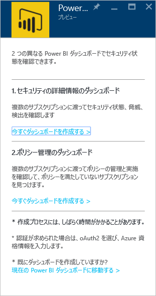
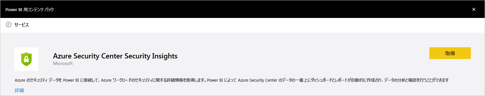
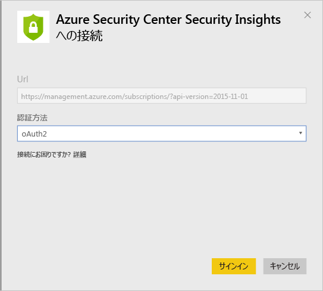
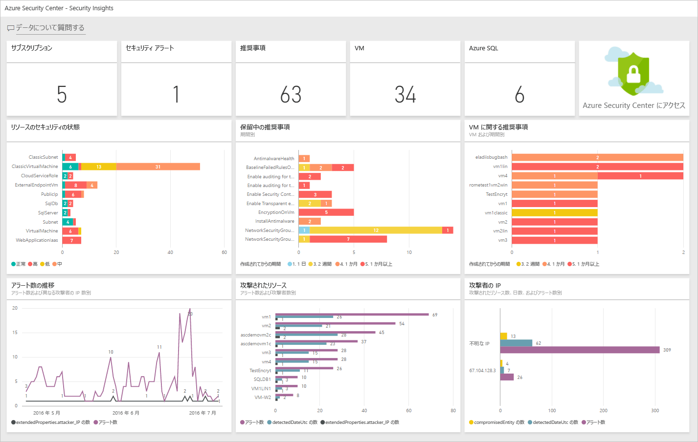
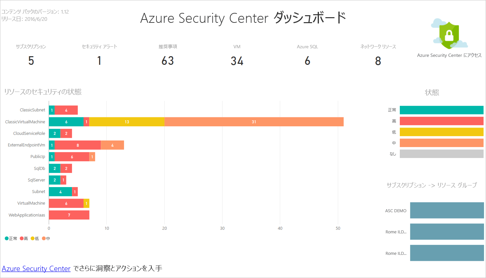
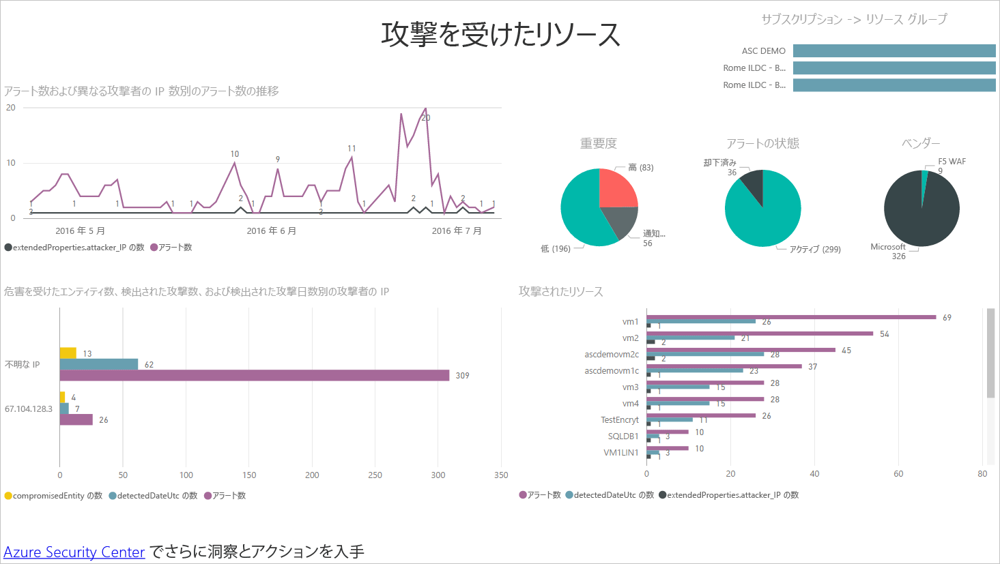
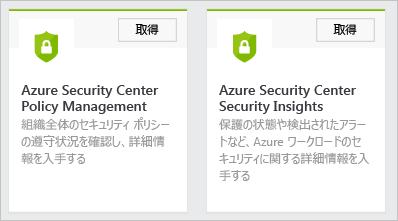
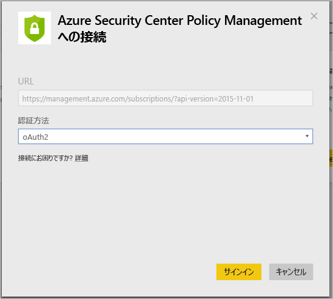
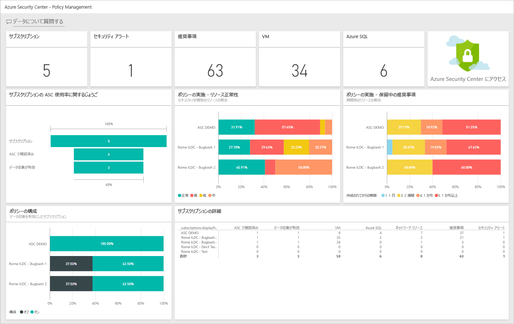

<properties
   pageTitle="Power BI で Azure Security Center のデータから洞察を得る | Microsoft Azure"
   description="Azure Security Center の Power BI コンテンツ パックを使用すると、レポート用に作成されたデータセットに基づいて、セキュリティ アラート、推奨事項、攻撃されたリソース、および傾向を簡単に見つけることができます。"
   services="security-center"
   documentationCenter="na"
   authors="YuriDio"
   manager="swadhwa"
   editor=""/>

<tags
   ms.service="security-center"
   ms.devlang="na"
   ms.topic="hero-article"
   ms.tgt_pltfrm="na"
   ms.workload="na"
   ms.date="07/08/2016"
   ms.author="yurid"/>

# Power BI で Azure Security Center のデータから洞察を得る
Azure Security Center の [Power BI ダッシュボード](http://aka.ms/azure-security-center-power-bi)を使用すると、モバイル デバイスなどの任意の場所から推奨事項とセキュリティ アラートの視覚化、分析、およびフィルター処理を行うことができます。傾向や攻撃パターンを表示し、リソースまたは発信元 IP アドレスごとのセキュリティ アラートや、リソースまたは時間ごとの未対応のセキュリティ リスクを確認できます。また、Security Center の推奨事項およびセキュリティ アラートと他のデータを、興味深い方法で組み合わせることもできます。たとえば、[Azure 監査ログ](https://powerbi.microsoft.com/blog/monitor-azure-audit-logs-with-power-bi/)および [Azure SQL Database の監査](https://powerbi.microsoft.com/blog/monitor-your-azure-sql-database-auditing-activity-with-power-bi/)と組み合わせることができ、これらはどちらも Power BI ダッシュボードにデータを提供します。このデータを Excel にエクスポートして、クラウド リソースのセキュリティの状態に関するレポートを簡単に作成することもできます。

> [AZURE.NOTE] このドキュメントの情報は、Azure セキュリティ センターのプレビュー リリースに適用されます。

##Azure Security Center ダッシュボードを使用して Power BI にアクセスする
Azure Security Center ダッシュボードを使用して、Power BI レポートにアクセスすることもできます。このタスクを実行するには、次の手順に従います。

1. **Azure Security Center** ダッシュボードで **[Explore in Power BI (Power BI で調べる)]** ボタンをクリックします。

	

2. 次のように、**[Explore in Power BI (Power BI で調べる)]** ブレードが右側に表示されます。

	

3. Power BI ダッシュボードを初めて作成する場合は、[Explore in Power BI (Power BI で調べる)] ブレードで次のいずれかのオプションを選択できます。

	- **[Security insights dashboard (セキュリティの詳細情報ダッシュボード)]**: セキュリティの状態、スレッド、検出を含むダッシュボードを作成する場合は、このオプションを選択します。これは、サブスクリプション全体の保護の状態と検出されたアラートを分析する DevOps ロール向けの一般的なオプションです。
	- **[Policy management dashboard (ポリシー管理ダッシュボード)]**: 管理と適用ポリシーを確認する場合は、このオプションを選択します。これは、ガバナンスに特化した中央 IT 向けの一般的なオプションです。このダッシュボードを使用すると、組織全体でのセキュリティ ポリシーの遵守について視覚的に確認し、詳細情報を入手できます。
	- 既に Power BI ダッシュボードがある場合は、**[Go to your current Power BI dashboard (現在の Power BI ダッシュボードに移動)]** をクリックします。

4. この例では、**[Security insights dashboard (セキュリティの詳細情報ダッシュボード)]** をクリックします。今回初めて Security Center で Power BI ダッシュボードを作成する場合、コンテンツ パックをインストールするよう求められます。次に示した **[Content packs for Power BI (Power BI 用コンテンツ パック)]** ウィンドウの **[取得]** ボタンをクリックします。

	

5. **[Connect to Azure Security Center Security Insights (Azure Security Center Security Insights への接続)]** ウィンドウが表示されます。次のように **[認証方法]** ボックスの一覧の **[oAuth2]** を選択し、**[サインイン]** をクリックします。
	
	

6. Azure の資格情報を使って再度認証を行うように求められる場合があります。認証後、ダッシュボードが作成されます。ダッシュボードが作成されると、次のような形式のレポートが表示されます。

	

> [AZURE.NOTE] レポートの更新は毎日実行されるようにスケジュールされています。この更新で障害が発生した場合は、「[Potential Refresh Issues with the Azure Security Center Power BI (Azure Security Center の Power BI の潜在的な更新の問題)](https://blogs.msdn.microsoft.com/azuresecurity/2016/04/07/azure-security-center-power-bi-refresh-fails/)」でトラブルシューティング方法について確認してください。

セキュリティ アラートと推奨事項の数や、Azure Security Center によって監視されている VM、Azure SQL データベース、ネットワーク リソースの数を確認できます。

Azure Security Center へのリンクをクリックすると、Azure ポータルにリダイレクトされます。グラフでは、セキュリティに関する推奨事項やアラートなど、次のような情報を簡単に視覚化できます。

- リソースのセキュリティ状態
- 保留中の推奨事項
- VM 推奨事項
- アラートの累積
- 攻撃されたリソース
- 攻撃された IP

各グラフからは、さらに洞察を得ることができます。タイルを選択すると、詳細が表示されます。たとえば、**[Resource Security State (リソースのセキュリティ状態)]** タイルには、リソースごとの保留中の推奨事項に関する追加情報が次のように表示されます。

このグラフのいずれかの項目をクリックすると、他の項目は淡色表示になり、選択した 1 つの項目だけに注目できます。ダッシュボードに戻るには、このページの左側のウィンドウで **[ダッシュボード]** オプションの下にある **[Azure Security Center]** をクリックします。

> [AZURE.NOTE] フィールドを追加したり既存のビジュアルを変更したりしてレポートをカスタマイズする場合は、レポートを編集できます。詳細については、「[Power BI の編集ビューでレポートと対話する](https://powerbi.microsoft.com/documentation/powerbi-service-interact-with-a-report-in-editing-view/)」を参照してください。

**[Alerts over Time (アラートの累積)]、[Attacked Resources (攻撃されたリソース)]**、**[Attacker IPs (攻撃者 IP)]** タイルは、クリックすると同じような情報が出力されます。これは、レポートでこれら 3 つの変数すべてに関する情報が集計され、次のように **[Resources under Attack (攻撃を受けているリソース)]** と呼ばれるためです。

この時点で、**[ファイル]** メニューのオプションを使用して、このレポートのコピーの保存、印刷、Web への発行を行うこともできます。

![[ファイル] メニュー](./media/security-center-powerbi/security-center-powerbi-fig8.png)

## Power BI サービスで Azure Security Center のデータを調べる

Power BI で [Power BI のコンテンツ パック サービス](https://msit.powerbi.com/groups/me/getdata/services)に接続し、以下の手順に従います。

1. **[Content Pack for Power BI (Power BI 用コンテンツ パック)]** ウィンドウには、次に示すように、2 つのオプションが表示されます。

	

	>[AZURE.NOTE] この記事の最初の部分が実行済みである場合、表示されるオプションは [Azure Security Center Policy Management (Azure Security Center のポリシー管理)] の 1 つだけです。

2. この例では、**[Azure Security Center Policy Management (Azure Security Center のポリシー管理)]** タイルの **[取得]** をクリックします。

3. **[Connect to Azure Security Center Policy Management (Azure Security Center のポリシー管理への接続)]** ウィンドウで、次に示すように **[認証方法]** ボックスの一覧の **[oAuth2]** を必ず選択し、**[サインイン]** をクリックします。

	

4. 認証ページにリダイレクトされるので、Azure Security Center への接続に使用している資格情報を入力します。認証プロセスが完了すると、Power BI がレポートを作成するためのデータのインポートを開始します。この処理中は、ブラウザーの右上隅に、次のメッセージが表示されます。

	

	>[AZURE.NOTE] ダッシュボードの作成が初めての場合は (主に、サブスクリプションが複数ある場合は)、通常より時間がかかります。

5. 処理が完了すると、Azure Security Center の Power BI ダッシュボードに、次に示したような**ポリシー管理**レポートが読み込まれます。

	

## 次のステップ
このドキュメントでは、Azure Security Center での Power BI の使用方法について説明しました。Azure セキュリティ センターの詳細については、次を参照してください。

- 「[Azure Security Center 計画および運用ガイド](security-center-planning-and-operations-guide.md)」 - Azure Security Center の導入を計画する方法について説明します。
- 「[Azure セキュリティ センターでのセキュリティ ポリシーの設定](security-center-policies.md)」 – Azure セキュリティ センターでのセキュリティ設定を構成する方法について
- 「[Azure セキュリティ センターでのセキュリティのアラートの管理と対応](security-center-managing-and-responding-alerts.md)」 -セキュリティの警告の管理および対応について
- 「[Azure セキュリティ センターに関する FAQ](security-center-faq.md)」 – このサービスの使用に関してよく寄せられる質問
- 「[Azure セキュリティ ブログ](http://blogs.msdn.com/b/azuresecurity/)」 – Azure のセキュリティとコンプライアンスについてまとめたブログ記事の検索

<!---HONumber=AcomDC_0713_2016-->