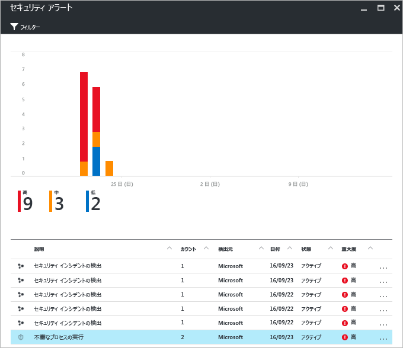
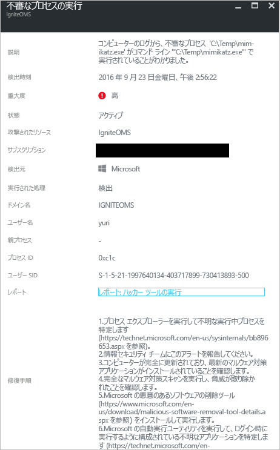

# Azure Security Center の脅威インテリジェンス レポート
このドキュメントでは、セキュリティ アラートが生成される原因となった脅威に関して詳しい情報を確認するにあたり、Azure Security Center の脅威インテリジェンス レポートがどのような点で役に立つかを説明します。

## 脅威インテリジェンス レポートとは
Security Center の脅威保護機能は、Azure のリソース、ネットワーク、接続されているパートナー ソリューションからのセキュリティ情報を監視することで機能します。 この情報を分析し、ときには複数の情報源から得た情報との関連性を探りながら、脅威を特定します。 詳細は、「[Azure Security Center での脅威の検出と対応方法](security-center-alerts-overview.md#detect-threats)」を参照してください。

Security Center が脅威を発見すると、[セキュリティ アラート](security-center-managing-and-responding-alerts.md) がトリガーされます。このセキュリティ アラートでは、特定のイベントに関して推奨される修復方法などの詳しい情報を確認できます。 インシデント対応を担当するチームが脅威の調査とその修復を実施する際に役立つように、Security Center には脅威インテリジェンス レポートという機能が用意されており、検出された脅威に関して以下のような情報を確認できるようになっています。

* 攻撃者の ID または所属団体 (この情報が利用可能な場合)
* 攻撃者の目的
* 現在および過去の攻撃キャンペーン (この情報が利用可能な場合)
* 攻撃者の戦術、ツール、手順
* URL やファイル ハッシュなど、関連する侵害の兆候 (IoC)
* 被害者情報 (攻撃が発生している業界や地域に関する情報で、Azure リソースにリスクが存在するかどうかの判断に役立ちます)
* 軽減策と修復方法に関する情報

> [!NOTE]
> レポートに記載される情報の量はさまざまであり、どの程度まで詳細な情報が表示されるかは、マルウェアの活動と拡散度に応じて決まります。
>
>

Security Center には、攻撃の種類に応じて 3 種類の脅威レポートが用意されています。 具体的には、以下のとおりです。

* **活動グループ レポート**: 攻撃者、その目的、および戦術に関する詳しい情報を記載したレポートです。
* **キャンペーン レポート**: 主に特定の攻撃キャンペーンの詳細を取り扱うレポートです。
* **脅威概要レポート**: 前の 2 つのレポートの全項目を確認できるレポートです。

この種の情報は、インシデント対応プロセスにおいて継続的に調査を実施し、攻撃元、攻撃者の動機、この問題の影響を今後軽減するための方策を把握するために利用できます。

## 脅威インテリジェンス レポートにアクセスする方法
現在の警告は、 **[セキュリティ アラート]** タイルで確認できます。 各警告の詳細を確認するには、Azure portal を開いて以下の手順に従ってください。

1. [セキュリティ センター] ダッシュボードには **[セキュリティの警告]** タイルが表示されます。
2. タイルをクリックして、 **[セキュリティ アラート]** ブレードを開くと、アラートに関する詳細が表示されます。そこで、さらに詳しい情報を確認したいセキュリティ アラートをクリックします。

    
3. この場合、 **[Suspicious process executed (不審なプロセスの実行)]** ブレードが表示され、アラートに関して以下の図に示すような詳細が表示されます。

    
4. 各セキュリティ アラートに関して表示される情報の量は、アラートの種類に応じて変わります。 **[レポート]** フィールドには、脅威インテリジェンス レポートへのリンクがあります。 リンクをクリックしてください。PDF ファイルが別のブラウザー ウィンドウで表示されます。

   

ここでは、このレポートの PDF のダウンロードのほか、検出されたセキュリティ面の問題の詳細を確認したり、入手した情報を基に各種の措置を講じたりできます。

## 関連項目
このドキュメントでは、セキュリティ アラートに関する調査にあたり Azure Security Center の脅威のインテリジェント レポートがどのような点で有用であるかを学習しました。 Azure セキュリティ センターの詳細については、次を参照してください。

* [Azure Security Center 計画および運用ガイド](security-center-planning-and-operations-guide.md)。 Azure Security Center を導入するための設計上の考慮事項を計画し、理解する方法について説明しています。
* [Azure Security Center でのセキュリティの警告の管理と対応](security-center-managing-and-responding-alerts.md)。 セキュリティの警告の管理と対応の方法について説明しています。
* [Azure Security Center でのセキュリティ インシデントの処理](security-center-incident.md)