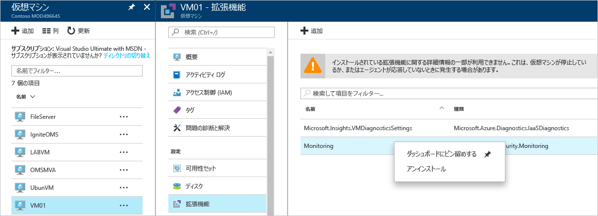

# Azure Security Center トラブルシューティング ガイド
このガイドは、所属組織が Azure Security Center を使用しており、Security Center に関連する問題のトラブルシューティングを必要としている情報技術 (IT) プロフェッショナル、情報セキュリティ アナリスト、クラウド管理者を対象としています。

## トラブルシューティング ガイド
このガイドでは、Security Center に関連する問題のトラブルシューティングの方法について説明します。 Security Center で行われるトラブルシューティングのほとんどは、問題の生じたコンポーネントの [監査ログ](https://azure.microsoft.com/updates/audit-logs-in-azure-preview-portal/) レコードを確認することから始まります。 監査ログを使用すると、次の内容を判断することができます。

* 実行された操作
* 操作を開始したユーザー
* 操作が発生した時間
* 操作の状態
* 操作の調査に役立つ可能性のあるその他のプロパティの値

監査ログには、リソースで実行されたすべての書き込み操作 (PUT、POST、DELETE) が含まれます。ただし、読み取り操作 (GET) は含まれません。

## Windows における監視エージェントのインストールのトラブルシューティング
Security Center 監視エージェントは、データ収集を実行するために使用されます。 データ収集が有効になり、ターゲット コンピューターにエージェントが正常にインストールされた後には、次のプロセスが実行されています。

* ASMAgentLauncher.exe - Azure 監視エージェント 
* ASMMonitoringAgent.exe - Azure セキュリティ監視拡張機能
* ASMSoftwareScanner.exe – Azure スキャン マネージャー

Azure セキュリティ監視拡張機能では、さまざまなセキュリティ関連の構成がスキャンされ、仮想マシンからセキュリティ ログが収集されます。 スキャン マネージャーは、パッチ スキャナーとして使用されます。

インストールが正常に実行されている場合は、ターゲット VM の監査ログに次のようなエントリが示されます。

*%systemdrive%\windowsazure\logs* (C:\WindowsAzure\Logs など) にあるエージェント ログを確認して、インストール プロセスに関する詳しい情報を入手することもできます。

> [!NOTE]
> Azure Security Center エージェントが正常に動作していない場合、ターゲット VM を再起動する必要があります。これは、エージェントの停止と開始のコマンドがないためです。

データの収集に関する問題が引き続き発生する場合は、次の手順に従ってエージェントをアンインストールできます。

1. **Azure Portal** から、データ収集の問題が発生している仮想マシンを選び、**[拡張機能]** をクリックします。
2. **[Microsoft.Azure.Security.Monitoring]** を右クリックし、**[アンインストール]** をクリックして選択します。

Azure セキュリティ監視拡張機能が数分以内に自動的に再インストールされます。

## Linux における監視エージェントのインストールのトラブルシューティング
Linux システムでの VM エージェントのインストールをトラブルシューティングする場合、必ず /var/lib/waagent/ に拡張機能をダウンロードしておく必要があります。 次のコマンドを実行すると、拡張機能がインストールされているかどうかを確認できます。

`cat /var/log/waagent.log` 

トラブルシューティングの目的で確認できるその他のログ ファイルには、次のものがあります。 

* /var/log/mdsd.err
* /var/log/azure/

動作中のシステムでは、TCP 29130 での mdsd プロセスへの接続が表示されます。 これは、mdsd プロセスと通信している syslog です。 この動作は、次のコマンドを実行することで検証できます。

`netstat -plantu | grep 29130`

## ダッシュボードの読み込みに関する問題のトラブルシューティング

Security Center ダッシュボードを読み込む際に問題が発生した場合は、Security Center のサブスクリプションを登録するユーザー (つまり、サブスクリプションで Security Center を最初に開いたユーザー) と、データの収集を有効にするユーザーが、サブスクリプションに対する "*所有者*" または"*共同作成者*" であることを確認します。 その時点から、サブスクリプションの "*閲覧者*" も dashboard/alerts/recommendation/policy を参照できます。

## Microsoft サポートへの問い合わせ
一部の問題は、この記事に示したガイドラインを基に特定できます。その他の問題については、Security Center パブリック [フォーラム](https://social.msdn.microsoft.com/Forums/en-US/home?forum=AzureSecurityCenter)でドキュメントを確認できます。 ただし、トラブルシューティングがさらに必要な場合は、次に示すように **Azure Portal** を使用して新しいサポート要求を開くことができます。 

## 関連項目
このドキュメントでは、Azure セキュリティ センターでのセキュリティ ポリシーの構成方法について説明しました。 Azure セキュリティ センターの詳細については、次を参照してください。

* [Azure Security Center 計画および運用ガイド](security-center-planning-and-operations-guide.md) 」 -- Azure Security Center を導入するための設計上の考慮事項を計画および理解する方法について説明します。
* [Azure Security Center でのセキュリティ ヘルスの監視](security-center-monitoring.md) 」 -- Azure リソースの正常性を監視する方法について説明しています。
* [Azure Security Center でのセキュリティの警告の管理と対応](security-center-managing-and-responding-alerts.md) 」 -- セキュリティの警告の管理と対応の方法について説明しています。
* [Azure Security Center を使用したパートナー ソリューションの監視](security-center-partner-solutions.md) 」 -- パートナー ソリューションの正常性状態を監視する方法について説明しています。
* [Azure Security Center のよく寄せられる質問 (FAQ)](security-center-faq.md) 」 -- このサービスの使用に関してよく寄せられる質問が記載されています。
* [Azure セキュリティ ブログ](http://blogs.msdn.com/b/azuresecurity/) -- Azure のセキュリティとコンプライアンスについてのブログ記事を確認できます。

<!--HONumber=Feb17_HO3-->

