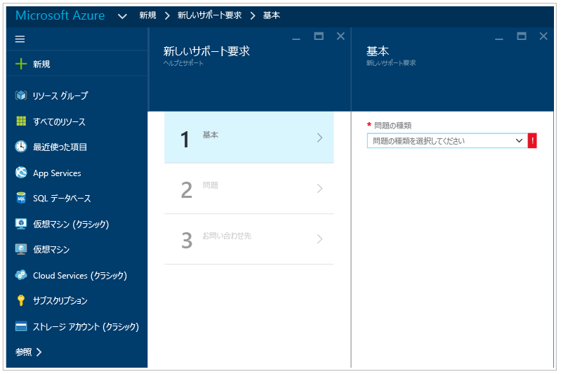

# Azure Security Center トラブルシューティング ガイド
このガイドは、所属組織が Azure Security Center を使用しており、Security Center に関連する問題のトラブルシューティングを必要としている情報技術 (IT) プロフェッショナル、情報セキュリティ アナリスト、クラウド管理者を対象としています。

>[!NOTE]
>2017 年 6 月上旬より、Security Center では、Microsoft Monitoring Agent を使用してデータの収集と格納を行っています。 詳細については、「[Azure Security Center のプラットフォームの移行](security-center-platform-migration.md)」を参照してください。 この記事の情報は、Microsoft Monitoring Agent に移行した後の Security Center の機能を示しています。
>

## トラブルシューティング ガイド
このガイドでは、Security Center に関連する問題のトラブルシューティングの方法について説明します。 Security Center で行われるトラブルシューティングのほとんどは、問題の生じたコンポーネントの [監査ログ](https://azure.microsoft.com/updates/audit-logs-in-azure-preview-portal/) レコードを確認することから始まります。 監査ログを使用すると、次の内容を判断することができます。

* 実行された操作
* 操作を開始したユーザー
* 操作が発生した時間
* 操作の状態
* 操作の調査に役立つ可能性のあるその他のプロパティの値

監査ログには、リソースで実行されたすべての書き込み操作 (PUT、POST、DELETE) が含まれます。ただし、読み取り操作 (GET) は含まれません。

## Microsoft Monitoring Agent
Security Center では、Microsoft Monitoring Agent を使用して、Azure 仮想マシンからセキュリティ データを収集します。これは、Log Analytics サービスで使用されるのと同じエージェントです。 データ収集が有効になり、ターゲット コンピューターにエージェントが正常にインストールされた後、次のプロセスが実行されます。

* HealthService.exe

サービス管理コンソール (services.msc) を開くと、次のように Microsoft Monitoring Agent サービスも実行されていることを確認できます。

エージェントのバージョンを確認するには、**タスク マネージャー**を開き、**[プロセス]** タブで **Microsoft Monitoring Agent サービス**を見つけます。サービスを右クリックし、**[プロパティ]** をクリックします。 **[詳細]** タブで、次のようなファイルのバージョンを確認します。

## Microsoft Monitoring Agent のインストール シナリオ
コンピューターに Microsoft Monitoring Agent をインストールするシナリオは 2 つあり、生成される結果が異なります。 サポートされるシナリオは次のとおりです。

* **Security Center による自動的なエージェントのインストール**: このシナリオでは、Security Center とログ検索の両方にアラートが表示されます。 リソースが属しているサブスクリプション用のセキュリティ ポリシー内に構成した電子メール アドレスに電子メール通知が送信されます
。
* **Azure の VM へのエージェントの手動インストール**: このシナリオでは、2017 年 2 月以前に手動でダウンロードしてインストールしたエージェントを使用している場合、Security Center ポータルにアラートを表示できるのは、ワークスペースが属しているサブスクリプションをフィルター処理している場合のみです。 リソースが属しているサブスクリプションをフィルター処理している場合、アラートを表示することはできません。 ワークスペースが属しているサブスクリプション用のセキュリティ ポリシー内に構成した電子メール アドレスに電子メール通知が送信されます。

>[!NOTE]
> 後者の動作を回避するために、必ずエージェントの最新バージョンをダウンロードしてください。
>

## <a name="mon-agent">エージェントの正常性の監視に関する問題</a>
**[監視の状態]** には、自動プロビジョニングの対象として初期化された VM およびコンピューターを Security Center で正常に監視できない理由が定義されています。 次の表は、**[監視の状態]** の値、説明、解決手順を示したものです。

| 監視の状態 | 説明 | 解決手順 |
|---|---|---|
| エージェントのインストールが保留中です | Microsoft Monitoring Agent のインストールがまだ実行されています。  インストールには最大数時間かかることがあります。 | 自動インストールの完了を待ちます。 |
| 電源状態がオフです | VM が停止しています。  Microsoft Monitoring Agent をインストールできるのは、実行中の VM だけです。 | VM を再起動します。 |
| Azure VM エージェントが見つからないか無効です | Microsoft Monitoring Agent がまだインストールされていません。  Security Center が拡張機能をインストールするためには、有効な Azure VM エージェントが必要です。 | Azure VM エージェントを VM にインストールするか、再インストールするか、またはアップグレードしてください。 |
| VM がインストールの準備が整っていない状態です  | インストールする準備が VM で整っていないため、Microsoft Monitoring Agent がまだインストールされていません。 インストールする準備が VM で整っていません。VM エージェントまたは VM プロビジョニングに問題があります。 | VM の状態を確認します。 ステータス情報については、ポータルの **[Virtual Machines]** に戻って、対象の VM を選択してください。 |
|インストールに失敗しました - 一般エラー | Microsoft Monitoring Agent はインストールされましたが、エラーが原因で正しく機能していません。 | [拡張機能を手動でインストール](../azure-monitor/learn/quick-collect-azurevm.md#enable-the-log-analytics-vm-extension)するか、または、Security Center によって再インストールが試行されるように、拡張機能をアンインストールしてください。 |
| インストールに失敗しました - ローカル エージェントが既にインストールされています | Microsoft Monitoring Agent のインストールに失敗しました。 ローカル エージェント (Log Analytics または SCOM) が VM にインストール済みであることが Security Center によって検出されました。 1 つの VM が 2 つの異なるワークスペースの管理下に置かれるマルチホーム構成を避けるために、Microsoft Monitoring Agent のインストールは停止されました。 | これには 2 とおりの解決方法があります。1 つは、[拡張機能を手動でインストール](../azure-monitor/learn/quick-collect-azurevm.md#enable-the-log-analytics-vm-extension)して、それを目的のワークスペースに接続する方法です。 もう 1 つは、目的のワークスペースを既定のワークスペースとして設定し、エージェントの自動プロビジョニングを有効にする方法です。  [自動プロビジョニングの有効化](security-center-enable-data-collection.md)に関するページを参照してください。 |
| エージェントがワークスペースに接続できません | Microsoft Monitoring Agent はインストールされましたが、ネットワーク接続が原因で正しく機能していません。  エージェントに関して、インターネット アクセスがあること、または有効な HTTP プロキシが構成されていることを確認してください。 | [監視エージェントのネットワーク要件](#troubleshooting-monitoring-agent-network-requirements)に関するページを参照してください。 |
| エージェントの接続先ワークスペースが存在しないか不明です | VM にインストールされている Microsoft Monitoring Agent が、接続先ワークスペースにアクセスできないことを Security Center が検出しました。 | この原因として 2 つのケースが考えられます。 まず、ワークスペースが削除されて現在は存在していないことが考えられます。 適切なワークスペースを備えたエージェントを再インストールするか、またはエージェントをアンインストールして、Security Center による自動プロビジョニング インストールが作動するようにしてください。 もう 1 つは、そのワークスペースを含んでいるサブスクリプションへのアクセス許可が Security Center にないケースです。 Microsoft Security Resource Provider にサブスクリプションへのアクセスを許可するためには、Security Center にそのサブスクリプションが必要です。 その対策として、Microsoft Security Resource Provider のサブスクリプションを登録します。 この作業は、API や PowerShell、ポータルから行うことができるほか、Security Center の **[概要]** ダッシュボードから、目的のサブスクリプションにフィルターを適用するだけでも実行できます。 詳細については、「[リソース プロバイダーと種類](../azure-resource-manager/resource-manager-supported-services.md#portal)」を参照してください。 |
| エージェントが応答しないか、ID がありません | エージェントがインストールされているにもかかわらず、VM からスキャンされたセキュリティ データを Security Center が取得できません。 | エージェントからデータ (ハート ビートも含む) がまったく報告されていません。 エージェントが破損しているか、何らかの原因でトラフィックがブロックされています。 または、エージェントからはデータが報告されているものの、Azure リソース ID が欠落しているために、データを Azure VM と突き合わせることができません。 Linux のトラブルシューティングについては、「[Troubleshooting Guide for Log Analytics Agent for Linux (Log Analytics エージェント for Linux のトラブルシューティング ガイド)](https://github.com/Microsoft/OMS-Agent-for-Linux/blob/master/docs/Troubleshooting.md#im-not-seeing-any-linux-data-in-the-oms-portal)」を参照してください。 Windows のトラブルシューティングについては、「[Troubleshooting Windows Virtual Machines (Windows 仮想マシンのトラブルシューティング)](https://github.com/MicrosoftDocs/azure-docs/blob/8c53ac4371d482eda3d85819a4fb8dac09996a89/articles/log-analytics/log-analytics-azure-vm-extension.md#troubleshooting-windows-virtual-machines)」を参照してください。 |
| エージェントがインストールされていません | データ収集が無効になっています。 | セキュリティ ポリシーでデータ収集を有効にするか、Microsoft Monitoring Agent を手動でインストールしてください。 |

## 監視エージェントのネットワーク要件のトラブルシューティング
Security Center に接続して登録するエージェントには、ドメイン URL とポート番号を含むネットワーク リソースへのアクセスが必要です。

- プロキシ サーバーでは、適切なプロキシ サーバーのリソースがエージェントの設定で構成されていることを確認する必要があります。 詳細については、[プロキシ設定を変更する方法](https://docs.microsoft.com/azure/log-analytics/log-analytics-windows-agents#configure-proxy-settings)に関する記事を参照してください。
- インターネットへのアクセスを制限するファイアウォールでは、Log Analytics へのアクセスを許可するようにファイアウォールを構成する必要があります。 エージェントの設定で必要な操作はありません。

次の表は、通信で必要なリソースを示しています。

| エージェントのリソース | ポート | バイパス HTTPS 検査 |
|---|---|---|
| *.ods.opinsights.azure.com | 443 | [はい] |
| *.oms.opinsights.azure.com | 443 | [はい] |
| *.blob.core.windows.net | 443 | [はい] |
| *.azure-automation.net | 443 | [はい] |

エージェントのオンボードに関する問題が発生した場合は、「[Operations Management Suite オンボードに関する問題のトラブルシューティング方法](https://support.microsoft.com/en-us/help/3126513/how-to-troubleshoot-operations-management-suite-onboarding-issues)」の記事を参照してください。

## Endpoint Protection が正しく動作していない場合のトラブルシューティング

ゲスト エージェントは、[Microsoft マルウェア対策](../security/azure-security-antimalware.md)拡張機能によって実行されるすべての処理の親プロセスです。 ゲスト エージェント プロセスが失敗すると、ゲスト エージェントの子プロセスとして実行されている Microsoft マルウェア対策も失敗する可能性があります。  このようなシナリオでは、次の点を確認することをお勧めします。

- ターゲット VM がカスタム イメージであり、VM の作成者がゲスト エージェントをインストールしていない場合。
- ターゲットが Windows VM ではなく Linux VM の場合、Linux VM に Windows バージョンのマルウェア対策拡張機能をインストールすると、インストールは失敗します。 Linux ゲスト エージェントには、OS バージョンと必要なパッケージに関して固有の要件があります。それらの要件が満たされていない場合、VM エージェントも機能しません。
- VM が古いバージョンのゲスト エージェントを使用して作成されている場合。 この場合、一部の古いエージェントが新しいバージョンに自動更新できないことが原因でこの問題が発生している可能性があることに注意してください。 独自のイメージを作成する場合は、必ず最新バージョンのゲスト エージェントを使用します。
- 一部のサード パーティ製管理ソフトウェアによって、ゲスト エージェントが無効化されているか、特定のファイルの場所へのアクセスがブロックされている可能性があります。 VM にサード パーティ製品がインストールされている場合は、エージェントが除外リストに含まれていることを確認してください。
- 特定のファイアウォール設定またはネットワーク セキュリティ グループ (NSG) が、ゲスト エージェントとの間でのネットワーク トラフィックをブロックしている可能性があります。
- 特定のアクセス制御リスト (ACL) がディスク アクセスを妨げている可能性があります。
- ディスク領域の不足によって、ゲスト エージェントが正常に機能できなくなっている可能性があります。

既定では、Microsoft マルウェア対策ユーザー インターフェイスは無効になっています。必要に応じてこれを有効にする方法の詳細については、[デプロイ後に ARM VM の Microsoft マルウェア対策ユーザー インターフェイスを有効にする方法](https://blogs.msdn.microsoft.com/azuresecurity/2016/03/09/enabling-microsoft-antimalware-user-interface-post-deployment/)に関するブログをご覧ください。

## ダッシュボードの読み込みに関する問題のトラブルシューティング

Security Center ダッシュボードを読み込む際に問題が発生した場合は、Security Center のサブスクリプションを登録するユーザー (つまり、サブスクリプションで Security Center を最初に開いたユーザー) と、データの収集を有効にするユーザーが、サブスクリプションに対する "*所有者*" または"*共同作成者*" であることを確認します。 その時点から、サブスクリプションの "*閲覧者*" も dashboard/alerts/recommendation/policy を参照できます。

## Microsoft サポートへの問い合わせ
一部の問題は、この記事に示したガイドラインを基に特定できます。その他の問題については、Security Center パブリック [フォーラム](https://social.msdn.microsoft.com/Forums/en-US/home?forum=AzureSecurityCenter)でドキュメントを確認できます。 ただし、さらにトラブルシューティングが必要な場合は、次に示すように **Azure ポータル**を使用して新しいサポート要求を開くことができます。

## 関連項目
このドキュメントでは、Azure セキュリティ センターでのセキュリティ ポリシーの構成方法について説明しました。 Azure セキュリティ センターの詳細については、次を参照してください。

* [Azure Security Center 計画および運用ガイド](security-center-planning-and-operations-guide.md) 」 -- Azure Security Center を導入するための設計上の考慮事項を計画および理解する方法について説明します。
* [Azure Security Center でのセキュリティ ヘルスの監視](security-center-monitoring.md) 」 -- Azure リソースの正常性を監視する方法について説明しています。
* [Azure Security Center でのセキュリティの警告の管理と対応](security-center-managing-and-responding-alerts.md) 」 -- セキュリティの警告の管理と対応の方法について説明しています。
* [Azure Security Center を使用したパートナー ソリューションの監視](security-center-partner-solutions.md) 」 -- パートナー ソリューションの正常性状態を監視する方法について説明しています。
* [Azure Security Center のよく寄せられる質問 (FAQ)](security-center-faq.md) 」 -- このサービスの使用に関してよく寄せられる質問が記載されています。
* [Azure セキュリティ ブログ](https://blogs.msdn.com/b/azuresecurity/) -- Azure のセキュリティとコンプライアンスについてのブログ記事を確認できます。
