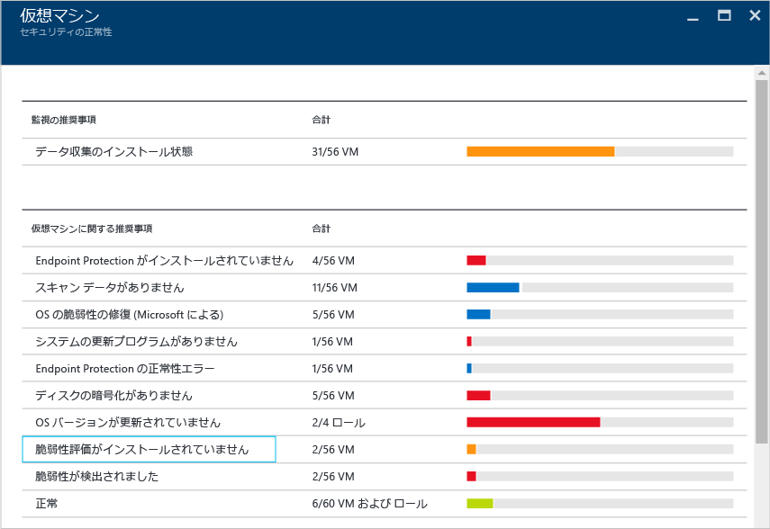
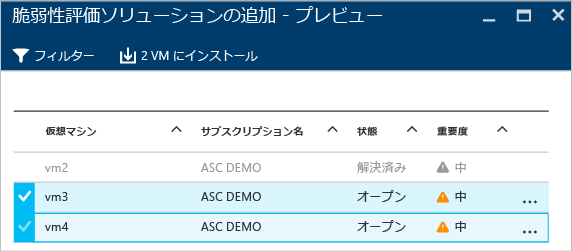
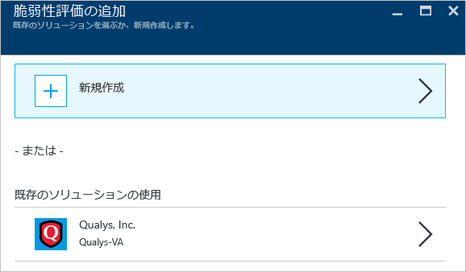
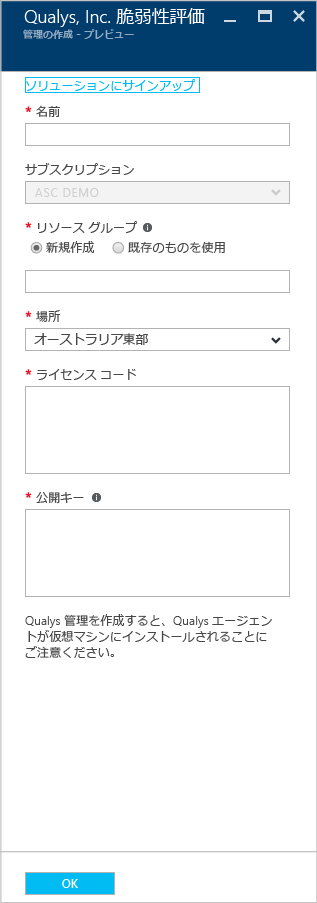
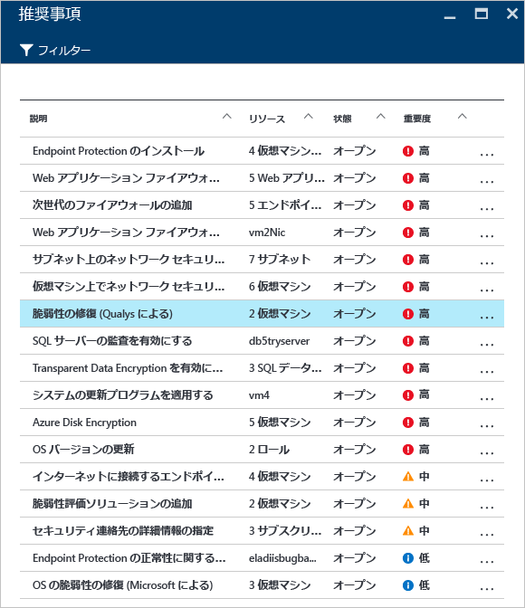
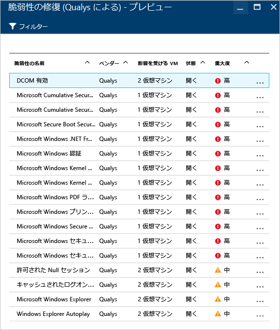
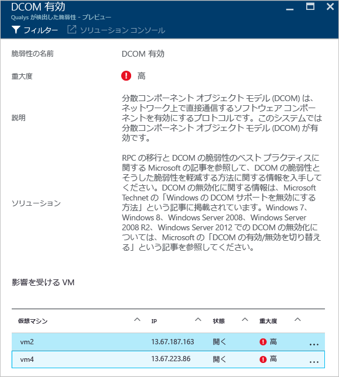

<properties
   pageTitle="Azure Security Center での脆弱性評価 | Microsoft Azure"
   description="このドキュメントでは、脆弱性評価ソリューションをインストールすることによって仮想マシンを保護する、Azure Security Center での推奨事項について説明します。"
   services="security-center"
   documentationCenter="na"
   authors="YuriDio"
   manager="swadhwa"
   editor=""/>

<tags
   ms.service="security-center"
   ms.devlang="na"
   ms.topic="hero-article"
   ms.tgt_pltfrm="na"
   ms.workload="na"
   ms.date="09/27/2016"
   ms.author="yurid"/>

# Azure Security Center での脆弱性評価
このドキュメントでは、Azure で実行されている仮想マシンに適用できる、脆弱性評価の推奨事項について説明します。

## 脆弱性評価とは

Azure Security Center の脆弱性評価は、仮想マシン (VM) の推奨事項の一部です。Security Center では、VM にインストールされている脆弱性評価ソリューションが検出されない場合、インストールを勧めるメッセージを表示します。パートナー エージェントは、デプロイ後、パートナーの管理プラットフォームに脆弱性データの報告を開始します。次にそのプラットフォームが脆弱性と正常性の監視データを Security Center に送り返します。ユーザーは Security Center ダッシュボードから脆弱な VM をすばやく特定できます。また、Security Center からパートナー管理コンソールに直接切り替えて、さらに報告や情報を得ることもできます。

> [AZURE.NOTE] このドキュメントでは、サンプルのデプロイを使用してサービスについて紹介します。ステップ バイ ステップ ガイドではありません。

## パブリック プレビューの制限事項

現在の脆弱性評価のパブリック プレビューには、次の制限が適用されます。

- 使用可能な唯一のパートナー脆弱性評価ソリューションは、[Qualys](https://www.qualys.com/lp/azure) です。今後、さらに追加される予定です。
- 同じサブスクリプションに属していれば、複数の VM に脆弱性評価ソリューションをインストールできます。
- Windows VM だけがサポートされています。Linux VM は、一般公開 (GA) で追加されます。

## 仮想マシンの推奨事項の実装

Security Center は、脆弱性評価ソリューションを持たないサポート対象 VM を特定すると、VM 推奨事項をトリガーします。以下の手順は、この推奨事項にアクセスし、同じサブスクリプションに属している複数の VM に対して適用する方法を示しています。

1. **[リソース セキュリティの正常性]** タイルで **[Virtual Machines]** をクリックします。
2. 次の図に示されているように、**[Virtual machines]** ブレードで **[脆弱性評価がインストールされていません]** を選択します。

	

3. 次の図に示されているように、**[脆弱性評価ソリューションの追加 - プレビュー]** ブレードで、脆弱性評価ソリューションをインストールする VM を選択します。

	

4. **[脆弱性評価ソリューションの追加 - プレビュー]** ブレードで **[2 台の VM にインストール]** オプション (選択した VM の数によって名前が異なります) をクリックすると、次の図に示されているような **[脆弱性評価の追加]** ブレードが表示されます。

	

5. このブレードでは、新しい脆弱性評価を作成して **Azure Marketplace** からパートナー ソリューションを選択するか、[既存のソリューションの使用] で既存のパートナー ソリューション (この場合は **Qualys**) を選択することができます。

## 新しい脆弱性評価ソリューションの作成

複数のサブスクリプションがある場合は、サブスクリプションごとに 1 つの脆弱性評価ソリューションを作成できます。主な手順は前のセクションでの手順と同じですが、手順 4. で **[新規作成]** オプションをクリックする点だけが異なります。このオプションを選択した後は、以下の手順に従います。

> [AZURE.NOTE] 以下の例では、Qualys を使用します。Security Center から Qualys クラウド エージェントをデプロイするには、Qualys のライセンス コードと公開キーが必要です。ライセンス コードと公開キーを取得する方法については、[Qualys のドキュメント](https://community.qualys.com/docs/DOC-5823-deploying-qualys-cloud-agents-from-microsoft-azure-security-center)を参照してください。

1. **[Create a new Vulnerability Assessment (新しい脆弱性評価の作成)]** ブレードで、パートナーの名前 (ここでは **Qualys**) をクリックします。
2. パートナーのブレードが開きます。このブレードで表示されるフィールドは、パートナーによって異なることがありますが、この例では **Qualys** を使用します。

	

3. **[Name (名前)]** フィールドに、このソリューションの名前を入力します。バインドしようとしているリソース グループまたはサブスクリプションに関連している名前を使用できます。
4. **[Subscription (サブスクリプション)]** で、このソリューションに使用するサブスクリプションを選択します。
5. **[Resource group (リソース グループ)]** フィールドで、既存のリソース グループを選択するか、新しいリソース グループを作成します。
6. **[Location (場所)]** フィールドで、このソリューションを地理的に配置する場所を選択します。
7. **[License code (ライセンス コード)]** フィールド (Qualys 固有) で、パートナーから提供されるライセンス番号を入力します。
8. **[Public key (公開キー)]** フィールド (Qualys 固有) で、パートナーから提供される公開キー情報を入力し、**[OK]** をクリックします。

## 推奨事項の確認

対象 VM に脆弱性評価ソリューションがインストールされると、VM がスキャンされ、システムおよびアプリケーションの脆弱性が検出、識別されます。

> [AZURE.NOTE] 最初のスキャンは完了までに数時間かかる場合があります。その後は、1 時間ほどの処理になります。

これらの問題は、**[仮想マシンに関する推奨事項]** オプションの下で発生します。次の例は、**[推奨事項]** ブレードに推奨事項がどのように表示されるかを示しています。

この例で選択された推奨事項は、検出が Qualys によって実行されたことを示しています。この推奨事項をクリックすると、次の図に示されているように、脆弱性の一覧のある新しいブレードが表示されます。

この一覧は、重要度と、この脆弱性によって影響を受ける仮想マシンの数の順に、すべての脆弱性を示します。この例では、有効化された DCOM という脆弱性が選択され、新しいブレードが表示されます。このブレードには、この脆弱性に対処するための推奨手順が示されます。

## 関連項目

このドキュメントでは、Azure Security Center の脆弱性評価の推奨事項を適用する方法について説明しました。Azure セキュリティ センターの詳細については、次を参照してください。

- [Azure Security Center 計画および運用ガイド](security-center-planning-and-operations-guide.md)。Azure Security Center を導入するための設計上の考慮事項を計画し、理解する方法について説明しています。
- [Azure Security Center でのセキュリティ ヘルスの監視](security-center-monitoring.md)。Azure リソースの正常性を監視する方法について説明しています。
- [Azure Security Center でのセキュリティの警告の管理と対応](security-center-managing-and-responding-alerts.md)。セキュリティの警告の管理と対応の方法について説明しています。
- [Azure Security Center を使用したパートナー ソリューションの監視](security-center-partner-solutions.md)。パートナー ソリューションの正常性状態を監視する方法について説明しています。
- [Azure Security Center のよく寄せられる質問 (FAQ)](security-center-faq.md)。このサービスの使用に関してよく寄せられる質問が記載されています。
- [Azure セキュリティ ブログ](http://blogs.msdn.com/b/azuresecurity/)。Azure のセキュリティとコンプライアンスについてのブログ記事を確認できます。

<!---HONumber=AcomDC_0928_2016-->