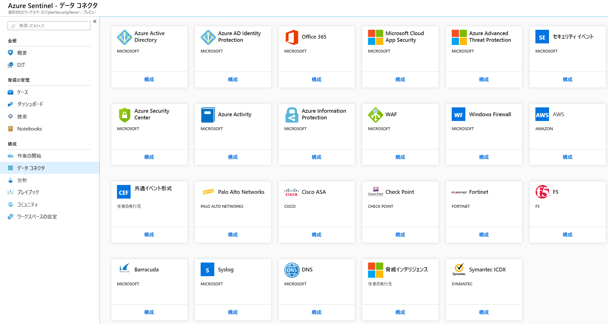
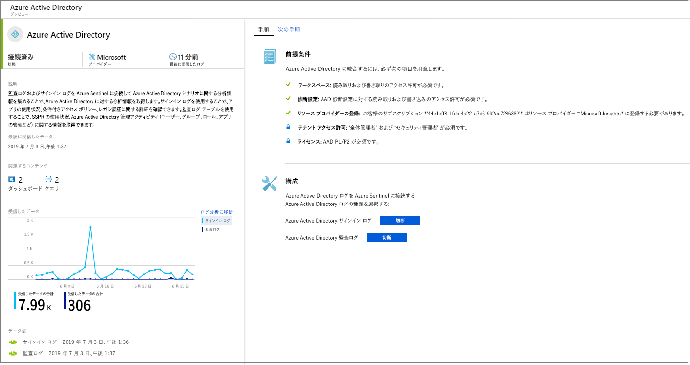
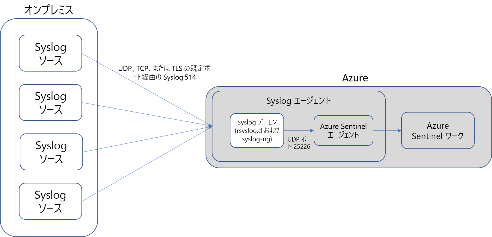
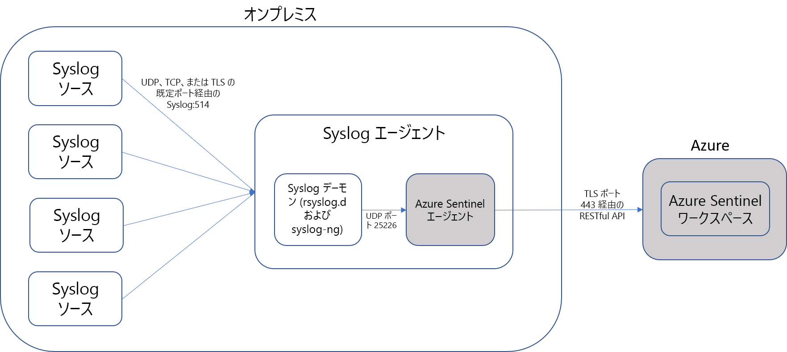

# データ ソースの接続

Azure Sentinel をオンボードするには、まずデータ ソースに接続する必要があります。 Azure Sentinel には、Microsoft Threat Protection ソリューションや Microsoft 365 ソース (Office 365、Azure AD、Azure ATP、Microsoft Cloud App Security) など、すぐに使用できるリアルタイム統合を提供する Microsoft ソリューション用コネクタが多数付属しています。 さらに、Microsoft 以外のソリューション用のより広範なセキュリティ エコシステムへの組み込みコネクタがあります。 一般的なイベント形式 (Syslog や REST-API) を使用して、データ ソースを Azure Sentinel に接続することもできます。  

1. メニューで **[Data connectors]\(データ コネクタ\)** を選択します。 このページでは、Azure Sentinel で提供されているコネクタとその状態の完全な一覧を表示できます。 接続するコネクタを選択し、 **[Open connector page]\(コネクタ ページを開く\)** を選択します。 

   

1. 特定のコネクタのページで、すべての前提条件を満たしたことを確認し、指示に従って Azure Sentinel にデータを接続します。 ログで Azure Sentinel との同期が開始されるまでには、しばらく時間がかかる場合があります。 接続した後、データの概要 ( **[Data received]\(受信データ\)** グラフ) と、データの種類の接続状態が表示されます。

   
  
1. **[Next steps]\(次のステップ\)** タブをクリックすると、特定のデータの種類に対して Azure Sentinel によって標準で提供されるコンテンツの一覧が表示されます。

   
 

## データ接続方法

Azure Sentinel では、次のデータ接続方法がサポートされています。

- **サービス間の統合**:  AWS や Microsoft サービスなどの一部のサービスはネイティブに接続されるので、標準統合用の Azure 基盤を利用して、ほんの数回のクリックで次のソリューションを接続できます。
    - [アマゾン ウェブ サービス - CloudTrail](connect-aws.md)
    - [Azure アクティビティ](connect-azure-activity.md)
    - [Azure AD 監査ログとサインイン](connect-azure-active-directory.md)
    - [Azure AD Identity Protection](connect-azure-ad-Identity-protection.md)
    - [Azure Advanced Threat Protection](connect-azure-atp.md)
    - [Azure Information Protection](connect-azure-information-protection.md)
    - [Azure Security Center](connect-azure-security-center.md)
    - [Cloud App Security](connect-cloud-app-security.md)
    - [ドメイン ネーム サーバー](connect-dns.md)
    - [Office 365](connect-office-365.md)
    - [Microsoft Defender ATP](connect-microsoft-defender-advanced-threat-protection.md)
    - [Microsoft Web アプリケーション ファイアウォール](connect-microsoft-waf.md)
    - [Windows ファイアウォール](connect-windows-firewall.md)
    - [Windows セキュリティ イベント](connect-windows-security-events.md)

- **API による外部ソリューション**:一部のデータ ソースは、接続されるデータ ソースによって提供される API を使用して接続されます。 通常、ほとんどのセキュリティ テクノロジでは、イベント ログの取得に使用できる API のセットが提供されています。API を使用して、Azure Sentinel に接続し、特定の種類のデータを収集して、Azure Log Analytics に送信します。 API を使用して接続されるアプライアンスは次のとおりです。
    - [Barracuda](connect-barracuda.md)
    - [Barracuda CloudGen Firewall](connect-barracuda-cloudgen-firewall.md)
    - [Citrix Analytics (セキュリティ)](connect-citrix-analytics.md)
    - [F5 BIG-IP](connect-f5-big-ip.md)
    - [Forcepoint DLP](connect-forcepoint-dlp.md)
    - [Squadra Technologies secRMM](connect-squadra-secrmm.md)
    - [Symantec ICDX](connect-symantec.md)
    - [Zimperium](connect-zimperium-mtd.md)

- **エージェントによる外部ソリューション**:Azure Sentinel は、Syslog プロトコルを使用してリアルタイムのログ ストリーミングを実行できる他のすべてのデータ ソースに対し、エージェントを使用して接続できます。  ほとんどのアプライアンスでは、Syslog プロトコルを使用して、ログ自体とログに関するデータが含まれるイベント メッセージが送信されます。 ログの形式は異なりますが、ほとんどのアプライアンスでは、Common Event Format (CEF) に基づくログ データの書式設定がサポートされています。  Log Analytics エージェントに基づく Azure Sentinel エージェントでは、CEF 形式のログが、Log Analytics で取り込むことのできる形式に変換されます。 アプライアンスの種類により、エージェントは、アプライアンス上に直接、または専用の Linux サーバー上にインストールされます。 Linux 用エージェントは、UDP 経由で Syslog デーモンからイベントを受信しますが、Linux マシンで大量の Syslog イベントを収集することが予想される場合は、イベントは TCP 経由で Syslog デーモンからエージェントに送信され、そこから Log Analytics に送信されます。
    - ファイアウォール、プロキシ、エンドポイント:
        - [Check Point](connect-checkpoint.md)
        - [Cisco ASA](connect-cisco.md)
        - [ExtraHop Reveal(x)](connect-extrahop.md)
        - [F5](connect-f5.md)
        - [Forcepoint 製品](connect-forcepoint-casb-ngfw.md)
        - [Fortinet](connect-fortinet.md)
        - [Palo Alto Networks](connect-paloalto.md)
        - [One Identity Safeguard](connect-one-identity.md)
        - [その他の CEF アプライアンス](connect-common-event-format.md)
        - [その他の Syslog アプライアンス](connect-syslog.md)
        - [Trend Micro Deep Security](connect-trend-micro.md)
        - [Zscaler](connect-zscaler.md)
    - DLP ソリューション
    - [脅威インテリジェンス プロバイダー](connect-threat-intelligence.md)
    - [DNS マシン](connect-dns.md) - DNS マシンに直接インストールされたエージェント
    - Linux サーバー
    - その他のクラウド
    
## エージェントの接続オプション

外部のアプライアンスを Azure Sentinel に接続するには、エージェントを専用のマシン (VM またはオンプレミス) に展開して、アプライアンスと Azure Sentinel の間の通信をサポートする必要があります。 エージェントのデプロイは、自動または手動で行うことができます。 自動デプロイは、専用マシンが Azure に作成中の新しい VM である場合にのみ使用できます。 

または、既存の Azure VM、別のクラウド内の VM、またはオンプレミスのコンピューターに、手動でエージェントをデプロイすることもできます。

## Azure Sentinel 接続オプションを使用してデータ型をマップする

| **データの種類** | **接続する方法** | **データ コネクタか?** | **コメント** |
|------|---------|-------------|------|
| AWSCloudTrail | [AWS の接続](connect-aws.md) | V | |
| AzureActivity | [Azure アクティビティの接続](connect-azure-activity.md)と[アクティビティ ログの概要](../azure-monitor/platform/platform-logs-overview.md)| V | |
| AuditLogs | [Azure AD の接続](connect-azure-active-directory.md)  | V | |
| SigninLogs | [Azure AD の接続](connect-azure-active-directory.md)  | V | |
| AzureFirewall |[Azure Diagnostics](../firewall/tutorial-diagnostics.md) | V | |
| InformationProtectionLogs_CL  | [Azure Information Protection レポート](https://docs.microsoft.com/azure/information-protection/reports-aip) [Azure Information Protection の接続](connect-azure-information-protection.md)  | V | 通常、これにはデータ型に加えて **InformationProtectionEvents** 関数が使用されます。 詳細については、「[レポートを変更し、カスタム クエリを作成する方法](https://docs.microsoft.com/azure/information-protection/reports-aip#how-to-modify-the-reports-and-create-custom-queries)」を参照してください。|
| AzureNetworkAnalytics_CL  | [トラフィック分析スキーマ](../network-watcher/traffic-analytics.md) [トラフィック分析](../network-watcher/traffic-analytics.md)  | | |
| CommonSecurityLog  | [CEF の接続](connect-common-event-format.md)  | V | |
| OfficeActivity | [Office 365 の接続](connect-office-365.md) | V | |
| SecurityEvents | [Windows セキュリティ イベントの接続](connect-windows-security-events.md)  | V | セキュリティで保護されていないプロトコル ブックについては、[セキュリティで保護されていないプロトコル ブックの設定](/azure/sentinel/quickstart-get-visibility#use-built-in-workbooks)に関する記事を参照してください。  |
| syslog | [Syslog の接続](connect-syslog.md) | V | |
| Microsoft Web アプリケーション ファイアウォール (WAF) - (AzureDiagnostics) |[Microsoft Web アプリケーション ファイアウォールの接続](connect-microsoft-waf.md) | V | |
| SymantecICDx_CL | [Symantec の接続](connect-symantec.md) | V | |
| ThreatIntelligenceIndicator  | [脅威インテリジェンスの接続](connect-threat-intelligence.md)  | V | |
| VMConnection   ServiceMapComputer_CL  ServiceMapProcess_CL|  [Azure Monitor サービス マップ](../azure-monitor/insights/service-map.md) [Azure Monitor VM の Insights のオンボード](../azure-monitor/insights/vminsights-onboard.md)   [Azure Monitor VM の Insights を有効にする](../azure-monitor/insights/vminsights-enable-overview.md)   [シングル VM のオンボードでの使用](../azure-monitor/insights/vminsights-enable-single-vm.md)   [ポリシーによるオンボードの使用](../azure-monitor/insights/vminsights-enable-at-scale-policy.md)| X | VM Insights ブック  |
| DnsEvents | [DNS の接続](connect-dns.md) | V | |
| W3CIISLog | [IIS ログの接続](../azure-monitor/platform/data-sources-iis-logs.md)  | X | |
| WireData | [ワイヤ データの接続](../azure-monitor/insights/wire-data.md) | X | |
| WindowsFirewall | [Windows ファイアウォールの接続](connect-windows-firewall.md) | V | |
| AADIP SecurityAlert  | [Azure AD Identity Protection への接続](connect-azure-ad-identity-protection.md)  | V | |
| AATP SecurityAlert  | [Azure ATP の接続](connect-azure-atp.md) | V | |
| ASC SecurityAlert  | [Azure Security Center の接続](connect-azure-security-center.md)  | V | |
| MCAS SecurityAlert  | [Microsoft Cloud App Security の接続](connect-cloud-app-security.md)  | V | |
| SecurityAlert | | | |
| Sysmon (イベント) | [Sysmon の接続](https://azure.microsoft.com/blog/detecting-in-memory-attacks-with-sysmon-and-azure-security-center)  [Windows イベントの接続](../azure-monitor/platform/data-sources-windows-events.md)   [Sysmon Parser の入手](https://github.com/Azure/Azure-Sentinel/blob/master/Parsers/SysmonParser.txt)| X | 既定では、Sysmon コレクションは仮想マシンにインストールされません。 Sysmon エージェントのインストール方法の詳細については、[Sysmon](https://docs.microsoft.com/sysinternals/downloads/sysmon) に関する記事を参照してください。 |
| ConfigurationData  | [VM インベントリの自動化](../automation/automation-vm-inventory.md)| X | |
| ConfigurationChange  | [VM の追跡の自動化](../automation/change-tracking.md) | X | |
| F5 BIG-IP | [F5 BIG-IP の接続](https://devcentral.f5.com/s/articles/Integrating-the-F5-BIGIP-with-Azure-Sentinel)  | X | |
| McasShadowItReporting  |  | X | |
| Barracuda_CL | [Barracuda の接続](connect-barracuda.md) | V | |

## 次のステップ

- Azure Sentinel を使用するには、Microsoft Azure のサブスクリプションが必要です。 サブスクリプションがない場合は、 [無料試用版](https://azure.microsoft.com/free/)にサインアップできます。
- [データを Azure Sentinel にオンボード](quickstart-onboard.md)し、[データや潜在的な脅威を視覚化する](quickstart-get-visibility.md)方法を確認します。
