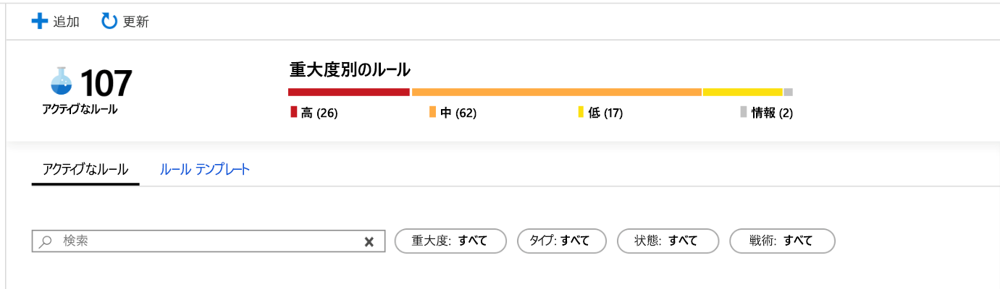
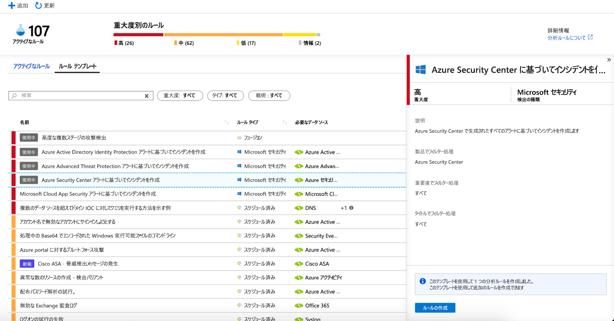
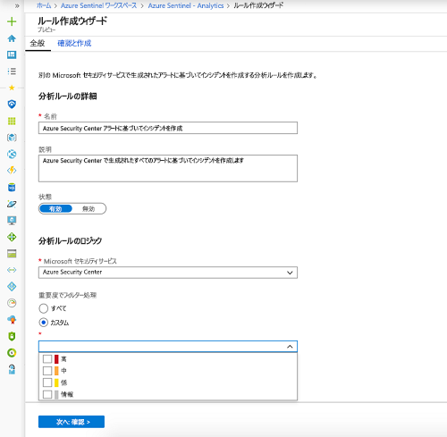
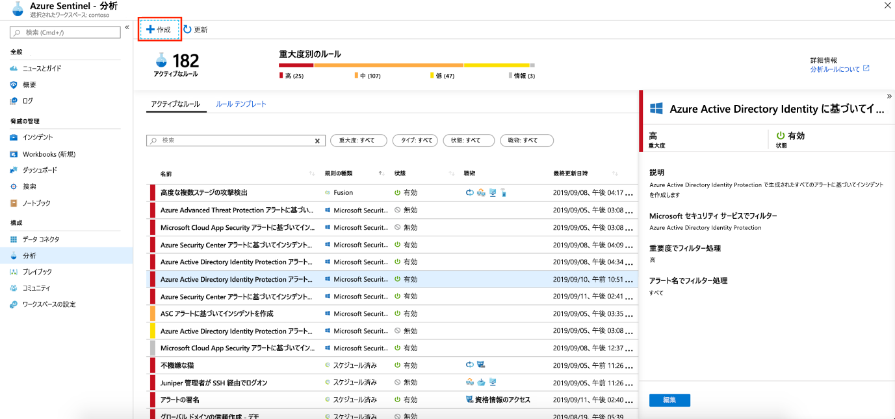

# Microsoft セキュリティ アラートからインシデントを自動的に作成する

Microsoft Cloud App Security や Azure Advanced Threat Protection など、Azure Sentinel に接続されている Microsoft セキュリティ ソリューションでトリガーされたアラートによって、自動的に Azure Sentinel にインシデントは作成されません。 既定では、Microsoft ソリューションを Azure Sentinel に接続すると、そのサービスで生成されたアラートは、Azure Sentinel の Azure Sentinel ワークスペースのセキュリティ アラート テーブルに生データとして格納されます。 そのデータは、Sentinel に接続する他の生データと同様に使用できます。

この記事の手順に従って、接続されている Microsoft セキュリティ ソリューションでアラートがトリガーされるたびに自動的にインシデントを作成するように Azure Sentinel を簡単に構成できます。

## 前提条件
セキュリティ サービスのアラートからインシデントを作成できるようにするには、[Microsoft セキュリティ ソリューションを接続する](connect-data-sources.md#data-connection-methods)必要があります。

## Microsoft セキュリティ インシデントの作成分析ルールの使用

Azure Sentinel で利用できる組み込みのルールを使用して、どの接続された Microsoft セキュリティ ソリューションで Azure Sentinel インシデントをリアルタイムで自動的に作成するかを選択します。 また、ルールを編集して、Microsoft セキュリティ ソリューションによって生成されたアラートのうち Azure Sentinel にインシデントを作成する必要があるものをフィルター処理する、より具体的なオプションを定義することもできます。 たとえば、重要度の高い Azure Security Center アラートからのみ Azure Sentinel インシデントを自動的に作成することを選択できます。

1. Azure portal の Azure Sentinel の下で **[Analytics]** を選択します。

1. **[Rule templates]\(ルール テンプレート\)** を選択してすべての組み込みの分析ルールを表示します。

    

1. 使用する **Microsoft セキュリティ**分析ルールテンプレートを選択し、 **[ルールの作成]** をクリックします。

    

1. ルールの詳細を変更して、アラートの重要度またはアラートの名前に含まれるテキストでインシデントを作成するアラートをフィルター処理するように選択できます。  
      
    たとえば、 **[Microsoft security service]\(Microsoft セキュリティ サービス\)** フィールドで **[Azure Security Center]** を選択し、 **[Filter by severity]\(重要度でフィルター\)** フィールドで **[高]** を選択した場合、重要度が高い Azure Security Center アラートでのみ Azure Sentinel にインシデントが自動的に作成されます。  

    

1. また、 **[+ 作成]** をクリックし、 **[Microsoft incident creation rule]\(Microsoft インシデント作成ルール\)** を選択して、別の Microsoft セキュリティ サービスのアラートをフィルター処理する新しい **Microsoft セキュリティ ルール**を作成することもできます。

    

  **Microsoft セキュリティ サービス**の種類ごとに、複数の **Microsoft セキュリティ**分析ルールを作成できます。 これにより、各ルールがフィルターとして使用されるため、重複するインシデントは作成されません。 アラートが複数の **Microsoft セキュリティ**分析ルールと一致する場合でも、1 つの Azure Sentinel インシデントのみが作成されます。

## 接続時にインシデント生成を自動的に有効にする
 Microsoft セキュリティ ソリューションを接続するときに、セキュリティ ソリューションのアラートによってインシデントが Azure Sentinel に自動的に生成されるようにするかどうかを選択できます。

1. Microsoft セキュリティ ソリューションのデータ ソースを接続します。 

   

1. **[Create incidents]\(インシデントの作成\)** で **[有効化]** を選択して、接続されたセキュリティ サービスで生成されたアラートからインシデントを自動的に作成する既定の分析ルールを有効にします。 次に、 **[分析]** でこのルールを編集してから、 **[Active rules]\(アクティブなルール\)** を選択します。

## 次のステップ

- Azure Sentinel を使用するには、Microsoft Azure のサブスクリプションが必要です。 サブスクリプションがない場合は、 [無料試用版](https://azure.microsoft.com/free/)にサインアップできます。
- [データを Azure Sentinel にオンボード](quickstart-onboard.md)し、[データや潜在的な脅威を視覚化する](quickstart-get-visibility.md)方法を確認します。
