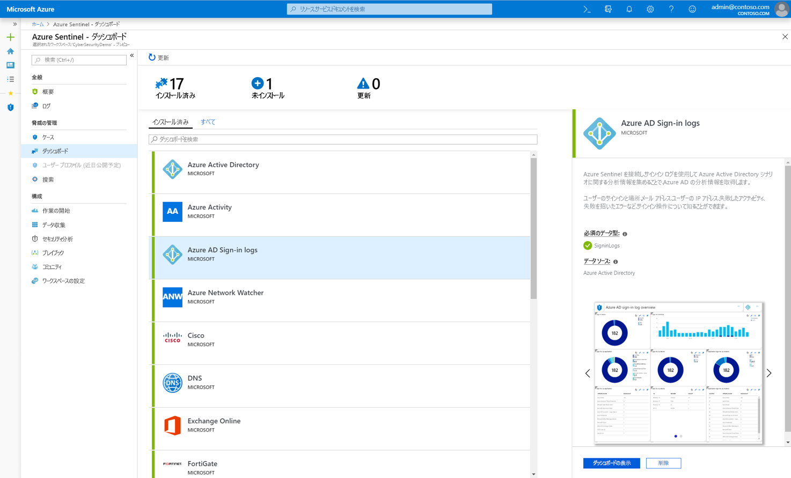
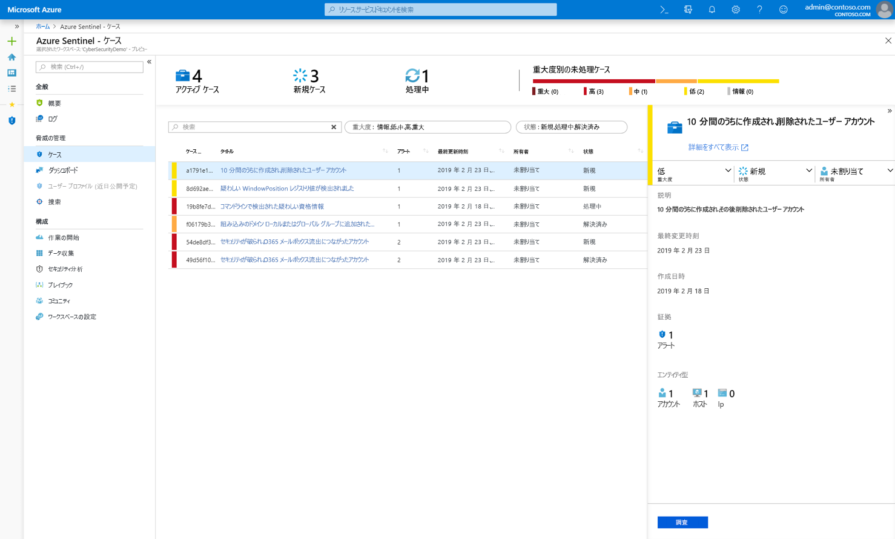
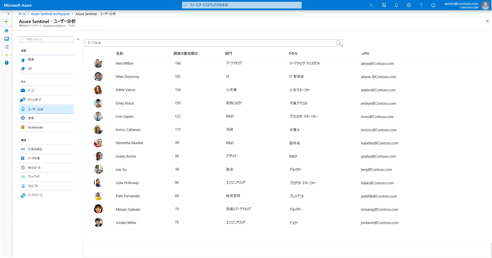

# Azure Sentinel プレビューの概要

> [!IMPORTANT]
> 現在、Azure Sentinel はパブリック プレビュー段階にあります。
> このプレビュー バージョンはサービス レベル アグリーメントなしで提供されています。運用環境のワークロードに使用することはお勧めできません。 特定の機能はサポート対象ではなく、機能が制限されることがあります。 詳しくは、[Microsoft Azure プレビューの追加使用条件](https://azure.microsoft.com/support/legal/preview-supplemental-terms/)に関するページをご覧ください。

Microsoft Azure Sentinel は、スケーラブルでクラウドネイティブ型の**セキュリティ情報イベント管理 (SIEM)** および**セキュリティ オーケストレーション自動応答 (SOAR)** ソリューションです。 Azure Sentinel は、高度なセキュリティ分析と脅威インテリジェンスを企業全体で実現し、アラートの検出、脅威の可視性、予防的な捜索、および脅威への対応のための 1 つのソリューションを提供します。 

Azure Sentinel を使用すると、ますます巧妙化する攻撃、増加するアラート、長い解決期間のストレスを軽減し、企業全体を俯瞰できます。

- **クラウドの規模でデータを収集**します。オンプレミスと複数のクラウド内の両方ですべてのユーザー、デバイス、アプリケーション、インフラストラクチャにわたって収集します。 

- **以前に検出されなかった脅威を検出**します。Microsoft の 分析と類を見ない脅威インテリジェンスを使用して、誤判定を最小限に抑えます。 

- **人工知能を使用して脅威を調査**します。Microsoft の長年にわたるサイバー セキュリティ業務を活用しながら、大規模に疑わしいアクティビティを捜索します。 

- **インシデントに迅速に対応**します。一般的なタスクの組み込みのオーケストレーションとオートメーションを使用します。

Azure Sentinel は、既存のさまざまな Azure サービスを基に構築され、Log Analytics や Logic Apps などの実績のある基盤をネイティブに組み込んでいます。 Azure Sentinel は、AI による調査と検出を強化し、Microsoft の脅威インテリジェンス ストリームを提供しています。また、ユーザーが独自の脅威インテリジェンスを取り入れることもできます。 

 
## すべてのデータに接続する

Azure Sentinel をオンボードするには、まず[セキュリティ ソースに接続する](connect-data-sources.md)必要があります。 Azure Sentinel には、Microsoft Threat Protection ソリューションや Microsoft 365 ソース (Office 365、Azure AD、Azure ATP、Microsoft Cloud App Security) など、すぐに使用できるリアルタイム統合を提供する Microsoft ソリューション用コネクタが多数付属しています。 さらに、Microsoft 以外のソリューション用のより広範なセキュリティ エコシステムへの組み込みコネクタがあります。 一般的なイベント形式 (Syslog や REST-API) を使用して、データ ソースを Azure Sentinel に接続することもできます。  

## ダッシュボード

データ ソースを接続した後、[優れた設計のダッシュボード](quickstart-get-visibility.md#dashboards)のギャラリーから選択し、データ ソースの分析情報を表示することができます。 各ダッシュボードは完全にカスタマイズ可能です。独自のロジックを追加する、クエリを変更する、または一からダッシュボードを作成することができます。

ダッシュボードには、高度な分析を使用して対話型の視覚的な情報が表示されるので、セキュリティ アナリストは攻撃中に状況をより深く理解できます。 調査ツールを使用すると、任意のデータから任意の分野について深く掘り下げて脅威の状況を迅速に把握できます。 

## Analytics

ノイズを減らし、確認および調査する必要があるアラートの数を最小限に抑えるために、Azure Sentinel は[分析を使用してアラートをケースに関連付けます](tutorial-detect-threats.md)。 **ケース**は、調査して解決できる対応可能な脅威をまとめた、関連するアラートのグループです。 組み込みの相関関係ルールをそのまま使用するか、独自のルールを作成する際の出発点として使用します。 Azure Sentinel には、ネットワークの動作をマップし、リソース全体の異常を探すための機械学習ルールも用意されています。 これらの分析では、さまざまなエンティティに関する信頼度の低いアラートを組み合わせて信頼度の高いセキュリティ インシデントにすることで、点を結び付けます。

## ユーザー分析

Azure Sentinel は、機械学習 (ML) と[ユーザー分析](user-analytics.md)のネイティブ統合により、脅威を迅速に検出することができます。 Azure Sentinel は Azure Advanced Threat Protection とシームレスに統合され、アラート、および Azure Sentinel と Microsoft 365 全体の疑わしいアクティビティ パターンに基づいて、ユーザーの行動を分析し、最初に調査すべきユーザーに優先順位を付けます。

## セキュリティのオートメーションとオーケストレーション

一般的なタスクを自動化し、Azure サービスおよび既存のツールと統合する[プレイブックを使用してセキュリティ オーケストレーションを簡略化](tutorial-respond-threats-playbook.md)します。 Azure Logic Apps を基に構築された Azure Sentinel のオートメーションおよびオーケストレーション ソリューションは、新しいテクノロジや脅威が発生したときにスケーラブルなオートメーションを可能にする高度に拡張可能なアーキテクチャを備えています。 Azure Logic Apps を使用してプレイブックを作成する際は、成長を続けている組み込みプレイブックのギャラリーから選択できます。 これらには、Azure Functions などのサービス用に [200 以上のコネクタ](https://docs.microsoft.com/azure/connectors/apis-list)が含まれます。 コネクタを使用すると、コード、ServiceNow、Jira、Zendesk、HTTP 要求、Microsoft Teams、Slack、Windows Defender ATP、および Cloud App Security に任意のカスタム ロジックを適用できます。

たとえば、ServiceNow チケット発行システムを使用している場合は、提供されているツールを使用して、Azure Logic Apps を使用してワークフローを自動化し、特定のイベントが検出されるたびに ServiceNow でチケットを開くことができます。

## 調査

Azure Sentinel の[詳細調査](tutorial-investigate-cases.md)ツールは、潜在的なセキュリティの脅威の範囲を把握し、根本的な原因を見つけるために役立ちます。 対話型グラフ上のエンティティを選択し、特定のエンティティについて興味がある質問をして、そのエンティティとその関連性を掘り下げて脅威の根本的な原因を突き止めることができます。 

## 検出

MITER フレームワークに基づく Azure Sentinel の[強力な捜索検索およびクエリ ツール](hunting.md)を使用すると、アラートがトリガーされる前に、組織のデータ ソース全体でセキュリティの脅威を予防的に捜索することができます。 攻撃の可能性について重要な分析情報を提供する捜索クエリがわかったら、クエリに基づいてカスタム検出ルールを作成し、セキュリティ インシデントの対応者へのアラートとしてそのような分析情報を表示することができます。 捜索中に興味深いイベントのブックマークを作成し、後で戻って他のユーザーと共有し、他の関連イベントとグループ化して、説得力のある調査のケースを作成することができます。

## コミュニティ

Azure Sentinel コミュニティは、脅威の検出とオートメーションのための強力なリソースです。 Microsoft のセキュリティ アナリストは、新しいダッシュボード、プレイブック、捜索のクエリなどを常に作成して追加し、お客様の環境で使用できるようにそれらをコミュニティに投稿しています。 プライベート コミュニティの GitHub [リポジトリ](https://aka.ms/asicommunity)からサンプル コンテンツをダウンロードして、Azure Sentinel 用のカスタム ダッシュボード、捜索クエリ、ノートブック、プレイブックを作成できます。 

## 次の手順

- Azure Sentinel を使用するには、Microsoft Azure のサブスクリプションが必要です。 サブスクリプションがない場合は、 [無料試用版](https://azure.microsoft.com/free/)にサインアップできます。
- [データを Azure Sentinel にオンボード](quickstart-onboard.md)し、[データや潜在的な脅威を視覚化する](quickstart-get-visibility.md)方法を確認します。
