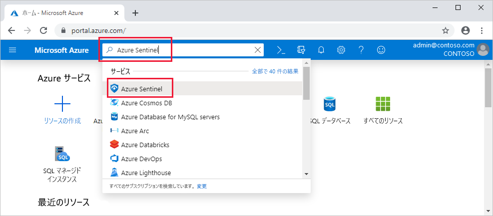

# クイック スタート:Azure Sentinel をオンボードする

このクイックスタートでは、Azure Sentinel をオンボードする方法について説明します。 

Azure Sentinel をオンボードするには、まず Azure Sentinel を有効にしてから、データ ソースを接続する必要があります。 Azure Sentinel には、Microsoft Threat Protection ソリューションや Microsoft 365 ソース (Office 365、Azure AD、Azure ATP、Microsoft Cloud App Security) など、すぐに使用できるリアルタイム統合を提供する Microsoft ソリューション用コネクタが多数付属しています。 さらに、Microsoft 以外のソリューション用のより広範なセキュリティ エコシステムへの組み込みコネクタがあります。 一般的なイベント形式 (Syslog や REST-API) を使用して、データ ソースを Azure Sentinel に接続することもできます。  

データ ソースを接続した後、優れた設計のブックのギャラリーから選択し、データに基づいて分析情報を表示できます。 これらのブックは、ニーズに合わせて簡単にカスタマイズできます。

>[!IMPORTANT] 
> Azure Sentinel の使用に伴う料金については、「[Azure Sentinel の価格](https://azure.microsoft.com/pricing/details/azure-sentinel/)」を参照してください。
  

## グローバルな前提条件

- アクティブな Azure サブスクリプションをお持ちでない場合は、開始する前に[無料アカウント](https://azure.microsoft.com/free/?WT.mc_id=A261C142F)を作成してください。

- Log Analytics ワークスペース。 [Log Analytics ワークスペースの作成方法](../log-analytics/log-analytics-quick-create-workspace.md)を確認してください。 Log Analytics ワークスペースの詳細については、「[Azure Monitor ログのデプロイの設計](../azure-monitor/platform/design-logs-deployment.md)」を参照してください。

- Azure Sentinel を有効にするには、Azure Sentinel ワークスペースが存在するサブスクリプションへの共同作成者のアクセス許可が必要です。 
- Azure Sentinel を使用するには、ワークスペースが属しているリソース グループに対する共同作成者または閲覧者のいずれかのアクセス許可が必要です。
- 特定のデータ ソースに接続するには、追加のアクセス許可が必要になる場合があります。
- Azure Sentinel は有料サービスです。 価格情報については、[Azure Sentinel の概要](https://go.microsoft.com/fwlink/?linkid=2104058)に関するページをご覧ください。
 
## Azure Sentinel を有効にする 

1. Azure portal にサインインします。 Azure Sentinel が作成されたときのサブスクリプションが選択されていることをご確認ください。

1. **Azure Sentinel** を検索して選択します。

   

1. **[追加]** を選択します。

1. 使用するワークスペースを選択するか、新しいワークスペースを作成します。 複数のワークスペースで Azure Sentinel を実行できますが、データは 1 つのワークスペースに分離されます。

   

   >[!NOTE] 
   > - Azure Security Center で作成した既定のワークスペースが一覧に表示されない場合、そこに Azure Sentinel をインストールすることはできません。
   > - Azure Sentinel は、中国、ドイツ、および Azure Government の各リージョンを除く、[Log Analytics の一般公開リージョン](https://azure.microsoft.com/global-infrastructure/services/?products=monitor)のワークスペースで実行できます。 Azure Sentinel によって生成されるデータ (これらのワークスペースをソースとする顧客データを含む可能性がある、インシデント、ブックマーク、アラート ルールなど) は、西ヨーロッパ (ヨーロッパにあるワークスペースの場合) または米国東部 (すべての米国ベースのワークスペースおよびヨーロッパを除くその他のリージョンの場合) で保存されます。

1. **[Add Azure Sentinel]\(Azure Sentinel の追加\)** を選択します。
  

## データ ソースの接続

Azure Sentinel でサービスとアプリへの接続を確立するには、サービスに接続して、Azure Sentinel にイベントとログを転送します。 マシンと仮想マシンの場合、ログを収集し、そのログを Azure Sentinel に転送する Azure Sentinel エージェントをインストールできます。 ファイアウォールとプロキシの場合、Azure Sentinel は Linux Syslog サーバーを利用します。 エージェントがインストールされているなら、エージェントはそこからログ ファイルを収集し、そのログを Azure Sentinel に転送します。 
 
1. **[データ収集]** をクリックします。
2. 接続できるデータ ソースごとにタイルがあります。 
たとえば、 **[Azure Active Directory]** をクリックします。 このデータ ソースを接続する場合は、Azure AD から Azure Sentinel にすべてのログをストリーミングします。 サインイン ログや監査ログなど、取得するログの種類を選択できます。  
Azure Sentinel の下部には、各コネクタにインストールする必要のあるブックに関する推奨事項が示されているため、データ全体の興味深い分析をすぐに得ることができます。   インストール手順を実行するか、[関連する接続のガイドを参照](connect-data-sources.md)して詳細をご確認ください。 データ コネクタについては、「[Microsoft サービスの接続](connect-data-sources.md)」をご覧ください。

データ ソースが接続されると、データは Azure Sentinel にストリーミングされ、操作を開始できます。 [組み込みのダッシュボード](quickstart-get-visibility.md)でログを表示し、Log Analytics でクエリをビルドして[データを調査](tutorial-investigate-cases.md)できます。

## 次のステップ
このドキュメントでは、データ ソースを Azure Sentinel に接続する方法を説明しました。 Azure Sentinel の詳細については、次の記事をご覧ください。
- [データと潜在的な脅威を可視化](quickstart-get-visibility.md)する方法についての説明。
- [Azure Sentinel を使用した脅威の検出](tutorial-detect-threats-built-in.md)の概要。
- [一般的なイベント形式のアプライアンス](connect-common-event-format.md)から Azure Sentinel へのデータのストリーム配信。
