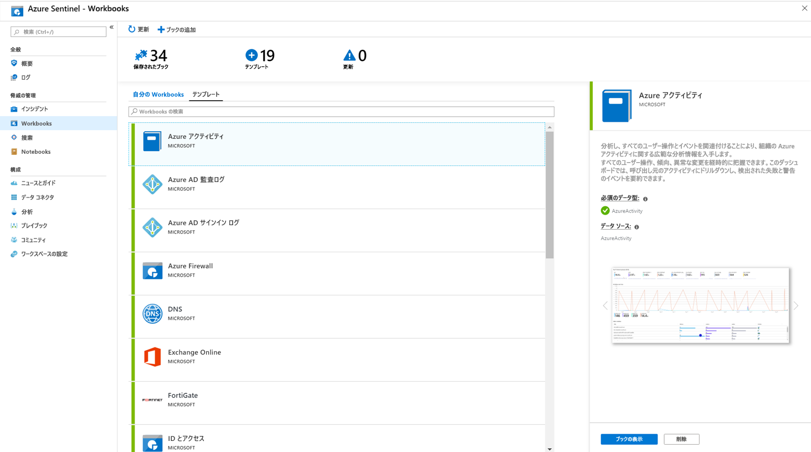

# チュートリアル: データの視覚化と監視

Azure Sentinel に [データ ソースを接続](quickstart-onboard.md) した後、Azure Sentinel による Azure Monitor ブックの適用を使用して、データを視覚化および監視できます。これにより、多用途のカスタム ダッシュボードを作成できます。 ブックの表示は Azure Sentinel では異なりますが、[Azure Monitor ブックを使用して対話型レポートを作成する](../azure-monitor/app/usage-workbooks.md)方法を確認すると役立つ場合があります。 Azure Sentinel を使用すると、データ全体に対してカスタム ブックを作成できます。また、用意されている組み込みのブック テンプレートを使用してデータ ソースに接続すると、すぐにデータ全体の分析情報をすばやく得ることもできます。

このチュートリアルは、Azure Sentinel でデータを視覚化するのに役立ちます。
> [!div class="checklist"]
> * 組み込みのブックを使用する
> * 新しいブックを作成する

## 前提条件

- Azure Sentinel ワークスペースのリソース グループに対して、少なくともブックの閲覧者またはブックの共同作成者のアクセス許可が必要です。

> [!NOTE]
> Azure Sentinel で表示されるブックは、Azure Sentinel ワークスペースのリソース グループ内に保存され、作成されたワークスペースごとにタグ付けされます。

## 組み込みのブックを使用する

1. **[ブック]** にアクセスし、 **[テンプレート]** を選択して、Azure Sentinel の組み込みのブックの完全な一覧を表示します。 どれが接続しているデータ型と関連しているかを確認する場合、Azure Sentinel に関連データが既にストリーミングされている場合には各ブックの **[Required data types]\(必要なデータ型\)** フィールドでそのデータ型の隣に緑色のチェックマークが表示されます。
  
1. データが設定されているテンプレートを確認するには、 **[ブックの表示]** をクリックします。
  
1. ブックを編集するには、 **[保存]** を選択し、テンプレートの JSON ファイルを保存する場所を選択します。 

   > [!NOTE]
   > これにより、関連するテンプレートに基づいて Azure リソースが作成され、データではなく、テンプレートの JSON ファイル自体が保存されます。

1. **[ブックの表示]** を選択します。 次に、上部にある **[編集]** をクリックします。 ブックを編集し、必要に応じてカスタマイズできるようになりました。 ブックをカスタマイズする方法の詳細については、「[Azure Monitor ブックを使用した対話型レポートの作成](../azure-monitor/app/usage-workbooks.md)」を参照してください。

1. 変更を行ったら、ブックを保存できます。 

1. 次のようにして、ブックを複製することもできます。 **[編集]** 、 **[名前を付けて保存]** の順に選択します。このとき、同じサブスクリプションとリソース グループの下に別の名前で保存してください。 これらのブックは、 **[My workbooks]\(自分のブック\)** タブに表示されます。

## 新しいブックを作成する

1. 新しいブックを最初から作成するには、 **[ブック]** 、 **[Add workbook]\(ブックの追加\)** の順に選択します。
  

1. ブックを編集するには、 **[編集]** を選択し、必要に応じてテキスト、クエリ、およびパラメーターを追加します。 ブックをカスタマイズする方法の詳細については、「[Azure Monitor ブックを使用した対話型レポートの作成](../azure-monitor/app/usage-workbooks.md)」を参照してください。 

1. クエリを作成するときに、 **[データ ソース]** を **[ログ]** に、 **[リソース タイプ]** を **[Log Analytics]** に設定してから、関連するワークスペースを選択します。 

1. ブックを作成したら、Azure Sentinel ワークスペースのサブスクリプションとリソース グループの下にブックを保存します。

1. 組織内の他のユーザーがブックを使用できるようにする場合は、 **[保存先]** で **[共有レポート]** を選択します。 このブックを自分だけが使用できるようにする場合は、 **[個人用レポート]** を選択します。

1. ワークスペース内のブックを切り替えるには、任意のブックの上部ウィンドウで **[開く]**  を選択します。 右側に表示されるウィンドウで、ブックを切り替えます。

   

## ブックを削除する方法

Azure Sentinel テンプレートから作成されたブックを削除することができます。 

カスタマイズ後のブックを削除するには、[ブック] ページで、削除する保存済みブックを選択し、 **[削除]** を選択します。 これにより、保存されたブックが削除されます。

> [!NOTE]
> これにより、リソースだけでなく、テンプレートに対して行った変更も削除されます。 元のテンプレートは引き続き使用できます。

## 次のステップ

このチュートリアルでは、Azure Sentinel でデータを表示する方法を学習しました。

脅威への対応を自動化する方法については、「[Azure Sentinel で脅威への自動対応を設定する](tutorial-respond-threats-playbook.md)」を参照してください。
