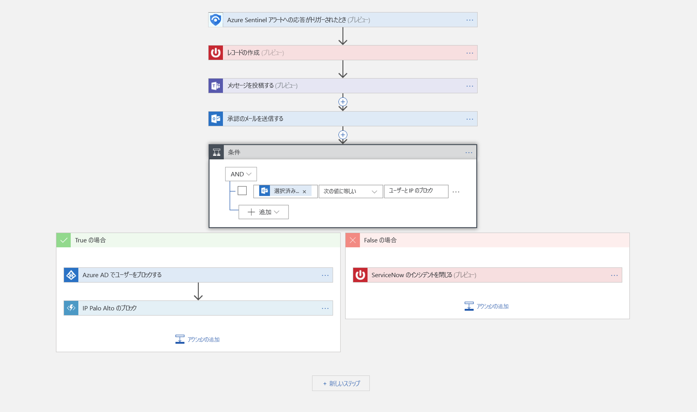

# チュートリアル:Azure Sentinel プレビューで脅威への自動対応を設定する

> [!IMPORTANT]
> 現在、Azure Sentinel はパブリック プレビュー段階にあります。
> このプレビュー バージョンはサービス レベル アグリーメントなしで提供されています。運用環境のワークロードに使用することはお勧めできません。 特定の機能はサポート対象ではなく、機能が制限されることがあります。 詳しくは、[Microsoft Azure プレビューの追加使用条件](https://azure.microsoft.com/support/legal/preview-supplemental-terms/)に関するページをご覧ください。

このチュートリアルは、Azure Sentinel でセキュリティ プレイブックを使用して、Azure Sentinel によって検出されたセキュリティ関連の問題 (脅威) への自動対応を設定するのに役立ちます。

> [!div class="checklist"]
> * プレイブックについて理解する
> * プレイブックを作成する
> * プレイブックを実行する
> * 脅威への対応を自動化する

## Azure Sentinel のセキュリティ プレイブックとは

セキュリティ プレイブックは、アラートに対する応答として Azure Sentinel から実行できる手順のコレクションです。 セキュリティ プレイブックを利用して、応答を自動化して調整することができます。セキュリティ プレイブックは手動で実行することも、特定のアラートがトリガーされたときに自動的に実行するように設定することもできます。 Azure Sentinel のセキュリティ プレイブックは [Azure Logic Apps](https://docs.microsoft.com/azure/logic-apps/logic-apps-what-are-logic-apps) を基にしているので、Logic Apps のすべての機能と組み込みテンプレートを利用でき、カスタマイズが可能です。 各プレイブックは選択した特定のサブスクリプションに対して作成されますが、[プレイブック] ページには、選択したサブスクリプションのすべてのプレイブックが表示されます。

> [!NOTE]
> プレイブックでは Azure Logic Apps が利用されるため、料金が適用されます。 詳細については、[Azure Logic Apps](https://azure.microsoft.com/pricing/details/logic-apps/) の価格ページを参照してください。

たとえば、悪意のある攻撃者によるネットワーク リソースへのアクセスを懸念している場合は、ネットワークにアクセスしている悪意のある IP アドレスを検出するアラートを設定できます。 次に、以下のことを実行するプレイブックを作成できます。
1. アラートがトリガーされたら、ServiceNow またはその他の IT チケット システムでチケットを開きます。
2. セキュリティ アナリストがインシデントを認識できるように、Microsoft Teams または Slack のセキュリティ オペレーション チャネルにメッセージを送信します。
3. シニア ネットワーク管理者とセキュリティ管理者に、アラートのすべての情報を送信します。この電子メール メッセージには、ユーザーが選択できる 2 つのボタン **[ブロック]** と **[無視]** も含まれています。
4. プレイブックは、管理者からの応答を受信した後も実行を続けます。
5. 管理者が **[ブロック]** を選択した場合、その IP アドレスはファイアウォールでブロックされ、該当するユーザーが Azure AD で無効になります。
6. 管理者が **[無視]** を選択した場合、Azure Sentinel でアラートが閉じられ、ServiceNow でインシデントが閉じられます。

セキュリティ プレイブックは、手動で実行することも自動的に実行することもできます。 手動で実行する場合、アラートを受け取ったときに、選択したアラートへの応答としてプレイブックをオンデマンドで実行することを選択できます。 自動的に実行する場合、関連付けの規則を作成する際に、アラートがトリガーされたときに自動的に 1 つまたは複数のプレイブックを実行するよう設定します。

## セキュリティ プレイブックを作成する

Azure Sentinel に新しいセキュリティ プレイブックを作成するには、次の手順に従います。

1. **Azure Sentinel** ダッシュボードを開きます。
2. **[管理]** で **[プレイブック]** を選択します。

   

3. **[Azure Sentinel - Playbooks (Preview)]\(Azure Sentinel - プレイブック (プレビュー)\)** ページで、 **[追加]** ボタンをクリックします。

    

4. **[ロジック アプリの作成]** ページで、新しいロジック アプリを作成するために要求された情報を入力し、 **[作成]** をクリックします。 

5. [**ロジック アプリ デザイナー**](../logic-apps/logic-apps-overview.md)で、使用するテンプレートを選択します。 資格情報が必要なテンプレートを選択した場合は、それらを指定する必要があります。 または、新しい空白のプレイブックを一から作成できます。 **[空のロジック アプリ]** を選択します。 

   

6. ロジック アプリ デザイナーが開き、そこでテンプレートを新規作成するか、編集することができます。 [Logic Apps](../logic-apps/logic-apps-create-logic-apps-from-templates.md) でプレイブックを作成する方法の詳細をご確認ください。

7. 空のプレイブックを作成する場合は、 **[すべてのコネクタとトリガーを検索する]** フィールドに「*Azure Sentinel*」と入力し、 **[When a response to an Azure Sentinel alert is triggered]\(Azure Sentinel 通知への応答がトリガーされるとき\)** を選択します。  新しいプレイブックが作成されると、 **[プレイブック]** 一覧に表示されます。 表示されない場合は、 **[更新]** をクリックしてください。 

7. これで、プレイブックをトリガーしたときの動作を定義できます。 アクション、論理条件、スイッチ ケースの条件、またはループを追加できます。

   

## セキュリティ プレイブックの実行方法

プレイブックをオンデマンドで実行できます。

プレイブックをオンデマンドで実行するには:

1. **[ケース]** ページで、ケースを選択して **[View full details]\(完全な詳細を表示\)** をクリックします。

2. **[アラート]** タブで、プレイブックを実行するアラートをクリックし、右側にスクロールして **[プレイブックの表示]** をクリックし、サブスクリプションで使用可能なプレイブックの一覧から、**実行**するプレイブックを選択します。 

## 脅威への対応を自動化する

SIEM や SOC チームには、定期的にセキュリティ アラートが殺到することがあります。 生成されるアラートの量が非常に多いため、対応するセキュリティ管理者は途方に暮れています。 この結果、多くのアラートを調査することができず、組織は見過ごした攻撃に対して脆弱なままになっていることがほとんどです。 

これらのアラートの多くは、ほとんどではないにしても、定義された特定の修復アクションで対処できる繰り返し発生するパターンに準拠しています。 Azure Sentinel では、プレイブック内で修復を定義することが既にできるようになっています。 また、プレイブック定義の一部としてリアルタイム オートメーションを設定して、特定のセキュリティ アラートに対する定義済みの対応を完全に自動化することもできます。 リアルタイム オートメーションを使用すると、対応チームは、繰り返し発生するタイプのアラートに対する所定の対応を完全に自動化することにより、作業負荷を大幅に削減できます。これにより、一般的でないアラート、パターンの分析、脅威ハンティングなどに専念することができます。

対応を自動化するには:

1. 対応を自動化するアラートを選択します。
1. Azure Sentinel ワークスペースのナビゲーション メニューから、 **[分析]** を選択します。
1. 自動化するアラートを選択します。 
1. **[アラート ルールの編集]** ページの **[Real-time automation]\(リアルタイム オートメーション\)** で、このアラート ルールが一致したときに実行する**トリガー対象のプレイブック**を選択します。
1. **[保存]** を選択します。

   

## 次の手順

このチュートリアルでは、Azure Sentinel でプレイブックを実行する方法を学習しました。 Azure Sentinel を使用して[脅威を予防的に捜索する方法](hunting.md)に進んでください。

