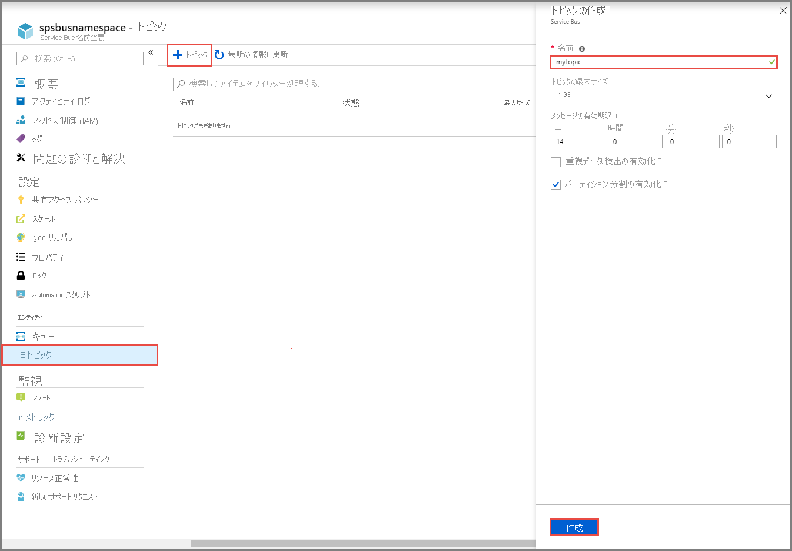
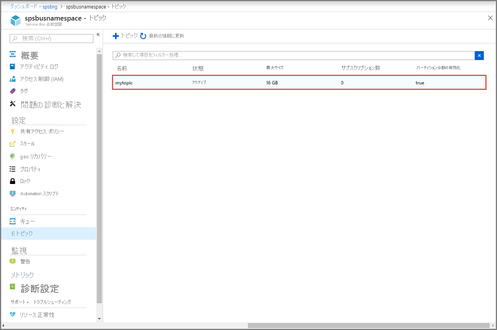
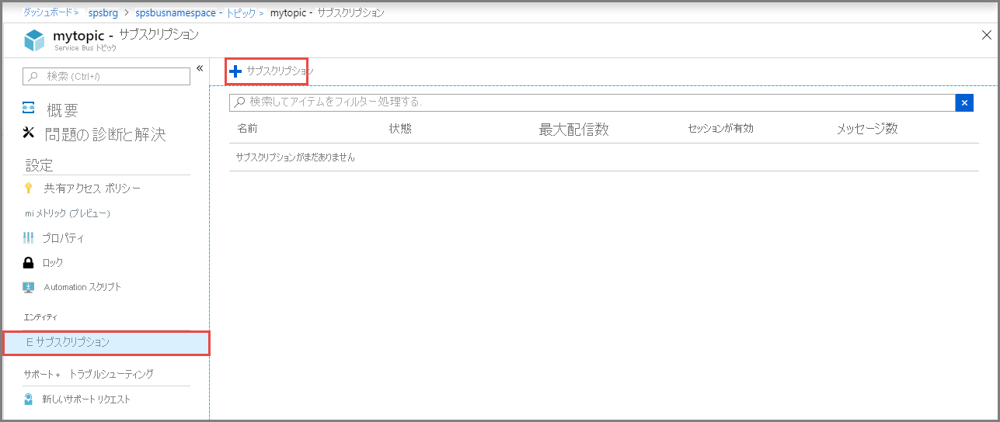

## Azure Portal を使用したトピックの作成
1. **[Service Bus 名前空間]** ページで、左側のメニューの **[トピック]** を選択します。
2. ツール バーの **[+ トピック]** を選択します。 
4. トピックの **名前** を入力します。 他のオプションは既定値のままにしてください。
5. **[作成]** を選択します。

    

## トピックに対するサブスクリプションを作成する
1. 前のセクションで作成した **トピック** を選択します。 
    
    
2. **[Service Bus トピック]** ページで、左側のメニューの **[サブスクリプション]** を選択し、ツール バーの **[+ サブスクリプション]** を選択します。 
    
    
3. **[サブスクリプションの作成]** ページで、次の手順に従います。
    1. サブスクリプションの **名前** として「**S1**」と入力します。
    1. **[最大配信数]** に「**3**」と入力します。
    1. 次に、 **[作成]** を選択してサブスクリプションを作成します。 

        ![[サブスクリプションの作成] ページ](./media/service-bus-create-topics-subscriptions-portal/create-subscription-page.png)
4. 前の手順を 2 回繰り返して、**S2** と **S3** というサブスクリプションを作成します。