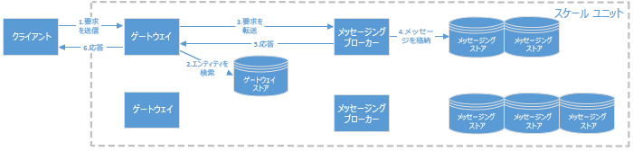
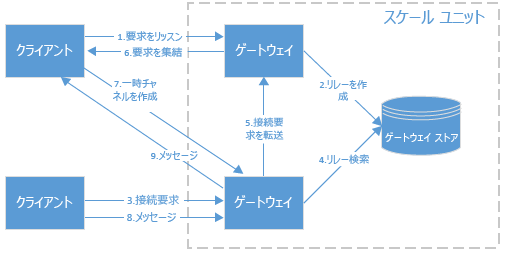

# Service Bus のアーキテクチャ
この記事では、Azure Service Bus のメッセージ処理アーキテクチャについて説明します。

## Service Bus スケール ユニット
Service Bus は、 *スケール ユニット*別に編成されます。 スケール ユニットはデプロイの単位であり、サービスの実行に必要なコンポーネントをすべては含みます。 各リージョンでは、1 つまたは複数の Service Bus スケール ユニットをデプロイします。

Service Bus の名前空間は、スケール ユニットにマップされます。 スケール ユニットは、すべての種類の Service Bus エンティティを処理します。Service Bus エンティティには、リレーとブローカー メッセージング エンティティ (キュー、トピック、サブスクリプション) があります。 Service Bus スケール ユニットは、次のコンポーネントで構成されています。

* **ゲートウェイ ノードのセット。** ゲートウェイ ノードは、受信要求を認証し、リレー要求を処理します。 各ゲートウェイ ノードには、パブリック IP アドレスが割り当てられます。
* **メッセージング ブローカー ノード。** メッセージング ブローカー ノードは、メッセージング エンティティに関する要求を処理します。
* **1 つのゲートウェイ ストア。** ゲートウェイ ストアは、このスケール ユニット内に定義されているすべてのエンティティのデータを保持します。 ゲートウェイ ストアは、SQL Azure データベース上に実装されます。
* **複数のメッセージング ストア。** メッセージング ストアは、このスケール ユニット内に定義されているすべてのキュー、トピック、およびサブスクリプションのメッセージを保持します。 また、すべてのサブスクリプション データも含まれています。 [パーティション分割されたメッセージング エンティティ](service-bus-partitioning.md)が有効でない限り、1 つのキューまたはトピックが 1 つのメッセージング ストアにマップされます。 サブスクリプションは、その親トピックと同じメッセージング ストアに格納されます。 Service Bus [Premium メッセージング](service-bus-premium-messaging.md)を除き、メッセージング ストアは、SQL Azure データベース上に実装されます。

## コンテナー
各メッセージング エンティティには、特定のコンテナーが割り当てられます。 コンテナーとは、1 つのメッセージング ストアだけを使用して、このコンテナーのすべての関連データを格納する論理構成です。 各コンテナーは、メッセージング ブローカー ノードに割り当てられます。 通常、メッセージング ブローカー ノードよりもコンテナーの数が多くなります。 そのため、各メッセージング ブローカー ノードは、複数のコンテナーを読み込みます。 メッセージング ブローカー ノードに対するコンテナーの配分は、すべてのメッセージング ブローカー ノードが均等に読み込まれるように編成されています。 読み込みパターンが変わった場合 (たとえば、1 つのコンテナーの負荷が非常に大きくなった場合)、またはメッセージング ブローカー ノードが一時的に使用できなくなった場合は、メッセージング ブローカー ノード間で、コンテナーが再配分されます。

## 受信メッセージ要求の処理
クライアントが Service Bus に要求を送信すると、その要求が Azure Load Balancer によってゲートウェイ ノードのいずれかにルーティングされます。 ゲートウェイ ノードは、要求を承認します。 要求がメッセージング エンティティ (キュー、トピック、サブスクリプション) に関連する場合は、ゲートウェイ ノードはゲートウェイ ストア内のエンティティを検索し、どのメッセージング ストアにエンティティがあるかを特定します。 その後、現在どのメッセージング ブローカー ノードがこのコンテナーにサービスを提供しているかを調べ、そのメッセージング ブローカー ノードに要求を送信します。 メッセージング ブローカー ノードは、要求を処理し、コンテナー ストア内のエンティティの状態を更新します。 その後、メッセージング ブローカー ノードはゲートウェイ ノードに応答を送信します。ゲートウェイ ノードは、元の要求を発行したクライアントに適切な応答を送信します。

## 受信リレー要求の処理
クライアントが Service Bus に要求を送信すると、その要求が Azure Load Balancer によってゲートウェイ ノードのいずれかにルーティングされます。 要求がリッスン要求である場合は、ゲートウェイ ノードは新しいリレーを作成します。 要求が特定のリレーへの接続要求の場合は、ゲートウェイ ノードはリレーを所有するゲートウェイ ノードに接続要求を転送します。 リレーを所有するゲートウェイ ノードは、リッスンしているクライアントにランデブー要求を送信します。その際、接続要求を受信したゲートウェイ ノードへの一時的なチャネルを作成するようリスナーに求めます。

リレー接続が確立されると、クライアントはランデブーに使用されるゲートウェイ ノードを経由してメッセージを交換できます。

## 次のステップ
Service Bus アーキテクチャの概要を確認しました。詳細については、次のリンクを参照してしてください。

* [Service Bus メッセージングの概要](service-bus-messaging-overview.md)
* [Azure Relay の概要](../service-bus-relay/relay-what-is-it.md)
* [Service Bus の基礎](service-bus-fundamentals-hybrid-solutions.md)
* [Service Bus キューを使用するキューに格納されたメッセージング ソリューション](service-bus-dotnet-multi-tier-app-using-service-bus-queues.md)

