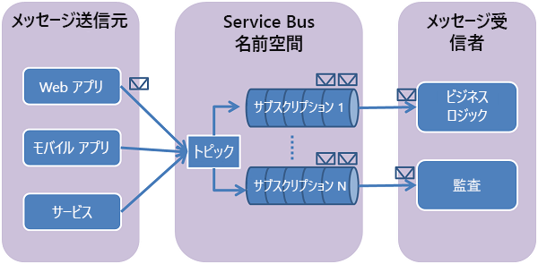

# <a name="how-to-use-service-bus-topics-and-subscriptions-with-java"></a>Java で Service Bus のトピックとサブスクリプションを使用する方法

[!INCLUDE [service-bus-selector-topics](../../includes/service-bus-selector-topics.md)]

このガイドでは、Service Bus のトピックとサブスクリプションの使用方法について説明します。 サンプルは Java で記述され、[Azure SDK for Java][Azure SDK for Java] を使用しています。 ここでは、**トピックとサブスクリプションの作成**、**サブスクリプション フィルターの作成**、**トピックへのメッセージの送信**、**サブスクリプションからのメッセージの受信**、**トピックとサブスクリプションの削除**などのシナリオについて説明します。

## <a name="what-are-service-bus-topics-and-subscriptions"></a>Service Bus トピックとサブスクリプションとは
Service Bus のトピックとサブスクリプションは、メッセージ通信の *発行/サブスクライブ* モデルをサポートします。 トピックとサブスクリプションを使用すると、分散アプリケーションのコンポーネントが互いに直接通信することがなくなり、仲介者の役割を果たすトピックを介してメッセージをやり取りすることになります。



各メッセージが 1 つのコンシューマーによって処理される Service Bus キューとは異なり、トピックとサブスクリプションでは、発行/サブスクライブ パターンを使用した "1 対多" 形式の通信を行います。 複数のサブスクリプションを 1 つのトピックに登録できます。 トピックに送信されたメッセージはサブスクリプションに渡され、各サブスクリプションで独立して処理できます。

トピックにとってのサブスクリプションは、トピックに送信されたメッセージのコピーを受け取る仮想キューのようなものです。 トピックに対するフィルター ルールをサブスクリプション単位で登録することもできます。この場合、トピックに送信されるどのメッセージをどのトピック サブスクリプションで受信するかのフィルター処理や制限が可能になります。

Service Bus のトピックとサブスクリプションを使用すると、多数のユーザーとアプリケーションの間でやり取りされる膨大な数のメッセージを処理することもできます。

## <a name="create-a-service-namespace"></a>サービス名前空間の作成
Azure で Service Bus トピックとサブスクリプションの使用を開始するには、最初に*名前空間*を作成する必要があります。名前空間は、アプリケーション内で Service Bus リソースをアドレス指定するためのスコープ コンテナーを提供します。

名前空間を作成するには:

[!INCLUDE [service-bus-create-namespace-portal](../../includes/service-bus-create-namespace-portal.md)]

## <a name="configure-your-application-to-use-service-bus"></a>Service Bus を使用するようにアプリケーションを構成する
このサンプルを作成する前に、[Azure SDK for Java][Azure SDK for Java] がインストールされていることを確認してください。 Eclipse を使用している場合は、Azure SDK for Java が含まれている [Azure Toolkit for Eclipse][Azure Toolkit for Eclipse] をインストールできます。 これで **Microsoft Azure Libraries for Java** をプロジェクトに追加できます。


次の `import` ステートメントを Java ファイルの先頭に追加します。

```java
import com.microsoft.windowsazure.services.servicebus.*;
import com.microsoft.windowsazure.services.servicebus.models.*;
import com.microsoft.windowsazure.core.*;
import javax.xml.datatype.*;
```

Azure Libraries for Java をビルド パスに追加し、プロジェクトのデプロイメント アセンブリに含めます。

## <a name="create-a-topic"></a>トピックを作成する
Service Bus トピックの管理操作は、**ServiceBusContract** クラスを使用して実行できます。 **ServiceBusContract** オブジェクトは SAS をカプセル化する構成とそれを管理するアクセス許可で構築されます。**ServiceBusContract** クラスでのみ Azure Service Bus トピックとのやり取りが可能です。

**ServiceBusService** クラスには、トピックの作成、列挙、削除のためのメソッドが用意されています。 次の例では、**ServiceBusService** オブジェクトを使用して、`HowToSample` 名前空間に `TestTopic` という名前のトピックを作成する方法を示しています。

```java
Configuration config =
    ServiceBusConfiguration.configureWithSASAuthentication(
      "HowToSample",
      "RootManageSharedAccessKey",
      "SAS_key_value",
      ".servicebus.windows.net"
      );

ServiceBusContract service = ServiceBusService.create(config);
TopicInfo topicInfo = new TopicInfo("TestTopic");
try  
{
    CreateTopicResult result = service.createTopic(topicInfo);
}
catch (ServiceException e) {
    System.out.print("ServiceException encountered: ");
    System.out.println(e.getMessage());
    System.exit(-1);
}
```

**TopicInfo** には、トピックのプロパティを設定できるメソッドが用意されています。たとえば、トピックに送信されるメッセージに対して既定の有効期間 (TTL) 値が適用されるように設定できます。 次の例では、名前が `TestTopic`、最大サイズが 5 GB であるトピックを作成する方法を示しています。

```java
long maxSizeInMegabytes = 5120;  
TopicInfo topicInfo = new TopicInfo("TestTopic");  
topicInfo.setMaxSizeInMegabytes(maxSizeInMegabytes);
CreateTopicResult result = service.createTopic(topicInfo);
```

**ServiceBusContract** オブジェクトの **listTopics** メソッドを使用すると、指定した名前のトピックがサービス名前空間に既に存在するかどうかを確認できます。

## <a name="create-subscriptions"></a>サブスクリプションを作成する
トピックのサブスクリプションも **ServiceBusService** クラスで作成します。 サブスクリプションを指定し、サブスクリプションの仮想キューに渡すメッセージを制限するフィルターを設定できます。

### <a name="create-a-subscription-with-the-default-matchall-filter"></a>既定の (MatchAll) フィルターを適用したサブスクリプションの作成
**MatchAll** フィルターは、新しいサブスクリプションの作成時にフィルターが指定されていない場合に使用される既定のフィルターです。 **MatchAll** フィルターを使用すると、トピックに発行されたすべてのメッセージがサブスクリプションの仮想キューに置かれます。 次の例では、"AllMessages" という名前のサブスクリプションを作成し、既定の **MatchAll** フィルターを使用します。

```java
SubscriptionInfo subInfo = new SubscriptionInfo("AllMessages");
CreateSubscriptionResult result =
    service.createSubscription("TestTopic", subInfo);
```

### <a name="create-subscriptions-with-filters"></a>フィルターを適用したサブスクリプションの作成
トピックに送信されたメッセージのうち、特定のトピック サブスクリプション内に表示されるメッセージに絞り込めるフィルターを作成することもできます。

サブスクリプションでサポートされるフィルターのうち、最も柔軟性の高いものが、SQL92 のサブセットを実装する [SqlFilter][SqlFilter] です。 SQL フィルターは、トピックに発行されるメッセージのプロパティに対して適用されます。 SQL フィルターで使用できる式の詳細については、[SqlFilter.SqlExpression][SqlFilter.SqlExpression] 構文の説明をご覧ください。

次の例では、`HighMessages` という名前のサブスクリプションを作成し、[SqlFilter][SqlFilter] オブジェクトを適用します。このフィルターでは、カスタムの **MessageNumber** プロパティが 3 を超えるメッセージのみが選択されます。

```java
// Create a "HighMessages" filtered subscription  
SubscriptionInfo subInfo = new SubscriptionInfo("HighMessages");
CreateSubscriptionResult result = service.createSubscription("TestTopic", subInfo);
RuleInfo ruleInfo = new RuleInfo("myRuleGT3");
ruleInfo = ruleInfo.withSqlExpressionFilter("MessageNumber > 3");
CreateRuleResult ruleResult = service.createRule("TestTopic", "HighMessages", ruleInfo);
// Delete the default rule, otherwise the new rule won't be invoked.
service.deleteRule("TestTopic", "HighMessages", "$Default");
```

同様に、次の例では `LowMessages` という名前のサブスクリプションを作成し、[SqlFilter][SqlFilter] オブジェクトを適用します。このフィルターでは、**MessageNumber** プロパティが 3 以下のメッセージのみが選択されます。

```java
// Create a "LowMessages" filtered subscription
SubscriptionInfo subInfo = new SubscriptionInfo("LowMessages");
CreateSubscriptionResult result = service.createSubscription("TestTopic", subInfo);
RuleInfo ruleInfo = new RuleInfo("myRuleLE3");
ruleInfo = ruleInfo.withSqlExpressionFilter("MessageNumber <= 3");
CreateRuleResult ruleResult = service.createRule("TestTopic", "LowMessages", ruleInfo);
// Delete the default rule, otherwise the new rule won't be invoked.
service.deleteRule("TestTopic", "LowMessages", "$Default");
```

メッセージが `TestTopic` に送信されると、そのメッセージは `AllMessages` サブスクリプションにサブスクライブしている受信者に必ず配信されます。また、`HighMessages` および `LowMessages` サブスクリプションにサブスクライブしている受信者には、メッセージの内容に応じて選択的に配信されます。

## <a name="send-messages-to-a-topic"></a>メッセージをトピックに送信する
メッセージを Service Bus トピックに送信するには、アプリケーションで **ServiceBusContract** オブジェクトを取得します。 次のコードは、以前に `HowToSample` 名前空間内に作成した `TestTopic` トピックにメッセージを送信する方法を示しています。

```java
BrokeredMessage message = new BrokeredMessage("MyMessage");
service.sendTopicMessage("TestTopic", message);
```

Service Bus トピックに送信されるメッセージは、[BrokeredMessage][BrokeredMessage] クラスのインスタンスです。 [BrokeredMessage][BrokeredMessage]* オブジェクトには、一連の標準的なメソッド (**setLabel** や **TimeToLive** など)、アプリケーション固有のカスタム プロパティの保持に使用されるディクショナリ、任意のアプリケーション データの本体が含まれます。 アプリケーションでは、[BrokeredMessage][BrokeredMessage] のコンストラクターにシリアル化可能なオブジェクトを渡すことによってメッセージの本文を設定できます。その後で、適切な **DataContractSerializer** を使用してオブジェクトをシリアル化します。 別の方法として、**java.io.InputStream** を使用することもできます。

以下の例では、上のコード スニペットで取得した `TestTopic` **MessageSender** にテスト メッセージを 5 件送信する方法を示しています。
各メッセージの **MessageNumber** プロパティの値がループのイテレーションに応じてどのように変化するかに注目してください (この値によってメッセージを受信するサブスクリプションが決定されます)。

```java
for (int i=0; i<5; i++)  {
// Create message, passing a string message for the body
BrokeredMessage message = new BrokeredMessage("Test message " + i);
// Set some additional custom app-specific property
message.setProperty("MessageNumber", i);
// Send message to the topic
service.sendTopicMessage("TestTopic", message);
}
```

Service Bus トピックでサポートされているメッセージの最大サイズは、[Standard レベル](service-bus-premium-messaging.md)では 256 KB、[Premium レベル](service-bus-premium-messaging.md)では 1 MB です。 標準とカスタムのアプリケーション プロパティが含まれるヘッダーの最大サイズは 64 KB です。 1 つのトピックで保持されるメッセージ数に上限はありませんが、1 つのトピックで保持できるメッセージの合計サイズには上限があります。 このトピックのサイズはトピックの作成時に定義します。上限は 5 GB です。

## <a name="how-to-receive-messages-from-a-subscription"></a>サブスクリプションからメッセージを受信する方法
サブスクリプションからメッセージを受信するには、**ServiceBusContract** オブジェクトを使用します。 メッセージは、**ReceiveAndDelete** と **PeekLock** (既定) の 2 つの異なるモードで受信できます。

**ReceiveAndDelete** モードを使用する場合、受信が 1 回ずつの動作になります。つまり、Service Bus はメッセージに対する読み取り要求を受け取ると、メッセージを読み取り中としてマークし、アプリケーションに返します。 **ReceiveAndDelete** モードは最もシンプルなモデルであり、障害発生時にアプリケーション側でメッセージを処理しないことを許容できるシナリオに最適です。 たとえば、コンシューマーが受信要求を発行した後で、メッセージを処理する前にクラッシュしたというシナリオを考えてみましょう。 Service Bus はメッセージを読み取り済みとしてマークしているため、アプリケーションが再起動してメッセージの読み取りを再開すると、クラッシュ前に読み取られていたメッセージは見落とされます。

**PeekLock** モードでは、メッセージの受信処理が 2 段階の動作になり、メッセージが失われることが許容できないアプリケーションに対応することができます。 Service Bus は要求を受け取ると、次に読み取られるメッセージを検索して、他のコンシューマーが受信できないようロックしてから、アプリケーションにメッセージを返します。 アプリケーションがメッセージの処理を終えた後 (または後で処理するために確実に保存した後)、受信したメッセージに対して **Delete** を呼び出して受信処理の第 2 段階を完了します。 Service Bus が **Delete** 呼び出しを確認すると、メッセージが読み取り中としてマークされ、トピックから削除されます。

次の例は、**PeekLock** (既定モード) を使用したメッセージの受信および処理の方法を示しています。 この例では、ループを実行し、`HighMessages` サブスクリプション内のメッセージを処理します。メッセージがなくなるとループを終了します (または、新しいメッセージを待機するように設定することもできます)。

```java
try
{
    ReceiveMessageOptions opts = ReceiveMessageOptions.DEFAULT;
    opts.setReceiveMode(ReceiveMode.PEEK_LOCK);

    while(true)  {
        ReceiveSubscriptionMessageResult  resultSubMsg =
            service.receiveSubscriptionMessage("TestTopic", "HighMessages", opts);
        BrokeredMessage message = resultSubMsg.getValue();
        if (message != null && message.getMessageId() != null)
        {
            System.out.println("MessageID: " + message.getMessageId());
            // Display the topic message.
            System.out.print("From topic: ");
            byte[] b = new byte[200];
            String s = null;
            int numRead = message.getBody().read(b);
            while (-1 != numRead)
            {
                s = new String(b);
                s = s.trim();
                System.out.print(s);
                numRead = message.getBody().read(b);
            }
            System.out.println();
            System.out.println("Custom Property: " +
                message.getProperty("MessageNumber"));
            // Delete message.
            System.out.println("Deleting this message.");
            service.deleteMessage(message);
        }  
        else  
        {
            System.out.println("Finishing up - no more messages.");
            break;
            // Added to handle no more messages.
            // Could instead wait for more messages to be added.
        }
    }
}
catch (ServiceException e) {
    System.out.print("ServiceException encountered: ");
    System.out.println(e.getMessage());
    System.exit(-1);
}
catch (Exception e) {
    System.out.print("Generic exception encountered: ");
    System.out.println(e.getMessage());
    System.exit(-1);
}
```

## <a name="how-to-handle-application-crashes-and-unreadable-messages"></a>アプリケーションのクラッシュと読み取り不能のメッセージを処理する方法
Service Bus には、アプリケーションにエラーが発生した場合や、メッセージの処理に問題がある場合に復旧を支援する機能が備わっています。 受信側のアプリケーションが何らかの理由によってメッセージを処理できない場合には、受信したメッセージについて (**deleteMessage** メソッドの代わりに) **unlockMessage** メソッドを呼び出すことができます。 このメソッドが呼び出されると、Service Bus によってトピック内のメッセージのロックが解除され、メッセージが再度受信できる状態に変わります。メッセージを受信するアプリケーションは、以前と同じものでも、別のものでもかまいません。

トピック内でロックされているメッセージにはタイムアウトも設定されています。アプリケーションがクラッシュした場合など、ロックがタイムアウトになる前にアプリケーションがメッセージの処理に失敗した場合には、Service Bus によってメッセージのロックが自動的に解除され、再度受信できる状態になります。

メッセージが処理された後、**deleteMessage** 要求が発行される前にアプリケーションがクラッシュした場合は、アプリケーションが再起動する際にメッセージが再配信されます。 一般的に、このプロセスは "**1 回以上の処理**" と呼ばれます。つまり、すべてのメッセージが 1 回以上処理されますが、特定の状況では、同じメッセージが再配信される可能性があります。 重複処理が許されないシナリオの場合、重複メッセージの配信を扱うロジックをアプリケーションに追加する必要があります。 通常、この問題はメッセージの **getMessageId** メソッドを使用して対処します。このプロパティは、配信が試行された後も同じ値を保持します。

## <a name="delete-topics-and-subscriptions"></a>トピックとサブスクリプションを削除する
トピックとサブスクリプションを削除する主な方法は、**ServiceBusContract** オブジェクトを使用することです。 トピックを削除すると、そのトピックに登録されたサブスクリプションもすべて削除されます。 サブスクリプションは、個別に削除することもできます。

```java
// Delete subscriptions
service.deleteSubscription("TestTopic", "AllMessages");
service.deleteSubscription("TestTopic", "HighMessages");
service.deleteSubscription("TestTopic", "LowMessages");

// Delete a topic
service.deleteTopic("TestTopic");
```

## <a name="next-steps"></a>次の手順
ここでは、Service Bus キューの基本を学習しました。詳細については、「[Service Bus のキュー、トピック、サブスクリプション][Service Bus queues, topics, and subscriptions]」をご覧ください。

[Azure SDK for Java]: http://azure.microsoft.com/develop/java/
[Azure Toolkit for Eclipse]: ../azure-toolkit-for-eclipse.md
[Service Bus queues, topics, and subscriptions]: service-bus-queues-topics-subscriptions.md
[SqlFilter]: /dotnet/api/microsoft.azure.servicebus.sqlfilter
[SqlFilter.SqlExpression]: /dotnet/api/microsoft.azure.servicebus.sqlfilter.sqlexpression
[BrokeredMessage]: /dotnet/api/microsoft.servicebus.messaging.brokeredmessage

[0]: ./media/service-bus-java-how-to-use-topics-subscriptions/sb-queues-13.png
[2]: ./media/service-bus-java-how-to-use-topics-subscriptions/sb-queues-04.png
[3]: ./media/service-bus-java-how-to-use-topics-subscriptions/sb-queues-09.png
