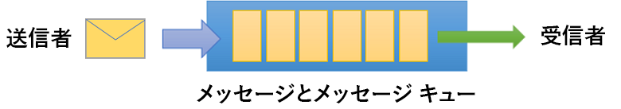
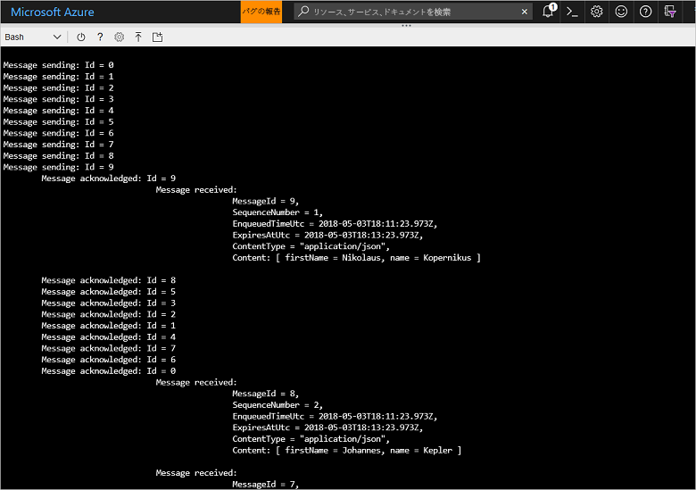

# <a name="quickstart-send-and-receive-messages-using-azure-cli-and-java"></a>クイック スタート: Azure CLI と Java を使用してメッセージを送受信する

Microsoft Azure Service Bus は、セキュリティで保護されたメッセージングと信頼性を提供するエンタープライズ統合メッセージ ブローカーです。 一般的な Service Bus のシナリオには、通常、複数のアプリケーション、サービス、プロセスの相互分離 (アプリケーションが同時にオンラインになる必要はありません)、状態またはデータの変更の転送、アプリケーション間でのメッセージの送信が含まれます。 

たとえば、小売企業では、補充および在庫の更新のためにバック オフィスまたは地域の流通センターに POS データを送信することがあります。 この場合、クライアント アプリは Service Bus キューとの間でメッセージを送受信します。



このクイック スタートでは、Azure CLI と Service Bus Java ライブラリを使って、Service Bus とメッセージを送受信する方法について説明します。 最後に、技術的な詳細に関心がある場合は、サンプル コードの主要な要素の[説明を読む](#understand-the-sample-code)ことができます。

Azure サブスクリプションをお持ちでない場合は、開始する前に[無料アカウント][]を作成できます。

[!INCLUDE [cloud-shell-try-it.md](../../includes/cloud-shell-try-it.md)]

## <a name="log-in-to-azure"></a>Azure にログインする

Azure portal の右上隅にあるメニューで [Cloud Shell] ボタンをクリックして、**[環境の選択]** ドロップダウンから **[Bash]** を選びます。 

## <a name="use-cli-to-create-resources"></a>CLI を使用してリソースを作成する

Cloud Shell の Bash プロンプトから次のコマンドを発行して、Service Bus のリソースをプロビジョニングします。 すべてのプレースホルダーを適切な値に置き換えてください。

```azurecli-interactive
# Create a resource group
az group create --name myResourceGroup --location eastus

# Create a Service Bus messaging namespace with a unique name
namespaceName=myNameSpace$RANDOM
az servicebus namespace create \
   --resource-group myResourceGroup \
   --name $namespaceName \
   --location eastus

# Create a Service Bus queue
az servicebus queue create --resource-group myResourceGroup \
   --namespace-name $namespaceName \
   --name myQueue

# Get the connection string for the namespace
connectionString=$(az servicebus namespace authorization-rule keys list \
   --resource-group myResourceGroup \
   --namespace-name  $namespaceName \
   --name RootManageSharedAccessKey \
   --query primaryConnectionString --output tsv)
```

最後のコマンドを実行した後、接続文字列および選択したキュー名をコピーし、メモ帳などの一時的な場所に貼り付けます。 これは、次のステップで必要になります。

## <a name="send-and-receive-messages"></a>メッセージを送受信する

名前空間とキューを作成し、必要な資格情報を用意すれば、メッセージを送信および受信する準備が整いました。 [こちらの GitHub サンプル フォルダー](https://github.com/Azure/azure-service-bus/tree/master/samples/Java/quickstarts-and-tutorials/quickstart-java/src/main/java/samples/quickstart/SendAndReceiveMessages.java)でコードを調べることができます。

1. Cloud Shell が開いていて、Bash プロンプトが表示されていることを確認します。

2. 次のコマンドを発行して、[Service Bus の GitHub リポジトリ](https://github.com/Azure/azure-service-bus/)を複製します。

   ```bash
   git clone https://github.com/Azure/azure-service-bus.git
   ```

2. スラッシュをパスの区切り記号として使用し、サンプル フォルダーに現在のディレクトリを変更します。

   ```bash
   cd azure-service-bus/samples/Java/quickstarts-and-tutorials/quickstart-java 
   ```

3. 次のコマンドを発行して、アプリケーションをビルドします。
   
   ```bash
   mvn clean package -DskipTests
   ```

4. プログラムを実行するには、次のコマンドを発行します。 Bash シェルを再起動しない限り、接続文字列の値を含む変数は自動的に置き換えられます。

   ```bash
   java -jar ./target/samples.quickstart-1.0.0-jar-with-dependencies.jar -c $connectionString -q myQueue
   ```

6. キューに 10 個のメッセージが送信されることを確認します。 メッセージの順序は保証されませんが、メッセージがペイロード データと共に送信され、受信確認されて、受信されるのを確認できることに注意してください。

   

## <a name="clean-up-resources"></a>リソースのクリーンアップ

次のコマンドを実行して、リソース グループ、名前空間、およびすべての関連リソースを削除します。

```azurecli-interactive
az group delete --resource-group myResourceGroup
```

## <a name="understand-the-sample-code"></a>サンプル コードを理解する

このセクションでは、サンプル コードの主要なセクションについてさらに詳細に説明します。 [こちら](https://github.com/Azure/azure-service-bus/blob/master/samples/Java/quickstarts-and-tutorials/quickstart-java/src/main/java/samples/quickstart/SendAndReceiveMessages.java)の GitHub リポジトリにあるコードを参照できます。

### <a name="get-connection-string-and-queue"></a>接続文字列とキューを取得する

コードでは最初に、コマンドライン引数としてプログラムに渡される 2 つの文字列変数が宣言されています。

```java
String ConnectionString = null;
String QueueName = null;
```

これらの値はパラメーターによって追加され、`runApp()` メソッドで割り当てられます。

```java
public static void main(String[] args) {
    SendAndReceiveMessages app = new SendAndReceiveMessages();
    try {
        app.runApp(args);
        app.run();
    } catch (Exception e) {
        System.out.printf("%s", e.toString());
    }
    System.exit(0);
}

public void runApp(String[] args) {
    try {
        // parse connection string from command line             
        Options options = new Options();
        options.addOption(new Option("c", true, "Connection string"));
        options.addOption(new Option("q", true, "Queue Name"));
        CommandLineParser clp = new DefaultParser();
        CommandLine cl = clp.parse(options, args);
        if (cl.getOptionValue("c") != null && cl.getOptionValue("q") != null) {
            ConnectionString = cl.getOptionValue("c");
            QueueName =  cl.getOptionValue("q");
        }
        else
        {
            HelpFormatter formatter = new HelpFormatter();
            formatter.printHelp("run jar with", "", options, "", true);
        }

    } catch (Exception e) {
        System.out.printf("%s", e.toString());
    }
}
```

### <a name="create-queue-clients-to-send-and-receive"></a>送信および受信を行うキュー クライアントを作成する

メッセージを送受信するため、`run()` メソッドは接続文字列とキュー名で構成されるキュー クライアントのインスタンスを作成します。 このコードは、送信用と受信用に 1 つずつ、2 つのキュー クライアントを作成します。

```java
public void run() throws Exception {
// Create a QueueClient instance for receiving using the connection string builder
// We set the receive mode to "PeekLock", meaning the message is delivered
// under a lock and must be acknowledged ("completed") to be removed from the queue
QueueClient receiveClient = new QueueClient(new ConnectionStringBuilder(ConnectionString, QueueName), ReceiveMode.PEEKLOCK);
this.registerReceiver(receiveClient);

// Create a QueueClient instance for sending and then asynchronously send messages.
QueueClient sendClient = new QueueClient(new ConnectionStringBuilder(ConnectionString, QueueName), ReceiveMode.PEEKLOCK);
```

`run()` メソッドは非同期メッセージ送信操作も開始し、送信操作が完了すると送信側を終了します。

```java
this.sendMessagesAsync(sendClient).thenRunAsync(() -> sendClient.closeAsync());
``` 

### <a name="construct-and-send-messages"></a>メッセージを作成して送信する

`sendMessagesAsync()` メソッドは 10 個のメッセージ セットを作成し、キュー クライアントを使って非同期的に送信します。

```java
CompletableFuture<Void> sendMessagesAsync(QueueClient sendClient) {
List<HashMap<String, String>> data =
        GSON.fromJson(
                "[" +
                        "{'name' = 'Einstein', 'firstName' = 'Albert'}," +
                        "{'name' = 'Heisenberg', 'firstName' = 'Werner'}," +
                        "{'name' = 'Curie', 'firstName' = 'Marie'}," +
                        "{'name' = 'Hawking', 'firstName' = 'Steven'}," +
                        "{'name' = 'Newton', 'firstName' = 'Isaac'}," +
                        "{'name' = 'Bohr', 'firstName' = 'Niels'}," +
                        "{'name' = 'Faraday', 'firstName' = 'Michael'}," +
                        "{'name' = 'Galilei', 'firstName' = 'Galileo'}," +
                        "{'name' = 'Kepler', 'firstName' = 'Johannes'}," +
                        "{'name' = 'Kopernikus', 'firstName' = 'Nikolaus'}" +
                        "]",
                new TypeToken<List<HashMap<String, String>>>() {}.getType());

List<CompletableFuture> tasks = new ArrayList<>();
for (int i = 0; i < data.size(); i++) {
    final String messageId = Integer.toString(i);
    Message message = new Message(GSON.toJson(data.get(i), Map.class).getBytes(UTF_8));
    message.setContentType("application/json");
    message.setLabel("Scientist");
    message.setMessageId(messageId);
    message.setTimeToLive(Duration.ofMinutes(2));
    System.out.printf("\nMessage sending: Id = %s", message.getMessageId());
    tasks.add(
            sendClient.sendAsync(message).thenRunAsync(() -> {
                System.out.printf("\n\tMessage acknowledged: Id = %s", message.getMessageId());
            }));
}
return CompletableFuture.allOf(tasks.toArray(new CompletableFuture<?>[tasks.size()]));
```

### <a name="receive-messages"></a>メッセージを受信する

`registerReceiver()` メソッドは `RegisterMessageHandler` コールバックを登録し、いくつかのメッセージ ハンドラー オプションも設定します。

```java
void registerReceiver(QueueClient queueClient) throws Exception {
    // register the RegisterMessageHandler callback
    queueClient.registerMessageHandler(new IMessageHandler() {
                           // callback invoked when the message handler loop has obtained a message
                           public CompletableFuture<Void> onMessageAsync(IMessage message) {
                               // receives message is passed to callback
                               if (message.getLabel() != null &&
                                       message.getContentType() != null &&
                                       message.getLabel().contentEquals("Scientist") &&
                                       message.getContentType().contentEquals("application/json")) {
                                    byte[] body = message.getBody();
                                   Map scientist = GSON.fromJson(new String(body, UTF_8), Map.class);

                                   System.out.printf(
                                           "\n\t\t\t\tMessage received: \n\t\t\t\t\t\tMessageId = %s, \n\t\t\t\t\t\tSequenceNumber = %s, \n\t\t\t\t\t\tEnqueuedTimeUtc = %s," +
                                                   "\n\t\t\t\t\t\tExpiresAtUtc = %s, \n\t\t\t\t\t\tContentType = \"%s\",  \n\t\t\t\t\t\tContent: [ firstName = %s, name = %s ]\n",
                                           message.getMessageId(),
                                           message.getSequenceNumber(),
                                           message.getEnqueuedTimeUtc(),
                                           message.getExpiresAtUtc(),
                                           message.getContentType(),
                                           scientist != null ? scientist.get("firstName") : "",
                                           scientist != null ? scientist.get("name") : "");
                               }
                               return CompletableFuture.completedFuture(null);
                           }

                           // callback invoked when the message handler has an exception to report
                           public void notifyException(Throwable throwable, ExceptionPhase exceptionPhase) {
                               System.out.printf(exceptionPhase + "-" + throwable.getMessage());
                           }
                       },
    // 1 concurrent call, messages are auto-completed, auto-renew duration
    new MessageHandlerOptions(1, true, Duration.ofMinutes(1)));

}
```

## <a name="next-steps"></a>次の手順

この記事では、キューでメッセージを送受信するために必要な Service Bus 名前空間と他のリソースを作成しました。 メッセージを送受信するコードの記述についてさらに詳しく学習するには、Service Bus に関する以下のチュートリアルを続けてください。

> [!div class="nextstepaction"]
> [CLI と Java を使用してインベントリを更新する](./service-bus-tutorial-topics-subscriptions-cli.md)

[無料アカウント]: https://azure.microsoft.com/free/?ref=microsoft.com&utm_source=microsoft.com&utm_medium=docs&utm_campaign=visualstudio
[fully qualified domain name]: https://wikipedia.org/wiki/Fully_qualified_domain_name
[Install Azure CLI 2.0]: /cli/azure/install-azure-cli
[az group create]: /cli/azure/group#az_group_create