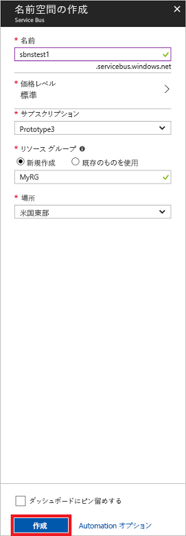

# <a name="quickstart-send-and-receive-messages-using-the-azure-portal-and-net"></a>クイック スタート: Azure Portal と .NET を使用してメッセージを送受信する

Microsoft Azure Service Bus は、セキュリティで保護されたメッセージングと絶対的な信頼性を提供するエンタープライズ統合メッセージ ブローカーです。 一般的な Service Bus のシナリオには、通常、2 つ以上のアプリケーション、サービスまたはプロセスを相互に分離し、状態またはデータの変更を転送する処理が含まれます。 このようなシナリオでは、別のアプリケーションまたはサービスで複数のバッチ ジョブをスケジュールする処理や、注文の実行をトリガーする処理が含まれる場合があります。 たとえば、小売企業では、補充および在庫の更新のためにバック オフィスまたは地域の流通センターに POS データを送信することがあります。 このシナリオでは、クライアント アプリは Service Bus キューとの間でメッセージを送受信します。  


このクイック スタートでは、Service Bus キューとの間でメッセージを送受信し、[Azure Portal][Azure portal] を使用してその名前空間内にメッセージング名前空間とキューを作成し、その名前空間に対する承認資格情報を取得する方法について説明します。 次に、[.NET Standard ライブラリ](https://www.nuget.org/packages/Microsoft.Azure.ServiceBus)を使用して、このキューからメッセージを送受信する方法について説明します。

Azure サブスクリプションをお持ちでない場合は、開始する前に[無料アカウント][]を作成できます。

## <a name="prerequisites"></a>前提条件

このチュートリアルを完了するには、以下がインストールされていることを確認してください。

- [Visual Studio 2017 Update 3 (バージョン 15.3, 26730.01)](http://www.visualstudio.com/vs) 以降。
- [NET Core SDK](https://www.microsoft.com/net/download/windows) バージョン 2.0 以降。

## <a name="log-on-to-the-azure-portal"></a>Azure Portal にログオンする

まず [Azure Portal][Azure portal] にアクセスし、Azure サブスクリプションを使用してログインします。 最初の手順は、種類が**メッセージング**の Service Bus 名前空間を作成することです。

## <a name="create-a-service-bus-namespace"></a>Service Bus 名前空間を作成する

Service Bus のメッセージング名前空間は一意のスコープ コンテナーを提供します。このコンテナーは、1 つ以上のキュー、トピック、サブスクリプションを作成する[完全修飾ドメイン名][]によって参照されます。 次の例では、新規または既存の[リソース グループ](/azure/azure-resource-manager/resource-group-portal)に Service Bus メッセージング名前空間を作成します。

1. ポータルの左側のナビゲーション ウィンドウで、**[+ リソースの作成]** をクリックし、**[Enterprise Integration]**、**[Service Bus]** の順にクリックします。
2. **[名前空間の作成]** ダイアログで、名前空間の名前を入力します。 その名前が使用できるかどうかがすぐに自動で確認されます。
3. 入力した名前空間の名前が使用できることを確認したら、価格レベル (Standard または Premium) を選択します。
4. **[サブスクリプション]** フィールドで、名前空間を作成する Azure サブスクリプションを選択します。
5. **[リソース グループ]** フィールドで、名前空間を追加する既存のリソース グループを選択するか、新しいリソース グループを作成します。      
6. **[場所]** で、名前空間をホストする国またはリージョンを選択します。
7. **Create** をクリックしてください。 これで、システムによってサービス名前空間が作成され、有効になります。 システムがアカウントのリソースを準備し 終わるまでに、数分間かかる場合があります。



### <a name="obtain-the-management-credentials"></a>管理資格情報の取得

新しい名前空間を作成すると、Shared Access Signature (SAS) の初期規則が自動的に生成され、あらゆる角度から名前空間を完全に制御することを可能にするプライマリ キーとセカンダリ キーのペアが関連付けられます。 初期規則をコピーするには、次の手順を実行します。 

1.  **[すべてのリソース]** で、新しく作成した名前空間の名前をクリックします。
2. 名前空間ウィンドウで、**[共有アクセス ポリシー]** をクリックします。
3. **[共有アクセス ポリシー]** 画面で、**[RootManageSharedAccessKey]** をクリックします。
4. **[ポリシー: RootManageSharedAccessKey]** ウィンドウで、**[プライマリ接続文字列]** の横にある **[コピー]** ボタンをクリックし、後で使用するために接続文字列をクリップボードにコピーします。 この値をメモ帳などに一時的に貼り付けます。 

    ![connection-string][connection-string]
5. 前の手順を繰り返し、**[プライマリ キー]** の値をコピーして、後で使用するために一時的な場所に貼り付けます。

## <a name="create-a-queue"></a>キューを作成する

Service Bus キューを作成するには、作成する名前空間を指定します。 次の例は、ポータルでキューを作成する方法を示しています。

1. ポータルの左側のナビゲーション ウィンドウで、**[Service Bus]** をクリックします (**[Service Bus]** が表示されていない場合は **[More Services (その他のサービス)]** をクリックします)。
2. キューを作成する名前空間をクリックします。
3. 名前空間ウィンドウで **[キュー]** をクリックし、**[キュー]** ウィンドウの **[+ キュー]** をクリックします。
4. **[キュー名]** に入力し、他の値は既定値のままにします。
5. ウィンドウの下部にある **[作成]** をクリックします。
6. キュー名をメモします。

## <a name="send-and-receive-messages"></a>メッセージを送受信する

名前空間とキューがプロビジョニングされ、必要な資格情報を持っている場合、メッセージを送受信できる状態です。 [こちらの GitHub サンプル フォルダー](https://github.com/Azure/azure-service-bus/tree/master/samples/Java/quickstarts-and-tutorials/quickstart-jms)でコードを調べることができます。

コードを実行するには、次の手順を実行します。

1. 次のコマンドを発行して、[Service Bus の GitHub リポジトリ](https://github.com/Azure/azure-service-bus/)を複製します。

   ```shell
   git clone https://github.com/Azure/azure-service-bus.git
   ```

3. サンプル フォルダー `azure-service-bus\samples\DotNet\GettingStarted\BasicSendReceiveQuickStart\BasicSendReceiveQuickStart` に移動します。

4. 「[管理資格情報の取得](#obtain-the-management-credentials)」セクションで取得した接続文字列とキュー名をコピーします。

5.  コマンド プロンプトで、次のコマンドを入力します。

   ```shell
   dotnet build
   ```

6.  `bin\Debug\netcoreapp2.0` フォルダーに移動します。

7.  次のコマンドを入力してプログラムを実行します。 `myConnectionString` を以前に取得した値に、`myQueueName` を作成したキューの名前に置き換えます。

   ```shell
   dotnet BasicSendReceiveQuickStart.dll -ConnectionString "myConnectionString" -QueueName "myQueueName"
   ``` 

8. キューに送信され、次にキューから受信される 10 個のメッセージを観察します。

   

## <a name="clean-up-resources"></a>リソースのクリーンアップ

ポータルを使用して、リソース グループ、名前空間、およびキューを削除できます。

## <a name="understand-the-sample-code"></a>サンプル コードを理解する

このセクションでは、サンプル コードの処理内容の詳細について説明します。 

### <a name="get-connection-string-and-queue"></a>接続文字列とキューを取得する

接続文字列とキュー名は、コマンド ライン引数として `Main()` メソッドに渡されます。 `Main()` は、これらの値を保持する 2 つの文字列変数を宣言します。

```csharp
static void Main(string[] args)
{
    string ServiceBusConnectionString = "";
    string QueueName = "";

    for (int i = 0; i < args.Length; i++)
    {
        var p = new Program();
        if (args[i] == "-ConnectionString")
        {
            Console.WriteLine($"ConnectionString: {args[i+1]}");
            ServiceBusConnectionString = args[i + 1]; 
        }
        else if(args[i] == "-QueueName")
        {
            Console.WriteLine($"QueueName: {args[i+1]}");
            QueueName = args[i + 1];
        }                
    }

    if (ServiceBusConnectionString != "" && QueueName != "")
        MainAsync(ServiceBusConnectionString, QueueName).GetAwaiter().GetResult();
    else
    {
        Console.WriteLine("Specify -Connectionstring and -QueueName to execute the example.");
        Console.ReadKey();
    }                            
}
```
 
`Main()` メソッドは、非同期メッセージ ループ `MainAsync()` を開始します。

### <a name="message-loop"></a>メッセージ ループ

MainAsync() メソッドで、コマンド ライン引数を使用してキュー クライアントを作成し、`RegisterOnMessageHandlerAndReceiveMessages()` という受信メッセージ ハンドラーを呼び出し、一連のメッセージを送信します。

```csharp
static async Task MainAsync(string ServiceBusConnectionString, string QueueName)
{
    const int numberOfMessages = 10;
    queueClient = new QueueClient(ServiceBusConnectionString, QueueName);

    Console.WriteLine("======================================================");
    Console.WriteLine("Press any key to exit after receiving all the messages.");
    Console.WriteLine("======================================================");

    // Register QueueClient's MessageHandler and receive messages in a loop
    RegisterOnMessageHandlerAndReceiveMessages();

    // Send Messages
    await SendMessagesAsync(numberOfMessages);

    Console.ReadKey();

    await queueClient.CloseAsync();
}
```

`RegisterOnMessageHandlerAndReceiveMessages()` メソッドで、いくつかのメッセージ ハンドラー オプションを設定し、次にキュー クライアントの `RegisterMessageHandler()` メソッドを呼び出し、受信を開始します。

```csharp
static void RegisterOnMessageHandlerAndReceiveMessages()
{
    // Configure the MessageHandler Options in terms of exception handling, number of concurrent messages to deliver etc.
    var messageHandlerOptions = new MessageHandlerOptions(ExceptionReceivedHandler)
    {
        // Maximum number of Concurrent calls to the callback `ProcessMessagesAsync`, set to 1 for simplicity.
        // Set it according to how many messages the application wants to process in parallel.
        MaxConcurrentCalls = 1,

        // Indicates whether MessagePump should automatically complete the messages after returning from User Callback.
        // False below indicates the Complete will be handled by the User Callback as in `ProcessMessagesAsync` below.
        AutoComplete = false
    };

    // Register the function that will process messages
    queueClient.RegisterMessageHandler(ProcessMessagesAsync, messageHandlerOptions);
} 
```

### <a name="send-messages"></a>メッセージを送信する

メッセージの作成と送信操作は、`SendMessagesAsync()` メソッドで行われます。

```csharp
static async Task SendMessagesAsync(int numberOfMessagesToSend)
{
    try
    {
        for (var i = 0; i < numberOfMessagesToSend; i++)
        {
            // Create a new message to send to the queue
            string messageBody = $"Message {i}";
            var message = new Message(Encoding.UTF8.GetBytes(messageBody));

            // Write the body of the message to the console
            Console.WriteLine($"Sending message: {messageBody}");

            // Send the message to the queue
            await queueClient.SendAsync(message);
        }
    }
    catch (Exception exception)
    {
        Console.WriteLine($"{DateTime.Now} :: Exception: {exception.Message}");
    }
}
```

### <a name="process-messages"></a>メッセージを処理する

`ProcessMessagesAsync()` メソッドで、メッセージの受信の確認、処理、および完了を行います。

```csharp
static async Task ProcessMessagesAsync(Message message, CancellationToken token)
{
    // Process the message
    Console.WriteLine($"Received message: SequenceNumber:{message.SystemProperties.SequenceNumber} Body:{Encoding.UTF8.GetString(message.Body)}");

    // Complete the message so that it is not received again.
    await queueClient.CompleteAsync(message.SystemProperties.LockToken);
}
```

## <a name="next-steps"></a>次の手順

この記事では、キューでメッセージを送受信するために必要な Service Bus 名前空間と他のリソースを作成しました。 メッセージを送受信するコードの記述についてさらに詳しく学習するには、Service Bus に関する以下のチュートリアルを続けてください。

> [!div class="nextstepaction"]
> [Azure Portal を使用して在庫を更新する](./service-bus-tutorial-topics-subscriptions-portal.md)


[無料アカウント]: https://azure.microsoft.com/free/?ref=microsoft.com&utm_source=microsoft.com&utm_medium=docs&utm_campaign=visualstudio
[完全修飾ドメイン名]: https://wikipedia.org/wiki/Fully_qualified_domain_name
[Azure portal]: https://portal.azure.com/

[connection-string]: ./media/service-bus-quickstart-portal/connection-string.png
[service-bus-flow]: ./media/service-bus-quickstart-portal/service-bus-flow.png
