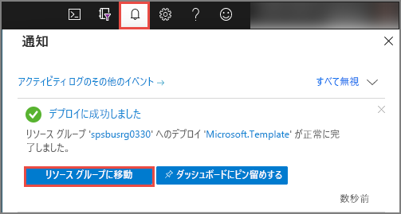
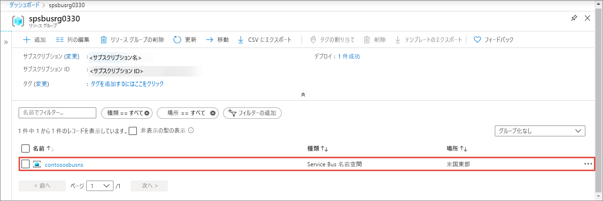
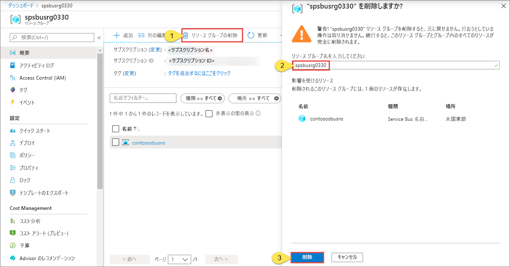

# クイック スタート:Service Bus の名前空間とキューを ARM テンプレートで作成する

この記事では、Service Bus の名前空間とその名前空間内にキューを作成する Azure Resource Manager テンプレート (ARM テンプレート) を使用する方法を示します。 この記事では、デプロイ対象のリソースを定義する方法と、デプロイの実行時に指定されるパラメーターを指定する方法を説明します。 このテンプレートは、独自のデプロイに使用することも、要件に合わせてカスタマイズすることもできます。

[!INCLUDE [About Azure Resource Manager](../../includes/resource-manager-quickstart-introduction.md)]

環境が前提条件を満たしていて、ARM テンプレートの使用に慣れている場合は、 **[Azure へのデプロイ]** ボタンを選択します。 Azure portal でテンプレートが開きます。

## 前提条件

Azure サブスクリプションをお持ちでない場合は、開始する前に[無料アカウントを作成](https://azure.microsoft.com/free/)してください。

## テンプレートを確認する

このクイックスタートで使用されるテンプレートは [Azure クイックスタート テンプレート](https://azure.microsoft.com/resources/templates/201-servicebus-create-queue)からのものです。

:::code language="json" source="~/quickstart-templates/201-servicebus-create-queue/azuredeploy.json":::

このテンプレートに定義されているリソースは次のとおりです。

- [**Microsoft.ServiceBus/namespaces**](/azure/templates/microsoft.servicebus/namespaces)
- [**Microsoft.ServiceBus/namespaces/queues**](/azure/templates/microsoft.servicebus/namespaces/queues)

> [!NOTE]
> 次の ARM テンプレートをダウンロードしてデプロイすることができます。
>
> * [キューと承認規則を含んだ Service Bus 名前空間を作成する](service-bus-resource-manager-namespace-auth-rule.md)
> * [トピックとサブスクリプションを含んだ Service Bus 名前空間を作成する](service-bus-resource-manager-namespace-topic.md)
> * [Service Bus 名前空間の作成](service-bus-resource-manager-namespace.md)
> * [トピック、サブスクリプション、ルールを含んだ Service Bus の名前空間を作成する](service-bus-resource-manager-namespace-topic-with-rule.md)

その他のテンプレートについては、「[Azure クイックスタート テンプレート](https://azure.microsoft.com/resources/templates/?resourceType=Microsoft.Servicebus&pageNumber=1&sort=Popular)」をご覧ください

## テンプレートのデプロイ

このテンプレートでは、キューを含んだ Service Bus 名前空間をデプロイします。

[Service Bus キュー](service-bus-queues-topics-subscriptions.md#queues)では、コンシューマーが競合している場合のメッセージ配信に先入れ先出し法 (FIFO) を使用します。

デプロイメントを自動的に実行するには、次のボタンをクリックします。後で簡単にクリーンアップできるよう、デプロイ用に新しいリソース グループを作成してください。

## デプロイの検証

1. 上部にある **[通知]** を選択して、デプロイの状態を確認します。 デプロイが正常に完了するまで待ちます。 次に、通知メッセージの **[リソース グループに移動]** を選択して、Service Bus 名前空間を含んだリソース グループのページに移動します。 

    
2. Service Bus 名前空間がリソースの一覧に表示されていることを確認します。 

    
3. 一覧から名前空間を選択して、 **[Service Bus 名前空間]** ページを表示します。 

## リソースをクリーンアップする

1. Azure portal で、自分のリソース グループの **[リソース グループ]** ページに移動します。
2. ツール バーから **[リソース グループの削除]** を選びます。 
3. リソース グループの名前を入力し、 **[削除]** を選択します。 

    

## 次のステップ

名前空間/キューの承認規則を作成する方法を説明している次のトピックを参照してください。

[Service Bus の名前空間とキューに使用する承認規則を ARM テンプレートで作成する](service-bus-resource-manager-namespace-auth-rule.md)

次の記事を参照して、これらのリソースの管理方法を確認してください。

* [PowerShell で Service Bus を管理する](service-bus-manage-with-ps.md)
* [Service Bus リソースを Service Bus Explorer で管理する](https://github.com/paolosalvatori/ServiceBusExplorer/releases)

[Authoring Azure Resource Manager templates]: ../azure-resource-manager/templates/template-syntax.md
[Service Bus namespace and queue template]: https://github.com/Azure/azure-quickstart-templates/blob/master/201-servicebus-create-queue/
[Azure Quickstart Templates]: https://azure.microsoft.com/documentation/templates/?term=service+bus
[Learn more about Service Bus queues]: service-bus-queues-topics-subscriptions.md
[Using Azure PowerShell with Azure Resource Manager]: ../azure-resource-manager/management/manage-resources-powershell.md
[Using the Azure CLI for Mac, Linux, and Windows with Azure Resource Management]: ../azure-resource-manager/management/manage-resources-cli.md