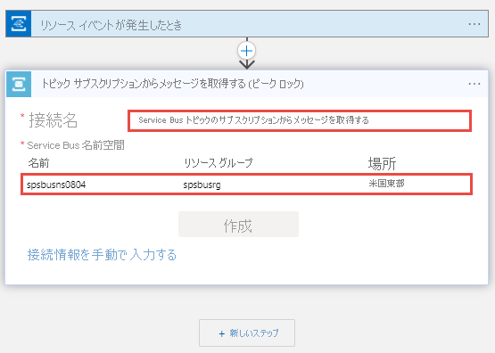
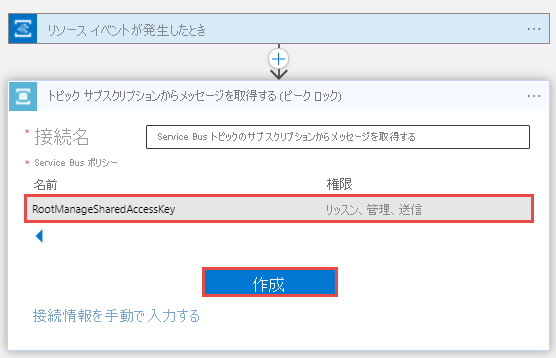
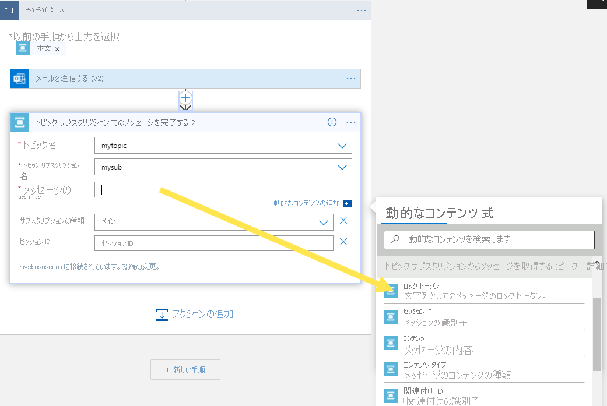

# <a name="respond-to-azure-service-bus-events-received-via-azure-event-grid-by-using-azure-functions-and-azure-logic-apps"></a>Azure Functions と Azure Logic Apps を使用して、Azure Event Grid 経由で受信した Azure Service Bus イベントに応答する
このチュートリアルでは、Azure Functions と Azure Logic Apps を使用して、Azure Event Grid 経由で受信した Azure Service Bus イベントに応答する方法について説明します。 次の手順を実行します。
 
- Event Grid からのイベントの初期フローをデバッグして確認するための、テスト Azure 関数を作成します。
- Event Grid イベントに基づいて Azure Service Bus メッセージを受信して処理する Azure 関数を作成します。
- Event Grid イベントに応答するロジック アプリを作成します

Service Bus、Event Grid、Azure Functions、および Logic Apps の成果物を作成した後後は、次のアクションを行います。 

1. Service Bus トピックにメッセージを送信します。 
2. トピックに対するサブスクリプションがそれらのメッセージを受信したことを確認します
3. イベントをサブスクライブした関数またはロジック アプリがイベントを受信したことを確認します。 

## <a name="create-a-service-bus-namespace"></a>Service Bus 名前空間を作成する
このチュートリアルの手順に従ってください。[クイック スタート:Azure portal を使用して Service Bus トピックとそのサブスクリプションを作成する](service-bus-quickstart-topics-subscriptions-portal.md)」で確認し、次のタスクを実行します:

- **Premium** Service Bus 名前空間を作成します。 
- 接続文字列を取得します。 
- Service Bus トピックを作成します。
- トピックに対するサブスクリプションを 2 つ作成します。 

## <a name="prepare-a-sample-application-to-send-messages"></a>サンプル アプリケーションを準備してメッセージを送信する
メッセージを Service Bus トピックに送信するには、お好きな方法を使用できます。 この手順の最後にあるサンプル コードは、Visual Studio 2017 の使用を前提としています。

1. [GitHub の azure-service-bus リポジトリ](https://github.com/Azure/azure-service-bus/)を複製します。
2. Visual Studio で *\samples\DotNet\Microsoft.ServiceBus.Messaging\ServiceBusEventGridIntegration* フォルダーに移動し、*SBEventGridIntegration.sln* ファイルを開きます。
3. **MessageSender** プロジェクトに移動し、 **[Program.cs]** を選択します。
4. Service Bus トピック名と、前の手順で取得した接続文字列を入力します。

    ```CSharp
    const string ServiceBusConnectionString = "YOUR CONNECTION STRING";
    const string TopicName = "YOUR TOPIC NAME";
    ```
5. テスト メッセージを Service Bus トピックに送信するプログラムをビルドして実行します。 

## <a name="set-up-a-test-function-on-azure"></a>Azure でテスト関数を設定する 
シナリオ全体を実行する前に、少なくとも小さなテスト関数を設定します。これを使用して、流れているイベントのデバッグと観察を行うことができます。 「[Azure portal で初めての関数を作成する](../azure-functions/functions-create-first-azure-function.md)」の記事の手順に従って、次のタスクを行ってください。 

1. 関数アプリを作成します。
2. HTTP によってトリガーされる関数を作成します。 

その後、次の手順を実行します。 


# <a name="azure-functions-v2tabv2"></a>[Azure Functions V2](#tab/v2)

1. ツリー ビューで **[関数]** を展開し、関数を選択します。 関数のコードを次のコードに置き換えます。 

    ```CSharp
    #r "Newtonsoft.Json"
    
    using System.Net;
    using Microsoft.AspNetCore.Mvc;
    using Microsoft.Extensions.Primitives;
    using Newtonsoft.Json;
    
    public static async Task<IActionResult> Run(HttpRequest req, ILogger log)
    {
        log.LogInformation("C# HTTP trigger function processed a request.");
        var content = req.Body;
        string jsonContent = await new StreamReader(content).ReadToEndAsync();
        log.LogInformation($"Received Event with payload: {jsonContent}");
    
        IEnumerable<string> headerValues;
        headerValues = req.Headers.GetCommaSeparatedValues("Aeg-Event-Type");
    
        if (headerValues.Count() != 0)
        {
            var validationHeaderValue = headerValues.FirstOrDefault();
            if(validationHeaderValue == "SubscriptionValidation")
            {
                var events = JsonConvert.DeserializeObject<GridEvent[]>(jsonContent);
                var code = events[0].Data["validationCode"];
                log.LogInformation("Validation code: {code}");
                return (ActionResult) new OkObjectResult(new { validationResponse = code });
            }
        }
    
        return jsonContent == null
            ? new BadRequestObjectResult("Please pass a name on the query string or in the request body")
            : (ActionResult)new OkObjectResult($"Hello, {jsonContent}");
    }
    
    public class GridEvent
    {
        public string Id { get; set; }
        public string EventType { get; set; }
        public string Subject { get; set; }
        public DateTime EventTime { get; set; }
        public Dictionary<string, string> Data { get; set; }
        public string Topic { get; set; }
    }
    
    ```
2. **[保存および実行]** を選択します。

    
3. **[関数の URL の取得]** を選択して、URL をメモします。 

    

# <a name="azure-functions-v1tabv1"></a>[Azure Functions V1](#tab/v1)

1. **V1** バージョンを使用するように関数を構成します。 
    1. ツリー ビューで関数アプリを選択し、 **[Function App の設定]** を選択します。 

        ./media/service-bus-to-event-grid-integration-example/function-app-settings.png)
    2. **[ランタイム バージョン]** には、 **[~1]** を選択します。 
2. ツリー ビューで **[関数]** を展開し、関数を選択します。 関数のコードを次のコードに置き換えます。 

    ```CSharp
    #r "Newtonsoft.Json"
    using System.Net;
    using Newtonsoft.Json;
    using Newtonsoft.Json.Linq;
    
    public static async Task<HttpResponseMessage> Run(HttpRequestMessage req, TraceWriter log)
    {
        log.Info("C# HTTP trigger function processed a request.");
        // parse query parameter
        var content = req.Content;
    
        string jsonContent = await content.ReadAsStringAsync(); 
        log.Info($"Received Event with payload: {jsonContent}");
    
        IEnumerable<string> headerValues;
        if (req.Headers.TryGetValues("Aeg-Event-Type", out headerValues))
        {
            var validationHeaderValue = headerValues.FirstOrDefault();
            if(validationHeaderValue == "SubscriptionValidation")
            {
            var events = JsonConvert.DeserializeObject<GridEvent[]>(jsonContent);
                 var code = events[0].Data["validationCode"];
                 return req.CreateResponse(HttpStatusCode.OK,
                 new { validationResponse = code });
            }
        }
    
        return jsonContent == null
        ? req.CreateResponse(HttpStatusCode.BadRequest, "Pass a name on the query string or in the request body")
        : req.CreateResponse(HttpStatusCode.OK, "Hello " + jsonContent);
    }
    
    public class GridEvent
    {
        public string Id { get; set; }
        public string EventType { get; set; }
        public string Subject { get; set; }
        public DateTime EventTime { get; set; }
        public Dictionary<string, string> Data { get; set; }
        public string Topic { get; set; }
    }
    ```
4. **[保存および実行]** を選択します。

    
4. **[関数の URL の取得]** を選択して、URL をメモします。 

    

---

## <a name="connect-the-function-and-namespace-via-event-grid"></a>Event Grid による関数と名前空間の接続
このセクションでは、Azure portal を使用して、関数と Service Bus 名前空間を関連付けます。 

Azure Event Grid サブスクリプションを作成するには、次の手順に従います。

1. Azure portal で、該当する名前空間に移動し、左側のウィンドウで **[イベント]** を選択します。 該当する名前空間のウィンドウが開き、右側のウィンドウに 2 つの Event Grid サブスクリプションが表示されます。 
    
    ![Service Bus - [イベント] ページ](./media/service-bus-to-event-grid-integration-example/service-bus-events-page.png)
2. ツール バーの **[+ イベント サブスクリプション]** を選択します。 
3. **[イベント サブスクリプションの作成]** ページで、次の手順を実行します。
    1. サブスクリプションの**名前**を入力します。 
    2. **[エンドポイントのタイプ]** には **[Webhook]** を選択します。 

        
    3. **[エンドポイントの選択]** を選び、関数の URL を貼り付けてから、 **[選択の確認]** を選びます。 

        
    4. **[フィルター]** タブに切り替えて、前に作成した Service Bus トピックに対する**最初のサブスクリプション**の名前を入力し、 **[作成]** ボタンを選択します。 

        
4. 一覧にそのイベント サブスクリプションが表示されていることを確認します。

    

## <a name="send-messages-to-the-service-bus-topic"></a>Service Bus トピックにメッセージを送信する
1. Service Bus トピックにメッセージを送信する .Net C# アプリケーションを実行します。 

    
1. Azure 関数アプリのページで、 **[関数]** を展開して、該当の**関数**を展開し、 **[監視]** を選択します。 

    

## <a name="receive-messages-by-using-azure-functions"></a>Azure Functions を使用してメッセージを受信する
前のセクションでは、テストとデバッグの簡単なシナリオを確認し、イベントが送信されていることを確認しました。 

このセクションでは、イベントを受信した後に、メッセージを受信して処理する方法について説明します。

### <a name="publish-a-function-from-visual-studio"></a>Visual Studio から関数を発行する
1. 開いていた同じ Visual Studio ソリューション (**SBEventGridIntegration**) で、**SBEventGridIntegration** プロジェクト内の **ReceiveMessagesOnEvent.cs** を選択します。 
2. 次のコードに実際の Service Bus 接続文字列を入力します。

    ```Csharp
    const string ServiceBusConnectionString = "YOUR CONNECTION STRING";
    ```
3. 関数の**発行プロファイル**をダウンロードします。
    1. 関数アプリを選択します。 
    2. **[概要]** タブが選択されていない場合は、選択します。 
    3. ツールバーの **[発行プロファイルの取得]** を選択します。 

        
    4. プロジェクトのフォルダーにファイルを保存します。 
4. Visual Studio で **SBEventGridIntegration** を右クリックして **[発行]** を選択します。 
5. **[発行]** ページで **[開始]** を選択します。 
6. **[発行先を選択]** ページで、次の手順に従い、 **[プロファイルのインポート]** を選択します。 

    ![Visual Studio - [プロファイルのインポート] ボタン](./media/service-bus-to-event-grid-integration-example/visual-studio-import-profile-button.png)
7. 先ほどダウンロードした**発行プロファイル ファイル**を選択します。 
8. **[発行]** ページで **[発行]** を選択します。 

    
9. 新しい Azure 関数 **ReceiveMessagesOnEvent** が表示されていることを確認します。 必要に応じてページを更新します。 

    
10. この新しい関数の URL を取得し、メモします。 

### <a name="event-grid-subscription"></a>Event Grid サブスクリプション

1. 既存の Event Grid サブスクリプションを削除します。
    1. **[Service Bus 名前空間]** ページで、左側のメニューの **[イベント]** を選択します。 
    2. 既存のイベント サブスクリプションを選択します。 
    3. **[イベント サブスクリプション]** ページで、 **[削除]** を選択します。
2. 「[Event Grid による関数と名前空間の接続](#connect-the-function-and-namespace-via-event-grid)」セクションの手順に従い、新しい関数の URL を使用して Event Grid サブスクリプションを作成します。
3. 「[Service Bus トピックにメッセージを送信する](#send-messages-to-the-service-bus-topic)」セクションの手順に従い、トピックにメッセージを送信して、関数を監視します。 

## <a name="receive-messages-by-using-logic-apps"></a>Logic Apps を使用してメッセージを受信する
次の手順に従い、ロジック アプリを Azure Service Bus と Azure Event Grid に接続します。

1. Azure portal で、ロジック アプリを作成します。
    1. **[+ リソースの作成]** 、 **[統合]** 、 **[ロジック アプリ]** の順に選択します。 
    2. **[ロジック アプリ - 作成]** ページで、ロジック アプリの**名前**を入力します。
    3. Azure **サブスクリプション**を選択します。 
    4. **[リソース グループ]** では **[既存のものを使用]** を選択し、以前に作成済みの、他のリソース (Azure 関数、Service Bus 名前空間など) に使用したリソース グループを選択します。 
    5. ロジック アプリの**場所**を選択します。 
    6. **[作成]** を選択して、ロジック アプリを作成します。 
2. **[Logic Apps デザイナー]** ページの **[テンプレート]** で、 **[空のロジック アプリ]** を選択します。 
3. デザイナーで、次の手順を実行します。
    1. **Event Grid** を検索します。 
    2. **[When a resource event occurs (preview) - Azure Event Grid]\(リソース イベントが発生したとき (プレビュー) - Azure Event Grid\)** を選択します。 

        
4. **[サインイン]** を選択して、Azure 資格情報を入力し、 **[Allow Access]\(アクセスを許可する\)** を選択します。 
5. **[When a resource event occurs]\(リソース イベントが発生したとき\)** ページで、次の手順を実行します。
    1. Azure サブスクリプションを選択します。 
    2. **[リソースの種類]** で、 **[Microsoft.ServiceBus.Namespaces]** を選択します。 
    3. **[リソース名]** で、Service Bus 名前空間を選択します。 
    4. **[新しいパラメーターの追加]** を選択し、 **[サフィックス フィルター]** を選択します。 
    5. **[サフィックス フィルター]** で、Service Bus トピックの 2 つ目のサブスクリプションの名前を入力します。 
        
6. デザイナーで **[+ 新しいステップ]** を選択し、次の手順を実行します。
    1. **Service Bus** を検索します。
    2. 一覧から **[Service Bus]** を選択します。 
    3. **[アクション]** 一覧から **[メッセージを取得します]** を選択します。 
    4. **[トピック サブスクリプションからメッセージを取得する (ピークロック)]** を選択します。 

        
    5. **接続名**を入力します。 例: 「**Get messages from the topic subscription**」。そして、Service Bus 名前空間を選択します。 

         
    6. **[RootManageSharedAccessKey]** を選択します。

         
    7. **作成** を選択します。 
    8. トピックとサブスクリプションを選択します。 
    
        
7. **[+ 新しいステップ]** を選択し、次の手順を実行します。 
    1. **[Service Bus]** を選びます。
    2. アクションの一覧から **[トピック サブスクリプション内のメッセージを完了する]** を選択します。 
    3. Service Bus **トピック**を選択します。
    4. トピックに対する 2 つ目の**サブスクリプション**を選択します。
    5. **[メッセージのロック トークン]** で、 **[動的なコンテンツ]** から **[ロック トークン]** を選択します。 

        
8. Logic Apps デザイナーのツールバーの **[保存]** を選択して、ロジック アプリを保存します。 
9. 「[Service Bus トピックにメッセージを送信する](#send-messages-to-the-service-bus-topic)」セクションの手順に従い、トピックにメッセージを送信します。 
10. お使いのロジック アプリの **[概要]** ページに切り替えます。 送信されたメッセージの **[実行の履歴]** に、ロジック アプリの実行が表示されます。

    

## <a name="next-steps"></a>次の手順

* [Azure Event Grid](https://docs.microsoft.com/azure/event-grid/) について学習します。
* [Azure Functions](https://docs.microsoft.com/azure/azure-functions/) について学習します。
* [Azure App Service の Logic Apps 機能](https://docs.microsoft.com/azure/logic-apps/)について学習します。
* Azure Service Bus の詳細については、[こちら](https://docs.microsoft.com/azure/service-bus/)を参照してください。


[2]: ./media/service-bus-to-event-grid-integration-example/sbtoeventgrid2.png
[3]: ./media/service-bus-to-event-grid-integration-example/sbtoeventgrid3.png
[7]: ./media/service-bus-to-event-grid-integration-example/sbtoeventgrid7.png
[8]: ./media/service-bus-to-event-grid-integration-example/sbtoeventgrid8.png
[9]: ./media/service-bus-to-event-grid-integration-example/sbtoeventgrid9.png
[10]: ./media/service-bus-to-event-grid-integration-example/sbtoeventgrid10.png
[11]: ./media/service-bus-to-event-grid-integration-example/sbtoeventgrid11.png
[12]: ./media/service-bus-to-event-grid-integration-example/sbtoeventgrid12.png
[12-1]: ./media/service-bus-to-event-grid-integration-example/sbtoeventgrid12-1.png
[12-2]: ./media/service-bus-to-event-grid-integration-example/sbtoeventgrid12-2.png
[13]: ./media/service-bus-to-event-grid-integration-example/sbtoeventgrid13.png
[14]: ./media/service-bus-to-event-grid-integration-example/sbtoeventgrid14.png
[15]: ./media/service-bus-to-event-grid-integration-example/sbtoeventgrid15.png
[16]: ./media/service-bus-to-event-grid-integration-example/sbtoeventgrid16.png
[17]: ./media/service-bus-to-event-grid-integration-example/sbtoeventgrid17.png
[18]: ./media/service-bus-to-event-grid-integration-example/sbtoeventgrid18.png
[20]: ./media/service-bus-to-event-grid-integration-example/sbtoeventgridportal.png
[21]: ./media/service-bus-to-event-grid-integration-example/sbtoeventgridportal2.png
