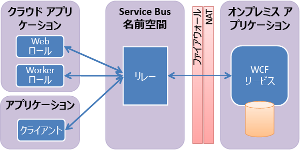

# Service Bus Relay の概要
Service Bus の主なコンポーネントは、一元管理された (ただし高度に負荷分散された) "*リレー*" サービスです。Azure データセンターと独自のオンプレミス エンタープライズ環境の両方で実行可能なハイブリッド アプリケーションを構築できます。  Service Bus Relay では、多様なトランスポート プロトコルと Web サービス標準がサポートされています。 サポートされる標準には、SOAP、WS-*、REST などがあります。 ハイブリッド アプリケーションにリレー サービスを使用すると、ファイアウォール接続を開放せず、または企業ネットワークのインフラストラクチャ内部を変更せずに、企業のエンタープライズ ネットワーク内部にある Windows Communication Foundation (WCF) サービスを安全にパブリック クラウドに公開することができます。 

リレー サービスは、従来の一方向メッセージング、要求/応答メッセージング、ピアツーピア メッセージングをサポートしています。 また、インターネット範囲のイベント配信もサポートしているので、発行/サブスクライブのシナリオや、双方向ソケット通信も可能になり、ポイント間の効率が向上します。 

リレー型メッセージング パターンでは、オンプレミス サービスが送信ポートを介してリレー サービスに接続され、特定のランデブー アドレスに関連付けられた双方向通信用ソケットが作成されます。 その後、クライアントは、ランデブー アドレス宛てのメッセージをリレー サービスに送信することでオンプレミス サービスと通信できます。 メッセージを受けたリレー サービスは、展開済みの双方向ソケットを介してオンプレミス サービスにメッセージを "リレー" します。 クライアントは、オンプレミス サービスと直接接続する必要はありません。また、クライアントはオンプレミス サービスの場所を知っている必要はありません。オンプレミス サービス側では、ファイアウォールの着信ポートを開く必要がありません。

オンプレミス サービスとリレー サービス間の接続を開始するには、一連の WCF "リレー" バインディングを使用します。 バックグラウンドで、リレー バインディングは、新しいトランスポート バインディング要素にマッピングされます。この要素は、クラウド内の Service Bus と統合される WCF チャネル コンポーネントを作成するように設計されています。 

## 次のステップ
Service Bus Relay の詳細については、次のトピックを参照してください。

* [Azure Service Bus アーキテクチャの概要](../service-bus-messaging/service-bus-fundamentals-hybrid-solutions.md)
* [Service Bus WCF Relay サービスの使用方法](service-bus-dotnet-how-to-use-relay.md)

<!--HONumber=Nov16_HO2-->

