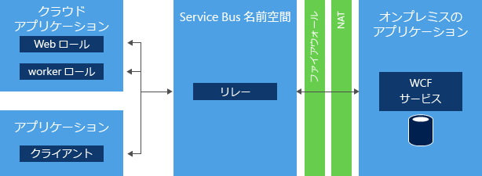
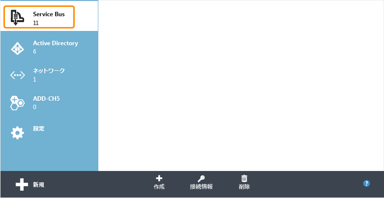
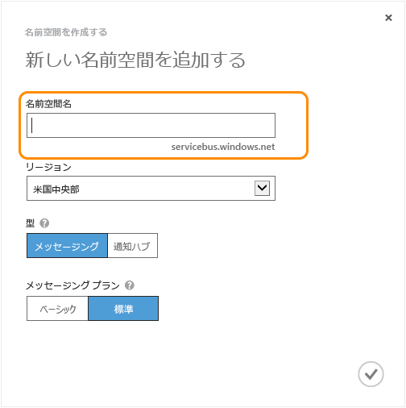
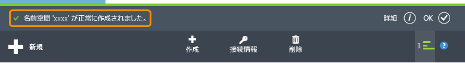
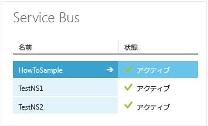

<properties
	pageTitle=".NET で Service Bus Relay を使用する方法 | Microsoft Azure"
	description="Azure Service Bus Relay サービスを使用して、別の場所にホストされた 2 つのアプリケーションに接続する方法について説明します。"
	services="service-bus"
	documentationCenter=".net"
	authors="sethmanheim"
	manager="timlt"
	editor=""/>

<tags
	ms.service="service-bus"
	ms.workload="tbd"
	ms.tgt_pltfrm="na"
	ms.devlang="dotnet"
	ms.topic="get-started-article"
	ms.date="10/07/2015"
	ms.author="sethm"/>


# Azure Service Bus Relay サービスの使用方法

この記事では、Service Bus Relay サービスの使用方法について説明します。サンプルは、C# で記述され、Windows Communication Foundation (WCF) API と、Microsoft Azure .NET SDK の一部である Service Bus アセンブリに含まれている拡張機能を使用しています。Service Bus Relay の詳細については、「[Service Bus のリレー型メッセージング](service-bus-relay-overview.md)」の概要を参照してください。

[AZURE.INCLUDE [アカウント作成メモ](../../includes/create-account-note.md)]

## Service Bus Relay とは

[Service Bus *Relay* サービス](service-bus-relay-overview.md)を使用して、Azure データセンターと独自のオンプレミスのエンタープライズ環境の両方で動作するハイブリッド アプリケーションを構築できます。Service Bus Relay を使用することで、ファイアウォール接続を開放せず、または企業ネットワークのインフラストラクチャ内部を変更せずに、企業のエンタープライズ ネットワーク内部にある Windows Communication Foundation (WCF) サービスを安全にパブリック クラウドに公開することができます。



Service Bus Relay を使用して、既存のエンタープライズ環境内の WCF サービスをホストできます。その後で、その WCF サービスに対する受信セッションと受信要求のリッスンを Azure 内で動作するService Bus にデリゲートできます。これにより、Azure で実行されるアプリケーション コードや、モバイル ワーカー環境またはエクストラネット パートナー環境に対して、これらのサービスを公開できます。Service Bus を使用すると、これらのサービスにアクセスできるユーザーを詳細なレベルで安全に制御できます。これは、既存のエンタープライズ ソリューションのデータとアプリケーション機能を公開してクラウドで活用するため、強力で安全な手段となります。

この記事では、Service Bus Relay を使用して、2 者間の安全な対話を実現する TCP チャネル バインドを使用して公開される WCF Web サービスの作成方法を示します。

## サービス名前空間の作成

Azure で Service Bus Relay を使用するには、最初にサービス名前空間を作成する必要があります。名前空間は、アプリケーション内で Service Bus リソースをアドレス指定するためのスコープ コンテナーを提供します。

サービス名前空間を作成するには:

1.  [Azure ポータル][]にログオンします。

2.  Azure ポータルの左のナビゲーション ウィンドウで、**[Service Bus]** をクリックします。

3.  Azure ポータルの下のウィンドウで、**[作成]** をクリックします。

	

4.  **[新しい名前空間を追加する]** ダイアログ ボックスで、名前空間の名前を入力します。その名前が使用できるかどうかがすぐに自動で確認されます。

	

5.  入力した名前空間の名前が利用できることを確認できたら、名前空間をホストする国またはリージョンを選択します (コンピューティング リソースを展開する国またはリージョンと同じ国またはリージョンを必ず使用してください)。

	> [AZURE.IMPORTANT]アプリケーションをデプロイする予定の国またはリージョンと*同じ国/リージョン*を選択してください。そうすることで、パフォーマンスが最高になります。

6.	ダイアログ ボックスの他のフィールドは、既定値 (**[メッセージング]** と **[Standard]** レベル) のままにして、チェック マークをクリックします。これで、システムによってサービス名前空間が作成され、有効になります。システムがアカウントのリソースを準備し 終わるまでに、数分間かかる場合があります。

	

	作成した名前空間が Azure ポータルに表示され、アクティブになります。これには少し時間がかかります。ステータスが **[アクティブ]** になるのを待ってから、次に進みます。

## 名前空間の既定の管理資格情報の取得

新規作成した名前空間に対してリレー接続の作成などの管理操作を実行するには、名前空間の共有アクセス署名 (SAS) の承認規則を構成する必要があります。SAS の詳細については、「[Service Bus での共有アクセス署名認証][]」を参照してください。

1.  左側のナビゲーション ウィンドウで **[Service Bus]** ノードをクリックして、利用可能な名前空間の一覧を表示します。

2.  表示される一覧から先ほど作成した名前空間の名前をダブルクリックします。

3.  ページの上部にある **[構成]** タブをクリックします。

4.  Service Bus 名前空間がプロビジョニングされると、**RootManageSharedAccessKey** に設定された **SharedAccessAuthorizationRule** と **KeyName** が既定で作成されます。このページには、そのキーと、既定のルールのプライマリ キーとセカンダリ キーが表示されます。

## Service Bus NuGet パッケージの取得

Service Bus NuGet パッケージは、Service Bus API を取得し、Service Bus 依存関係をすべて備えたアプリケーションを構成する最も簡単な方法です。NuGet Visual Studio 拡張機能を使用すると、Visual Studio や Visual Studio Express でのライブラリやツールのインストールと更新を簡単に行うことができます。Service Bus NuGet パッケージは、Service Bus API を取得し、Service Bus 依存関係をすべて備えたアプリケーションを構成する最も簡単な方法です。

アプリケーションに NuGet パッケージをインストールするには、次のステップを行います。

1.  ソリューション エクスプローラーで **[参照]** を右クリックし、 **[NuGet パッケージの管理]** をクリックします。
2.  "Service Bus" を検索して、**[Microsoft Azure Service Bus]** 項目を選択します。**[インストール]** をクリックし、インストールが完了したら、次のダイアログ ボックスを閉じます。

	


## Service Bus を使用して SOAP Web サービスを TCP で公開および使用する

既存の WCF SOAP Web サービスを外部で使用するために公開するには、サービスのバインドとアドレスに変更を加える必要があります。WCF サービスの設定や構成によっては、構成ファイルを変更したり、コードを変更したりする必要があります。WCF を使用すると同じサービス上で複数のネットワーク エンドポイントを持つことができるので、既存の内部エンドポイントを保持しながら、同時に外部アクセス用のService Bus エンドポイントも追加できます。

このタスクでは、単純な WCF サービスを構築し、そのサービスに Service Bus リスナーを追加します。この演習はある程度 Visual Studio に習熟したユーザーを対象としているため、プロジェクトの作成手順の詳しい内容については説明していません。代わりに、コードに重点を置いています。

次の手順を完了して環境を設定してから、後の手順を開始してください。

1.  Visual Studio 内で、"Client" と "Service" という 2 つのプロジェクトを含むコンソール アプリケーションをソリューション内に作成します。
2.  Microsoft Azure Service Bus NuGet パッケージを両方のプロジェクトに追加します。これにより、プロジェクトへの必要なアセンブリ参照がすべて追加されます。

### サービスの作成方法

最初に、サービス自体を作成します。すべての WCF サービスは、少なくとも次の 3 つの部分で構成されます。

-   交換されるメッセージと呼び出される操作を指定するコントラクトの定義。
-   そのコントラクトの実装。
-   WCF サービスをホストして複数のエンドポイントを公開するホスト。

このセクションでは、これらの各コンポーネントを処理するコード例を示します。

このコントラクトでは、2 つの数値を足して結果を返す `AddNumbers` という 1 つの処理を定義します。`IProblemSolverChannel` インターフェイスは、クライアントでプロキシの有効期間を簡単に管理できるようにするインターフェイスです。このようなインターフェイスを作成することがベスト プラクティスと考えられます。このコントラクト定義を別のファイルに格納しておき、そのファイルを "Client" プロジェクトと "Service" プロジェクトの両方から参照できようにすることをお勧めしますが、コードを両方のプロジェクトにコピーしてもよいでしょう。

```
using System.ServiceModel;

[ServiceContract(Namespace = "urn:ps")]
interface IProblemSolver
{
    [OperationContract]
    int AddNumbers(int a, int b);
}

interface IProblemSolverChannel : IProblemSolver, IClientChannel {}
```

コントラクトが適切に記述されたら、実装は簡単です。

```
class ProblemSolver : IProblemSolver
{
    public int AddNumbers(int a, int b)
    {
        return a + b;
    }
}
```

### サービス ホストをプログラムで構成する

コントラクトと実装が適切に記述されたので、次にサービスをホストします。ホスティングは [System.ServiceModel.ServiceHost](https://msdn.microsoft.com/library/azure/system.servicemodel.servicehost.aspx) オブジェクトの内部で行い、サービスのインスタンスを管理し、メッセージをリッスンするエンドポイントをホストします。次のコードでは、サービスに通常のローカル エンドポイントと Service Bus エンドポイントの両方を構成して、内部エンドポイントと外部エンドポイントの外観を並べて指定しています。文字列 *namespace* は実際の名前空間の名前に置き換え、*yourKey* は前のセットアップ手順で取得した SAS キーに置き換えてください。

```
ServiceHost sh = new ServiceHost(typeof(ProblemSolver));

sh.AddServiceEndpoint(
   typeof (IProblemSolver), new NetTcpBinding(),
   "net.tcp://localhost:9358/solver");

sh.AddServiceEndpoint(
   typeof(IProblemSolver), new NetTcpRelayBinding(),
   ServiceBusEnvironment.CreateServiceUri("sb", "namespace", "solver"))
    .Behaviors.Add(new TransportClientEndpointBehavior {
          TokenProvider = TokenProvider.CreateSharedAccessSignatureTokenProvider("RootManageSharedAccessKey", "yourKey")});

sh.Open();

Console.WriteLine("Press ENTER to close");
Console.ReadLine();

sh.Close();
```

この例では、同じコントラクト実装にある 2 つのエンドポイントを作成します。1 つはローカルで、もう 1 つは Service Bus を経由して提示されます。大きな違いはバインドです。ローカルには [NetTcpBinding](https://msdn.microsoft.com/library/azure/system.servicemodel.nettcpbinding.aspx) を使用し、Service Bus エンドポイントとアドレスには [NetTcpRelayBinding](https://msdn.microsoft.com/library/azure/microsoft.servicebus.nettcprelaybinding.aspx) を使用します。ローカル エンドポイントは、個々のポートを含むローカル ネットワーク アドレスを持ちます。Service Bus エンドポイントは、文字列 `sb`、使用する名前空間の名前、およびパス "solver" で構成されるエンドポイント アドレスを持ちます。 全体としては `sb://[serviceNamespace].servicebus.windows.net/solver` という URI になり、このサービス エンドポイントは完全修飾の外部 DNS 名を持つ Service Bus TCP エンドポイントとして識別されます。前述のようにプレースホルダーを置き換えたコードを **Service** アプリケーションの `Main` 関数に配置すると、このサービスが実際に機能します。サービスで Service Bus を排他的にリッスンするには、ローカル エンドポイントの宣言を削除します。

### サービス ホストを App.config ファイルで構成する

App.config ファイルを使用してホストを構成することもできます。この場合にコードをホストするサービスは、次の例にあります。

```
ServiceHost sh = new ServiceHost(typeof(ProblemSolver));
sh.Open();
Console.WriteLine("Press ENTER to close");
Console.ReadLine();
sh.Close();
```

エンドポイントの定義は App.config ファイルに移動します。NuGet パッケージでは定義の範囲がすでに App.config ファイルに追加していることに注意してください。この定義の範囲は Service Bus の必要な構成の拡張機能です。次の例 (先に示したコードと同じ) は **system.serviceModel** 要素のすぐ下に配置する必要があります。このコード例では、プロジェクト C# 名前空間の名前が **Service** であると想定しています。プレースホルダーを実際の Service Bus Service の名前空間と SAS キーに置き換えてください。

```
<services>
    <service name="Service.ProblemSolver">
        <endpoint contract="Service.IProblemSolver"
                  binding="netTcpBinding"
                  address="net.tcp://localhost:9358/solver"/>
        <endpoint contract="Service.IProblemSolver"
                  binding="netTcpRelayBinding"
                  address="sb://namespace.servicebus.windows.net/solver"
                  behaviorConfiguration="sbTokenProvider"/>
    </service>
</services>
<behaviors>
    <endpointBehaviors>
        <behavior name="sbTokenProvider">
            <transportClientEndpointBehavior>
                <tokenProvider>
                    <sharedAccessSignature keyName="RootManageSharedAccessKey" key="yourKey" />
                </tokenProvider>
            </transportClientEndpointBehavior>
        </behavior>
    </endpointBehaviors>
</behaviors>
```

以上の変更を加えたサービスは、以前と同じように開始されます。2 つのアクティブなエンドポイントは、1 つはローカルに存在し、もう 1 つはクラウド内でリッスンします。

### クライアントを作成する

#### クライアントをプログラムで構成する

サービスを使用するために、[ChannelFactory](https://msdn.microsoft.com/library/system.servicemodel.channelfactory.aspx) オブジェクトを使用して WCF クライアントを作成できます。Service Bus は SAS を使用して実装されるトークン ベースのセキュリティ モデルを使用します。[TokenProvider](https://msdn.microsoft.com/library/azure/microsoft.servicebus.tokenprovider.aspx) クラスは、いくつかの既知のトークン プロバイダーを返すファクトリ メソッドが組み込まれたセキュリティ トークン プロバイダーを表します。下の例では [CreateSharedAccessSignatureTokenProvider](https://msdn.microsoft.com/library/azure/microsoft.servicebus.tokenprovider.createsharedaccesssignaturetokenprovider.aspx) メソッドを使用し、適切な SAS トークンの取得を処理します。名前とキーは、前のセクションで説明したようにポータルから取得されます。

最初に、`IProblemSolver` コントラクト コードをサービスからクライアント プロジェクトに対して参照またはコピーします。

次に、クライアントの `Main` メソッドのコードを置き換えます。ここでも、プレースホルダー テキストを実際の Service Bus の名前空間と SAS キーに置き換えてください。

```
var cf = new ChannelFactory<IProblemSolverChannel>(
    new NetTcpRelayBinding(),
    new EndpointAddress(ServiceBusEnvironment.CreateServiceUri("sb", "namespace", "solver")));

cf.Endpoint.Behaviors.Add(new TransportClientEndpointBehavior
            { TokenProvider = TokenProvider.CreateSharedAccessSignatureTokenProvider("RootManageSharedAccessKey","yourKey") });

using (var ch = cf.CreateChannel())
{
    Console.WriteLine(ch.AddNumbers(4, 5));
}
```

これで、クライアントとサービスを構築して実行できます (先にサービスを実行します)。クライアントはサービスを呼び出し、**9** を出力します。クライアントとサーバーを別々のコンピューターで実行しても (ネットワークが異なっても)、通信は維持されます。クライアント コードは、クラウド上でもローカルでも実行できます。

#### App.config ファイルでクライアントを構成する

次のコードは、App.config ファイルを使用してクライアントを構成する方法を示しています。

```
var cf = new ChannelFactory<IProblemSolverChannel>("solver");
using (var ch = cf.CreateChannel())
{
    Console.WriteLine(ch.AddNumbers(4, 5));
}
```

エンドポイントの定義は App.config ファイルに移動します。次の例 (先に示したコードと同じ) は **system.serviceModel** 要素のすぐ下に配置する必要があります。前の例と同じように、プレースホルダーを実際の Service Bus の名前空間と SAS キーに置き換えてください。

```
<client>
    <endpoint name="solver" contract="Service.IProblemSolver"
              binding="netTcpRelayBinding"
              address="sb://namespace.servicebus.windows.net/solver"
              behaviorConfiguration="sbTokenProvider"/>
</client>
<behaviors>
    <endpointBehaviors>
        <behavior name="sbTokenProvider">
            <transportClientEndpointBehavior>
                <tokenProvider>
                    <sharedAccessSignature keyName="RootManageSharedAccessKey" key="yourKey" />
                </tokenProvider>
            </transportClientEndpointBehavior>
        </behavior>
    </endpointBehaviors>
</behaviors>
```

## 次のステップ

これで、Service Bus Relay サービスの基本を学習できました。さらに詳細な情報が必要な場合は、次のリンク先を参照してください。

- [Azure Service Bus アーキテクチャの概要](fundamentals-service-bus-hybrid-solutions.md)
- [Service Bus Relay サービスの使用方法](service-bus-dotnet-how-to-use-relay.md)
- Service Bus のサンプルを [Azure のサンプル][]からダウンロードするか、[Service Bus サンプルの概要][]を参照してください。

  [Create a Service Namespace]: #create_namespace
  [Obtain the Default Management Credentials for the Namespace]: #obtain_credentials
  [Get the Service Bus NuGet Package]: #get_nuget_package
  [How to: Use Service Bus to Expose and Consume a SOAP Web Service  with TCP]: #how_soap
  [Azure ポータル]: http://manage.windowsazure.com
  [Service Bus での共有アクセス署名認証]: service-bus-shared-access-signature-authentication.md
  [Azure のサンプル]: https://code.msdn.microsoft.com/site/search?query=service%20bus&f%5B0%5D.Value=service%20bus&f%5B0%5D.Type=SearchText&ac=2
  [Service Bus サンプルの概要]: service-bus-samples.md

<!---HONumber=Oct15_HO3-->