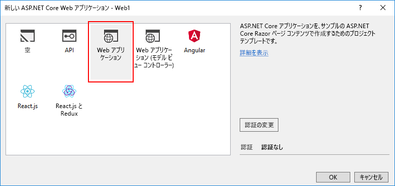
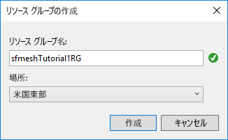

# <a name="quickstart-create-and-deploy-a-web-app-to-azure-service-fabric-mesh"></a>クイック スタート: Web アプリを作成して Azure Service Fabric mesh にデプロイする

Azure Service Fabric Mesh は、仮想マシン、ストレージ、ネットワークを管理することなく開発者がマイクロサービス アプリケーションをデプロイできるフル マネージド サービスです。

このクイック スタートでは、ASP.NET Core Web アプリで構成される新しい Service Fabric Mesh アプリケーションを作成し、ローカル開発クラスターで実行してから、Azure で実行するように発行します。

Azure サブスクリプションが必要です。 Azure サブスクリプションを持っていない場合は、始める前に[無料アカウント作成](https://azure.microsoft.com/free/)ページで無料の Azure サブスクリプションを間単に作成できます。 [開発環境をセットアップする](service-fabric-mesh-howto-setup-developer-environment-sdk.md)必要もあります。

[!INCLUDE [preview note](./includes/include-preview-note.md)]

## <a name="create-a-service-fabric-mesh-project"></a>Service Fabric mesh プロジェクトを作成する

Visual Studio を開き、**[ファイル]** > **[新規]** > **[プロジェクト]** の順に選択します。

**[新しいプロジェクト]** ダイアログの上部にある **[検索]** ボックスに「`mesh`」と入力します。 **[Service Fabric Mesh Application]\(Service Fabric mesh アプリケーション\)** テンプレートを選択します  (テンプレートが表示されない場合は、[開発環境の設定](service-fabric-mesh-howto-setup-developer-environment-sdk.md)に関するページの説明に従って、Mesh SDK と VS Tools プレビューをインストールしたことを確認してください)。 

**[名前]** ボックスに「**ServiceFabricMesh1**」と入力し、**[場所]** ボックスにプロジェクト ファイル格納場所のフォルダー パスを設定します。

**[ソリューションのディレクトリを作成する]** がオンになっていることを確認し、**[OK]** をクリックして Service Fabric mesh プロジェクトを作成します。


### <a name="create-a-service"></a>サービスの作成

**[OK]** をクリックすると、**[新しい Service Fabric サービス]** ダイアログが表示されます。 プロジェクトの種類として **[ASP.NET Core]** を選択し、**[Container OS]\(コンテナー OS\)** が **[Windows]** に設定されていることを確認した後、**[OK]** をクリックして ASP.NET Core プロジェクトを作成します。 


**[新しい ASP.NET Core Web アプリケーション]** ダイアログが表示されます。 **[Web アプリケーション]** を選択し、**[OK]** をクリックします。



Service Fabric Mesh アプリケーション プロジェクトと ASP.NET Core プロジェクトが作成されます。

## <a name="build-and-publish-to-your-local-cluster"></a>ビルドしてローカル クラスターに発行する

プロジェクトが読み込まれるとすぐに、Docker イメージが自動的にビルドされて、ローカル クラスターにデプロイされます。 このプロセスにはしばらく時間がかかることがあります。 **[出力]** ウィンドウ ドロップダウンで **[Service Fabric Tools]** 項目を選択すると、**[出力]** ウィンドウで Service Fabric Tools の進行状況を監視できます。 Docker イメージが展開されている間も作業を続行できます。

プロジェクトが作成された後、**F5** キーを押してサービスをローカル デバッグします。 ローカル デプロイが完了し、Visual Studio がプロジェクトを実行すると、ブラウザー ウィンドウでサンプルの Web ページが開きます。

デプロイされたサービスの参照が完了したら、Visual Studio で **Shift + F5** キーを押して、プロジェクトのデバッグを停止します。

## <a name="publish-to-azure"></a>Azure に発行する

Service Fabric mesh プロジェクトを Azure に発行するには、Visual Studio で **Service Fabric mesh プロジェクト**を右クリックし、**[発行...]** を選択します。


**[Service Fabric アプリケーションの発行]** ダイアログが表示されます。


Azure アカウントとサブスクリプションを選択します。 **[場所]** を選択します。 この記事では、**[米国東部]** を使用します。

**[リソース グループ]** で、**[\<新しいリソース グループの作成...>]** を選択します。 **[リソース グループの作成]** ダイアログが表示されます。 **[リソース グループ名]** と **[場所]** を設定します。  このクイック スタートでは、場所として **[米国東部]** を使用し、グループに **sfmeshTutorial1RG** という名前を付けます (組織に同じサブスクリプションを使用する複数のユーザーがいる場合は、一意のリソース グループ名を選択します)。  **[作成]** をクリックしてリソース グループを作成し、発行ダイアログに戻ります。



**[Service Fabric アプリケーションの発行]** ダイアログに戻り、**[Azure Container Registry]** の **[\<Create New Container Registry...>]\(<新しいコンテナー レジストリの作成...>\)** を選択します。 **[コンテナー レジストリの作成]** ダイアログで、**[コンテナー レジストリ名]** に一意の名前を使用します。 **[場所]** を指定します (このクイック スタートでは、**[米国東部]** を使用します)。 前の手順で作成した**リソース グループ**をドロップダウンで選択します (例: **sfmeshTutorial1RG**)。 **[SKU]** を **[Basic]** に設定し、**[作成]** をクリックして発行ダイアログに戻ります。


発行ダイアログで **[発行]** をクリックして、Service Fabric Mesh アプリケーションを Azure にデプロイします。

Azure に初めて発行したときは、Docker イメージが Azure Container Registry (ACR) にプッシュされます。イメージのサイズによっては、この処理に時間がかかります。 同じプロジェクトの以降の発行は高速になります。 Visual Studio の **[出力]** ウィンドウ ドロップダウンで **[Service Fabric Tools]** を選択することにより、デプロイの進行状況を監視できます。 デプロイが完了すると、**Service Fabric Tools** の出力に、アプリケーションの IP アドレスとポートが URL の形式で表示されます。

```json
Packaging Application...
Building Images...
Web1 -> C:\Code\ServiceFabricMesh1\Web1\bin\Any CPU\Release\netcoreapp2.0\Web1.dll
Uploading the images to Azure Container Registry...
Deploying application to remote endpoint...
The application was deployed successfully and it can be accessed at http://...
```

Web ブラウザーを開き、その URL に移動して、Azure で実行されている Web サイトを表示します。


## <a name="clean-up-resources"></a>リソースのクリーンアップ

不要になったら、このクイック スタートで作成したすべてのリソースを削除します。 ACR サービス リソースと Service Fabric mesh サービス リソースの両方をホストする新しいリソース グループを作成したので、このリソース グループを安全に削除できます。リソース グループを削除することで、リソース グループに関連付けられているすべてのリソースを簡単に削除できます。

```azurecli
az group delete --resource-group sfmeshTutorial1RG
```

```powershell
Connect-AzureRmAccount
Remove-AzureRmResourceGroup -Name sfmeshTutorial1RG
```

リソース グループは、[Azure portal から](https://portal.azure.com)削除することもできます。

## <a name="next-steps"></a>次の手順

Service Fabric Mesh アプリケーションの作成とデプロイについてさらに詳しく学習するには、チュートリアルを続けてください。
> [!div class="nextstepaction"]
> [マルチサービス Web アプリケーションを作成してデバッグし、Service Fabric mesh にデプロイする](service-fabric-mesh-tutorial-create-dotnetcore.md)