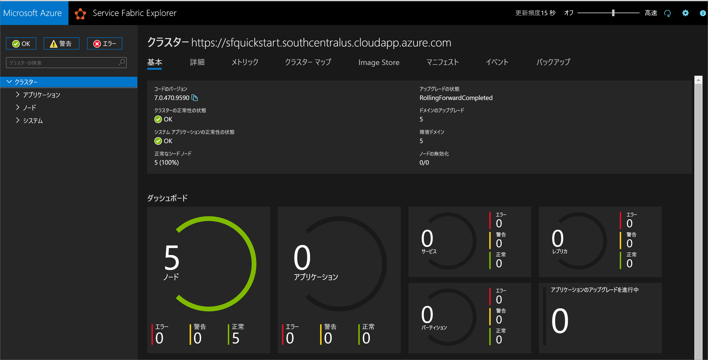
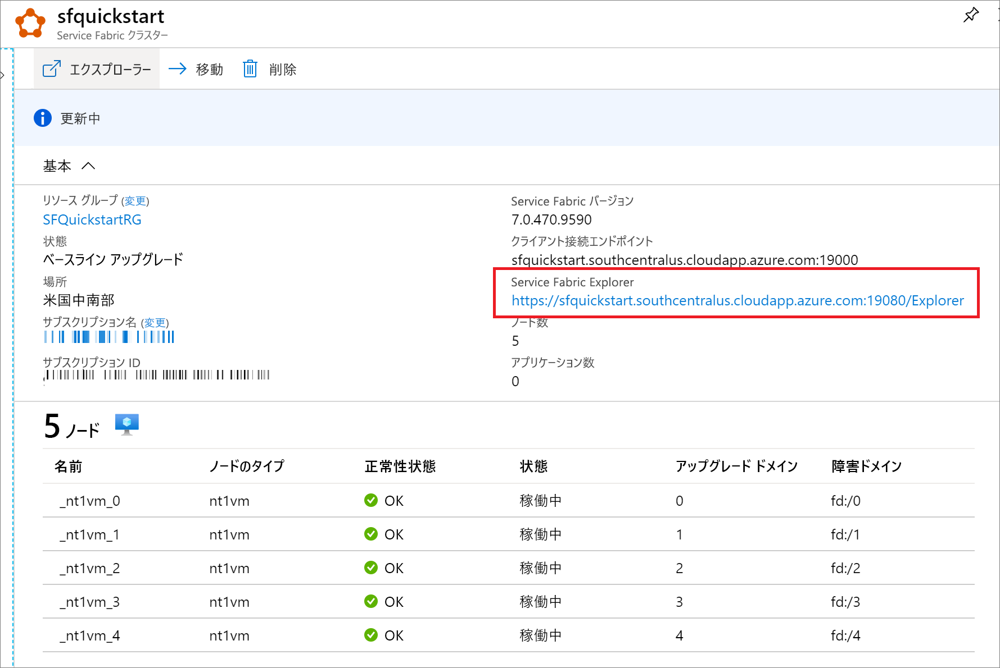

# <a name="quickstart-create-a-service-fabric-cluster-using-arm-template"></a>クイック スタート:ARM テンプレートを使用して Service Fabric クラスターを作成する

Azure Service Fabric は、スケーラブルで信頼性に優れたマイクロサービスとコンテナーのパッケージ化とデプロイ、管理を簡単に行うことができる分散システム プラットフォームです。 Service Fabric "*クラスター*" は、ネットワークで接続された一連の仮想マシンです。マイクロサービスは Service Fabric クラスターにデプロイされ、そこで管理されます。 この記事では、Azure Resource Manager テンプレート (ARM テンプレート) を使用して、Azure に Service Fabric テスト クラスターをデプロイする方法について説明します。

[!INCLUDE [About Azure Resource Manager](../../includes/resource-manager-quickstart-introduction.md)]

この 5 ノードの Windows クラスターは、セキュリティの保護に自己署名証明書を使用しているため、運用環境のワークロードではなく、説明のみを目的としています。 テンプレートのデプロイには、Azure PowerShell を使用します。 Azure PowerShell だけでなく、Azure portal、Azure CLI、および REST API を使用することもできます。 他のデプロイ方法については、「[テンプレートのデプロイ](../azure-resource-manager/templates/deploy-portal.md)」を参照してください。

環境が前提条件を満たしていて、ARM テンプレートの使用に慣れている場合は、 **[Azure へのデプロイ]** ボタンを選択します。 Azure portal でテンプレートが開きます。

[](https://portal.azure.com/#create/Microsoft.Template/uri/https%3A%2F%2Fraw.githubusercontent.com%2FAzure%2Fazure-quickstart-templates%2Fmaster%2Fservice-fabric-secure-cluster-5-node-1-nodetype%2Fazuredeploy.json)

## <a name="prerequisites"></a>前提条件

Azure サブスクリプションをお持ちでない場合は、開始する前に[無料](https://azure.microsoft.com/free/)アカウントを作成してください。

### <a name="install-service-fabric-sdk-and-powershell-modules"></a>Service Fabric SDK と PowerShell モジュールをインストールします

このクイックスタートを完了するには、次のことが必要です。

* [Service Fabric SDK と PowerShell モジュール](service-fabric-get-started.md)をインストールします。

* [Azure PowerShell](/powershell/azure/install-az-ps)をインストールします。

### <a name="download-the-sample-template-and-certificate-helper-script"></a>サンプル テンプレートと証明書ヘルパー スクリプトをダウンロードする

[Azure Resource Manager クイックスタート テンプレート](https://github.com/Azure/azure-quickstart-templates) リポジトリを複製またはダウンロドします。 または、使用する以下のファイルを *service-fabric-secure-cluster-5-node-1-nodetype* フォルダーからローカルにコピーします。

* [New-ServiceFabricClusterCertificate.ps1](https://raw.githubusercontent.com/Azure/azure-quickstart-templates/master/service-fabric-secure-cluster-5-node-1-nodetype/scripts/New-ServiceFabricClusterCertificate.ps1)
* [azuredeploy.json](https://raw.githubusercontent.com/Azure/azure-quickstart-templates/master/service-fabric-secure-cluster-5-node-1-nodetype/azuredeploy.json)
* [azuredeploy.parameters.json](https://raw.githubusercontent.com/Azure/azure-quickstart-templates/master/service-fabric-secure-cluster-5-node-1-nodetype/azuredeploy.parameters.json)

### <a name="sign-in-to-azure"></a>Azure へのサインイン

Azure にサインインし、Service Fabric クラスターの作成に使用するサブスクリプションを指定します。

```powershell
# Sign in to your Azure account
Login-AzAccount -SubscriptionId "<subscription ID>"
```

### <a name="create-a-self-signed-certificate-stored-in-key-vault"></a>Key Vault に格納される自己署名証明書を作成する

Service Fabric では、X.509 証明書を使用して、[クラスターをセキュリティで保護](./service-fabric-cluster-security.md)し、アプリケーションのセキュリティ機能を提供します。また、[Key Vault](../key-vault/general/overview.md) を使用して、これらの証明書を管理します。 クラスターを正常に作成するには、ノード間通信を有効にするためのクラスター証明書が必要です。 このクイックスタート テスト クラスターを作成するために、クラスター認証用の自己署名証明書を作成します。 運用環境のワークロードには、正しく構成された Windows Server 証明書サービスを使用して作成した証明書か、認定済みの証明機関 (CA) からの証明書が必要です。

```powershell
# Designate unique (within cloudapp.azure.com) names for your resources
$resourceGroupName = "SFQuickstartRG"
$keyVaultName = "SFQuickstartKV"

# Create a new resource group for your Key Vault and Service Fabric cluster
New-AzResourceGroup -Name $resourceGroupName -Location SouthCentralUS

# Create a Key Vault enabled for deployment
New-AzKeyVault -VaultName $keyVaultName -ResourceGroupName $resourceGroupName -Location SouthCentralUS -EnabledForDeployment

# Generate a certificate and upload it to Key Vault
.\scripts\New-ServiceFabricClusterCertificate.ps1
```

スクリプトによって次のメッセージが表示されます (以下の例の値のうち、*CertDNSName* と *KeyVaultName* は必ず変更してください)。

* **パスワード:** Password!1
* **CertDNSName:** *sfquickstart*.southcentralus.cloudapp.azure.com
* **KeyVaultName:** *SFQuickstartKV*
* **KeyVaultSecretName:** clustercert

完了すると、テンプレートのデプロイに必要なパラメーター値がスクリプトによって提供されます。 これらの変数は、クラスター テンプレートをデプロイするために必要となるため、以下の変数に格納してください。

```powershell
$sourceVaultId = "<Source Vault Resource Id>"
$certUrlValue = "<Certificate URL>"
$certThumbprint = "<Certificate Thumbprint>"
```

## <a name="review-the-template"></a>テンプレートを確認する

このクイックスタートで使用されるテンプレートは [Azure クイックスタート テンプレート](https://azure.microsoft.com/resources/templates/service-fabric-secure-cluster-5-node-1-nodetype/)からのものです。 この記事のテンプレートは長いため、ここでは表示できません。 テンプレートを表示するには、[azuredeploy.json](https://raw.githubusercontent.com/Azure/azure-quickstart-templates/master/service-fabric-secure-cluster-5-node-1-nodetype/azuredeploy.json) ファイルを参照してください。

テンプレートでは、複数の Azure リソースが定義されています。

* [Microsoft.Storage/storageAccounts](/azure/templates/microsoft.storage/storageaccounts)
* [Microsoft.Network/virtualNetworks](/azure/templates/microsoft.network/virtualnetworks)
* [Microsoft.Network/publicIPAddresses](/azure/templates/microsoft.network/publicipaddresses)
* [Microsoft.Network/loadBalancers](/azure/templates/microsoft.network/loadbalancers)
* [Microsoft.Compute/virtualMachineScaleSets](/azure/templates/microsoft.compute/virtualmachinescalesets)
* [Microsoft.ServiceFabric/clusters](/azure/templates/microsoft.servicefabric/clusters)

Azure Service Fabric に関連するテンプレートをさらに探すには、「[Azure クイックスタート テンプレート](https://azure.microsoft.com/resources/templates/?sort=Popular&term=service+fabric)」を参照してください。

### <a name="customize-the-parameters-file"></a>パラメーター ファイルをカスタマイズする

*azuredeploy.parameters.json* を開き、パラメーター値を以下のように編集します。

* **clusterName** は、クラスター証明書を作成したときに *CertDNSName* に指定した値と一致させる
* **adminUserName** は、既定の *GEN-UNIQUE* トークン以外の値にする
* **adminPassword** は、既定の *GEN-PASSWORD* トークン以外の値にする
* **certificateThumbprint**、**sourceVaultResourceId**、および **certificateUrlValue** は、すべて空の文字列 (`""`) にする

次に例を示します。

```json
{
  "$schema": "https://schema.management.azure.com/schemas/2019-04-01/deploymentParameters.json#",
  "contentVersion": "1.0.0.0",
  "parameters": {
    "clusterName": {
      "value": "sfquickstart"
    },
    "adminUsername": {
      "value": "testadm"
    },
    "adminPassword": {
      "value": "Password#1234"
    },
    "certificateThumbprint": {
      "value": ""
    },
    "sourceVaultResourceId": {
      "value": ""
    },
    "certificateUrlValue": {
      "value": ""
    }
  }
}
```

## <a name="deploy-the-template"></a>テンプレートのデプロイ

ARM テンプレートとパラメーター ファイルのパスを変数に格納し、テンプレートをデプロイします。

```powershell
$templateFilePath = "<full path to azuredeploy.json>"
$parameterFilePath = "<full path to azuredeploy.parameters.json>"

New-AzResourceGroupDeployment `
    -ResourceGroupName $resourceGroupName `
    -TemplateFile $templateFilePath `
    -TemplateParameterFile $parameterFilePath `
    -CertificateThumbprint $certThumbprint `
    -CertificateUrlValue $certUrlValue `
    -SourceVaultResourceId $sourceVaultId `
    -Verbose
```

## <a name="review-deployed-resources"></a>デプロイされているリソースを確認する

デプロイが完了したら、出力の中の `managementEndpoint` 値を見つけ、Web ブラウザーでそのアドレスを開いて、[Service Fabric Explorer](./service-fabric-visualizing-your-cluster.md) でクラスターを表示します。



また、Azure portal の Service Explorer リソース ブレードから Service Fabric Explorer エンドポイントを見つけることもできます。



## <a name="clean-up-resources"></a>リソースをクリーンアップする

不要になったら、リソース グループを削除します。これにより、リソース グループ内のリソースが削除されます。

```powershell
$resourceGroupName = Read-Host -Prompt "Enter the Resource Group name"
Remove-AzResourceGroup -Name $resourceGroupName
Write-Host "Press [ENTER] to continue..."
```

次に、ローカル ストアからクラスター証明書を削除します。 インストールされている証明書の一覧を表示して、クラスター用のサムプリントを見つけます。

```powershell
Get-ChildItem Cert:\CurrentUser\My\
```

そして、その証明書を削除します。

```powershell
Get-ChildItem Cert:\CurrentUser\My\{THUMBPRINT} | Remove-Item
```

## <a name="next-steps"></a>次のステップ

カスタム Azure Service Fabric クラスター テンプレートの作成の詳細については、次を参照してください。

> [!div class="nextstepaction"]
> [Service Fabric クラスターの Resource Manager テンプレートを作成する](service-fabric-cluster-creation-create-template.md)
