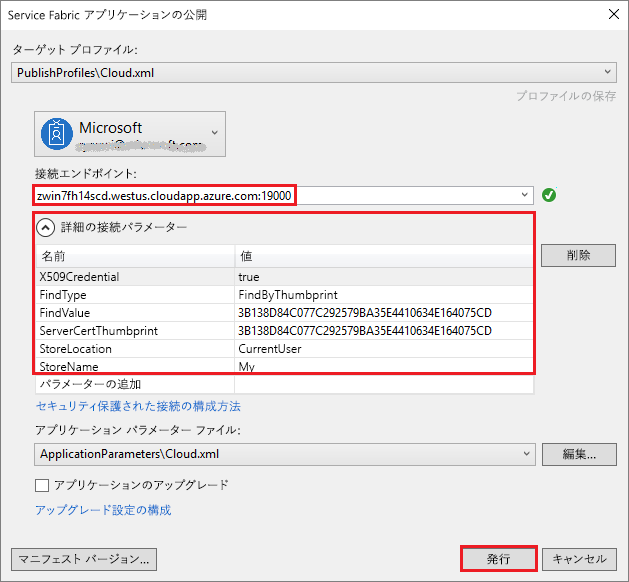

# <a name="quickstart-deploy-windows-containers-to-service-fabric"></a>クイック スタート: Service Fabric に Windows コンテナーをデプロイする

Azure Service Fabric は、スケーラブルで信頼性に優れたマイクロサービスとコンテナーのデプロイと管理を行うための分散システム プラットフォームです。

既存のアプリケーションを Service Fabric クラスター上の Windows コンテナー内で実行する場合は、アプリケーションに変更を加える必要はありません。 このクイックスタートでは、あらかじめ用意されている Docker コンテナー イメージを Service Fabric アプリケーションにデプロイする方法を紹介します。 最後まで読み進めていけば、Windows Server 2016 Nano Server と IIS コンテナーを稼働状態にすることができます。 このクイックスタートでは、Windows コンテナーのデプロイについて説明しています。Linux コンテナーをデプロイする場合は、[こちらのクイックスタート](service-fabric-quickstart-containers-linux.md)を参照してください。

![IIS の既定の Web ページ][iis-default]

このクイック スタートでは、次の方法について説明します。

* Docker イメージ コンテナーをパッケージ化する
* 通信を構成する
* Service Fabric アプリケーションのビルドとパッケージ化
* コンテナー アプリケーションを Azure にデプロイする

## <a name="prerequisites"></a>前提条件

* Azure サブスクリプション ([無料アカウント](https://azure.microsoft.com/free/?WT.mc_id=A261C142F)を作成できます)。
* 次のものを実行している開発コンピューター。
  * Visual Studio 2015 または Visual Studio 2017。
  * [Service Fabric SDK およびツール](service-fabric-get-started.md)。

## <a name="package-a-docker-image-container-with-visual-studio"></a>Visual Studio で Docker イメージ コンテナーをパッケージ化する

Service Fabric SDK およびツールには、コンテナーを Service Fabric クラスターにデプロイするときに役立つサービスのテンプレートが用意されています。

"管理者" として Visual Studio を起動します。  **[ファイル]** > **[新規作成]** > **[プロジェクト]** の順に選択します。

**[Service Fabric アプリケーション]** を選択し、"MyFirstContainer" という名前を付けて、**[OK]** をクリックします。

**[ホスト コンテナーとアプリケーション]** テンプレートから **[コンテナー]** を選択します。

**[イメージ名]** に、「microsoft/iis:nanoserver」と入力します。これが [Windows Server Nano Server と IIS の基本イメージ](https://hub.docker.com/r/microsoft/iis/)になります。

ポート 80 で受信するサービスへの要求が、コンテナーのポート 80 にマッピングされるように、コンテナーとホストとの間のポート マッピングを構成します。  **[Container Port] (コンテナー ポート)** を "80" に設定し、**[ホスト ポート]** を "80" に設定します。  

サービスに "MyContainerService" という名前を付けて **[OK]** をクリックします。

<<<<<<< 更新されたアップストリーム ![新しいサービス ダイアログ][new-service]
=======
## <a name="configure-communication-and-container-port-to-host-port-mapping"></a>通信/コンテナー ポートからホスト ポートへのマッピングを構成する

サービスには、通信のエンドポイントが必要です。  このクイック スタートでは、コンテナー化されたサービスはポート 80 でリッスンします。  ソリューション エクスプローラーで *MyFirstContainer/ApplicationPackageRoot/MyContainerServicePkg/ServiceManifest.xml* を開きます。  ServiceManifest.xml ファイルで既存の `Endpoint` を更新し、プロトコル、ポート、URI スキームを追加します。

```xml
<Resources>
    <Endpoints>
        <Endpoint Name="MyContainerServiceTypeEndpoint" UriScheme="http" Port="80" Protocol="http"/>
   </Endpoints>
</Resources>
```

`UriScheme` を指定すると、Service Fabric ネーム サービスを使用したコンテナー エンドポイントが自動的に登録され、検出可能性が確保されます。 ServiceManifest.xml の完全なサンプル ファイルは、この記事の最後にあります。

ポート 80 で受信するサービスへの要求が、コンテナーのポート 80 にマッピングされるように、コンテナーとホストとの間のポート マッピングを構成します。  ソリューション エクスプローラーで *MyFirstContainer/ApplicationPackageRoot/ApplicationManifest.xml* を開き、`ContainerHostPolicies` の `PortBinding` ポリシーを指定します。  このクイックスタートでは、`ContainerPort` は 80 で、`EndpointRef` は "MyContainerServiceTypeEndpoint" (サービス マニフェストで定義されたエンドポイント) です。

```xml
<ServiceManifestImport>
...
  <ConfigOverrides />
  <Policies>
    <ContainerHostPolicies CodePackageRef="Code">
      <PortBinding ContainerPort="80" EndpointRef="MyContainerServiceTypeEndpoint"/>
    </ContainerHostPolicies>
  </Policies>
</ServiceManifestImport>
```

ApplicationManifest.xml の完全なサンプル ファイルは、この記事の最後にあります。
>>>>>>> 一時退避された変更

## <a name="specify-the-os-build-for-your-container-image"></a>コンテナー イメージの OS ビルドを指定する
特定のバージョンの Windows Server で構築されたコンテナーは、異なるバージョンの Windows Server を実行しているホスト上では動作しない可能性があります。 たとえば、Windows Server バージョン 1709 を使用して構築されたコンテナーは、Windows Server 2016 を実行するホスト上では動作しません。 詳細については、[Windows Server コンテナーの OS とホスト OS の互換性](service-fabric-get-started-containers.md#windows-server-container-os-and-host-os-compatibility)に関するページを参照してください。 

Service Fabric ランタイム バージョン 6.1 以降では、コンテナーごとに複数の OS イメージを指定し、それぞれに展開する必要がある OS のビルド バージョンでタグ付けすることができます。 これにより、異なるバージョンの Windows OS を実行しているホスト全体でアプリを実行できるようになります。 詳細については、「[OS ビルド固有のコンテナー イメージを指定する](service-fabric-get-started-containers.md#specify-os-build-specific-container-images)」を参照してください。 

Microsoft は、異なるバージョンの Windows Server 上に構築された IIS のバージョンごとに異なるイメージを公開しています。 Service Fabric で、アプリを展開するクラスター ノード上で実行されている Windows Server のバージョンと互換性のあるコンテナーが展開されるようにするには、*ApplicationManifest.xml* ファイルに以下の行を追加します。 Windows Server 2016 のビルド バージョンは 14393 であり、Windows Server バージョン 1709 のビルド バージョンは 16299 です。 

```xml
    <ContainerHostPolicies CodePackageRef="Code"> 
      <ImageOverrides> 
        ...
          <Image Name="microsoft/iis:nanoserverDefault" /> 
          <Image Name= "microsoft/iis:nanoserver" Os="14393" /> 
          <Image Name="microsoft/iis:windowsservercore-1709" Os="16299" /> 
      </ImageOverrides> 
    </ContainerHostPolicies> 
```

サービス マニフェストは、引き続きナノサーバーの 1 つのイメージ `microsoft/iis:nanoserver` のみを指定します。 

## <a name="create-a-cluster"></a>クラスターの作成

Azure のクラスターにアプリケーションをデプロイする場合、パーティ クラスターに参加できます。 パーティ クラスターは、Azure でホストされる無料の期間限定の Service Fabric クラスターであり、Service Fabric チームによって実行されます。このクラスターには、だれでもアプリケーションをデプロイして、プラットフォームについて学習することができます。  このクラスターでは、ノード間のセキュリティおよびクライアントとノードの間のセキュリティに単一の自己署名証明書が使用されます。 パーティ クラスターでは、コンテナーがサポートされます。 独自のクラスターをセットアップして使用する場合は、コンテナーをサポートする SKU (Windows Server 2016 Datacenter with Containers など) でクラスターを実行する必要があります。

サインインし、[Windows クラスターに参加](http://aka.ms/tryservicefabric)します。 **[PFX]** リンクをクリックして、PFX 証明書をコンピューターにダウンロードします。 **[How to connect to a secure Party cluster?]\(セキュリティで保護されたパーティ クラスターに接続する方法\)** リンクをクリックして、証明書のパスワードをコピーします。 証明書、証明書のパスワード、**[接続のエンドポイント]** の値は、次の手順で使用します。


> [!Note]
> 1 時間あたりに使用可能なパーティ クラスターの数には制限があります。 パーティ クラスターへのサインアップ時にエラーが発生する場合は、少し待ってからやり直してください。または、[.NET アプリのデプロイ](https://docs.microsoft.com/azure/service-fabric/service-fabric-tutorial-deploy-app-to-party-cluster#deploy-the-sample-application)のチュートリアルに記載されている手順に従って、Azure サブスクリプションに Service Fabric クラスターを作成し、アプリケーションをデプロイすることもできます。 Visual Studio で作成されたクラスターは、コンテナーをサポートします。 クラスターにアプリケーションをデプロイして確認したら、このクイック スタートの「[Service Fabric のアプリケーション マニフェストとサービス マニフェストの完全な例](#complete-example-service-fabric-application-and-service-manifests)」に進むことができます。
>

Windows コンピューターで、*CurrentUser\My* 証明書ストアに PFX をインストールします。

```powershell
PS C:\mycertificates> Import-PfxCertificate -FilePath .\party-cluster-873689604-client-cert.pfx -CertStoreLocation Cert:\CurrentUser\My -Password (ConvertTo-SecureString 873689604 -AsPlainText -Force)


  PSParentPath: Microsoft.PowerShell.Security\Certificate::CurrentUser\My

Thumbprint                                Subject
----------                                -------
3B138D84C077C292579BA35E4410634E164075CD  CN=zwin7fh14scd.westus.cloudapp.azure.com
<<<<<<< Updated upstream
``` 
=======
```

Remember the thumbprint for the following step.
>>>>>>> Stashed changes

## Deploy the application to Azure using Visual Studio

Now that the application is ready, you can deploy it to a cluster directly from Visual Studio.

Right-click **MyFirstContainer** in the Solution Explorer and choose **Publish**. The Publish dialog appears.

<<<<<<< Updated upstream
Copy the **Connection Endpoint** from the Party cluster page into the **Connection Endpoint** field. For example, `zwin7fh14scd.westus.cloudapp.azure.com:19000`. 
=======
Copy the **Connection Endpoint** from the Party cluster page into the **Connection Endpoint** field. For example, `zwin7fh14scd.westus.cloudapp.azure.com:19000`. Click **Advanced Connection Parameters** and verify the connection parameter information.  *FindValue* and *ServerCertThumbprint* values must match the thumbprint of the certificate installed in the previous step.


>>>>>>> Stashed changes

Click **Publish**.

Each application in the cluster must have a unique name.  Party clusters are a public, shared environment however and there may be a conflict with an existing application.  If there is a name conflict, rename the Visual Studio project and deploy again.

Open a browser and navigate to the **Connection endpoint** specified in the Party cluster page. You can optionally prepend the scheme identifier, `http://`, and append the port, `:80`, to the URL. For example, http://zwin7fh14scd.westus.cloudapp.azure.com:80. You should see the IIS default web page:
![IIS default web page][iis-default]

<<<<<<< Updated upstream
=======
## Complete example Service Fabric application and service manifests

Here are the complete service and application manifests used in this quickstart.

### ServiceManifest.xml

```xml
<?xml version="1.0" encoding="utf-8"?>
<ServiceManifest Name="MyContainerServicePkg"
                 Version="1.0.0"
                 xmlns="http://schemas.microsoft.com/2011/01/fabric"
                 xmlns:xsd="http://www.w3.org/2001/XMLSchema"
                 xmlns:xsi="http://www.w3.org/2001/XMLSchema-instance">
  <ServiceTypes>
    <!-- This is the name of your ServiceType.
         The UseImplicitHost attribute indicates this is a guest service. -->
    <StatelessServiceType ServiceTypeName="MyContainerServiceType" UseImplicitHost="true" />
  </ServiceTypes>

  <!-- Code package is your service executable. -->
  <CodePackage Name="Code" Version="1.0.0">
    <EntryPoint>
      <!-- Follow this link for more information about deploying Windows containers to Service Fabric: https://aka.ms/sfguestcontainers -->
      <ContainerHost>
        <ImageName>microsoft/iis:nanoserver</ImageName>
      </ContainerHost>
    </EntryPoint>
    <!-- Pass environment variables to your container: -->
    <!--
    <EnvironmentVariables>
      <EnvironmentVariable Name="VariableName" Value="VariableValue"/>
    </EnvironmentVariables>
    -->
  </CodePackage>

  <!-- Config package is the contents of the Config directoy under PackageRoot that contains an 
       independently-updateable and versioned set of custom configuration settings for your service. -->
  <ConfigPackage Name="Config" Version="1.0.0" />

  <Resources>
    <Endpoints>
      <!-- This endpoint is used by the communication listener to obtain the port on which to 
           listen. Please note that if your service is partitioned, this port is shared with 
           replicas of different partitions that are placed in your code. -->
      <Endpoint Name="MyContainerServiceTypeEndpoint" UriScheme="http" Port="80" Protocol="http"/>
    </Endpoints>
  </Resources>
</ServiceManifest>
```

### <a name="applicationmanifestxml"></a>ApplicationManifest.xml

```xml
<?xml version="1.0" encoding="utf-8"?>
<ApplicationManifest ApplicationTypeName="MyFirstContainerType"
                     ApplicationTypeVersion="1.0.0"
                     xmlns="http://schemas.microsoft.com/2011/01/fabric"
                     xmlns:xsd="http://www.w3.org/2001/XMLSchema"
                     xmlns:xsi="http://www.w3.org/2001/XMLSchema-instance">
  <Parameters>
    <Parameter Name="MyContainerService_InstanceCount" DefaultValue="-1" />
  </Parameters>
  <!-- Import the ServiceManifest from the ServicePackage. The ServiceManifestName and ServiceManifestVersion 
       should match the Name and Version attributes of the ServiceManifest element defined in the 
       ServiceManifest.xml file. -->
  <ServiceManifestImport>
    <ServiceManifestRef ServiceManifestName="MyContainerServicePkg" ServiceManifestVersion="1.0.0" />
    <ConfigOverrides />
    <Policies>
      <ContainerHostPolicies CodePackageRef="Code">
        <PortBinding ContainerPort="80" EndpointRef="MyContainerServiceTypeEndpoint"/>
      </ContainerHostPolicies>
    </Policies>
  </ServiceManifestImport>
  <DefaultServices>
    <!-- The section below creates instances of service types, when an instance of this 
         application type is created. You can also create one or more instances of service type using the 
         ServiceFabric PowerShell module.
         
         The attribute ServiceTypeName below must match the name defined in the imported ServiceManifest.xml file. -->
    <Service Name="MyContainerService" ServicePackageActivationMode="ExclusiveProcess">
      <StatelessService ServiceTypeName="MyContainerServiceType" InstanceCount="[MyContainerService_InstanceCount]">
        <SingletonPartition />
      </StatelessService>
    </Service>
  </DefaultServices>
</ApplicationManifest>
```

>>>>>>> 一時退避された変更
## <a name="next-steps"></a>次の手順

このクイック スタートでは、次の方法について説明しました。

* Docker イメージ コンテナーをパッケージ化する
* 通信を構成する
* Service Fabric アプリケーションのビルドとパッケージ化
* コンテナー アプリケーションを Azure にデプロイする

Service Fabric で Windows コンテナーを操作する方法の詳細については、Windows コンテナー アプリのチュートリアルに進んでください。

> [!div class="nextstepaction"]
> [Windows コンテナー アプリの作成](./service-fabric-host-app-in-a-container.md)

[iis-default]: ./media/service-fabric-quickstart-containers/iis-default.png
[publish-dialog]: ./media/service-fabric-quickstart-containers/publish-dialog.png
[new-service]: ./media/service-fabric-quickstart-containers/NewService.png
