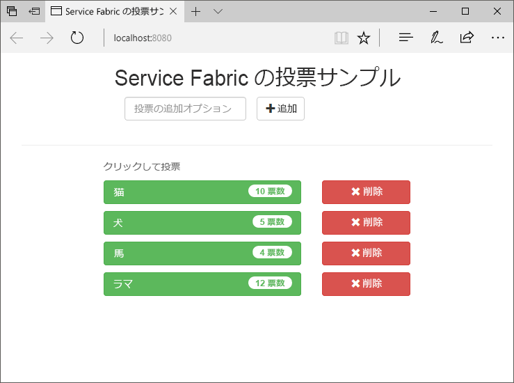
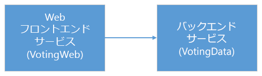
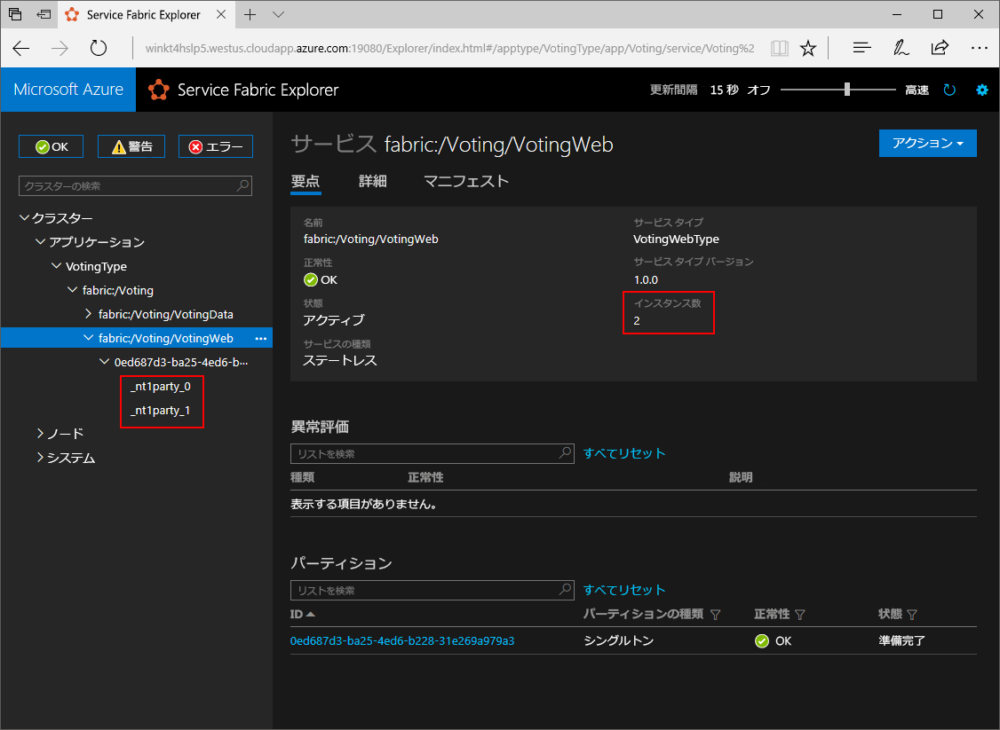
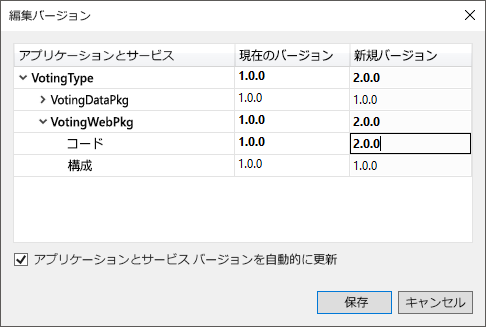
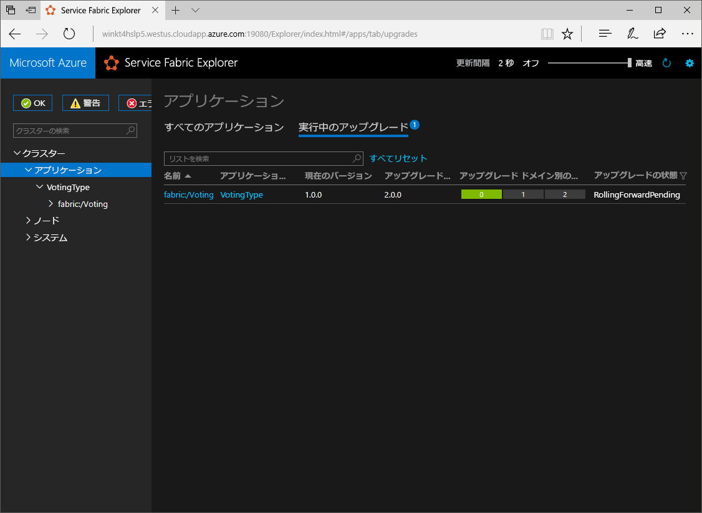

# <a name="quickstart-deploy-a-net-reliable-services-application-to-service-fabric"></a>クイック スタート: Service Fabric に .NET Reliable Services アプリケーションをデプロイする

Azure Service Fabric は、スケーラブルで信頼性に優れたマイクロサービスとコンテナーのデプロイと管理を行うための分散システム プラットフォームです。

このクイック スタートでは、初めての .NET アプリケーションを Service Fabric にデプロイする方法を紹介します。 最後まで読み進めていけば、ASP.NET Core Web フロントエンドからクラスター内のステートフルなバックエンド サービスに投票結果を保存するアプリケーションが完成します。



このアプリケーションを通じて次の方法を説明します。

* .NET と Service Fabric を使用してアプリケーションを作成する
* ASP.NET Core を Web フロントエンドとして使用する
* アプリケーション データをステートフル サービスに保存する
* アプリケーションをローカルでデバッグする
* アプリケーションを Azure のクラスターにデプロイする
* 複数のノードにアプリケーションをスケールアウトする
* アプリケーションのローリング アップグレードを実行する

## <a name="prerequisites"></a>前提条件

このクイック スタートを完了するには、以下が必要です。

1. [Visual Studio 2017 をインストール](https://www.visualstudio.com/)し、**Azure 開発**ワークロードと **ASP.NET および Web 開発**ワークロードをインストールする
2. [Git をインストールする](https://git-scm.com/)
3. [Microsoft Azure Service Fabric SDK をインストールする](http://www.microsoft.com/web/handlers/webpi.ashx?command=getinstallerredirect&appid=MicrosoftAzure-ServiceFabric-CoreSDK)
4. 次のコマンドを実行して Visual Studio からローカル Service Fabric クラスターへのデプロイを有効にする
    ```powershell
    Set-ExecutionPolicy -ExecutionPolicy Unrestricted -Force -Scope CurrentUser
    ```

>[!NOTE]
> このクイックスタートのサンプル アプリケーションは、Windows 7 では使用できない機能を使用します。
>

## <a name="download-the-sample"></a>サンプルのダウンロード

コマンド ウィンドウで、次のコマンドを実行して、サンプル アプリのリポジトリをローカル コンピューターに複製します。

```git
git clone https://github.com/Azure-Samples/service-fabric-dotnet-quickstart
```

## <a name="run-the-application-locally"></a>ローカルでアプリケーションを実行する

スタート メニューで Visual Studio アイコンを右クリックし、**[管理者として実行]** を選択します。 サービスにデバッガーをアタッチするには、Visual Studio を管理者として実行する必要があります。

複製したリポジトリから Visual Studio ソリューション **Voting.sln** を開きます。

既定では、この投票アプリケーションは、ポート 8080 でリッスンするように設定されています。  アプリケーションのポートは、*/VotingWeb/PackageRoot/ServiceManifest.xml* ファイルで設定されます。  アプリケーションのポートは、**Endpoint** 要素の **Port** 属性を更新することで変更できます。  アプリケーションをローカルでデプロイして実行するには、アプリケーションのポートをコンピューター上で開いて、使用できるようにする必要があります。  アプリケーションのポートを変更する場合は、この記事全体で "8080" の代わりにアプリケーションのポートの新しい値を使用してください。

アプリケーションをデプロイするには、**F5** キーを押します。

> [!NOTE]
> 初めてアプリケーションを実行してデプロイすると、Visual Studio によってデバッグ用にローカル クラスターが作成されます。 この操作には、しばらく時間がかかる場合があります。 Visual Studio の出力ウィンドウにクラスターの作成状態が表示されます。  出力では、"アプリケーション URL が設定されていないか、HTTP/HTTPS URL ではないため、アプリケーションに対してブラウザーは開かれません" というメッセージが表示されます。  このメッセージはエラーを示していませんが、ブラウザーは自動的に起動しません。

デプロイが完了したらブラウザーを起動し、`http://localhost:8080` ページ (アプリケーションの Web フロントエンド) を開きます。


これで一連の投票の選択肢を追加して投票を開始できます。 アプリケーションが実行され、データはすべて Service Fabric クラスターに保存されます。別途データベースを用意する必要はありません。

## <a name="walk-through-the-voting-sample-application"></a>投票のサンプル アプリケーションの概要

この投票アプリケーションは次の 2 つのサービスから成ります。

* Web フロントエンド サービス (VotingWeb) - ASP.NET Core Web フロントエンド サービス。Web ページを表示すると共に、バックエンド サービスとやり取りするための Web API を公開します。
* バックエンド サービス (VotingData) - ASP.NET Core Web サービス。ディスク上に永続化された信頼性の高いディクショナリに投票結果を保存する API を公開します。



アプリケーションで票を投じると、次のイベントが発生します。

1. JavaScript が Web フロントエンド サービスの Web API に HTTP PUT 要求として投票要求を送信します。

2. Web フロントエンド サービスがプロキシを使用して HTTP PUT 要求を検出し、バックエンド サービスに転送します。

3. バックエンド サービスが受信要求を受け取り、更新された結果を信頼性の高いディクショナリに保存すると、それがクラスター内の複数のノードにレプリケートされてディスク上に永続化されます。 アプリケーションのデータはすべてクラスターに保存されるため、データベースは必要ありません。

## <a name="debug-in-visual-studio"></a>Visual Studio でのデバッグ

アプリケーションは正常に実行されているはずですが、デバッガーを使用して、アプリケーションの主要部分がどのように動作しているかを確認することができます。 Visual Studio でアプリケーションをデバッグするときは、ローカルの Service Fabric 開発クラスターを使用します。 デバッグのエクスペリエンスは実際のシナリオに合わせて調整することができます。 このアプリケーションでは、データは信頼性の高いディクショナリを使ってバックエンド サービスに保存されます。 既定では、デバッガーを停止すると、Visual Studio によってアプリケーションが削除されます。 アプリケーションが削除されると、バックエンド サービス内のデータも削除されます。 デバッグ セッションの終了後もデータを維持するには、Visual Studio の **Voting** プロジェクトのプロパティで、**[アプリケーション デバッグ モード]** を変更してください。

コードでどのような処理が実行されているのかを確認するには、次の手順に従います。

1. **/VotingWeb/Controllers/VotesController.cs** ファイルを開き、Web API の **Put** メソッド (69 行目) にブレークポイントを設定します。このファイルは、Visual Studio のソリューション エクスプローラーで検索できます。

2. **/VotingData/Controllers/VoteDataController.cs** ファイルを開き、この Web API の **Put** メソッド (54 行目) にブレークポイントを設定します。

3. ブラウザーに戻り、投票の選択肢をクリックするか、新しい選択肢を追加します。 Web フロントエンドの API コントローラーで 1 つ目のブレークポイントに到達します。
    * ここは、JavaScript がブラウザーからフロントエンド サービスの Web API コントローラーに要求を送信する部分です。

    

    * 最初にバックエンド サービスの ReverseProxy の URL を構築します **(1)**。
    * 次に HTTP PUT 要求を ReverseProxy に送信します **(2)**。
    * 最後にバックエンド サービスからの応答をクライアントに返します **(3)**。

4. **F5** キーを押して続行します。
    - ブラウザーのプロンプトが表示された場合は、デバッグ モードに使用する読み取りと実行のアクセス許可を ServiceFabricAllowedUsers グループに与えます。
    - 今度は、バックエンド サービスのブレークポイントに到達します。

    

    * メソッド **(1)** の先頭行では、`StateManager` によって信頼性の高いディクショナリ (`counts`) が取得または追加されます。
    * 信頼性の高いディクショナリ内の値とのすべてのやり取りにはトランザクションが必要です。この using ステートメント **(2)** によってトランザクションが作成されます。
    * その後、トランザクションで、投票の選択肢に関連したキーの値を更新し、操作をコミットします **(3)**。 コミット メソッドから制御が戻ると、ディクショナリ内のデータが更新され、クラスター内の他のノードにレプリケートされます。 これでデータが安全にクラスターに保存され、バックエンド サービスは、データの可用性を維持したまま他のノードにフェールオーバーすることができます。
5. **F5** キーを押して続行します。

デバッグ セッションを停止するには、**Shift + F5** キーを押します。

## <a name="deploy-the-application-to-azure"></a>Azure にアプリケーションを展開する

Azure にアプリケーションをデプロイするには、アプリケーションを実行する Service Fabric クラスターが必要です。

### <a name="join-a-party-cluster"></a>パーティ クラスターに参加する

パーティ クラスターは、Azure でホストされる無料の期間限定の Service Fabric クラスターであり、Service Fabric チームによって実行されます。このクラスターには、だれでもアプリケーションをデプロイして、プラットフォームについて学習することができます。 このクラスターでは、ノード間のセキュリティおよびクライアントとノードの間のセキュリティに単一の自己署名証明書が使用されます。

サインインし、[Windows クラスターに参加](http://aka.ms/tryservicefabric)します。 **[PFX]** リンクをクリックして、PFX 証明書をコンピューターにダウンロードします。 **[How to connect to a secure Party cluster?]\(セキュリティで保護されたパーティ クラスターに接続する方法\)** リンクをクリックして、証明書のパスワードをコピーします。 証明書、証明書のパスワード、**[接続のエンドポイント]** の値は、次の手順で使用します。


> [!Note]
> 1 時間あたりに使用可能なパーティ クラスターの数には制限があります。 パーティ クラスターへのサインアップ時にエラーが発生する場合は、少し待ってからやり直してください。または、[.NET アプリのデプロイ](https://docs.microsoft.com/azure/service-fabric/service-fabric-tutorial-deploy-app-to-party-cluster#deploy-the-sample-application)のチュートリアルに記載されている手順に従って、Azure サブスクリプションに Service Fabric クラスターを作成し、アプリケーションをデプロイすることもできます。 Azure サブスクリプションをまだお持ちでない場合は、[無料のアカウント](https://azure.microsoft.com/free/?WT.mc_id=A261C142F)を作成できます。 クラスターにアプリケーションをデプロイして確認したら、このクイック スタートの「[クラスター内のアプリケーションとサービスをスケールする](#scale-applications-and-services-in-a-cluster)」に進むことができます。
>

お使いの Windows マシンで、*CurrentUser\My* 証明書ストアに PFX をインストールします。

```powershell
PS C:\mycertificates> Import-PfxCertificate -FilePath .\party-cluster-873689604-client-cert.pfx -CertStoreLocation Cert:\CurrentUser\My -Password (ConvertTo-SecureString 873689604 -AsPlainText -Force)


   PSParentPath: Microsoft.PowerShell.Security\Certificate::CurrentUser\My

Thumbprint                                Subject
----------                                -------
3B138D84C077C292579BA35E4410634E164075CD  CN=zwin7fh14scd.westus.cloudapp.azure.com
```

次の手順のために拇印を覚えておいてください。

> [!Note]
> 既定では、Web フロントエンド サービスは、ポート 8080 で着信トラフィックをリッスンするよう構成されています。 ポート 8080 は、パーティ クラスターで開かれています。  アプリケーションのポートを変更する必要がある場合は、パーティ クラスターで開かれているポートのいずれかに変更してください。
>

### <a name="deploy-the-application-using-visual-studio"></a>Visual Studio でアプリケーションをデプロイする

これでアプリケーションの準備ができたので、Visual Studio から直接クラスターにデプロイできます。

1. ソリューション エクスプローラーで **[Voting]** を右クリックして、**[発行]** を選択します。 [発行] ダイアログが表示されます。

2. パーティ クラスター ページの**接続のエンドポイント**を **[接続のエンドポイント]** フィールドにコピーします。 たとえば、「 `zwin7fh14scd.westus.cloudapp.azure.com:19000` 」のように入力します。 **[詳細な接続パラメーター]** をクリックし、*FindValue* と *ServerCertThumbprint* の値が前の手順でインストールした証明書の拇印に一致していることを確認します。

    ![[発行] ダイアログ](./media/service-fabric-quickstart-dotnet/publish-app.png)

    クラスター内の各アプリケーションには、一意の名前が必要です。  パーティ クラスターはパブリックの共有環境ですが、既存のアプリケーションと競合している可能性があります。  名前の競合が発生している場合は、Visual Studio プロジェクトの名前を変更し、もう一度デプロイします。

3. **[発行]** をクリックします。

4. ブラウザーを開き、クラスターのアドレスに続いて「:8080」を入力して、クラスター内のアプリケーションを取得します (例: `http://zwin7fh14scd.westus.cloudapp.azure.com:8080`)。 Azure のクラスターでアプリケーションが実行されていることがわかります。

    

## <a name="scale-applications-and-services-in-a-cluster"></a>クラスター内のアプリケーションとサービスをスケールする

Service Fabric サービスは、その負荷の変化に対応するために、クラスターで簡単にスケールすることができます。 サービスをスケールするには、クラスターで実行されるインスタンスの数を変更します。 サービスをスケールする方法は複数あり、PowerShell や Service Fabric CLI (sfctl) からスクリプトやコマンドを使用して行うことができます。 この例では、Service Fabric Explorer を使用します。

Service Fabric Explorer は、あらゆる Service Fabric クラスターで動作し、ブラウザーからクラスターの HTTP 管理ポート (19080) にアクセスして利用することができます (例: `http://zwin7fh14scd.westus.cloudapp.azure.com:19080`)。

場所が信頼されていないというブラウザーの警告が表示される場合があります。 これは、証明書が自己署名であることが原因です。 警告を無視することを選択して続行できます。
1. ブラウザーに求められたら、インストールされた証明書を選択して接続します。 リストから選択するパーティ クラスター証明書は、アクセスしようとしているパーティ クラスターと一致している必要があります  (例: win243uja6w62r.westus.cloudapp.azure.com)。
2. ブラウザーのプロンプトが表示された場合は、このセッションの CryptoAPI 秘密キーに対する権利を与えます。

Web フロントエンド サービスをスケールするには、次の手順に従います。

1. クラスターで Service Fabric Explorer を開きます (例: `http://zwin7fh14scd.westus.cloudapp.azure.com:19080`)。

2. ツリー ビューで、**[アプリケーション]**->**[VotingType]**->**[fabric:/Voting]** の順に展開します。 ツリー ビューで **fabric:/Voting/VotingWeb** ノードの横にある省略記号 (3 つの点) をクリックし、**[Scale Service]\(サービスのスケール\)** を選択します。

    

    これで Web フロントエンド サービスのインスタンス数をスケールできる状態になりました。

3. この数値を **2** に変更し、**[Scale Service]\(サービスのスケール\)** をクリックします。
4. ツリー ビューの **fabric:/Voting/VotingWeb** ノードをクリックし、パーティション ノード (GUID で表されます) を展開します。

    

    しばらくすると、サービスに 2 つのインスタンスが表示されます。  ツリー ビューでは、インスタンスが実行されるノードを確認できます。

たったこれだけの管理タスクにより、フロントエンド サービスでユーザー負荷を処理するためのリソースが 2 倍になりました。 実行するサービスの信頼性を高めるために、サービスのインスタンスを複数用意する必要はないことに注目してください。 サービスで障害が発生した場合、Service Fabric によって新しいサービス インスタンスがクラスターで実行されます。

## <a name="perform-a-rolling-application-upgrade"></a>アプリケーションのローリング アップグレードを実行する

アプリケーションに対して新しい更新プログラムをデプロイすると、その更新プログラムが Service Fabric によって安全にロールアウトされます。 ローリング アップグレードは、アップグレード中のダウンタイムが発生せず、また万一エラーが発生しても自動的にロールバックされます。

アプリケーションをアップグレードするには、次の手順に従います。

1. Visual Studio で **/VotingWeb/Views/Home/Index.cshtml** ファイルを開きます。
2. テキストを追加または更新して、ページの見出しを変更します。 たとえば、見出しを "Service Fabric Voting Sample v2" に変更します。
3. ファイルを保存します。
4. ソリューション エクスプローラーで **[Voting]** を右クリックして、**[発行]** を選択します。 [発行] ダイアログが表示されます。
5. **[マニフェストのバージョン]** ボタンをクリックしてサービスとアプリケーションのバージョンを変更します。
6. たとえば **VotingWebPkg** の **Code** 要素のバージョンを "2.0.0" に変更し、**[保存]** をクリックします。

    
7. **[Service Fabric アプリケーションの発行]** ダイアログで、[アプリケーションをアップグレードする] チェック ボックスをオンにし、**[発行]** をクリックします。

    ![[発行] ダイアログのアップグレード設定](./media/service-fabric-quickstart-dotnet/upgrade-app.png)

    アップグレード中もアプリケーションを使い続けることができます。 クラスターで実行されているサービスのインスタンスは 2 つあるため、アップグレード後のアプリケーションによって処理される要求と、アップグレード前のアプリケーションによって処理される要求が混在する可能性があります。

8. ブラウザーを開いて、クラスターのアドレスにポート 19080 でアクセスします (例: `http://zwin7fh14scd.westus.cloudapp.azure.com:19080`)。
9. ツリー ビューの **[Applications]\(アプリケーション\)** ノードをクリックし、右側のペインの **[Upgrades in Progress]\(進行中のアップグレード\)** をクリックします。 アップグレードが、クラスター内のアップグレード ドメインに展開されていくようすが表示されます。個々のドメインが正常であることを確認してから、次の手順に進んでください。 ドメインの正常性が確認されると、進行状況バーのアップグレード ドメインが緑で表示されます。
    

    Service Fabric はアップグレードを安全に行うために、クラスター内の各ノードについて、サービスのアップグレード後、2 分間待ちます。 更新がすべて完了するまでに約 8 分かかります。

## <a name="next-steps"></a>次の手順

このクイック スタートでは、次の方法について説明しました。

* .NET と Service Fabric を使用してアプリケーションを作成する
* ASP.NET Core を Web フロントエンドとして使用する
* アプリケーション データをステートフル サービスに保存する
* アプリケーションをローカルでデバッグする
* アプリケーションを Azure のクラスターにデプロイする
* 複数のノードにアプリケーションをスケールアウトする
* アプリケーションのローリング アップグレードを実行する

Service Fabric と .NET の詳細については、次のチュートリアルを参照してください。
> [!div class="nextstepaction"]
> [Service Fabric における .NET アプリケーション](service-fabric-tutorial-create-dotnet-app.md)
