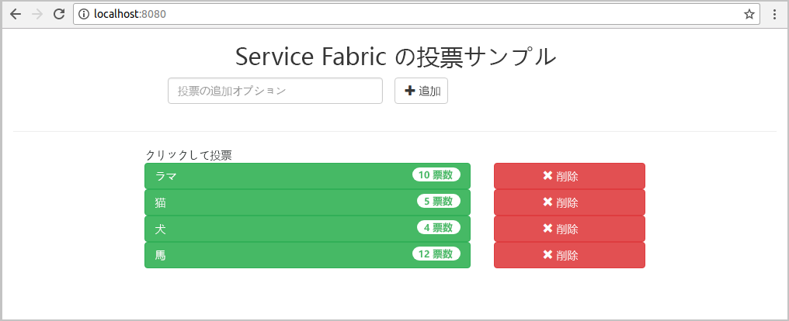
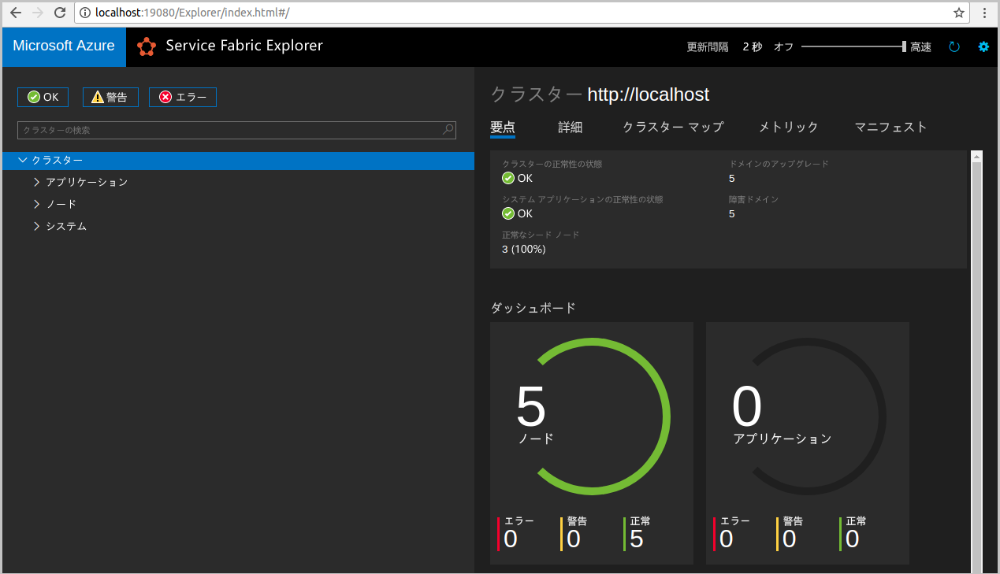
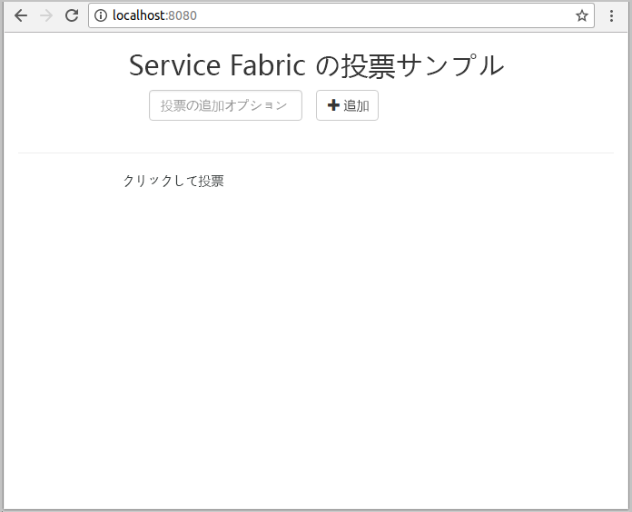
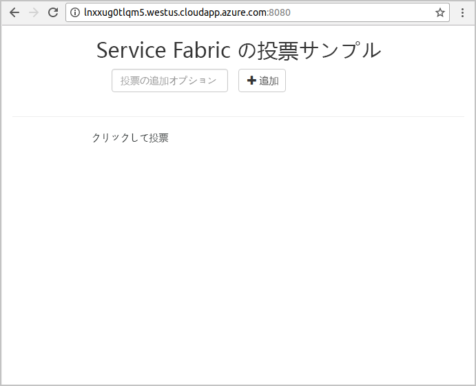
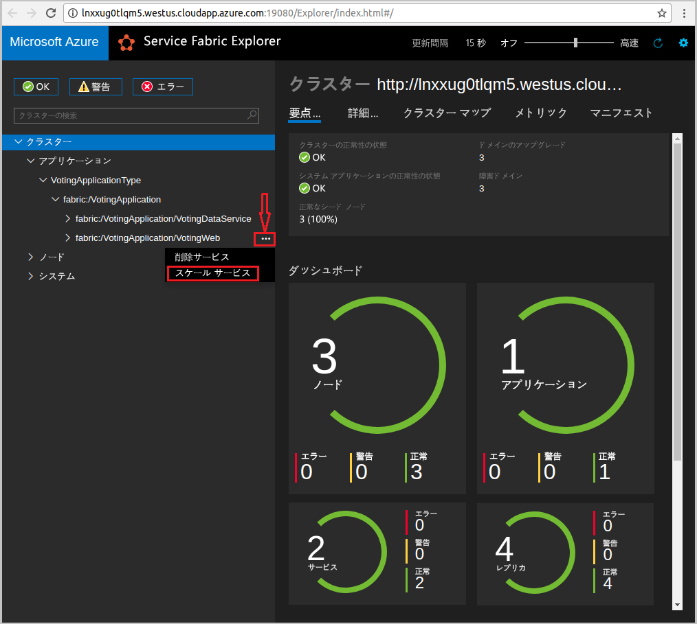
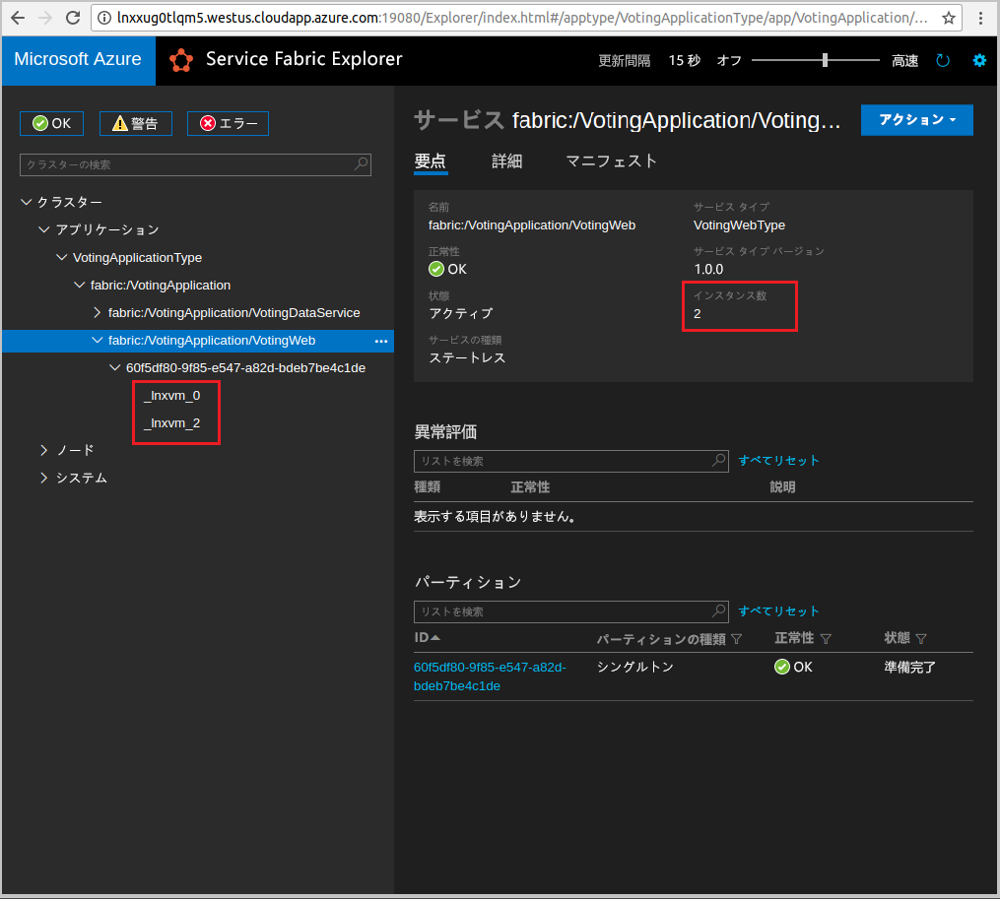

# <a name="quickstart-deploy-a-java-reliable-services-application-to-service-fabric"></a>クイック スタート: Service Fabric に Java Reliable Services アプリケーションをデプロイする

Azure Service Fabric は、マイクロサービスとコンテナーのデプロイと管理を行うための分散システム プラットフォームです。

このクイック スタートでは、Linux 開発者コンピューターで Eclipse IDE を使用して、Service Fabric に初めての Java アプリケーションをデプロイする方法を示します。 最後まで読み進めていけば、Java Web フロントエンドからクラスター内のステートフルなバックエンド サービスに投票結果を保存するアプリケーションが完成します。



このクイックスタートでは、次の方法について説明します。

* Service Fabric Java アプリケーションのツールとして Eclipse を使用する
* アプリケーションをローカル クラスターにデプロイする
* アプリケーションを Azure のクラスターにデプロイする
* 複数のノードにアプリケーションをスケールアウトする

## <a name="prerequisites"></a>前提条件

このクイック スタートを完了するには、以下が必要です。

1. [Service Fabric SDK および Service Fabric コマンド ライン インターフェイス (CLI) をインストールする](https://docs.microsoft.com/azure/service-fabric/service-fabric-get-started-linux#installation-methods)
2. [Git をインストールする](https://git-scm.com/)
3. [Eclipse をインストールする](https://www.eclipse.org/downloads/)
4. [Java 環境をセットアップ](https://docs.microsoft.com/azure/service-fabric/service-fabric-get-started-linux#set-up-java-development)し、オプションの手順に従って Eclipse プラグインのインストールを確実に行う

## <a name="download-the-sample"></a>サンプルのダウンロード

コマンド ウィンドウで、次のコマンドを実行して、サンプル アプリのリポジトリをローカル コンピューターに複製します。

```git
git clone https://github.com/Azure-Samples/service-fabric-java-quickstart.git
```

## <a name="run-the-application-locally"></a>ローカルでアプリケーションを実行する

1. 次のコマンドを実行して、ローカル クラスターを開始します。

    ```bash
    sudo /opt/microsoft/sdk/servicefabric/common/clustersetup/devclustersetup.sh
    ```
    ローカル クラスターの起動には、一定の時間がかかります。 クラスターが完全に起動されたことを確認するには、**http://localhost:19080** で Service Fabric Explorer にアクセスします。 5 つの正常なノードは、ローカル クラスターが起動され、実行されていることを示します。

    

2. Eclipse を開きます。
3. [ファイル] -> [Open Projects from File System]\(ファイル システムからプロジェクトを開く\) の順にクリックします。
4. [ディレクトリ] をクリックし、Github から複製した `service-fabric-java-quickstart` フォルダーから `Voting` ディレクトリを選択します。 [完了] をクリックします。

    ![Eclipse の [インポート] ダイアログ](./media/service-fabric-quickstart-java/eclipseimport.png)

5. これで、Eclipse のパッケージ エクスプローラーに `Voting` プロジェクトが配置されました。
6. プロジェクトを右クリックして、**[Service Fabric]** ドロップダウンの **[Publish Application...]\(アプリケーションの発行\)** を選択します。 ターゲット プロファイルとして **[PublishProfiles/Local.json]** を選択し、[発行] をクリックします。

    ![ローカルの [発行] ダイアログ](./media/service-fabric-quickstart-java/localjson.png)

7. 使い慣れた Web ブラウザーを開き、**http://localhost:8080** に接続してアプリケーションにアクセスします。

    

これで一連の投票の選択肢を追加して投票を開始できます。 アプリケーションが実行され、データはすべて Service Fabric クラスターに保存されます。別途データベースを用意する必要はありません。

## <a name="deploy-the-application-to-azure"></a>Azure にアプリケーションを展開する

### <a name="set-up-your-azure-service-fabric-cluster"></a>Azure Service Fabric クラスターの設定

Azure 内のクラスターにアプリケーションをデプロイするには、独自のクラスターを作成します。

パーティー クラスターは、Azure でホストされ、Service Fabric チームによって実行される期間限定の無料 Service Fabric クラスターです。 パーティ クラスターは、アプリケーションをデプロイしてプラットフォームについて学習するために使用できます。 このクラスターでは、ノード間のセキュリティおよびクライアントとノードの間のセキュリティに単一の自己署名証明書が使用されます。

サインインして、[Linux クラスター](http://aka.ms/tryservicefabric)に参加します。 **[PFX]** リンクをクリックして、PFX 証明書をコンピューターにダウンロードします。 **[ReadMe]** リンクをクリックして、証明書パスワードと、証明書を使用するさまざまな環境を構成する方法についての手順を探します。 **ウェルカム** ページと **ReadMe** ページをどちらも開いたままにして、次の手順にある指示のいくつかを使用します。

> [!Note]
> 1 時間あたりに使用可能なパーティ クラスターの数には制限があります。 パーティ クラスターへのサインアップ時にエラーが発生する場合は、少し待ってからやり直してください。または、[Azure での Service Fabric クラスターの作成](service-fabric-tutorial-create-vnet-and-linux-cluster.md)に関するページの手順に従って、サブスクリプションにクラスターを作成することもできます。
>
> Spring Boot サービスは、ポート 8080 で受信トラフィックをリッスンする構成になっています。 このポートがクラスターで開放されていることを確認してください。 パーティ クラスターを使用している場合、このポートは開放されています。
>

Service Fabric には、クラスターとそのアプリケーションを管理するために使用できるツールがいくつか用意されています。

* ブラウザーベースのツールである Service Fabric Explorer。
* Azure CLI 2.0 上で実行される Service Fabric コマンド ライン インターフェイス (CLI)。
* PowerShell コマンド。

このクイック スタートでは、Service Fabric CLI と Service Fabric Explorer を使用します。

CLI を使用するには、ダウンロードした PFX ファイルに基づいて PEM ファイルを作成する必要があります。 ファイルを変換するには、次のコマンドを使用します  (パーティー クラスターでは、**ReadMe** ページにある手順から PFX ファイルに固有のコマンドをコピーできます)。

    ```bash
    openssl pkcs12 -in party-cluster-1486790479-client-cert.pfx -out party-cluster-1486790479-client-cert.pem -nodes -passin pass:1486790479
    ```

Service Fabric Explorer を使用するには、パーティ クラスターの Web サイトからダウンロードした証明書 PFX ファイルを、ご使用の証明書ストア (Windows または Mac) あるいはブラウザー本体 (Ubuntu) にインポートする必要があります。 **ReadMe** ページから取得できる PFX 秘密キー パスワードが必要です。

お使いのシステムに証明書をインポートするのに最適な任意の方法を使用します。 例: 

* Windows の場合: PFX ファイルをダブルクリックし、プロンプトに従って個人用ストア `Certificates - Current User\Personal\Certificates` に証明書をインストールします。 または、**ReadMe** 手順の PowerShell コマンドを使用できます。
* Mac の場合: PFX ファイルをダブルクリックし、プロンプトに従ってキーチェーンに証明書をインストールします。
* Ubuntu の場合: Mozilla Firefox は、Ubuntu 16.04 の既定のブラウザーです。 証明書を Firefox にインポートするには、ブラウザーの右上隅にあるメニュー ボタンをクリックし、**[オプション]** をクリックします。 **環境設定**ページで、検索ボックスを使用して "証明書" を検索します。 **[証明書を表示]** をクリックし、**[あなたの証明書]** タブを選択します。次に、**[インポート]** をクリックし、プロンプトに従って証明書をインポートします。

   

### <a name="add-certificate-information-to-your-application"></a>アプリケーションに証明書情報を追加する

アプリケーションには、Service Fabric のプログラミング モデルが使用されているため、証明書の拇印を追加する必要があります。

1. セキュリティで保護されたクラスターで実行するときは、`Voting/VotingApplication/ApplicationManifest.xml` ファイルに証明書の拇印が必要となります。 次のコマンドを実行して、証明書の拇印を抽出します。

    ```bash
    openssl x509 -in [CERTIFICATE_PEM_FILE] -fingerprint -noout
    ```

2. `Voting/VotingApplication/ApplicationManifest.xml` ファイルの **ApplicationManifest** タグに次のスニペットを追加します。 前の手順で得た拇印 (セミコロンを除く) を **X509FindValue** に指定する必要があります。 

    ```xml
    <Certificates>
        <SecretsCertificate X509FindType="FindByThumbprint" X509FindValue="0A00AA0AAAA0AAA00A000000A0AA00A0AAAA00" />
    </Certificates>
    ```

### <a name="deploy-the-application-using-eclipse"></a>Eclipse を使用したアプリケーションのデプロイ

アプリケーションとクラスターの準備ができたので、Eclipse から直接クラスターにデプロイできます。

1. **PublishProfiles** ディレクトリにある **Cloud.json** ファイルを開き、`ConnectionIPOrURL` および `ConnectionPort` フィールドに適切に入力します。 以下に例を示します。

    ```bash
    {
         "ClusterConnectionParameters":
         {
            "ConnectionIPOrURL": "lnxxug0tlqm5.westus.cloudapp.azure.com",
            "ConnectionPort": "19080",
            "ClientKey": "[path_to_your_pem_file_on_local_machine]",
            "ClientCert": "[path_to_your_pem_file_on_local_machine]"
         }
    }
    ```

2. プロジェクトを右クリックして、**[Service Fabric]** ドロップダウンの **[Publish Application...]\(アプリケーションの発行\)** を選択します。 ターゲット プロファイルとして **[PublishProfiles/Cloud.json]** を選択し、[発行] をクリックします。

    ![クラウドの [発行] ダイアログ](./media/service-fabric-quickstart-java/cloudjson.png)

3. Web ブラウザーを開き、**http://\<ConnectionIPOrURL>:8080** に接続してアプリケーションにアクセスします。

    

## <a name="scale-applications-and-services-in-a-cluster"></a>クラスター内のアプリケーションとサービスをスケールする

サービスは、その負荷の変化に対応するために、クラスターで簡単にスケールすることができます。 サービスをスケールするには、クラスターで実行されるインスタンスの数を変更します。 サービスをスケーリングする方法は多数あり、たとえば Service Fabric CLI (sfctl) のスクリプトやコマンドを使用できます。 次の手順では、Service Fabric Explorer を使用します。

Service Fabric Explorer は、すべての Service Fabric クラスターで動作し、ブラウザーからクラスターの HTTP 管理ポート (19080) にアクセスして利用することができます (例: `http://lnxxug0tlqm5.westus.cloudapp.azure.com:19080`)。

Web フロントエンド サービスをスケーリングするには、以下を実行します。

1. クラスターで Service Fabric Explorer を開きます (例: `https://lnxxug0tlqm5.westus.cloudapp.azure.com:19080`)。
2. ツリー ビューで **fabric:/Voting/VotingWeb** ノードの横にある省略記号 (3 つの点) をクリックし、**[Scale Service]\(サービスのスケール\)** を選択します。

    

    これで Web フロントエンド サービスのインスタンス数をスケールできる状態になりました。

3. この数値を **2** に変更し、**[Scale Service]\(サービスのスケール\)** をクリックします。
4. ツリー ビューの **fabric:/Voting/VotingWeb** ノードをクリックし、パーティション ノード (GUID で表されます) を展開します。

    

    このサービスには 2 つのインスタンスがあることがわかります。また、ツリー ビューを見れば、それらのインスタンスがどのノードで実行されているかが確認できます。

この簡単な管理タスクを通じて、フロントエンド サービスでユーザー負荷を処理するためのリソースが 2 倍になりました。 実行するサービスの信頼性を高めるために、サービスのインスタンスを複数用意する必要はないことに注目してください。 サービスで障害が発生した場合、Service Fabric によって新しいサービス インスタンスがクラスターで実行されます。

## <a name="next-steps"></a>次の手順

このクイック スタートでは、次の方法について説明しました。

* Service Fabric Java アプリケーションのツールとして Eclipse を使用する
* Java アプリケーションをローカル クラスターにデプロイする
* Java アプリケーションを Azure のクラスターにデプロイする
* 複数のノードにアプリケーションをスケールアウトする

Service Fabric で Java アプリを操作する方法を学習するには、Java アプリのチュートリアルに進んでください。

> [!div class="nextstepaction"]
> [Java アプリのデプロイ](./service-fabric-tutorial-create-java-app.md)