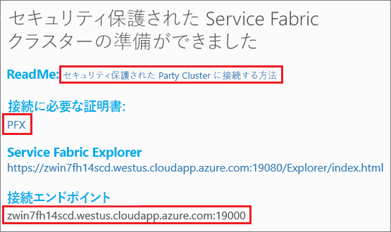

# <a name="tutorial-deploy-a-service-fabric-application-to-a-cluster-in-azure"></a>チュートリアル: Azure のクラスターに Service Fabric アプリケーションをデプロイする

このチュートリアルはシリーズの第 2 部です。Azure で新しいクラスターに Azure Service Fabric アプリケーションをデプロイする方法について説明します。

このチュートリアルで学習する内容は次のとおりです。
> [!div class="checklist"]
> * パーティ クラスターを作成する。
> * Visual Studio を使用してリモート クラスターにアプリケーションをデプロイする。

このチュートリアル シリーズで学習する内容は次のとおりです。
> [!div class="checklist"]
> * [.NET Service Fabric アプリケーションを構築する](service-fabric-tutorial-create-dotnet-app.md)
> * アプリケーションをリモート クラスターにデプロイする
> * [ASP.NET Core フロントエンド サービスに HTTPS エンドポイントを追加する](service-fabric-tutorial-dotnet-app-enable-https-endpoint.md)
> * [Visual Studio Team Services を使用して CI/CD を構成する](service-fabric-tutorial-deploy-app-with-cicd-vsts.md)
> * [アプリケーションの監視と診断を設定する](service-fabric-tutorial-monitoring-aspnet.md)

## <a name="prerequisites"></a>前提条件

このチュートリアルを開始する前に

* Azure サブスクリプションをお持ちでない場合は、[無料アカウント](https://azure.microsoft.com/free/?WT.mc_id=A261C142F)を作成してください。
* [Visual Studio 2017 をインストール](https://www.visualstudio.com/)し、**Azure 開発**ワークロードと **ASP.NET および Web 開発**ワークロードをインストールします。
* [Service Fabric SDK をインストール](service-fabric-get-started.md)します。

## <a name="download-the-voting-sample-application"></a>投票サンプル アプリケーションをダウンロードする

[このチュートリアル シリーズの第 1 部](service-fabric-tutorial-create-dotnet-app.md)で投票サンプル アプリケーションをビルドしていない場合は、ダウンロードすることができます。 コマンド ウィンドウで、次のコマンドを実行して、サンプル アプリのリポジトリをローカル コンピューターに複製します。

```git
git clone https://github.com/Azure-Samples/service-fabric-dotnet-quickstart
```

## <a name="publish-to-a-service-fabric-cluster"></a>Service Fabric クラスターに発行する

これでアプリケーションの準備ができたので、Visual Studio から直接クラスターにデプロイできます。 
  [Service Fabric クラスター](https://docs.microsoft.com/en-gb/azure/service-fabric/service-fabric-deploy-anywhere)は、ネットワークで接続された一連の仮想マシンまたは物理マシンで、マイクロサービスがデプロイおよび管理されます。

このチュートリアルでは、Visual Studio を使用して投票アプリケーションを Service Fabric クラスターにデプロイするためのオプションが 2 つあります。

* 試用版 (パーティ) クラスターに発行します。
* サブスクリプションで既存のクラスターに発行します。  [Azure Portal](https://portal.azure.com) 経由で、[PowerShel](./scripts/service-fabric-powershell-create-secure-cluster-cert.md) または [Azure CLI](./scripts/cli-create-cluster.md) スクリプトを使用するか、または [Azure Resource Manager テンプレート](service-fabric-tutorial-create-vnet-and-windows-cluster.md)から Service Fabric クラスターを作成することができます。

> [!NOTE]
> 多くのサービスは、リバース プロキシを使用して相互に通信します。 Visual Studio で作成されたクラスターとパーティ クラスターでは、既定でリバース プロキシが有効です。  既存のクラスターを使用する場合、[クラスターでリバース プロキシを有効にする](service-fabric-reverseproxy-setup.md#)必要があります。


### <a name="find-the-votingweb-service-endpoint-for-your-azure-subscription"></a>Azure サブスクリプションの VotingWeb サービス エンドポイントを見つける

投票アプリケーションを Azure サブスクリプションに公開する場合は、フロントエンド Web サービスのエンドポイントを見つけます。 パーティ クラスターを使用している場合、投票サンプルで使用されているポート 8080 は自動的に開かれるため、パーティ クラスターのロード バランサーでこのポートを構成する必要はありません。

フロントエンド Web サービスは、特定のポートでリッスンしています。  Azure でアプリケーションがクラスターにデプロイされると、クラスターとアプリケーションの両方が Azure ロード バランサーの背後で実行します。  受信トラフィックが Web サービスを通過できるように、このクラスターの Azure ロード バランサーのルールを使用してアプリケーション ポートが開かれている必要があります。  ポート (8080 など) は、*VotingWeb/PackageRoot/ServiceManifest.xml* ファイルの **Endpoint** 要素にあります。

```xml
<Endpoint Protocol="http" Name="ServiceEndpoint" Type="Input" Port="8080" />
```

Azure サブスクリプションの場合は、[PowerShell スクリプト](./scripts/service-fabric-powershell-open-port-in-load-balancer.md)を介して Azure の負荷分散ルールを使用するか、[Azure portal](https://portal.azure.com) でこのクラスターのロード バランサーを介して、このポートを開きます。

### <a name="join-a-party-cluster"></a>パーティ クラスターに参加する

> [!NOTE]
> Azure サブスクリプション内の独自のクラスターにアプリケーションを公開する場合は、Visual Studio を使用したアプリケーションのデプロイに関する次のセクションに進んでください。

パーティ クラスターは、Azure でホストされる無料の期間限定の Service Fabric クラスターであり、Service Fabric チームによって実行されます。このクラスターには、だれでもアプリケーションをデプロイして、プラットフォームについて学習することができます。 このクラスターでは、ノード間のセキュリティおよびクライアントとノードの間のセキュリティに単一の自己署名証明書が使用されます。

サインインし、[Windows クラスターに参加](http://aka.ms/tryservicefabric)します。 **[PFX]** リンクをクリックして、PFX 証明書をコンピューターにダウンロードします。 **[How to connect to a secure Party cluster?]\(セキュリティで保護されたパーティ クラスターに接続する方法\)** リンクをクリックして、証明書のパスワードをコピーします。 証明書、証明書のパスワード、**[接続のエンドポイント]** の値は、次の手順で使用します。



> [!Note]
> 1 時間あたりに使用可能なパーティ クラスターの数には制限があります。 パーティ クラスターへのサインアップ時にエラーが発生する場合は、少し待ってからやり直してください。または、[.NET アプリのデプロイ](https://docs.microsoft.com/azure/service-fabric/service-fabric-tutorial-deploy-app-to-party-cluster#deploy-the-sample-application)のチュートリアルに記載されている手順に従って、Azure サブスクリプションに Service Fabric クラスターを作成し、アプリケーションをデプロイすることもできます。 Azure サブスクリプションをまだお持ちでない場合は、[無料のアカウント](https://azure.microsoft.com/free/?WT.mc_id=A261C142F)を作成できます。
>

お使いの Windows マシンで、*CurrentUser\My* 証明書ストアに PFX をインストールします。

```powershell
PS C:\mycertificates> Import-PfxCertificate -FilePath .\party-cluster-873689604-client-cert.pfx -CertStoreLocation Cert:\CurrentUser\My -Password (ConvertTo-SecureString 873689604 -AsPlainText -Force)


   PSParentPath: Microsoft.PowerShell.Security\Certificate::CurrentUser\My

Thumbprint                                Subject
----------                                -------
3B138D84C077C292579BA35E4410634E164075CD  CN=zwin7fh14scd.westus.cloudapp.azure.com
```

次の手順のために拇印を覚えておいてください。

> [!Note]
> 既定では、Web フロントエンド サービスは、ポート 8080 で着信トラフィックをリッスンするよう構成されています。 ポート 8080 は、パーティ クラスターで開かれています。  アプリケーションのポートを変更する必要がある場合は、パーティ クラスターで開かれているポートのいずれかに変更してください。
>

### <a name="publish-the-application-using-visual-studio"></a>Visual Studio を使用してアプリケーションを公開する

これでアプリケーションの準備ができたので、Visual Studio から直接クラスターにデプロイできます。

1. ソリューション エクスプローラーで **[Voting]** を右クリックして、**[発行]** を選択します。 [発行] ダイアログが表示されます。

2. パーティ クラスター ページまたは Azure サブスクリプションから**接続のエンドポイント**を **[接続のエンドポイント]** フィールドにコピーします。 たとえば、「`zwin7fh14scd.westus.cloudapp.azure.com:19000`」のように入力します。 **[詳細な接続パラメーター]** をクリックし、*FindValue* と *ServerCertThumbprint* の値が前の手順でインストールしたパーティ クラスターの証明書または Azure サブスクリプションに一致する証明書の拇印に一致していることを確認します。

    ![[発行] ダイアログ](./media/service-fabric-quickstart-dotnet/publish-app.png)

    クラスター内の各アプリケーションには、一意の名前が必要です。  パーティ クラスターはパブリックの共有環境ですが、既存のアプリケーションと競合している可能性があります。  名前の競合が発生している場合は、Visual Studio プロジェクトの名前を変更し、もう一度デプロイします。

3. **[発行]** をクリックします。

4. ブラウザーを開き、クラスターのアドレスに続いて ":8080" (または他のポートが構成されている場合はそのポート) を入力して、クラスター内の投票アプリケーションに接続します (例: `http://zwin7fh14scd.westus.cloudapp.azure.com:8080`)。 Azure のクラスターでアプリケーションが実行されていることがわかります。 投票 Web ページで、投票オプションの追加や削除を試します。さらに、これらのオプションの 1 つ以上に投票してみます。

    


## <a name="next-steps"></a>次の手順

このチュートリアルで学習した内容は次のとおりです。

> [!div class="checklist"]
> * パーティ クラスターを作成する。
> * Visual Studio を使用してリモート クラスターにアプリケーションをデプロイする。

次のチュートリアルに進みます。
> [!div class="nextstepaction"]
> [HTTPS を有効にする](service-fabric-tutorial-dotnet-app-enable-https-endpoint.md)
