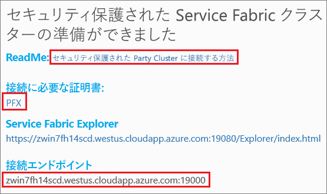

# <a name="deploy-an-application-to-a-party-cluster-in-azure"></a>Azure でパーティ クラスターにアプリケーションをデプロイする
このチュートリアルはシリーズの第 2 部です。Azure でパーティ クラスターに Azure Service Fabric アプリケーションをデプロイする方法について説明します。

シリーズの第 2 部で学習する内容は次のとおりです。
> [!div class="checklist"]
> * [.NET Service Fabric アプリケーションを構築する](service-fabric-tutorial-create-dotnet-app.md)
> * アプリケーションをリモート クラスターにデプロイする
> * [Visual Studio Team Services を使用して CI/CD を構成する](service-fabric-tutorial-deploy-app-with-cicd-vsts.md)
> * [アプリケーションの監視と診断を設定する](service-fabric-tutorial-monitoring-aspnet.md)

このチュートリアル シリーズで学習する内容は次のとおりです。
> [!div class="checklist"]
> * Visual Studio を使用してリモート クラスターにアプリケーションをデプロイする
> * Service Fabric Explorer を使用してクラスターからアプリケーションを削除する

## <a name="prerequisites"></a>前提条件
このチュートリアルを開始する前に
- Azure サブスクリプションをお持ちでない場合は、[無料アカウント](https://azure.microsoft.com/free/?WT.mc_id=A261C142F)を作成します。
- [Visual Studio 2017 をインストール](https://www.visualstudio.com/)し、**Azure 開発**ワークロードと **ASP.NET および Web 開発**ワークロードをインストールします。
- [Service Fabric SDK をインストール](service-fabric-get-started.md)します。

## <a name="download-the-voting-sample-application"></a>投票サンプル アプリケーションをダウンロードする
[このチュートリアル シリーズの第 1 部](service-fabric-tutorial-create-dotnet-app.md)で投票サンプル アプリケーションをビルドしていない場合は、ダウンロードすることができます。 コマンド ウィンドウで、次のコマンドを実行して、サンプル アプリのリポジトリをローカル コンピューターに複製します。

```
git clone https://github.com/Azure-Samples/service-fabric-dotnet-quickstart
```

## <a name="set-up-a-party-cluster"></a>パーティ クラスターをセットアップする
パーティ クラスターは、Azure でホストされる無料の期間限定の Service Fabric クラスターであり、Service Fabric チームによって実行されます。このクラスターには、だれでもアプリケーションをデプロイして、プラットフォームについて学習することができます。 無料試用版をお試しください!

パーティ クラスターへのアクセス権を取得するには、次のサイト (http://aka.ms/tryservicefabric) を参照し、指示に従ってクラスターへのアクセス権を取得します。 パーティ クラスターへのアクセス権を取得するには、Facebook または GitHub アカウントが必要です。

必要に応じて、パーティー クラスターではなく、独自のクラスターを使用できます。  ASP.NET Core Web フロントエンドは、リバース プロキシを使用して、ステートフル サービス バックエンドと通信します。  パーティー クラスターとローカル開発クラスターは、既定でリバース プロキシを有効にしています。  投票サンプル アプリケーションを自分のクラスターにデプロイする場合は、[クラスターでリバース プロキシを有効にする](service-fabric-reverseproxy.md#setup-and-configuration)必要があります。

> [!NOTE]
> パーティ クラスターはセキュリティで保護されないため、ご利用のアプリケーションとそれに入力するデータが他のユーザーに表示される可能性があります。 他のユーザーに見せたくないものは一切デプロイしないでください。 使用条件の詳細に必ず目を通してください。

サインインし、[Windows クラスターに参加](http://aka.ms/tryservicefabric)します。 **[PFX]** リンクをクリックして、PFX 証明書をコンピューターにダウンロードします。 証明書と **[接続のエンドポイント]** の値は、次の手順で使用します。



Windows コンピューターで、*CurrentUser\My* 証明書ストアに PFX をインストールします。

```powershell
PS C:\mycertificates> Import-PfxCertificate -FilePath .\party-cluster-873689604-client-cert.pfx -CertStoreLocation Cert:
\CurrentUser\My


  PSParentPath: Microsoft.PowerShell.Security\Certificate::CurrentUser\My

Thumbprint                                Subject
----------                                -------
3B138D84C077C292579BA35E4410634E164075CD  CN=zwin7fh14scd.westus.cloudapp.azure.com
```


## <a name="deploy-the-app-to-the-azure"></a>Azure にアプリケーションをデプロイする
これで、アプリケーションの準備ができたので、Visual Studio から直接パーティ クラスターにデプロイできます。

1. ソリューション エクスプローラーで **[Voting]** を右クリックして、**[発行]** を選択します。 

    ![[発行] ダイアログ](./media/service-fabric-quickstart-containers/publish-app.png)

2. パーティ クラスター ページの**接続のエンドポイント**を **[接続のエンドポイント]** フィールドにコピーします。 たとえば、「`zwin7fh14scd.westus.cloudapp.azure.com:19000`」のように入力します。 **[詳細な接続パラメーター]** をクリックし、次の情報を入力します。  *FindValue* と *ServerCertThumbprint* の値は、前の手順でインストールした証明書の拇印に一致する必要があります。 **[発行]**をクリックします。 

    発行が完了した後は、ブラウザーからアプリケーションに要求を送信できます。

3. 好みのブラウザーを開き、クラスター アドレス (ポート情報を除いた接続エンドポイント。たとえば、win1kw5649s.westus.cloudapp.azure.com) を入力します。

    アプリケーションをローカルで実行するときに確認したのと同じ結果が表示されます。

    

## <a name="remove-the-application-from-a-cluster-using-service-fabric-explorer"></a>Service Fabric Explorer を使用してクラスターからアプリケーションを削除する
Service Fabric Explorer は、Service Fabric クラスター内のアプリケーションを参照および管理するためのグラフィカル ユーザー インターフェイスです。

パーティ クラスターからアプリケーションを削除するには:

1. パーティ クラスターのサインアップ ページで提供されるリンクを使用して、Service Fabric Explorer を参照します。 たとえば https://win1kw5649s.westus.cloudapp.azure.com:19080/Explorer/index.html を使用します。

2. Service Fabric Explorer で、左側にあるツリービューの **[fabric:/Voting]** ノードに移動します。

3. 右側の **[基本]** ウィンドウの **[アクション]** をクリックして、**[アプリケーションの削除]** を選択します。 アプリケーション インスタンスの削除を承認すると、クラスターで実行されているアプリケーション インスタンスが削除されます。


## <a name="remove-the-application-type-from-a-cluster-using-service-fabric-explorer"></a>Service Fabric Explorer を使用してクラスターからアプリケーションの型を削除する
アプリケーションは、Service Fabric クラスター内にアプリケーションの型としてデプロイされます。これにより、アプリケーションの複数のインスタンスやバージョンをクラスター内で実行できます。 アプリケーションの実行中のインスタンスを削除した後は、その型も削除でき、デプロイのクリーンアップを完了できます。

Service Fabric のアプリケーション モデルの詳細については、「[Service Fabric でのアプリケーションのモデル化](service-fabric-application-model.md)」を参照してください。

1. ツリービューの **[VotingType]** ノードに移動します。

2. 右側の **[基本]** ウィンドウの **[アクション]** をクリックして、**[Unprovision Type]\(型のプロビジョニングを解除\)** を選択します。 アプリケーションの型のプロビジョニング解除を承認します。


これでチュートリアルは終了します。

## <a name="next-steps"></a>次の手順
このチュートリアルで学習した内容は次のとおりです。

> [!div class="checklist"]
> * Visual Studio を使用してリモート クラスターにアプリケーションをデプロイする
> * Service Fabric Explorer を使用してクラスターからアプリケーションを削除する

次のチュートリアルに進みます。
> [!div class="nextstepaction"]
> [Visual Studio Team Services を使用して継続的インテグレーションを設定する](service-fabric-tutorial-deploy-app-with-cicd-vsts.md)
