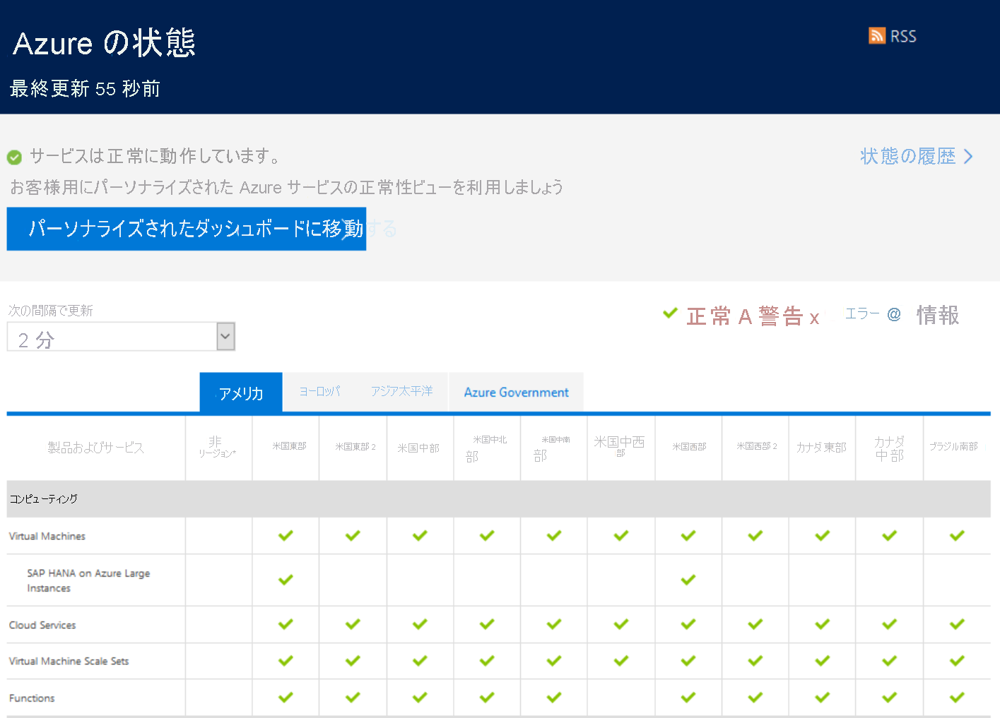
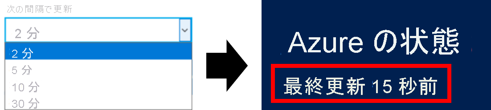

# Azure の状態の概要

[Azure の状態](https://status.azure.com/status/)により、Azure サービスおよびリージョンの正常性のグローバルなビューが提供されます。 Azure の状態を利用し、サービスの可用性に関する情報を取得できます。 Azure の状態を使用すると、そのサービス正常性や、広範囲に影響を与えるインシデントを報告するすべてのサービスを誰でも表示できます。 ただし、現在の Azure ユーザーは、[Azure Service Health](https://aka.ms/azureservicehealth) でパーソナライズされたエクスペリエンスを使用することを強くお勧めします。 Azure Service Health には、すべての停止、今後予定されている計画メンテナンス アクティビティ、およびサービスに関する勧告が含まれています。

## Azure の状態の更新

Azure の状態のページは、Azure サービスの正常性が変化するとリアルタイムに更新されます。 Azure の状態のページを開いたままにする場合は、ページを新しいデータで更新する頻度を制御できます。 上部で、ページが最後に更新された時刻を確認できます。

## Azure の状態の履歴

Azure の状態のページには常に最新の正常性情報が表示されますが、[Azure の状態の履歴ページ](https://status.azure.com/status/history/)を使用して古いイベントを表示できます。 この履歴ページには、2019 年 11 月 20 日以降に発生したインシデントの RCA がすべて含まれており、その日付から 5 年間の RCA 履歴が提供されます。 2019 年 11 月 20 日より前の RCA は利用できません。

## RSS フィード

Azure の状態では、サブスクライブできる、Azure サービスの正常性に対する変化についての [RSS フィード](https://status.azure.com/status/feed/)も提供されます。

## 次の手順

* [サービスの正常性](./service-health-overview.md)を利用し、Azure の正常性について、よりパーソナライズしたビューを取得できる方法を学習します。
* [リソースの正常性](./resource-health-overview.md)を利用し、Azure の特定のリソースの正常性について、よりきめ細かなビューを取得できる方法を学習します。
