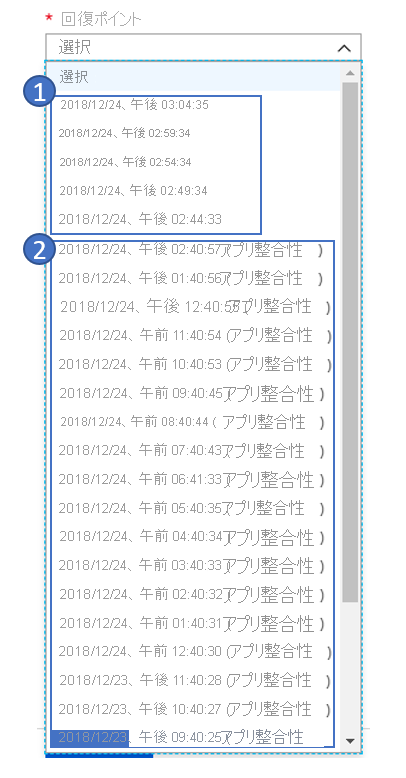

# 一般的な質問:Azure から Azure へのディザスター リカバリー

この記事では、[Site Recovery](site-recovery-overview.md) を使用して Azure VM を別の Azure リージョンにディザスター リカバリーする場合についてよく寄せられる質問に回答します。 

## 全般

### Site Recovery の価格
詳しくは、「[Site Recovery の価格](https://azure.microsoft.com/blog/know-exactly-how-much-it-will-cost-for-enabling-dr-to-your-azure-vm/)」をご覧ください。
### Azure Site Recovery の Free レベルの課金はどのように行われますか?
Azure Site Recovery で保護されるすべてのインスタンスは、保護を開始してから 31 日間は無料になります。 32 日目以降は、インスタンスの保護に対して上記の料金が課金されます。
### 最初の 31 日間に、他の Azure 料金は発生しますか?
はい。Azure Site Recovery は保護されたインスタンスに対して最初の 31 日間無料ですが、Azure Storage、ストレージ トランザクション、データ転送について課金が発生する場合があります。 仮想マシンの復旧も、Azure の通常の課金の対象になる場合があります。 価格の詳細については、[こちら](https://azure.microsoft.com/pricing/details/site-recovery)からご確認ください

### Azure VM のディザスター リカバリーに関するベスト プラクティスはどこで確認できますか? 
1. [Azure から Azure へのアーキテクチャを理解する](azure-to-azure-architecture.md)
2. [サポートされている構成とサポートされていない構成を確認する](azure-to-azure-support-matrix.md)
3. [Azure VM のディザスター リカバリーを設定する](azure-to-azure-how-to-enable-replication.md)
4. [テスト フェールオーバーの実行](azure-to-azure-tutorial-dr-drill.md)
5. [プライマリ リージョンにフェールオーバーおよびフェールバックする](azure-to-azure-tutorial-failover-failback.md)

### ターゲット リージョンでは、容量はどのように保証されますか?
Site Recovery チームは Azure 容量管理チームと連携し、十分なインフラストラクチャ容量を計画し、フェールオーバーが開始されたときに Site Recovery によって保護されている VM が確実にターゲット リージョンにデプロイされるように支援しています。

## レプリケーション

### Azure Disk Encryption が有効になっている VM をレプリケートできますか?
はい、レプリケートできます。 記事「[Azure Disk Encryption (ADE) が有効な仮想マシンを別の Azure リージョンにレプリケートする](azure-to-azure-how-to-enable-replication-ade-vms.md)」をご覧ください。 現在、Azure Site Recovery では、Windows OS を実行していて、Azure Active Directory (Azure AD) アプリでの暗号化が有効にされている Azure VM のみがサポートされています。

### 別のサブスクリプションに VM をレプリケートできますか?
はい、同じ Azure AD テナント内で別のサブスクリプションに Azure VM をレプリケートできます。
[サブスクリプション間](https://azure.microsoft.com/blog/cross-subscription-dr)で DR を構成するのは簡単です。 レプリケーション時に別のサブスクリプションを選択できます。

### ゾーンにピン留めされた Azure VM を別のリージョンにレプリケートできますか?
はい、[ゾーンにピン留めされた VM](https://azure.microsoft.com/blog/disaster-recovery-of-zone-pinned-azure-virtual-machines-to-another-region) を別のリージョンにレプリケートすることができます。

### ディスクを除外することはできますか?

はい、PowerShell を使用して保護時にディスクを除外できます。 詳しくは、[記事](azure-to-azure-exclude-disks.md)を参照してください

### レプリケートされた VM に新しいディスクを追加して、それらのレプリケーションを有効にすることはできますか?

はい、マネージド ディスクがある Azure VM でサポートされています。 レプリケーションが有効な Azure VM に新しいディスクを追加すると、VM のレプリケーションの正常性に、警告と、VM 上の 1 つ以上のディスクを保護対象に指定できるという注意が表示されます。 追加されたディスクのレプリケートを有効にすることができます。
- 追加されたディスクの保護を有効にすると、初回のレプリケーション後に警告は表示されなくなります。
- ディスクのレプリケートを有効にしないことを選択した場合は、この警告の無視を選択できます。
- ディスクを追加した VM をフェールオーバーし、そのディスクに対するレプリケーションを有効にすると、レプリケーション ポイントに復旧に使用できるディスクが表示されます。 たとえば、VM に単一のディスクがあり、新しいディスクを追加した場合、ディスクを追加する前に作成されたレプリケーション ポイントでは、そのレプリケーション ポイントが "2 台中の 1 台のディスク" で構成されていることが示されます。

Site Recovery は、レプリケートされた VM からのディスクの "ホット リムーブ" をサポートしません。 VM ディスクを削除した場合は、VM のレプリケーションを無効にしてから再度有効にする必要があります。

### どのくらいの頻度で Azure にレプリケートできますか?
Azure VM を別の Azure リージョンにレプリケートするときは、レプリケーションは継続的に行われます。 詳しくは、[Azure から Azure へのレプリケーション アーキテクチャ](https://docs.microsoft.com/azure/site-recovery/azure-to-azure-architecture#replication-process)に関する記事をご覧ください。

### リージョン内で仮想マシンをレプリケートできますか? VM を移行するのにこれが必要です。
Azure から Azure の DR ソリューションを使用して、リージョン内で VM をレプリケートすることはできません。

### VM を任意の Azure リージョンにレプリケートできますか?
Site Recovery を使用して、同じ地理クラスター内の 2 つのリージョン間で VM をレプリケートして復旧できます。 地理クラスターは、データの遅延と主権を念頭に置きながら定義されます。 詳しくは、Site Recovery の[リージョンのサポート マトリックス](https://docs.microsoft.com/azure/site-recovery/azure-to-azure-support-matrix#region-support)をご覧ください。

### Site Recovery にはインターネット接続が必要ですか?

いいえ、Site Recovery にはインターネット接続は必要ありません。 ただし、[こちらの記事](https://docs.microsoft.com/azure/site-recovery/azure-to-azure-about-networking#outbound-connectivity-for-ip-address-ranges)で説明されているように、Site Recovery の URL と IP 範囲にアクセスする必要があります。

### 階層ごとに個別のリソース グループを使用してアプリケーションをレプリケートすることはできますか?
はい、アプリケーションをレプリケートし、ディザスター リカバリー構成を個別のリソース グループに保持することは可能です。
たとえば、各階層のアプリ、データベース、および Web が個別のリソース グループに属するアプリケーションがある場合は、[レプリケーション ウィザード](https://docs.microsoft.com/azure/site-recovery/azure-to-azure-how-to-enable-replication#enable-replication)を 3 回クリックして、すべての階層を保護することができます。 これら 3 つの階層は、Site Recovery によって 3 つの異なるリソース グループにレプリケートされます。

## Replication policy

### レプリケーション ポリシーとは何ですか?
復旧ポイントの保持履歴と、アプリ整合性スナップショットの頻度の設定が定義されています。 既定では、次のような既定の設定の新しいレプリケーション ポリシーが Azure Site Recovery で作成されます。

* 復旧ポイントの保持履歴は 24 時間。
* アプリ整合性スナップショットの頻度は 60 分。

[詳細情報](https://docs.microsoft.com/azure/site-recovery/azure-to-azure-tutorial-enable-replication#configure-replication-settings)。

### クラッシュ整合性復旧ポイントとは何ですか?
クラッシュ整合性復旧ポイントは、VM がクラッシュしたか、スナップショットの作成時に電源コードがサーバーから引き抜かれたときの、ディスク上のデータを表します。 これには、スナップショットの作成時にメモリ内にあったものは一切含まれません。

現在、ほとんどのアプリケーションは、クラッシュ整合性のスナップショットから十分に復旧できます。 クラッシュ整合性復旧ポイントは通常、データベースのないオペレーティング システムや、ファイル サーバー、DHCP サーバー、プリント サーバーなどのアプリケーションにとっては十分です。

### クラッシュ整合性復旧ポイントはどのくらいの頻度で生成されますか?
Site Recovery では、5 分ごとにクラッシュ整合性復旧ポイントが作成されます。

### アプリケーション整合性復旧ポイントとは何ですか?
アプリケーション整合性復旧ポイントは、アプリケーション整合性スナップショットから作成されます。 アプリケーション整合性復旧ポイントでは、クラッシュ整合性スナップショットと同じデータがキャプチャされ、メモリ内のすべてのデータと処理中のすべてのトランザクションが追加されます。
これらの追加コンテンツのため、アプリケーション整合性スナップショットは、最も複雑で実行時間も最も長くかかります。 アプリケーション整合性の復旧ポイントは、SQL Server などのデータベース オペレーティング システムで推奨されます。

### アプリケーション整合性復旧ポイントがアプリケーション パフォーマンスにもたらす影響について教えてください。
アプリケーション整合性復旧ポイントでは、メモリ内やプロセス内のすべてのデータが取得されます。またその際、Windows 上の VSS などのフレームワークで、アプリケーションを停止する必要があります。 これをあまり頻繁に行うと、既にワークロードがビジー状態の場合に、パフォーマンスに影響が出る可能性があります。 通常、データベース以外のワークロードについては、アプリ整合性復旧ポイントの間隔を短くしないことを推奨します。また、データベース ワークロードについても、1 時間で十分です。

### アプリケーション整合性復旧ポイントが生成される最小の頻度はどのくらいですか?
Site Recovery では、アプリケーション整合性復旧ポイントを 1 時間という最小の頻度で作成できます。

### 復旧ポイントはどのように生成されて保存されますか?
Site Recovery で復旧ポイントがどのように生成されるかを理解するため、レプリケーション ポリシーの例を見てみましょう。このポリシーには、24 時間の復旧ポイントの保有期間と 1 時間のアプリ整合性の頻度のスナップショットが設定されています。

Site Recovery では、5 分ごとにクラッシュ整合性復旧ポイントが作成されます。 ユーザーは、この頻度を変更できません。 そのため、ユーザーは直近の 1 時間の 12 のクラッシュ整合性ポイントと 1 つのアプリケーション整合性ポイントから選択できます。 時間が経過すると、1 時間を経過した復旧ポイントは Site Recovery によってすべて取り除かれ、1 時間に 1 つの復旧ポイントのみが保存されます。

次のスクリーンショットはこの例を示したものです。 スクリーンショットでは次のようになっています。

1. 直近 1 時間未満では、5 分ごとの復旧ポイントがあります。
2. 過去 1 時間を超える時間については、Site Recovery は復旧ポイントを 1 つだけ保持します。

   

### 過去のどの時点まで遡って復旧できますか?
使用できる最も古い復旧ポイントは 72 時間です。

### 24 時間のレプリケーション ポリシーがあり、問題により 24 時間より長く Site Recovery で復旧ポイントが生成されなかった場合はどうなりますか? 以前の復旧ポイントはなくなりますか?
いいえ、以前のすべての復旧ポイントが Site Recovery によって保持されます。 復旧ポイントのリテンション期間 (この場合は 24 時間) によって異なりますが、Site Recovery が最も古いポイントを置き換えるのは新しいポイントが生成される場合のみです。 このケースでは、問題があるために新しい復旧ポイントは生成されないため、リテンション期間が終了しても古いポイントはすべて保持されます。

### VM でレプリケーションを有効にした後で、レプリケーション ポリシーを変更するにはどうしたらよいですか?
**[Site Recovery コンテナー]**  >  **[Site Recovery インフラストラクチャ]**  >  **[レプリケーション ポリシー]** の順に移動します。 編集するポリシーを選択し、変更を保存します。 変更は既存のすべてのレプリケーションにも適用されます。

### すべての復旧ポイントが VM の完全なコピーですか、それとも差分ですか?
生成される最初の復旧ポイントには、完全なコピーがあります。 それ以降の復旧ポイントでは、差分変更が保持されます。

### 復旧ポイントの保持期間を長くすると、ストレージ コストは増えますか?
はい。 はい、保持期間を 24 時間から 72 時間に増やすと、Site Recovery により追加の 48 時間分の復旧ポイントが保存されます。 追加の時間により、ストレージ料金が発生します。 たとえば、1 つの復旧ポイントに 10 GB の差分変更が含まれ、GB あたりのコストが 0.16 ドル/月の場合、1 か月あたり 1.6 ドル * 48 の追加料金が発生します。

## マルチ VM 整合性

### マルチ VM 整合性とは何ですか?
レプリケートされたすべての仮想マシン間で復旧ポイントに整合性があることを確認することを意味します。
Site Recovery の [マルチ VM 整合性] オプションを選択した場合、グループの一部であるすべてのマシンをまとめてレプリケートするためのレプリケーション グループが作成されます。
すべての仮想マシンが、フェールオーバー時に共有のクラッシュ整合性復旧ポイントとアプリ整合性復旧ポイントを持ちます。
[マルチ VM 整合性の有効化](https://docs.microsoft.com/azure/site-recovery/azure-to-azure-tutorial-enable-replication#enable-replication-for-a-vm)に関するチュートリアルをご覧ください。

### マルチ VM 整合性レプリケーション グループ内の単一の仮想マシンをフェールオーバーできますか?
[マルチ VM 整合性] オプションを選択すると、アプリケーションがグループ内のすべての仮想マシンに対して依存関係を持つことが示されます。 そのため、単一の仮想マシンのフェールオーバーは許可されません。

### マルチ VM 整合性レプリケーション グループの一部として何個の仮想マシンをレプリケートできますか?
レプリケーション グループ内の 16 個の仮想マシンをまとめてレプリケートできます。

### どのようなときにマルチ VM 整合性を有効にする必要がありますか?
CPU を多く消費するので、マルチ VM 整合性を有効にすると、ワークロードのパフォーマンスに影響する場合があります。 これは、複数のマシンが同じワークロードを実行していて、複数のマシン間に整合性を持たせる必要がある場合にのみ使用してください。 たとえば、2 個の SQL Server インスタンスと 2 個の Web サーバーがアプリケーション内にある場合、SQL Server インスタンスに対してのみマルチ VM 整合性を有効にする必要があります。

## フェールオーバー

### Azure VM のターゲット リージョンでは、容量はどのように保証されますか?
Site Recovery チームは Azure 容量管理チームと連携し、十分なインフラストラクチャ容量を計画し、フェールオーバーが開始されたときにディザスター リカバリーに対応した VM がターゲット リージョンに確実にデプロイされるように支援しています。

### フェールオーバーは自動で行われますか。

フェールオーバーは自動では行われません。 ポータルで 1 回クリックするだけでフェールオーバーを開始できます。または [PowerShell](azure-to-azure-powershell.md) を使ってフェールオーバーをトリガーすることもできます。

### フェールオーバー後にパブリック IP アドレスを保持できますか?

運用アプリケーションのパブリック IP アドレスは、フェールオーバー後に保持されません。
- フェールオーバー プロセスの一部として起動したワークロードは、ターゲット リージョンで利用可能なAzure パブリック IP リソースを割り当てる必要があります。
- これは、手動で行うか、復旧計画を使用して自動化することができます。
- 「[フェールオーバー後にパブリック IP アドレスを設定する](concepts-public-ip-address-with-site-recovery.md#public-ip-address-assignment-using-recovery-plan)」方法を参照してください。  

### フェールオーバー中にプライベート IP アドレスを保持することはできますか?
はい、プライベート IP アドレスを保持することができます。 既定では、Azure VM のディザスター リカバリーを有効にすると、Site Recovery によって、ソース リソースの設定に基づいてターゲット リソースが作成されます。 - Azure VM が静的 IP アドレスで構成されている場合、Site Recovery は、使用中でなければ同じ IP アドレスをターゲット VM にプロビジョニングしようとします。
[フェールオーバー時の IP アドレスの保持](site-recovery-retain-ip-azure-vm-failover.md)に関する記事を参照してください。

### フェールオーバー後、サーバーに新しい IP アドレスが割り当てられるのはなぜですか?

Site Recovery では、フェールオーバー時に IP アドレスの指定が試みられます。 別の仮想マシンがそのアドレスを取得している場合、Site Recovery では次の使用可能な IP アドレスがターゲットとして設定されます。
[VNet のネットワーク マッピングと IP アドレス指定の設定](azure-to-azure-network-mapping.md#set-up-ip-addressing-for-target-vms)に関する記事を参照してください。

### **最新 (最低 RPO)** の復旧ポイントとは何ですか?
**[最新 (最低 RPO)]** オプションでは、Site Recovery サービスに送信されたすべてのデータが最初に処理されて、各 VM の復旧ポイントが作成されてから、それにフェールオーバーされます。 フェールオーバー後に作成された VM は、フェールオーバーがトリガーされた時点で Site Recovery にレプリケートされたすべてのデータを保持しているため、このオプションでは最低の目標復旧時点 (RPO) が提供されます。

### **最新 (最低 RPO)** の復旧ポイントは、フェールオーバー RTO に影響しますか?
はい。 Site Recovery では、フェールオーバー前に保留中のすべてのデータが処理されるので、このオプションは他のオプションより目標復旧時間 (RTO) が高くなります。

### 復旧ポイントの **[最後に処理があった時点]** オプションは何を意味しますか?
**[最後に処理があった時点]** オプションでは、計画内のすべての VM が、Site Recovery によって処理された最新の復旧ポイントにフェールオーバーされます。 特定の VM の最新の復旧ポイントを参照するには、VM 設定の **[Latest Recovery Points] (最新の回復ポイント)** を確認します。 このオプションを使用すると、未処理のデータの処理に時間がかからないため、RTO を低くできます。

### プライマリ リージョンで予期しない停止が発生した場合はどうなりますか?
停止後、フェールオーバーをトリガーできます。 Site Recovery では、フェールオーバーを実行するためにプライマリ リージョンからの接続を必要としません。

### VM フェールオーバーの RTO とは何ですか?
Site Recovery の [RTO の SLA は 2 時間](https://azure.microsoft.com/support/legal/sla/site-recovery/v1_2/)です。 ただし、ほとんどの場合、Site Recovery による仮想マシンのフェールオーバーは、数分以内に行われます。 VM を起動するまでにかかった時間を示すフェールオーバー ジョブに移動することで、RTO を計算できます。 復旧計画の RTO については、以下のセクションを参照してください。

## 復旧計画

### 復旧計画とは何ですか?
Site Recovery での復旧計画は、VM のフェールオーバーの復旧を調整します。 これは、復旧を常に正確で、繰り返し可能、さらに自動化されるようにするのに役立ちます。 復旧計画は、ユーザーの次のニーズに対応します。

- 一緒にフェールオーバーする仮想マシンのグループを定義する
- アプリケーションが正確に動作するように、仮想マシン間の依存関係を定義する
- 仮想マシンのフェールオーバー以外のタスクを実行するため、カスタムの手動操作と共に復旧を自動化する

[こちら](site-recovery-create-recovery-plans.md) をご覧ください。

### 復旧計画ではシーケンス処理はどのように実行されますか?

復旧計画では、シーケンス処理を実行するために複数のグループを作成できます。 すべてのグループが一度にフェールオーバーされます。 同じグループの一部である VM がまとめてフェールオーバーされ、続いて別のグループがフェールオーバーされます。 復旧計画を使用してアプリケーションをモデル化する方法については、「[復旧計画について](recovery-plan-overview.md#model-apps)」をご覧ください。

### 復旧計画の RTO を検索するにはどうしたらよいですか?
復旧計画の RTO を確認するには、復旧計画をテスト フェールオーバーして、**Site Recovery ジョブ**に移動します。
次の例では、SAPTestRecoveryPlan という名前のジョブは、すべての仮想マシンをフェールオーバーして指定されたアクションを実行するのに、8 分 59 秒かかりました。

### 復旧計画に Automation Runbook を追加できますか?
はい、Azure Automation Runbooks を復旧計画に組み込むことができます。 [詳細情報](site-recovery-runbook-automation.md)。

## 再保護とフェールバック

### プライマリ リージョンからディザスター リカバリー リージョンへのフェールオーバーの後、DR リージョン内の VM は自動的に保護されますか?
いいえ。 あるリージョンから別のリージョンに Azure VM を[フェールオーバー](https://docs.microsoft.com/azure/site-recovery/azure-to-azure-tutorial-failover-failback)すると、その VM は DR リージョン内で保護されていない状態で起動されます。 プライマリ リージョンに VM をフェールバックするには、セカンダリ リージョン内の VM を[再保護](https://docs.microsoft.com/azure/site-recovery/azure-to-azure-how-to-reprotect)する必要があります。

### 再保護時に、Site Recovery ではセカンダリ リージョンからプライマリ リージョンに完全なデータがレプリケートされますか?
状況によって異なります。 たとえば、ソース リージョンの VM が存在している場合、ソース ディスクとターゲット ディスクの間の変更のみが同期されます。 Site Recovery では、ディスクを比較することで差分が計算された後、データが転送されます。 通常、このプロセスには数時間かかります。 再保護中に行われることについて詳しくは、「[プライマリ リージョンに対してフェールオーバーされた Azure VM を再保護する]( https://docs.microsoft.com/azure/site-recovery/azure-to-azure-how-to-reprotect#what-happens-during-reprotection)」をご覧ください。

### フェールバックにはどのくらい時間がかかりますか?
再保護の後、フェールバックにかかる時間は、通常、プライマリ リージョンからセカンダリ リージョンへのフェールオーバーに要した時間と同程度です。

## 容量

### Azure VM のターゲット リージョンでは、容量はどのように保証されますか?
Site Recovery チームは Azure 容量管理チームと連携し、十分なインフラストラクチャ容量を計画し、フェールオーバーが開始されたときにディザスター リカバリーに対応した VM がターゲット リージョンに確実にデプロイされるように支援しています。

### Site Recovery は予約インスタンスと連携しますか?
はい、ディザスター リカバリー リージョンで[予約インスタンス](https://azure.microsoft.com/pricing/reserved-vm-instances/)を購入することができ、それらは Site Recovery のフェールオーバー操作で使用されます。   追加の構成は必要ありません。

## セキュリティ

### Site Recovery サービスにレプリケーション データが送信されますか。
いいえ、Site Recovery はレプリケートされたデータを傍受しません。また、VM 上の実行内容に関するどのような情報も保持しません。 レプリケーションとフェールオーバーを調整するために必要なメタデータのみが、Site Recovery サービスに送信されます。  
Site Recovery は ISO 27001:2013、27018、HIPAA、DPA の認証を受けており、SOC2 および FedRAMP JAB の評価が進行中です。

### Site Recovery はレプリケーションを暗号化しますか。
はい、転送中の暗号化と [Azure に保存中の暗号化](https://docs.microsoft.com/azure/storage/storage-service-encryption)の両方がサポートされています。

## 次の手順
* サポート要件を[確認する](azure-to-azure-support-matrix.md)。
* Azure から Azure へのレプリケーションを[設定する](azure-to-azure-tutorial-enable-replication.md)。
- この記事の内容について質問がある場合は、[Azure Recovery Services フォーラム](https://social.msdn.microsoft.com/Forums/azure/home?forum=hypervrecovmgr)に投稿してください。
